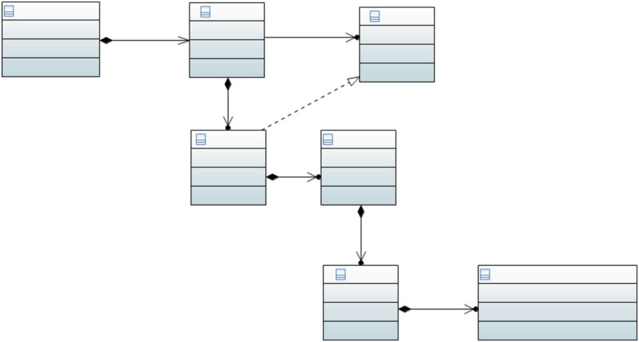

# Introduction

**Abstract** Modern cars have evolved from mechanical devices into distributed cyber-physical systems which rely on software to function correctly. Starting from the 1970s the amount of electronics and software used has gradually increased from as little as one computer (Electronic Control Unit, ECU) to as much as 150 ECUs in 2015. The trend in the architecture, however, changes as companies look for ways to decrease the number of central computing nodes and connect them with the increased number of I/O nodes. In this chapter we provide an overview of the book and the conventions used in it and introduce the examples which we will use throughout. We describe the history of the automotive software anchoring the events in the evolution of the market of the electronics and software in modern cars. Towards the end of the chapter we also describe which directions can be pursued to deepen the knowledge of automotive software.

> **摘要**现代汽车已从机械设备演变为分布式的网络物理系统，这些系统依赖软件正常运行。从 1970 年代开始，所使用的电子和软件的数量逐渐从一台计算机(电子控制单元，ECU)逐渐增加到 2015 年的 ECU。为了减少中央计算节点的数量，并将其与 I/O 节点数量增加相连。在本章中，我们概述了书中使用的书籍和惯例，并介绍了我们将在整个过程中使用的示例。我们描述了汽车软件的历史，该汽车软件锚定了现代汽车市场和软件市场发展中事件的历史。在本章结束时，我们还描述了可以追求哪些方向以加深汽车软件的知识。

## Software and Modern Cars

The introduction of software to cars opened up plenty of opportunities—from the optimization of cars’ performance and to exciting infotainment features. Modern cars are full of electronics and the consumers are looking for car platforms which fully resemble software products. A good example of this kind of car is Tesla, which is known for innovations driven by software. The manufacturer is known for constantly pushing new versions of software to customers, providing them with new, exciting features almost every day.

> 从汽车上引入软件为汽车提供了很多机会 - 从汽车性能的优化到令人兴奋的信息娱乐功能。现代汽车充满了电子产品，消费者正在寻找完全类似于软件产品的汽车平台。这种汽车的一个很好的例子是特斯拉，以软件驱动的创新而闻名。制造商以不断向客户推销新版本的软件，几乎每天都提供新的令人兴奋的功能而闻名。

The software intensive systems in modern cars provide plenty of new oppor- tunities, but they also require more careful design, implementation, verification and validation before they can be released to users. And although the practices of software engineering include methods and tools able to fulfill the needs for safety and reliability of the automotive software, they must be applied in an automotive- specific manner to address these needs.

> 现代汽车中的软件密集型系统提供了许多新的功能，但是它们还需要更仔细的设计，实施，验证和验证，然后才能将其释放给用户。尽管软件工程的实践包括能够满足汽车软件安全性和可靠性需求的方法和工具，但必须以汽车特定方式应用它们来满足这些需求。

We could see the clear development of the automotive industry into a field less dominated by mechanical engineering but with a growing component of electronic and software engineering. We have seen the evolution of software from simple engine control algorithms of the 1970s to the advanced safety systems of the 2000s and the advanced connectivity of the 2010s. We can observe that the trends of using the software is not going to decrease, but will increase and the amount of software used will continue to increase.

> 我们可以看到，汽车行业的明确发展成一个不太受到机械工程的领域，但具有越来越多的电子和软件工程组成部分。我们已经看到软件从 1970 年代的简单发动机控制算法到 2000 年代的高级安全系统以及 2010 年代的高级连接的演变。我们可以观察到使用软件的趋势不会减少，但会增加，并且使用的软件量将继续增加。

With the growing amount and importance of software in modern cars we can observe the increased need for professional software engineering. Rigorous processes of software engineering lead to higher quality software with complexity not higher than necessary and assuring that the software does not contribute to fatalities in the traffic conditions.

> 随着现代汽车中软件的数量和重要性的越来越重要，我们可以观察到对专业软件工程的需求增加。软件工程的严格过程导致更高质量的软件，其复杂性不高于必要，并确保该软件在交通状况下不会导致死亡。

One of the practices of software engineering is the high-level design of software systems, also referred to as _software architecture_. The architecture of the software provides the designers with the possibility to prescribe how the software functions are distributed to software components and how the components are to interact with each other. Software architecting is usually done at the early stages of software development and serves as the basis for the allocation of software modules to components and the distribution (called _systemization_) of the functions to software components.

> 软件工程的实践之一是软件系统的高级设计，也称为 *software 架构*。该软件的体系结构为设计人员提供了规定软件功能如何分配到软件组件以及组件如何相互作用的可能性。软件架构通常是在软件开发的早期阶段进行的，它是将软件模块分配到组件和功能对软件组件的分布(称为 *Systemization*)的基础。

## History of Software in the Automotive Industry

Although today it is a given that there is a lot of software in our cars, it was not like that at the beginning of the automotive industry. The first cars did not contain any electronics, which only entered the automotive market during the 1970s with the introduction of electronic fuel injection as a response to the demand for fuel efficiency [[CC11](#_bookmark41)].

> 尽管今天鉴于我们的汽车中有很多软件，但在汽车行业的开头并不是这样。第一批汽车不包含任何电子产品，该电子设备仅在 1970 年代才进入汽车市场，并引入了电子燃料注入，这是对燃油效率需求的响应 [CC11](#_bookmark41)]。

In the 1970s the software in the cars was usually embedded deeply in the electronics in functions related to single domains—e.g., electronic fuel injection in the powertrain, electronic ignition in the electrical system or central locking. Since the use of electronics was scarce in that decade, the notion of functional safety did not relate to software and it was relatively easy to embedded mechanisms for controlling the safety of the functions. The architectures of the software were usually monoliths which were not communicating with other parts of the software. It was the 1980s that brought in such innovations as the central computers which could display basic telemetry of the vehicles—such as current fuel consumption, average fuel consumption and distance travelled. The ability to display the infor- mation to the drivers opened up new possibilities. On the embedded software front, software algorithms controlled new functions such as anti-lock brakes (ABS) and even electronic gearboxes.

> 在 1970 年代，汽车中的软件通常被深深地嵌入与单个域相关的功能中，例如，电动机中的电子燃料注入，电气系统中的电子点火或中央锁定。由于在那十年中使用电子产品很少，因此功能安全性的概念与软件无关，并且嵌入控制功能安全性的机制相对容易。该软件的体系结构通常是与软件其他部分进行通信的整体。正是 1980 年代带来了可以显示车辆基本遥测的中央计算机等创新，例如当前的燃油消耗，平均燃油消耗和距离。向驾驶员展示信息的能力打开了新的可能性。在嵌入式软件方面，软件算法控制了新功能，例如防锁制动器(ABS)甚至电子变速箱。

The 1990s introduced even more consumer-visible electronics. The most notable innovation was in the infotainment domain and was the navigation system—or as it is commonly called, the GPS. Visualizing the information online required integration of important electronic components such as powertrain control com- puter, the dedicated GPS receiver and the infotainment display. The same decade

> 1990 年代推出了更多的消费者可见电子产品。最引人注目的创新是在信息娱乐域中，是导航系统，或通常称为 GPS。在线可视化信息需要集成重要的电子组件，例如动力总成控制器，专用的 GPS 接收器和信息娱乐显示。同一个十年

1. History of Software in the Automotive Industry 3 introduced also more electronics and software in safety-critical areas such as ACC (Adaptive Cruise Control) which controlled the speed of a vehicle based on the speed of the vehicles in front. The introduction of this kind of functionality raised the important questions of liability for accidents caused by malfunctioning of software. The automotive software architecture used in the 1990s was more distributed and software became often recognized as important factor in innovation in the car industry. An example computer system is presented in Fig. [1.1](#_bookmark5).[1](#_bookmark6)

> 1.汽车行业 3 中的软件历史记录也引入了更多的电子和软件，例如 ACC(自适应巡航控制)等安全 - 关键区域，该区域根据前面车辆的速度控制了车辆的速度。这种功能的引入提出了因软件故障引起的事故的重要问题。1990 年代使用的汽车软件体系结构的分布更加分布，并且软件通常被认为是汽车行业创新的重要因素。一个示例计算机系统如图 [1.1](#_bookmark5)。

<Fig. 1.1 Late 1990s JECS LH-Jetronic ECU for engine control

This kind of development continued into the 2000s, when software started to dominate innovation in the car industry. It was also during the 2000s that the notion of advanced driver support systems was coined. The  `advanced`  referred to functions which integrated multiple computers in the car and made more  `difficult`  decisions for the driver. One of the most notable systems in this area was the City Safety system introduced by Volvo in its XC60 model [[Ern13](#_bookmark45)]. The system could stop the car from of speed under 50 kph when an obstacle appeared in front of it and the driver had no time to react. It was these kinds of systems that required more control over the complex interactions and prioritizations and therefore led to more advanced software architectures. The AUTOSAR standard was introduced to provide the possibility to communize solutions (where possible) and make it easy to change hardware platform with limited effort to adopt the software, and to enable easier sharing of the components between manufacturers and introduce a common  `operating system`  for the car’s computers [[Dur15](#_bookmark44), [DSTH14](#_bookmark43)].

> 此  的开发一直持续到 2000 年代，当时软件开始主导汽车行业的创新。同样在 2000 年代，提出了高级驾驶支持系统的概念。`高级` 提到的功能是在汽车中集成了多台计算机，并为驾驶员做出了更 `困难` 的决策。该地区最著名的系统之一是沃尔沃在其 XC60 型号[[ERN13](#_bookmark45)]中引入的城市安全系统。当障碍物出现在其前面，驾驶员没有时间做出反应时，该系统可能会阻止 50 公里 /小时的速度汽车。正是这些系统需要对复杂的交互和优先级进行更多控制，因此导致了更高级的软件体系结构。引入了 Autosar 标准，以提供有可能通过有限的努力来采用该软件的解决方案(并在可能的情况下)交流解决方案的可能性，并使制造商之间的组件共享更轻松地共享组件并引入一个常见的 `操作系统` 对于汽车的计算机[[dur15](#_bookmark44)，[dsth14](#_bookmark43)]。

Finally, the 2010s introduced a completely new way of designing the electronics in cars [[SLO10](#_bookmark52), [RSB+13](#_bookmark50)]. Departing from the distributed network of computers in a single car, this decade introduced the concepts of wireless cars, car-2- car communication, car-2-infrastructure communication and autonomous driving concepts. Many new actors appeared on the market where the car was no longer a final product, but a platform where new functions could be deployed even post- production. Examples of such cars are Tesla cars or Google’s self-driving vehicle [[Mar10](#_bookmark48)]. It was also this decade that required more advanced control over the execution of software coming from different vendors for the possibility of adding new functionality to cars without the need for physically modifying the cars. An example of a focus area—infotainment—is presented in Fig. [1.2](#_bookmark7).[2](#_bookmark8)

> 最后，2010 年代引入了一种全新的方式，用于设计汽车中的电子设备[[slo10](#_bookmark52)，[rsb + 13](#_bookmark50)]。这十年从一辆汽车的计算机网络中偏离了分布式网络，引入了无线汽车，CAR-2-CAR 通信，CAR-2 基础设施通信和自动驾驶概念的概念。许多新演员出现在汽车不再是汽车的市场上最终产品，但在生产后甚至可以部署新功能的平台。此类汽车的示例是特斯拉汽车或 Google 的自动驾驶汽车[[mar10](#_bookmark48)]。正是在这十年中，需要对来自不同供应商的软件执行的执行更高级控制，以便在不需要物理修改汽车的情况下向汽车添加新功能。焦点区域的一个示例 - 毒品 - 示出了图 [1.2](#_bookmark7)。

<Fig. 1.2 2014 Audi TT infotainment unit>

<Fig. 1.3 2016 Volvo XC90 infotainment unit

## Trends Shaping Automotive Software Development

> ##趋势塑造汽车软件开发

In 2007, Pretschner et al. [[PBKS07](#_bookmark49)] outlined the major trends in software develop- ment in automotive systems. This work has been a trendsetter since then and has foreshadowed the large increase in the amount of automotive software—in 2007 measured in megabytes and in 2016 measured in gigabytes. The five trends of automotive software systems presented by Pretschner et al. are:

> 2007 年，Pretschner 等人。[[PBKS07](#_bookmark49)]概述了汽车系统中软件开发的主要趋势。从那时起，这项工作就一直是潮流引领者，并预示了汽车软件量的大幅度增加 - 在 2007 年，在 Megabytes 和 2016 年以 Gigabytes 进行了测量。Pretschner 等人提出的汽车软件系统的五个趋势。是：

- Heterogeneity of software—the software in modern cars realizes different func- tions in different domains. These domains range from highly safety-critical (e.g. active safety) to user experience-centered (e.g. infotainment). This means that the ways of specifying, designing, implementing and verifying the software vary among domains.

> - 软件的异质性 - 现代汽车中的软件在不同域中实现了不同的功能。这些领域的范围从高度安全至关重要(例如主动安全)到以用户体验为中心(例如信息娱乐)。这意味着指定，设计，实施和验证该软件的方式在域之间有所不同。

- Distribution of labor—the development of the software systems is often dis- tributed between automotive OEMs (Original Equipment Manufacturers, like Volvo, BMW, and Audi) and suppliers. Suppliers are also often given an option to define their own way of working as long as they comply with the requirements of and contracts with the OEMs.

> - 分配劳动力 - 软件系统的开发通常在汽车 OEM(沃尔沃，宝马和奥迪)和供应商之间分配。只要符合与 OEM 的要求和合同，供应商通常也可以选择定义自己的工作方式。

- Distribution of software—the automotive software system comprises a number of ECUs, and each of the computers has its own software which needs to cooperate with other ECUs to fulfill its functions. This entails more difficulty in coordination of the software and introduces more complexity.

> - 软件的分布 - 汽车软件系统包括许多 ECU，并且每台计算机都有自己的软件，需要与其他 ECUS 合作以实现其功能。这需要在软件的协调方面更加困难，并引入了更多的复杂性。

- Variants and configurations—the globalized and highly competitive automotive market requires customizations of the same car based on the requirements of the country and the user. This means that the software in modern cars need to be able to work in different countries without the need for recertification and, therefore the software needs to handle variants in multiple ways—both in the source code and also at runtime.

> - 变体和配置 - 全球化且竞争激烈的汽车市场需要根据国家和用户的要求对同一辆车进行自定义。这意味着现代汽车中的软件需要能够在不同国家 /地区工作，而无需重新认证，因此，该软件需要以多种方式处理变体，包括源代码和运行时。

- Unit-based cost models—the competitive market means that the unit price of the car cannot be too high compared to the competition and therefore it is often the case that automotive OEMs optimize the hardware and software in such a way that unit costs remains low while the development costs can be higher. A lot has happened since 2007 and the major trends in the automotive market today can be complemented with such trends as:[3](#_bookmark11)

> - 基于单位的成本模型 - 竞争市场意味着与竞争对手相比，汽车的单位价格不能太高，因此，汽车 OEM 通常以单位成本保持较低的方式来优化硬件和软件虽然开发成本可能更高。自 2007 年以来发生了很多事情，今天的汽车市场的主要趋势可以与以下趋势相辅相成：[ 3 ](#_bookmark1111)

- Connectivity and cooperation [[BWKC16](#_bookmark40)]—the ability to use internet functions through mobile networks enabled cars to connect to each other and/or to use information from the infrastructure to make decisions. Research projects in the area of intelligent transport systems explore such ideas as planning of the speed of a bus to minimize the need for braking for  `red`  when approaching intersections. The modern cars are expected to be able to connect to smartphones via Bluetooth and to use internet features such as web browsers or music services.

> - 连接与合作[[BWKC16](#_bookmark40)] - 通过移动网络使用 Internet 功能的能力使汽车可以相互连接和/或使用基础结构中的信息来做出决策。智能运输系统领域的研究项目探讨了诸如计划公交车速度的思想，以最大程度地减少接近交叉点时制动 `红色` 的需求。预计现代汽车将能够通过蓝牙连接到智能手机，并使用网络浏览器或音乐服务等互联网功能。

- Autonomous functions [[LKM13](#_bookmark47)]—the ability of the car to brake, steer and autonomously take over from drivers entails a large amount of complexity in safety-critical systems, but is seen as  `the next big thing`  in the automotive sector. This also means that the verification and validation methods for software in cars will become even more stringent and even more advanced. Autonomous driving scenarios are challenging because of the need to have an accurate and exact model of the physical surroundings of the car. This demand for the accuracy requires more sophisticated measurement equipment and therefore more data to process, more decision points, and in turn more complex algorithms. One piece of such measurement equipment which is used in autonomous driving is LIDAR, shown in Fig. [1.4](#_bookmark13).[4](#_bookmark12)

> - 自主函数[[[lkm13](#_bookmark47)] - 汽车制动，转向和自主从驾驶员中接管的能力在安全至关重要的系统中需要大量复杂性，但被视为 ` 下一个大型大型汽车领域的事物。这也意味着，汽车中软件的验证和验证方法将变得更加严格，甚至更先进。自主驾驶场景是具有挑战性的，因为有必要拥有汽车物理环境的准确和精确的模型。对准确性的需求需要更复杂的测量设备，因此需要更多的数据来处理，更多的决策点以及更复杂的算法。在自动驾驶中使用的一件这样的测量设备是 LIDAR，如图 [1.4](#_bookmark13) 如图所示。[ 4 ]

Figure [1.4](#_bookmark13) shows a LIDAR mounted on the roof of an autonomous car. The device provides a 360◦ view of the surroundings and allows the car’s software to find objects in the vicinity of the car. A LIDAR is often a complement to a RADAR, which is usually placed in the front of the vehicle. Figure [1.5](#_bookmark14) shows the picture of the radar ECU of a Volvo FH16 truck.

> 图 [1.4](#_bookmark13) 显示了安装在自动驾驶汽车屋顶上的激光雷达。该设备提供了 360 ◦周围环境的视图，并允许汽车的软件在汽车附近找到对象。激光雷达通常是对雷达的补充，通常将其放置在车辆的前部。图 [1.5](#_bookmark14) 显示了沃尔沃 FH16 卡车的雷达 ECU 的图片。

The production cars, however, do not have LIDARs yet, but take advantage of cameras placed in covered places. In Fig. [1.6](#_bookmark15) we can see the front camera of a Volvo XC90.

> 但是，量产车还没有激光雷达，而是利用放置在遮盖的地方的相机。在图 [1.6](#_bookmark15) 中，我们可以看到沃尔沃 XC90 的前置摄像头。

<**Fig. 1.4** Velodyne High-Def LIDAR

<**Fig. 1.5** Radar ECU in Volvo FH16 truck

It is interesting to observe the automotive software market today, and therefore we believe that this book will be of use to anyone who is interested in starting to get into automotive software engineering.

> 它是  有趣的是要观察当今的汽车软件市场，因此我们相信这本书将对有兴趣开始进入汽车的人有用软件工程。

<**Fig. 1.6** Front camera in Volvo XC90

## Organization of Automotive Software Systems

Over the years each car manufacturer (often referred to as an OEM, Original Equipment Manufacturer) developed its own way of organizing software systems with the diversity in pair of the diversity of car brands today. However, many of the car manufacturers design the software in a similar way—they use the V development model and a similar organization of the electrical (and software) systems into domains and subsystems. We can depict it in the model presented in Fig. [1.7](#_bookmark17).

> 多年来，每个汽车制造商(通常称为 OEM，原始设备制造商)开发了自己的组织软件系统的方式，这些软件系统具有多样性的当今汽车品牌的多样性。但是，许多汽车制造商以类似的方式设计该软件 - 他们将 V 开发模型和类似的电气(和软件)系统的组织用于域和子系统。我们可以在图 [1.7](#_bookmark17) 中的模型中描述它。

In this view we can see that the electrical system is organized into domains, such as infotainment and powertrain. Each of these domains has a specific set of properties—some are safety-critical and some not, some are very user oriented and some are realtime and embedded. Each of these domains, however, is organized into subsystems which group a specific functionality (some OEMs call these subsystems simply  `systems` ) such as active safety, and advanced driver support and similar. These systems group a number of logical elements and realize the functionality, which is often grouped into functions. The functions are often called end-to-end functions, as they realize user functionality such as Adaptive Cruise Control, Line Departure Warning and Navigation from A to B.

> 在这种观点中，我们可以看到电气系统被组织成域，例如信息娱乐和动力总成。这些域中的每个域都有一组特定的属性 - 一些是安全至关重要的，有些不是用户面向的，有些是实时的，并且是嵌入的。但是，这些域中的每个域都被组织到子系统中，该子系统将特定功能(某些 OEM 称为这些子系统简单地称为 `系统` )，例如主动安全性和高级驱动程序支持以及类似的。这些系统分组许多逻辑元素并实现功能，通常将其分组为函数。这些功能通常称为端到端功能，因为它们意识到用户功能，例如自适应巡航控制，线路出发警告和从 A 到 B 的导航。

The functions are realized by subsystems of the electrical system and they are orthogonal to the organization of subsystems, components and modules. Therefore we often see the concept of  `functional architecture (view)` —describing the dependencies among functions.

> 这些功能是由电气系统的子系统实现的，它们与子系统，组件和模块的组织正交。因此，我们经常看到 `功能体系结构(视图)` 的概念 - 描述功能之间的依赖性。

<**Fig. 1.7** Conceptual view of the organization of the software system

Each subsystem contains a number of components which include smaller parts of software elements that realize parts of the functionality (e.g. such a part could be a message broker for an infotainment system). These components are organized into software modules, which are often source code files with a set of classes, methods and programming language functions. The groupings of these programming language functions or software classes are referred to as logical software components.

> 每个子系统都包含许多组件，其中包括软件元素的较小部分，这些元素意识到了该功能的一部分(例如，这样的部分可能是信息娱乐系统的消息代理)。这些组件被组织到软件模块中，它们通常是具有一组类，方法和编程语言函数的源代码文件。这些编程语言功能或软件类的分组称为逻辑软件组件。

The term software architecture can be used in almost all levels of this hierarchy (except for the lowest one). We can talk about the EE architecture (Electrical System architecture) which describes the organization of software and hardware for the entire car. We can talk about an ECU architecture which describes the logical organization of software subsystems, components and modules in the ECU. Depending on the size and role of the ECU we could have modules, components or subsystems in the ECU [[DNSH13](#_bookmark42)].

> 该术语软件体系结构几乎可以在此层次结构的所有级别中使用(最低的层次结构除外)。我们可以讨论 EE 体系结构(电气系统体系结构)，该体系结构描述了整个汽车的软件和硬件组织。我们可以讨论一个 ECU 体系结构，该体系结构描述了 ECU 中软件子系统，组件和模块的逻辑组织。根据 ECU 的大小和作用，我们可以在 ECU [[DNSH13](#_bookmark42)]中具有模块，组件或子系统。

The methods and techniques presented in this book can be applied at any of these levels.

> 本书中介绍的方法和技术都可以在这些级别中的任何一个级别应用。

## Architecting as a Discipline

Software architecture is a kind of artifact in software development, but architecting is a full-fledged discipline with its own activities and tasks. It is quite often the case that software architects are perceived as more experienced than senior designers and are given a larger mandate to make decisions than software designers. In order to prevent confusion, let us briefly discuss the role of software architects in contrast to the designers and project managers. These two roles can be perceived as overlapping to some extent and therefore this comparison gets interesting.

> 软件体系结构是软件开发中的一种工件，但是架构是一门成熟的纪律，具有自己的活动和任务。通常，软件架构师比高级设计师更有经验，并且具有比软件设计师更大的决定。为了防止混乱，让我们简要讨论软件架构师与设计师和项目经理相反的作用。这两个角色可以在某种程度上被视为重叠，因此这种比较变得有趣。

### _Architecting vs. Project Management_

Being a software architect means being in a role of a kind of technology leadership. The architects are the persons who lay the ground for the development of the entire system—in terms of general architectural styles, but also in terms of principles which guide the development of the system. Those principles form the boundaries within which the designers can make their choices. It is the role of the architect to ensure that these principles are followed during the entire lifecycle of the software system.

> 成为一名软件架构师意味着发挥一种技术领导作用。架构师是为整个系统开发奠定基础的人，就一般的架构风格而言，也是指导系统开发的原则。这些原则构成了设计师可以做出选择的边界。架构师的角色是确保在软件系统的整个生命周期中遵循这些原则。

In some sense, setting the frames for the system design is a technical corre- spondent to setting the frames for the cost and scope of the project that develops the system. However, it is the responsibility of the project manager to set and monitor this project scope, schedule and cost. Therefore we contrast architecting as a technical correspondent to project management in Table [1.1](#_bookmark20).

> 从某种意义上说，设置系统设计的框架是一个技术方面，可以为开发系统的项目的成本和范围设置框架。但是，项目经理有责任设置和监视此项目范围，时间表和成本。因此，我们将架构作为技术通讯员与表 [1.1](#_bookmark20) 中的项目管理进行对比。

<**Table 1.1** Architecting vs. project management

> 

Since the discipline of architecting is practices by technical experts, it is technical principles that are applied—how to create objects, send messages, deploy compo- nents onto ECUs. This means that the technologies and their characteristics are in focus. For example, the architects need to balance different quality characteristics with each other—performance vs. safety, maintainability vs. portability and others. Therefore the architects also focus on the quality and functionality—addressing such challenges as  `how to enable video feeds over the Flexray network without adding new cables` . Finally the architects focus on the functionality and make sure that the electrical system of the car can realize the functionality given the constraints (e.g. weight of the cables, number of ECUs). All of these aspects make software architecting seem as technical product management.

> 由于架构的纪律是技术专家的实践，因此是应用技术原则 - 如何创建对象，发送消息，将组合部署在 ECUS 上。这意味着技术及其特征是焦点。例如，架构师需要彼此之间平衡不同的质量特征 - 绩效与安全性，可维护性与便携性等。因此，架构师还专注于质量和功能，并挑战 `如何在不添加新电缆的情况下通过 FlexRay 网络启用视频供稿` 。最后，架构师专注于功能，并确保汽车的电气系统可以实现给定约束的功能(例如电缆的重量，ECU 的数量)。所有这些方面都使软件架构似乎是技术产品管理。

In contrast to the technical management, we have project management, where the project leaders apply organizational theories to determine whether to work Agile or waterfall, or how to negotiate contracts, or how to measure the progress of the project. When applying the managerial and organizational theories the project leaders focus on the scope of the project—addressing the questions of whether a given functionality can be developed given the budget constraints of the project. The focus of the project leaders is on resources, on balancing cost and resources with the schedule of the project. All of these aspects can be seen as management of the project rather than management of the product.

> 与技术管理相反，我们拥有项目管理，项目负责人在其中应用组织理论来确定是否工作敏捷或瀑布，如何谈判合同或如何衡量项目的进度。在应用管理和组织理论时，项目负责人专注于项目的范围 - 鉴于项目的预算限制，请注意是否可以开发给定功能的问题。项目负责人的重点是资源，平衡成本和资源与项目时间表。所有这些方面都可以看作是项目的管理，而不是对产品的管理。

Both technical and project management need to work with one another as they develop the one and the same product! Humphrey [[Hum96](#_bookmark46)] in his book  `Managing Technical People: Innovation, Teamwork and the Technical process`  provides a number of useful guidelines on how to combine these two.

> 技术管理和项目管理都需要彼此合作，因为他们开发了同一产品！汉弗莱(Humphrey)[[hum96](#_bookmark46)]在他的《管理技术人员：创新，团队合作和技术过程》一书中提供了许多有关如何结合这两者的有用指南。

### _Architecting vs. Design_

Similarly to contrasting the discipline of architecting to the discipline of project management, we can also contrast architecting to designing. We could observe from the previous contrast that technical product management is about setting principles for the work. The discipline of designing is all about following these principles in order to arrive at final software product. We present some of the differences in Table [1.2](#_bookmark22).

> 与将架构的学科与项目管理学科进行对比类似，我们还可以将架构与设计对比。从先前的对比中，我们可以观察到技术产品管理是关于为工作设定原理。设计的纪律是要遵循这些原则以达到最终软件产品。我们介绍了表 [1.2](#_bookmark22) 的一些差异。

<**Table 1.2** Architecting vs. designing

> 

Software architecting, being the technical management of the system, sets the boundaries for the design in terms of principles, rules and decisions about how to design the system. An example of such a decision is the choice of the communication protocol between the ECUs and the number of ECUs in the system. It’s also about which standards to follow and why. Architecting, as we will see in this book, is a discipline operating at a high abstraction level—considering components (e.g. groups of software classes) and execution nodes. This requires a holistic understanding of the system—both the software and the underlying hardware used to execute the software or provide the software with data. This kind of a  `systems thinking`  makes the architects the core part of any software team because they understand the background of  `why`  things happen rather than just do things.[5](#_bookmark24)

> 软件架构是系统的技术管理，从有关如何设计系统的原则，规则和决策方面为设计设定了界限。这样的决定的一个例子是选择 ECU 和系统中 ECU 数量之间的通信协议。这也是关于要遵循的标准以及原因。正如我们将在本书中看到的那样，架构是在高抽象级别运行的一门学科 - 考虑组件(例如，软件类)和执行节点。这需要对系统的整体理解 - 包括软件和用于执行软件或为软件提供数据的基础硬件。这种 `系统思考` 使架构师成为任何软件团队的核心部分，因为他们了解 `为什么` 事物的背景而不是仅仅做事。

The discipline of architecting is also very documentation-oriented—as the decisions, rules and principles need to be communicated, they also need to be explained and documented to lead to consistency and enforcement of rules. This happens often as a process of analysis and modelling of the system.

> 架构的纪律也非常注重文档 - 正如需要传达的决策，规则和原则一样，还需要对其进行解释和记录，以导致一致性和规则的执行。这通常是作为系统分析和建模的过程。

In contrast, the discipline of designing is focused on realizing the principles, decisions and rules of the architecture in software code or an executable model. The high-level structure discussed in the architecture is now developed using lower-level structures—components using classes and blocks, ECUs using execution processes. This requires specialized knowledge and competence in the particular domain in question (e.g. the infotainment or powertrain). The design is focused on the software entities and their interaction with the underlying hardware, where the hardware is often given (or at least the specification of the hardware is given during the design of the software). This means that designing is focused on the code and executable/detailed models rather than on abstract analysis and modelling. It is also therefore the design that is the first activity where we discuss testing and execution, whereas in the architecture we talk about assessments and evaluations (a topic which we will return to in Chap. [6](#_bookmark368)).

> 相比之下，设计的纪律集中于实现软件代码或可执行模型中体系结构的原理，决策和规则。架构中讨论的高级结构现在是使用较低级别结构开发的，即使用类和块，使用执行过程的 ecus 组成。这需要有关特定领域的专业知识和能力(例如信息娱乐或动力总成)。该设计的重点是软件实体及其与基础硬件的互动，在该硬件中经常给出硬件(或至少在软件设计期间给出了硬件的规范)。这意味着设计专注于代码和可执行/详细的模型，而不是抽象分析和建模。因此，这也是我们讨论测试和执行的第一个活动，而在架构中，我们讨论了评估和评估(这是我们将在第一章中返回的主题。[6](#_bookmark368))。

Similarly to the collaboration between the architects and the project managers, the architects need to collaborate closely with the designers in order to develop and deliver a software system which fulfills all the requirements and quality constraints.

> 与架构师与项目经理之间的合作类似，架构师需要与设计人员紧密合作，以开发和交付满足所有要求和质量约束的软件系统。

## Content of This Book

This book addresses one of the most fundamental aspects of engineering of software systems—software architectures. The architecture is a high-level design of a software system which enables the architects to distribute the functionality of the software system to multiple interacting components. The components are usually grouped into subsystems and domains which address a set of functional and non- functional requirements of the software system.

> 本书介绍了软件系统工程设计的最基本方面之一，即软件体系结构。该体系结构是软件系统的高级设计，使架构师能够将软件系统的功能分配给多个交互组件。这些组件通常分组到子系统和域，这些子系统和域，这些系统和域，这些系统和域处理软件系统的功能和非功能要求。

In this book we explore the concept of software architecture for modern cars which is intended for both novice and advanced software designers. This book is intended for two groups of audience—professionals working with automotive software who need to understand concepts related to automotive architectures, and students of software engineering or related programs who need to understand the specifics of automotive software to be able to construct cars or their components.

> 在本书中，我们探讨了针对新手和高级软件设计师的现代汽车软件体系结构的概念。本书旨在针对两组受众群体 - 与汽车软件一起工作的专业人士，他们需要了解与汽车架构有关的概念，以及软件工程的学生或相关计划的学生，他们需要了解汽车软件的细节才能构建汽车或其其汽车的细节组件。

The idea to support the professionals came from the author’s observations that the automotive industry requires an individual software engineer to be able to understand a variety of disciplines. Individuals working with the construction of car software or hardware need to understand their counterparts in order to be able to design safe, reliable and long-term solutions for the car industry. Software engineers need to understand how their software is to be integrated with other software from other vendors in order to be able to develop user functions, e.g. collision avoidance by braking.

> 支持专业人士的想法来自作者的观察，即汽车行业要求单个软件工程师能够能够了解各种学科。使用汽车软件或硬件构建的个人需要了解其同行，以便能够为汽车行业设计安全，可靠和长期的解决方案。软件工程师需要了解如何将其软件与其他供应商的其他软件集成在一起，以便能够开发用户功能，例如通过制动避免碰撞。

5Sinek in his book  `Starting with Why: How Great Leaders Inspire Everyone to Action`  [[Sin11](#_bookmark51)] presents a set of examples of how this works in practice.

The idea to support the students came from the observation that many of the graduates from software engineering programs require further education in order to understand such advanced concepts as software and systems safety, working with suppliers and distribution of software. During the author’s years of working with students it became evident that it is difficult to provide education in software engineering in general and also focus on specific aspects such as automotive software. This book addresses this challenge and is aimed at being both a reference book and a potential course book for software engineering programs.

> 支持学生的想法来自这样的观察，即来自软件工程计划的许多毕业生都需要进一步的教育，以了解软件和系统安全，与供应商合作和软件分配等高级概念。在作者与学生合作的岁月中，很明显，很难在一般情况下提供软件工程教育，并专注于诸如汽车软件之类的特定方面。本书解决了这一挑战，旨在成为一本参考书和软件工程计划的潜在课程书。

This book is structured into independent chapters which can be read separately, although we recommend reading them in sequence. Reading the chapters in sequence allows us to follow the motivating example throughout the book and to gradually build up knowledge about automotive software architectures.

> 本书结构为独立章节，尽管我们建议按顺序阅读它们，但可以单独阅读。按顺序阅读这些章节使我们能够在整本书中遵循激励的示例，并逐步建立有关汽车软件体系结构的知识。

### _Chapter [2](#_bookmark54): Software Architectures_

In this chapter we present the basics of software architecture in general as a recap for readers who are not familiar with architecting as a discipline, and towards the end of the chapter we describe the specificity of automotive software architectures. In the beginning of the chapter we review the definitions of software architec- tures, define the types of view used in automotive software design and relate them to the architectural views in software engineering in general—the 4+1 architecture view model.

> 在本章中，我们介绍了一般软件体系结构的基础知识，作为不熟悉架构作为学科的读者的回顾，在本章结尾处，我们描述了汽车软件体系结构的特殊性。在本章的开头，我们回顾了软件架构的定义，定义了汽车软件设计中使用的视图类型，并将它们与一般软件工程中的架构视图(4+1 架构视图模型)相关联。

We gradually progress in the chapter to introduce elements important for auto- motive architectures, e.g., ECUs (Electronic Control Units), logical and physical components, functional architectures, and topologies for automotive architectures (physical and logical). We delve into the peculiarities of automotive software— embedded systems with large focus on safety and dependability.

> 我们在本章中逐渐进步，以介绍对自动体系结构重要的元素，例如 ECU(电子控制单元)，逻辑和物理组件，功能架构以及用于汽车体系结构(物理和逻辑)的拓扑结构。我们深入研究汽车软件的特殊性 - 嵌入式系统，重点是安全性和可靠性。

### _Chapter [3](#_bookmark154): Modern Software Architectures: Federated_and Centralized

Once we get familiar with different architectural styles, we study how modern software systems are designed. We study federated software architectures, where the software is organized into domains, with domain controllers that coordinate and manage the software within the domains. Federated architectures are very popular at the moment, but they have limitations that prevent them from growing further, for example, the lack of redundancy or one central computer for computation-intensive tasks for machine learning.

> 一旦我们熟悉不同的架构风格，我们就会研究现代软件系统的设计。我们研究了联合软件体系结构，该软件体系结构将软件组织到域中，域控制器可以协调和管理域内的软件。联合体系结构目前非常受欢迎，但是它们的局限性可以阻止它们进一步发展，例如，缺乏冗余或一台中央计算机用于机器学习的计算密集型任务。

Therefore, we also explore the centralized software architectures of the future. Automotive software designed around these architectural styles can use the power of high capacity processing units, which can provide more functions to the end users. However, these systems are also more complex as they require redundancy and virtualization to enable safety mechanisms required by modern standards.

> 因此，我们还探索了未来的集中软件体系结构。围绕这些体系结构风格设计的汽车软件可以利用高容量处理单元的功能，这可以为最终用户提供更多功能。但是，这些系统也更加复杂，因为它们需要冗余和虚拟化以实现现代标准所需的安全机制。

### _Chapter [4](#_bookmark185): Automotive Software Development_

In this chapter we describe and elaborate on software development processes in the automotive industry. We introduce the V-model for the entire vehicle development and we continue to introduce modern agile software development methods for describing the ways of working of software development teams. We also provide an overview of a tool which is used to keep the design data consistent—SystemWeaver by SystemIte.

> 在本章中，我们描述并详细介绍了汽车行业的软件开发过程。我们介绍了整个车辆开发的 V 模型，并继续介绍现代敏捷软件开发方法，以描述软件开发团队的工作方式。我们还提供了一种工具的概述，该工具用于使设计数据保持一致 - SystemWeaver 按 SystemIte。

In this chapter we discuss the specifics of automotive software development such as variant management, different integration stages, testing strategies and the methods used for these. We review methods used in practice and explain how they should be used.

> 在本章中，我们讨论了汽车软件开发的细节，例如变体管理，不同的集成阶段，测试策略以及用于这些的方法。我们回顾实践中使用的方法，并解释应如何使用它们。

### _Chapter [5](#_bookmark273): AUTOSAR Reference Model_

In this chapter we continue on the topic of standardization and we discuss the current standardization efforts. We describe and discuss the AUTOSAR standard, which gets the most attention today in Europe and worldwide. In the AUTOSAR standard we describe the main building blocks like software components and communication buses.

> 在本章中，我们将继续进行标准化主题，并讨论当前的标准化工作。我们描述和讨论 Autosar 标准，该标准在当今欧洲和全球范围内获得最大的关注。在 Autosar 标准中，我们描述了主要构件，例如软件组件和通信总线。

### _Chapter [6](#_bookmark368): Detailed Design of Automotive Software_

In this chapter we continue to delve into the technical aspects of automotive software architectures and we describe ways of working when designing software within particular software components. We present the methods for modelling the functions using Simulink modelling and we show how these methods are used in the automotive industry.

> 在本章中，我们继续深入研究汽车软件体系结构的技术方面，并描述在特定软件组件中设计软件时的工作方式。我们介绍了使用 Simulink 建模对功能进行建模的方法，并展示了如何在汽车行业使用这些方法。

Towards the end of the chapter we introduce the need for quality assessment of software architectures and the challenges related to assessment of the sub- characteristics of quality (the so-called -ilities).

> 在本章结束时，我们介绍了对软件体系结构进行质量评估的需求，以及与评估质量亚特征(所谓的 - 能力)相关的挑战。

### _Chapter [7](#_bookmark451): Machine Learning in Automotive Software_

In the first edition of this book, machine learning was mentioned as the emerging technology. Since then, the technology has matured and found its way into vehicle’s software. Therefore, this edition of the book contains a chapter where we learn about this technology and how it is used.

> 在本书的第一版中，机器学习被称为新兴技术。从那时起，该技术已经成熟并找到了车辆的软件。因此，本书包含一章，我们了解了这项技术及其使用方式。

We explore two types of machine learning—supervised learning in image recognition and reinforcement learning for optimizations. In addition to explaining how these algorithms work, we look into the ways on how to prepare the data. We also go into the ways in which the machine learning can be done with on-board and off-board training.

> 我们探索了两种类型的机器学习类型 - 在图像识别中学习和强化学习以进行优化。除了解释这些算法的工作原理外，我们还研究了如何准备数据的方法。我们还进入了机器上和板外培训的方式进行机器学习的方式。

### _Chapter [8](#_bookmark493): Evaluation of Automotive Software_Architectures

In this chapter we introduce methods for assessing the quality of software architec- tures and we discuss ATAM. We discuss the non-functional properties of automotive software and we review the methods used to assess such properties as dependability, robustness and reliability. We follow the ISO/IEC 25000 series of standards when discussing these properties.

> 在本章中，我们介绍了评估软件架构质量的方法，并讨论了 ATAM。我们讨论汽车软件的非功能性能，并回顾用于评估可靠性，鲁棒性和可靠性等属性的方法。讨论这些属性时，我们遵循 ISO/IEC 25000 系列标准。

In this chapter we also address the challenges related to the integration of hardware and software and the impact of this integration. We review the differences with stand-alone desktop applications and discuss examples of these differences.

> 在本章中，我们还解决了与硬件和软件集成以及该集成的影响有关的挑战。我们回顾了独立桌面应用程序的差异，并讨论了这些差异的示例。

Towards the end of the chapter we discuss the need to measure these properties and introduce the need for software measurement.

> 在本章结束时，我们讨论了测量这些属性并介绍软件测量的需求的必要性。

### _Chapter [9](#_bookmark558): Metrics for Software Design_and Architectures

In this chapter we describe the most commonly used metrics in software engineering in general and in automotive software engineering, e.g. lines of code, model size, complexity, and architectural stability or coupling [6]. In particular we present these metrics and their interpretation (what should be done, and why, based on the values of metrics). We discuss the use of metrics based on the international standard ISO/IEC 15939.

> 在本章中，我们描述了一般软件工程和汽车软件工程中最常用的指标，例如代码，模型大小，复杂性和架构稳定性或耦合[6 ]的行。特别是我们介绍了这些指标及其解释(应该做什么，以及为什么根据指标的价值)。我们讨论了基于国际标准 ISO/IEC 15939 的指标的使用。

### _Chapter [10](#_bookmark642): Functional Safety of Automotive Software_

In this chapter we elaborate on one of the most important issues related to software in modern cars—functional safety. We explore the safety-related concepts described in the international standard ISO/IEC 26262 and we describe how this standard is used in modern software development processes.

> 在本章中，我们详细阐述了与现代汽车(功能安全性)中与软件相关的最重要问题之一。我们探讨了国际标准 ISO/IEC 26262 中与安全有关的概念，并描述了该标准如何在现代软件开发过程中使用。

We explore such elements as verification and validation techniques mentioned in the standard and link them to the ASIL levels and efficiency of their applications.

> 我们探讨了标准中提到的验证和验证技术等元素，并将其链接到其应用程序的 ASIL 级别和效率。

In the chapter we describe how the standard is to be applied on the examples of the simple function.

> 在本章中，我们描述了如何将标准应用于简单函数的示例。

### _Chapter [11](#_bookmark687): Current Trends in Automotive Software_Development

We conclude the book with the outlook on the current trends in automotive software development and we introduce the emerging, disruptive technologies on the market that have the potential to change the automotive industry to become more software- oriented than it traditionally has been.

> 我们以对汽车软件开发的当前趋势的前景结束了这本书，我们介绍了市场上新兴的破坏性技术，这些技术有可能改变汽车行业，从而比传统上更加面向软件。

### _Motivating Examples in the Book_

In this book we illustrate the concepts introduced in each chapter with a set of examples. Each chapter has its own examples which are dedicated to extrapolating the concepts described, and therefore:

> 在本书中，我们用一组示例说明了每章中介绍的概念。每章都有自己的示例，专门用于推断所描述的概念，因此：

- Chapter [2](#_bookmark54) contains a set of examples from different domains, e.g. infotainment, powertrain and active safety.
- Chapter [3](#_bookmark154) contains examples which are based on real systems but largely simplified to illustrate the most important points.
- Chapter [4](#_bookmark185) includes examples of requirements from AUTOSAR and requirements for opening the car from the chassi domain.
- Chapter [5](#_bookmark273) contains examples of the AUTOSAR models and their realization for communication between two ECUs.
- Chapter [6](#_bookmark368) includes examples of digitalization of an analog signal and the designing of the heating of a car’s chassi from the Chassi domain. 1.8 Where to Go Next 17
- Chapter [7](#_bookmark451) contains examples of neural networks and examples of images used for training.
- Chapter [8](#_bookmark493) contains examples of the parking assistance camera from the active safety domain.
- Chapter [9](#_bookmark558) contains examples of a real software (obfuscated) published as open source.
- Chapter [10](#_bookmark642) includes the example of a simple microcontroller demonstrating the different ASIL levels and architectural choices used to achieve these levels. These examples do not constitute an entire software system of a car, as these systems are huge. As a reference, BMW in its talks at conferences showed the size of the electrical system to be about 200 ECUs, which includes all variants of its electrical system (meaning that there is no car with all 200 ECUs.[6](#_bookmark38) )

> - [第 2 章](#_bookmark54)包含来自不同域的一组示例，例如信息娱乐，动力总成和主动安全。
> - [第 3 章](#_bookmark154)包含基于真实系统但大量简化以说明最重要点的示例。
> - [第 4 章](#_Bookmark185)包括 Autosar 要求的示例以及从 Chassi 域打开汽车的要求。
> - [第 5 章](#_Bookmark273)包含 Autosar 模型的示例及其在两个 ECU 之间进行通信的实现。
> - [第 6 章](#_bookmark368)包括模拟信号的数字化示例以及从底盘域中加热汽车底盘的设计。1.8 下一个 17
> - [第 7 章](#_bookmark451)包含神经网络的示例和用于培训的图像示例。
> - [第 8 章](#_bookmark493)包含来自主动安全域的停车援助摄像头的示例。
> - [第 9 章](#_bookmark558)包含作为开源的真实软件(混淆)的示例。
> - [第 10 章](#_bookmark642)包括一个简单的微控制器的示例，该示例演示了用于达到这些水平的不同 ASIL 级别和架构选择。这些示例并不构成汽车的整个软件系统，因为这些系统很大。作为参考，宝马在会议上的会谈中显示，电气系统的大小约为 200 ECU，其中包括其电气系统的所有变体(这意味着没有所有 200 个 ECU 的汽车。[ 6 ](#_bookmark38))

The example are also prepared in a way that easies the understanding, without the focus on the completeness of these examples. The vehicle’s software evolves rapidly and therefore keeping examples complete is not prioritized in this book.

> 该示例还以一种宽松的理解方式准备，而没有关注这些示例的完整性。该书在本书中没有优先考虑该车辆的软件迅速发展，因此保持示例的完整不优先。

## Knowledge Prerequisites

In order to understand the book one needs to understand how programming works. We do not require any specific programming skills, but it is good to know the basics of programming in C/C++ or Java/C#. It is also good to have the basic knowledge of the UML notation, especially the class diagrams.

> 为了了解这本书，需要了解编程的工作原理。我们不需要任何特定的编程技能，但是最好了解 C/C ++ 或 Java/C#中编程的基础知识。拥有 UML 符号的基本知识，尤其是类图也是一件好事。

We introduce topics from the automotive domain and we require no prior understanding of the domain nor any knowledge of software architecture.

> 我们介绍了汽车域中的主题，我们不需要事先了解该域或任何有关软件体系结构的知识。

For each chapter we provide pointers where the interested reader can find more information or where the necessary prerequisites can be obtained.

> 对于每一章，我们提供指示，感兴趣的读者可以在其中找到更多信息或可以获得必要的先决条件的地方。

## Where to Go Next

After reading this book you will be able to understand how to architect a software system for a modern car. You will also be prepared to understand the design principles guiding the development of software in modern cars and be able to understand the non-functional principles behind the design.

> 阅读本书后，您将能够理解如何为现代汽车构建软件系统。您还将准备了解指导现代汽车软件开发的设计原则，并能够理解设计背后的非功能原则。

The next natural step is to follow your interest in the design of software systems. We recommend focusing on the principles of continuous integration and deployment, virtual verification and validation as well as advanced functional safety.

> 下一个自然的步骤是遵循您对软件系统设计的兴趣。我们建议专注于持续集成和部署，虚拟验证和验证以及高级功能安全的原则。

6Presentation from BMW at Elektronik i Fordon, Gothenburg, May 2016.

## References

BWKC16. Robert Bertini, Haizhong Wang, Tony Knudson, and Kevin Carstens. Preparing a roadmap for connected vehicle/cooperative systems deployment scenarios: Case study of the state of Oregon, USA. _Transportation Research Procedia_, 15:447–458, 2016.

CC11. Andrew YH Chong and Chee Seong Chua. _Driving Asia: As Automotive Electronic Transforms a Region_. Infineon Technologies Asia Pacific Pte Limited, 2011.

DNSH13. Darko Durisic, Martin Nilsson, Miroslaw Staron, and Jörgen Hansson. Measuring the impact of changes to the complexity and coupling properties of automotive software systems. _Journal of Systems and Software_, 86(5):1275–1293, 2013.

DSTH14. D. Durisic, M. Staron, M. Tichy, and J. Hansson. Evolution of Long-Term Industrial Meta-Models - A Case Study of AUTOSAR. In _Euromicro Conference on Software Engineering and Advanced Applications_, pages 141–148, 2014.

Dur15. D. Durisic. _Measuring the Evolution of Automotive Software Models and Meta-Models to Support Faster Adoption of New Architectural Features_. Gothenburg University, 2015.

Ern13. Tomas Ernberg. Volvos vision 2020: no death, no serious injury in a Volvo car. _Auto Tech Review_, 2(5):12–13, 2013.

Hum96. Watts S Humphrey. _Managing technical people: innovation, teamwork, and the software process_. Addison-Wesley Longman Publishing Co., Inc., 1996.

LKM13. Jerome M Lutin, Alain L Kornhauser, and Eva Lerner-Lam MASCE. The revolutionary development of self-driving vehicles and implications for the transportation engineer- ing profession. _Institute of Transportation Engineers. ITE Journal_, 83(7):28, 2013.

Mar10. John Markoff. Google cars drive themselves, in traffic. _The New York Times_, 10(A1):9, 2010.

PBKS07. Alexander Pretschner, Manfred Broy, Ingolf H Kruger, and Thomas Stauner. Software engineering for automotive systems: A roadmap. In _2007 Future of Software Engineer- ing_, pages 55–71. IEEE Computer Society, 2007.

RSB+ 13. Rakesh Rana, Miroslaw Staron, Christian Berger, Jörgen Hansson, Martin Nilsson, and Fredrik Törner. Increasing efficiency of ISO 26262 verification and validation by combining fault injection and mutation testing with model based development. In _ICSOFT_, pages 251–257, 2013.

Sin11. Simon Sinek. _Start with why: How great leaders inspire everyone to take action_.

SLO10. Margaret V String, Nancy G Leveson, and Brandon D Owens. Safety-driven design for software-intensive aerospace and automotive systems. _Proceedings of the IEEE_, 98(4):515–525, 2010.

Vis15. Balaji Viswanathan. Driving into the future of automotive technology at GENIVI annual members meeting. _OpenSource Delivers_, online, 2015.
