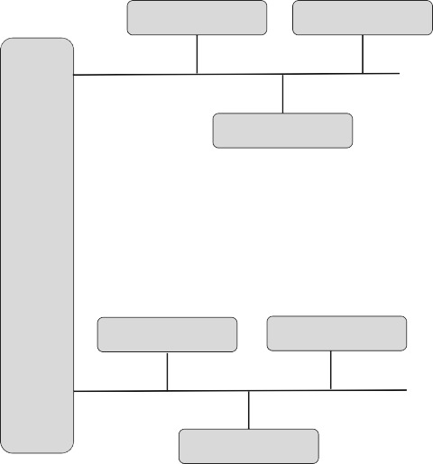

# Software Architectures—Views and Documentation

**Abstract** Software architecture is the foundation for automotive software design. Being a high-level design view of the system it combines multiple views on the software system, and provides the project teams with the possibility to communicate and make technical decisions about the organization of the functionality of the entire software system. It allows also us to understand and to predict the performance of the system before it is even designed. In this chapter we introduce the definitions related to software architectures which we will use in the remainder of the book. We discuss the views used during the process of architectural design and discuss their practical implications.

> **摘要**软件体系结构是汽车软件设计的基础。作为该系统的高级设计视图，它结合了软件系统上的多个视图，并为项目团队提供了有关整个软件系统功能组织组织的可能性和技术决策的可能性。它还允许我们在设计之前理解和预测系统的性能。在本章中，我们介绍了与软件架构有关的定义，这些定义将在本书的其余部分中使用。我们讨论架构设计过程中使用的观点，并讨论其实际含义。

## Introduction

As the amount of software in modern cars grows we observe the need to use more advanced software engineering methods and tools to handle the complexity, size and criticality of the software [[Sta16](#_bookmark150), [Für10](#_bookmark124)]. We increase the level of automation and increase the speed of delivery of software components. We also constantly evolve software systems and their design in order to be able to keep up with the speed of the changes in requirements in automotive software projects.

> 随着现代汽车中的软件数量的增长，我们观察到需要使用更高级的软件工程方法和工具来处理软件的复杂性，大小和批判性 [sta16](#_bookmark150)，[für10](#_bookmark124)]。我们提高自动化水平，并提高软件组件的交付速度。我们还不断地发展软件系统及其设计，以便能够跟上汽车软件项目需求变化的速度。

Software architecture is one of the cornerstones of successful products in general, and in particular in the automotive industry. In general, the larger the system, the more difficult it is to obtain a good quality overview of its functions, subsystems, components and modules—simply because of the limitations of our human perception. In automotive software design we have more specific challenge, related to the safety of the software embedded in the car and the distribution of the software—both distribution in terms of the physical distribution of the computing nodes and distribution of the development among the car manufacturers and their suppliers.

> 软件体系结构是一般成功产品的基石之一，尤其是汽车行业。通常，系统越大，就越难获得其功能，子系统，组件和模块的高质量概述，这是因为我们人类感知的局限性。在汽车软件设计中，我们面临更具体的挑战，与汽车中嵌入的软件的安全性以及软件的分配有关 - 根据计算节点的物理分配以及汽车制造商和开发的分布的分布他们的供应商。

In this chapter we discuss the concept of software architecture and explain it with the examples of building architectures. Once we know more about what constitutes software architecture, we go into the details of different views of software architecture and how they come together. We then move on to describing the most common architectural styles and explain where they can be seen in automotive software. Finally we present the ways of describing architectures—the architecture modelling languages. We end the chapter with references to further readings for readers interested in more details.

> 在本章中，我们讨论了软件体系结构的概念，并用构建体系结构的示例进行解释。一旦我们了解了什么构成软件体系结构的更多信息，我们就会详细介绍软件体系结构的不同视图及其如何融合的详细信息。然后，我们继续描述最常见的体系结构风格，并在汽车软件中解释它们可以看到它们的位置。最后，我们介绍描述体系结构的方法 - 架构建模语言。我们结束了本章，引用了对更多详细信息感兴趣的读者的进一步阅读。

## Common View on Architecture in General and in the Automotive Industry in Particular

The concept of architecture is well rooted in our society and its natural association is to the styles of buildings. When thinking about architecture we often recall large cathedrals, the gothic and modern styles of churches, or other large structures. One of the examples of such a cathedral is the  `Sagrada Familia`  cathedral in Barcelona with its very characteristic style.

> 架构的概念源于我们的社会，其自然关联是架构的风格。当思考架构时，我们经常回想起大型大教堂，教堂的哥特式和现代风格或其他大型架构。这种大教堂的例子之一是巴塞罗那的 ` Sagrada Familia` 大教堂，其特色风格。

However, let us discuss the concept of the architecture with a considerable smaller example—let us take the example of a pyramid. Figure [2.1](#_bookmark57)[1](#_bookmark58) presents a picture of the pyramids in Gizah.

> 但是，让我们以一个相当小的示例讨论体系结构的概念 - 以金字塔为例。图 [2.1](#_bookmark57)[ 1 ](#_bookmark58)介绍了吉萨(Gizah)金字塔的图片。

<Fig. 2.1** All Gizah pyramids: a picture represents an external view of the product

The form of the pyramid is naturally based on a triangle. The fact that it is based on a triangle is one of the architectural choices. Another choice is the type of the

>  金字塔的形式自然基于三角形。它基于三角形的事实是架构选择之一。另一个选择是

1Author: Ricardo Liberato, available at Wikipedia, under the Creative Commons License: [https://](https://creativecommons.org/licenses/by-sa/2.0/) [creativecommons.org/licenses/by-sa/2.0/](https://creativecommons.org/licenses/by-sa/2.0/).

1. Definitions 21 triangle (e.g. using the golden number 1.619 as the ratio between the slant height to half the base length). The decision is naturally based on mathematics and illustrated using one of the views of the pyramid—call it an early design blueprint as presented in Fig. [2.2](#_bookmark59).

> 1.定义 21 三角形(例如，将黄金数字 1.619 作为倾斜高度与基本长度一半之间的比率)。该决定自然基于数学，并使用金字塔的观点之一进行了说明 - 将其称为图。[2.2](#_bookmark59) 所示的早期设计蓝图。

<Fig. 2.2\*\* Internal view of the architecture of a pyramid

Figure [2.2](#_bookmark59) shows the first design principles later on used to detail the design of the pyramid. Instead of delving deeper into the pyramid construction, let us now consider the notion of architecture and software architecture in the automotive industry.

> 图 [2.2](#_bookmark59) 显示了以后的第一个设计原理，用于详细说明金字塔的设计。现在，让我们考虑到汽车行业中架构和软件架构的概念，而不是深入研究金字塔结构。

One obvious view of the architecture of the car is the external view of the product, as with the view of the pyramid (Fig. [2.3](#_bookmark62)[2](#_bookmark61) )

> 汽车架构的一个明显视图是产品的外部视图，如金字塔的视图(图 [2.3](#_bookmark62)[ 2 ](#_bookmark61))

We can observe the general architectural characteristics of a car—the placement of the lights, the shape of the lights, the shape of the front grill, the length of the car, etc. This view has to be complemented with a view of the internal design of the car. An example of such a blueprint is presented in Fig. [2.4](#_bookmark64).

> 我们可以观察汽车的一般架构特征 - 灯光的放置，灯的形状，前烤架的形状，汽车的长度等。这种视图必须互补，以欣赏内部的视图汽车的设计。此类蓝图的一个示例如图 [2.4](#_bookmark64)。

This blueprint shows the dimensions of the car, hiding other kinds of details. In the mechanical domain, when designing the chassis of the car, the engineers visualize the use of materials in the car, as shown in Fig. [2.5](#_bookmark65).

> 该蓝图显示了汽车的尺寸，隐藏了其他类型的细节。在机械域中，设计汽车的底盘时，工程师可视化汽车中材料的使用，如图 [2.5](#_bookmark65) 所示。

The body structure can be complemented with the architecture of the powertrain, as shown in Fig. [2.6](#_bookmark67).

> 如图 [2.6](#_bookmark67) 所示，可以将车身结构与动力总成的结构相辅相成。

In the next section, we explore how the architects present software and the principles behind the design of the software.

> 在下一部分中，我们将探讨架构师如何呈现软件和软件设计背后的原理。

## Definitions

Software architecting starts with the very first requirement and ends with the last defect fix in the product, although its most intensive period is in the early design stage where the architects decide upon the high-level principles of the system

> 软件架构始于第一个要求，并以产品的最后一个缺陷修复结束，尽管其最密集的时期是在早期的设计阶段，架构师决定了系统的高级原理

2Author: Albin Olsson, available at Wikipedia, under the Creative Commons License: [https://](https://creativecommons.org/licenses/by-sa/4.0/deed.en) [creativecommons.org/licenses/by-sa/4.0/deed.en](https://creativecommons.org/licenses/by-sa/4.0/deed.en).

<**Fig. 2.3** Volvo XC 90, another example of the external view of the product design. These high-level principles are documented in the form of a software architecture document with several views included. We could therefore define the software architecture as the high-level design, but this definition would not be just. The definition which we use in this book is:

Software architecture refers to the high-level structures of a software system, the discipline of creating such structures, and the documentation of these structures. These structures are needed to reason about the software system

> 软件体系结构是指软件系统的高级结构，创建此类结构的纪律以及这些结构的文档。需要这些结构来推理软件系统

The definition is not the only one, but it reflects the right scope of the architecture. The definition comes from Wikipedia ([https://en.wikipedia.org/wiki/](https://en.wikipedia.org/wiki/Software_architecture) [Software_architecture](https://en.wikipedia.org/wiki/Software_architecture)).

> 该定义不是唯一的定义，但它反映了体系结构的正确范围。该定义来自 Wikipedia([[https://en.wikipedia.org/wiki/](https://en.wikipedia.org/wiki/)](/software_architecture))。

## High-Level Structures

The definition presented in this chapter ( `Software architecture refers to the high- level structures of a software system... ` ) talks about  `high-level structures`  as a means to generalize a number of different entities used in the architectural design.

> 本章介绍的定义( `软件体系结构是指软件系统的高级结构……` )谈到 `高级结构` ，以此作为概括体系结构设计中使用的许多不同实体的手段。

<**Fig. 2.4** A blueprint of the design principles of a car. Volvo XC70, ©2020, Volvo Car Corporation. Used under permission from Volvo Car Corporation

In this chapter we go into details about these structures, which are:

> 在本章中，我们详细介绍了这些结构，这些结构是：

1. Software components/Blocks—pieces of software packaged into subsystems and components based on their logical structure Examples of such components could be UML/C++ classes, C cod modules, and XML configuration files

> 1.软件组件/块 - 基于其逻辑结构示例包装到子系统和组件的软件件可以是 UML/C ++ 类，C COD 模块和 XML 配置文件

2. Hardware components/Electronic Control Units—elements of design of the computer system (or platform) on which the software i executed. Examples of such elements include ECUs, communicatio buses, sensors and actuators

> 2.硬件组件/电子控制单元 - 我执行软件的计算机系统(或平台)设计元素。此类元素的示例包括 ECUS，Communicatio Bus，传感器和执行器

3. Functions—elements of the logical design of the software described in terms of functionality, which is then distributed over th software components/blocks. Examples of such elements are softwar functions, properties and requirements All of these elements together form the electrical system of the car and its software system. Even though the hardware components do not  `belong`  to the software world, it is the often the job of the architect to make sure that they are visible and linked to the software components. This linking is important from the process perspective—it must be know which supplier should design the software for the hardware. We talk more about the concept of the supplier and the process in Chap. [3](#_bookmark154)

> 3.功能 - 用功能性描述的软件逻辑设计的元素，然后将其分布在 TH 软件组件/块上。此类元素的示例是软件功能，属性和要求，所有这些元素一起构成了汽车及其软件系统的电气系统。即使硬件组件不属于软件世界，也经常是架构师的工作，以确保它们可见并链接到软件组件。从流程的角度来看，这种链接很重要 - 必须知道哪个供应商应为硬件设计软件。我们更多地谈论了供应商的概念和 CHAP 的过程。[3](#_bookmark154)

<**Fig. 2.5** Volvo XC90 body structure. ©2020, Volvo Car Corporation. Used under permission from Volvo Car Corporation

In the list of high-level structures, when introducing functions, we indicated the interrelation between these entities— `functions distributed over the software components` . This interrelation leads us to an important principle of architecting— the use of views. An architectural view is _a representation of one or more structural aspects of an architecture that illustrates how the architecture addresses one or more concerns held by one or more of its stakeholders_[[RW12](#_bookmark141)].

> 在引入功能的高级结构列表中，我们指出了这些实体之间的相互关系 -  `分布在软件组件上` 。这种相互关系使我们成为架构的重要原则 - 使用观点。架构观点是 *a 的一个或多个结构方面的表示，该架构说明了该体系结构如何解决一个或多个利益相关者*[rw12](#_bookmark141)]的一个或多个关注点。

One could see the process of architecting as a prescriptive design, the process continuous as the design evolves. Certain aspects of design decisions influence the architecture and are impossible to know a priori—increased processing power required to fulfill late function requirements or safety-criticality of the designed system. If not managed correctly the architecture has a tendency to evolve into a descriptive documentation that needs to be kept consistent with the software itself [[EHPL15](#_bookmark121), [SGSP16](#_bookmark145)].

> 人们可以将架构的过程视为一种规定的设计，随着设计的发展，该过程是连续的。设计决策的某些方面会影响体系结构，并且不可能知道先验的 - 满足迟交功能要求或设计系统的安全至关重要性所需的处理能力。如果无法正确管理，则体系结构倾向于发展为描述性文档，该文档需要与软件本身保持一致 [EHPL15](#_bookmark121)，[sgsp16](#_bookmark145)]。

## Architectural Principles

The second part of the definition of the software architecture ( `... the discipline of creating such structures... ` ) refers to the decisions which the software architects make in order to set the scene for the development. The software architects create the principles by defining such things as what components should be included in the system, which functionality each component should have (but not how it should be implemented—this is the role of the design discipline, which we describe in Chap. [5](#_bookmark273)) and how the components should communicate with each other.

> 软件体系结构定义的第二部分( ` ...创建此类结构……` )是指软件架构师为开发设置场景而做出的决策。软件架构师通过定义应该包含哪些组件的内容来创建原理，每个组件应具有哪些功能(但不能如何实现)，这是设计学科的作用，我们在 Chap 中描述了该纪律。[5](#_bookmark273))以及组件应如何相互通信。

<**Fig. 2.6** Volvo T8 Twin Engine on SPA (Scalable Platform Architecture). ©2020, Volvo Car Corporation. Used under permission from Volvo Car Corporation

Let us consider the coupling as an example of setting the principles. We can consider an example of a communication between the component representing the controller of the windshield wipers and the component representing the hardware interface to the small engine controlling the actual windshield wiper arm. We could have a coupling in one way, as presented in Fig. [2.7](#_bookmark68).

> 让我们将耦合视为设定原理的示例。我们可以考虑代表挡风玻璃控制器控制器的组件与代表硬件接口到小型发动机的组件之间的通信示例。如图 [2.7](#_bookmark68) 中所示，我们可以以一种方式进行耦合。

<**Fig. 2.7** An example principle—unidirectional coupling between two blocks

In the figure we can see that the line (association) between the blocks is directed from WindshieldWiper to WndEngHW. This means that the communication can only happen in one way—the controller can send signals to the hardware interface. This seems logical, but it raises challenges when the controller wants to know the status of the hardware interface without pulling the interface—it is not possible as the hardware interface cannot communicate with the controller. If an architect sets this principle then this has the consequences on the later design, such as the need for extra signals on the communication bus (pulling the hardware for the status).

> 在图中，我们可以看到块之间的线(关联)是从挡风玻璃吹动到 WNDENGHW 的。这意味着通信只能以一种方式进行 - 控制器可以将信号发送到硬件接口。这似乎是合乎逻辑的，但是当控制器想知道硬件接口的状态而不拉动接口时，它会引起挑战 - 由于硬件接口无法与控制器通信，因此不可能。如果架构师设置了此原理，那么这会对后来的设计产生后果，例如在通信总线上需要额外的信号(将硬件拉动状态)。

However, the software architect might make another decision—to allow commu- nication both ways, which is shown in Fig. [2.8](#_bookmark69).

> 但是，软件架构师可能会做出另一个决定 - 允许两种方式进行交流，如图 [2.8](#_bookmark69) 所示。

<**Fig. 2.8** An example principle—bidirectional coupling between two blocks

The second architectural alternative allows the communication in both ways, which solves the challenges related to pulling the hardware interface component for the status. However, it also brings in another challenge—tight coupling between the controller and the hardware interface. This tight coupling means that when one of these two component changes, the other should be changed (or at least reviewed) as the two are dependent on one another.

> 第二个体系结构替代方案允许以两种方式进行通信，从而解决了与将硬件接口组件提取状态相关的挑战。但是，它也带来了另一个挑战 - 控制器和硬件接口之间的耦合。这种紧密的耦合意味着，当这两个组件之一更改时，应更改(或至少进行审查)，因为两者相互依赖。

In the remainder of this chapter we discuss several of such principles when discussing architectural styles.

> 在本章的其余部分中，我们在讨论架构风格时讨论了一些此类原则。

## Architecture in the Development Process

In order to put the process of architecting in context and describe the current architectural views in automotive software architectures, let us first discuss the V-model as shown in Fig. [2.9](#_bookmark71). The V-model represents a high-level view of a software development process for a car from the perspective of OEMs. In the most common scenario, where there is no OEM in-house development, component design and verification is usually entirely done by the suppliers (i.e., OEMs send empty software compositions to the suppliers, who populate them with the actual software components).

> 为了将架构的过程放在上下文中并描述汽车软件体系结构中当前的体系结构视图，让我们首先讨论 V 模型，如图 [2.9](#_bookmark71) 所示。从 OEM 的角度来看，V 模型代表了汽车软件开发过程的高级视图。在最常见的情况下，在没有 OEM 内部开发的情况下，组件设计和验证通常由供应商完全完成(即 OEM 向供应商发送空的软件构图，这些供应商将它们与实际软件组件一起填充它们)。

The first level is the functional development level, where we encounter the first two types of the architectural views—the functional view and the logical system view. Now, let us look into the different architectural views, their purpose and the principles of using them. When discussing the views we also discuss the elements of these views.

> 第一个级别是功能开发级别，我们遇到了架构视图的前两种类型 - 功能视图和逻辑系统视图。现在，让我们研究不同的架构观点，它们的目的和使用它们的原则。在讨论观点时，我们还讨论了这些观点的要素。

Functional architecture
<**Fig. 2.9** V-model with focus on architectural views and evolution

## Architectural Views

As we show in the process when starting with the development from scratch, the requirements of or ideas for functions in the car come first—the product management has the ideas about what kind of functionality the car should have. Therefore we start with this type of the view first and gradually move on to more detailed views on the design of the system.

> 正如我们在从头开始开发时在过程中所显示的那样，汽车中功能的要求或想法首先出现 - 产品管理对汽车应该具有什么样的功能具有想法。因此，我们首先从这种类型的视图开始，然后逐渐转化为系统设计的更详细的视图。

### _Functional View_

The functional view, often abbreviated to _functional architecture_, is the view where the focus is on the functions of the vehicle and their dependencies on one another [[VF13](#_bookmark152)]. An example of such a view is shown in Fig. [2.10](#_bookmark74).

> 功能视图通常缩写为*功能架构*，是对车辆及其依赖相互依赖的焦点的视图 [vf13](#_bookmark152)]。这种观点的示例如图 [2.10](#_bookmark74) 所示。

As we can see from the example, there are three elements in this diagram—the functions (plotted as rounded-edge rectangles), the domains (plotted as sharp-edged rectangles) and the dependency relations (plotted as dashed lines), as the functions can depend on each other and they can easily be grouped into  `domains`  such as Powertrain and Active Safety. The usual domains are:

> 从示例中我们可以看到，此图中有三个要素：函数(绘制为圆形矩形)，域(绘制为尖锐的矩形)和依赖关系(绘制为虚线)，作为依赖关系，作为依赖关系(绘制为绘制的矩形)，如功能可以互相取决于彼此，并且可以轻松地将其分组到 `域` 中，例如动力总成和主动安全性。通常的域是：

<**Fig. 2.10** Example of a functional architecture—or a functional view

1. Powertrain—grouping the elements related to the powertrain of the car—engine, engine ECU, gearbox and exhaust

> 1.动力总成 - 将与汽车动力总成相关的元素 - 发动机，发动机 ECU，变速箱和排气装置

2. Active Safety—grouping the elements related to safety of the car—ADAS (Advanced Driver Assistance Systems), ABS (Anti-loc Braking System) and similar

> 2.主动安全性 - 将与汽车安全性有关的元素组成 - ADAS(高级驾驶协助系统)，ABS(反 LOC 制动系统)和类似

1. Chassi and body—grouping the elements related to the interior of the car— seats, windows and other (which also contain electronics an software actua- tors/sensors)

> 1.底盘和车身 - 将与汽车内部相关的元素组成 - 座椅，窗户和其他(还包含电子和软件执行器/传感器)

2. Electronic systems—grouping the elements related to the functioning of the car’s electronic system—main ECU, communication buses an related In modern cars the number of functions can reach more than 1000 and is constantly growing. The largest growth in the number of functions is related to new types of functionality in the cars—autonomous driving and electrification. Examples of functions from the autonomous driving area are

> 2.电子系统(将与汽车电子系统功能相关的元素组成 - ecu，通信总线与现代汽车相关的通信总线可以达到 1000 多个功能，并且正在不断增长。功能数量最大的增长与汽车中新型功能类型有关 - 自主驾驶和电气化。自动驾驶区域功能的示例是

3. Adaptive Cruise Control—basic function to automatically keep a distance from the preceding vehicle while maintaining a constan maximum velocity

> 3.自适应巡航控制 - 基本功能可以自动与前面的车辆保持距离，同时保持 constan 最大速度

4. Lane Keeping Assistance—basic function to warn the driver when the vehicle is crossing the parallel line on the road without the tur indicator

> 4.巷道保持协助 - 当车辆在没有 TUR 指示器的道路上越过平行线时警告驾驶员的基础功能

5. Active Traffic Light Assistance—medium advanced function to warn the driver of a red light ahead

> 5.主动的交通信号灯援助 - 中间的高级功能警告驾驶员前方红灯

6. Traffic Jam Chauffeur—medium/advanced function to autonomously drive dur- ing traffic jam conditions

> 6.交通拥堵司机 - 在交通堵塞条件下自动驾驶的媒体/高级功能

7. Highway Chauffeur/pilot—medium/advanced function to autonomously drive during high-speed driving

> 7.高速公路司机/飞行员 - 高速驾驶期间自动驾驶的媒体/高级功能

8. Platooning—advanced function to align a number of vehicles to drive autonomously in a so-called platoon

> 8.排 - 促进功能，以对齐许多车辆在所谓的排中自动驾驶

9. Overtaking Pilot—advanced function to autonomously drive during an overtake situation These advanced functions build on top of the more basic functionality of the car, such as the ABS (Anti-lock Braking System), warning lights and blinkers. The basic functions that are used by the above functions can be exemplified by

> 9.超越飞行员 - 在超越情况下自动驾驶的助长功能这些高级功能建立在汽车的更基本功能之上，例如 ABS(防锁制动系统)，警告灯和闪烁器。上述功能使用的基本功能可以用

10. Anti-lock Braking System (ABS)—preventing the car from locking the brakes on slippery roads

> 10.防锁制动系统(ABS) - 防止汽车锁在滑动道路上的刹车

1. Engine cut-off—shutting down the engine in situations such as after crash

> 1.发动机截止

1. Distance warning—warning the driver about too little distance from the vehicle in front. The functional view provides the architects with the possibility to cluster functions, and distribute them to the right department to develop and to reason about these kinds of functionality. An example of such reasoning is the use of methods such as the Pareto front [[DST15](#_bookmark118)].

> 1.距离警告 - 使驾驶员距离车辆的距离太少。功能视图为架构师提供了群集功能的可能性，并将其分配给正确的部门以开发和推理这类功能。这种推理的一个例子是使用诸如 Pareto Front [DST15](#_bookmark118)]之类的方法。

###### How-To

The process of functional architecture design starts with the development of the list of functions of the vehicle and their dependencies, which can be documented in block diagrams, use case diagrams or SysML requirements diagrams [[JT13](#_bookmark128), [SSBH14](#_bookmark149)].

> 功能体系结构设计的过程始于车辆及其依赖性功能列表的开发，可以用框图，用例图或 SYSML 要求图进行记录，[JT13](#_bookmark128)，[SSBH14](#_Bookmark149)]。

Once the list and dependencies are found, we move to organizing the functions to the domains. In the normal case these domains are known and given. The organization of the functions is based on how they are dependent on each other with the principle that the number of dependencies that cross-cut the domains should be minimized. The result of this process is the development of the diagram as shown in Fig. [2.10](#_bookmark74).

> 一旦找到了列表和依赖项，我们就将将功能组织到域。在正常情况下，这些域是已知和给出的。功能的组织基于它们如何相互依赖的原理，即应将域的依赖性数量最小化。该过程的结果是图的开发，如图 [2.10](#_bookmark74) 所示。

### _Physical System View_

Another view is the system view on the architecture, usually portrayed as a view of the entire electrical system at the top level with accompanying lower-level diagrams (e.g. class diagrams in UML). Such an overview level is presented in Fig. [2.11](#_bookmark76). In this view we could see the ECUs (rounded rectangles) of different sizes placed on two physical buses (lines). This view of the architecture provides the possibility to present the topology of the electrical system of the car and provides the architects with a way to reason about the placement of the computers on the communication buses.

> 另一个视图是在体系结构上的系统视图，通常被描绘成顶层的整个电气系统的视图，并伴有较低级别的图(例如 UML 中的类图)。这样的概述级别如图 [2.11](#_Bookmark76) 所示。在这种观点中，我们可以看到将不同尺寸的 ECU(圆形矩形)放在两个物理总线上(线)上。这种体系结构的观点提供了呈现汽车电气系统拓扑的可能性，并为架构师提供了一种推理计算机在通信总线上放置的方法。

In the early days of automotive software engineering (up until the late 1990s) this view was quite simple and static as there were only a few ECUs and a few communication buses. However, in the modern software design, this view gets increased importance as the number of ECUs grows and the ability to give an overview becomes more important. The number of communication buses also increases and therefore the topologies of the components in the physical architectures have evolved from the typical star topologies (as in Fig. [2.11](#_bookmark76)) to more linked architectures with over 100 active nodes. The modern view on the topology also includes information about the processing power and the operating system (and its version) of each ECU.

> 在汽车软件工程的早期(直到 1990 年代后期)，这种观点非常简单且静态，因为只有几个 ECU 和一些通信巴士。但是，在现代软件设计中，随着 ECU 的数量的增长，并且提供概述的能力变得更加重要。通信巴士的数量还增加了物理体系结构中组件的拓扑结构，从典型的星形拓扑(如图 [2.11](#_bookmark76))演变为具有 100 多个活动节点的更多链接体系结构。拓扑的现代视图还包括有关每个 ECU 的处理能力和操作系统(及其版本)的信息。

<**Fig. 2.11** Example of a system architecture—or a system view

###### How-To

Designing this view is usually straightforward as it is dictated by the physical architecture of the car, where the set of ECUs is often given. The most important ECUs are often predetermined from the previous projects—usually the main computer, the active safety node, the engine node, and similar. A list of the most common ECUs present in almost all modern cars is ([https://en.wikipedia.org/wiki/](https://en.wikipedia.org/wiki/Electronic_control_unit) [Electronic_control_unit](https://en.wikipedia.org/wiki/Electronic_control_unit)):

> 设计这种观点通常很简单，因为它是由汽车的物理结构所决定的，那里经常给出 ECU 的集合。最重要的 ECU 通常是从以前的项目中预先确定的 - 通常是主计算机，主动安全节点，发动机节点等。几乎所有现代汽车中最常见的 ECU 列表是[[[https://en.wikipedia.org/wiki/](https://en.wikipedia.org/wiki/)](//en.wikipedia.org/wiki/electronic_control_unit)：)：

- Engine control unit (EnCU)
- Electric power steering control unit (PSCU)
- Human-machine interface (HMI)
- Powertrain control module (PCM)
- Telematic control unit (TCU)
- Transmission control unit (TCU)
- Brake control module (BCM; ABS or ESC)
- Battery management system

> - 发动机控制单元(ENCU)
> - 电动转向控制单元(PSCU)
> - 人机接口(HMI)
> - 动力总成控制模块(PCM)
> - 远程膜控制单元(TCU)
> - 传输控制单元(TCU)
> - 制动控制模块(BCM；ABS 或 ESC)
> - 电池管理系统

Depending on the car manufacturer, the other control modules can differ significantly. It is also the case that many of the additional control units are part of the electrical system, meaning that they are included only in certain car models or instances, depending on the customer order.

> 根据汽车制造商的不同，其他控制模块可能会有很大差异。也是如此，许多其他控制单元是电气系统的一部分，这意味着仅在某些汽车模型或实例中包括它们，具体取决于客户订单。

### _Logical View_

The focus of the view is on the topology of the system. This view is often accompanied by the logical component architecture as presented in Fig. [2.12](#_bookmark79). The rationale behind the logical view of the system is to focus solely on the software of the car. In the logical view we show which classes, modules, and components are used in the car’s software and how they are related to each other. The notation used for this model is often UML (Unified Modelling Language) and its subling SysML (Systems Modelling Language).

> 观点的重点是系统的拓扑。该视图通常伴随着图 [2.12](#_bookmark79) 所示的逻辑组件体系结构。系统逻辑观点背后的理由是仅关注汽车的软件。在逻辑视图中，我们显示了汽车软件中使用哪些类，模块和组件以及它们相互关联的方式。该模型使用的符号通常是 UML(统一的建模语言)及其 SUBLING SYSML(系统建模语言)。

For the logical view, the architects often use a variety of diagrams (e.g. commu- nication diagrams, class diagrams, component diagrams) to show various levels of abstraction of the software of the car—usually in its context. For the detailed design, these architectural models are complemented with low-level executable models such as Matlab/Simulink defining the behaviour of the software [[Fri06](#_bookmark123)].

> 对于逻辑视图，架构师经常使用各种图(例如通信图，类图，组件图)来显示汽车软件的各种级别的抽象，通常在其上下文中。对于详细的设计，这些体系结构模型与低级可执行模型相辅相成，例如 MATLAB/SIMULINK 定义软件的行为 [FRI06](#_bookmark123)]。

###### How-To

The first step in describing the logical view of the software is to identify the components—these are modelled as UML classes. Once they are identified we should add the relationships between these components in the form of associations. It is important to keep the directionality of the associations correct as these will determine the communication between the components added during the detailed design.

> 描述软件逻辑视图的第一步是识别组件 - 这些组件是建模为 UML 类。一旦确定它们，我们应该以关联形式添加这些组件之间的关系。重要的是要保持关联的方向性正确，因为这些将决定详细设计过程中添加的组件之间的通信。

The logical architecture should be refined and evolved during the entire project of the automotive software development.

> 逻辑体系结构应在汽车软件开发的整个项目中进行完善和进化。

### _Relation to the 4+1 View Model_

The above-mentioned three views, presently used in automotive software engineer- ing, evolved from the widely known principles of 4+1 view architecture model presented in 1995 by Kruchten [[Kru95](#_bookmark132)]. The 4+1 view model postulates describing software architectures from the following perspectives:

> 上述三个视图，目前用于汽车软件工程师，从 1995 年由 Kruchten [Kru95](#_bookmark132)]提出的 4+1 视图体系结构模型的广为人知的原理演变而来。4+1 视图模型假设从以下角度描述软件体系结构：

- logical view—describing the design model of the system, including entities such as components and connectors
- process view—describing the execution process view of the architecture, thus allowing us to reason about non-functional properties of the software under construction
- physical view—describing the hardware architecture of the system and the mapping of the software components on the hardware platform (deployment)
- development view—describing the organization of software modules within the software components

> - 逻辑视图 - 描述系统的设计模型，包括组件和连接器之类的实体
> - 过程视图 - 描述体系结构的执行过程视图，从而使我们能够对正在构建的软件的非功能性属性进行推理
> - 物理视图 - 描述系统的硬件体系结构以及硬件平台上软件组件的映射(部署)
> - 开发视图 - 描述软件组件中软件模块的组织

- scenario view—describing the interactions of the system with the external actors and internal interactions between components. These views are perceived as connected with the scenario view overlapping the other four, as presented in Fig. [2.13](#_bookmark80), adapted from [[Kru95](#_bookmark132)].

> - 方案视图 - 描述系统与外部参与者的相互作用以及组件之间的内部交互。如图 [2.13](#_bookmark80) 所示，这些视图与方案视图重叠的方案视图相连，该视图改编自 [KRU95](#_bookmark132)]。

<**Fig. 2.12** Example of a logical view—a UML class diagram notation

<**Fig. 2.13** 4+1 view model of architecture

The 4+1 view model has been used in the telecommunication domain, the aviation domain and almost all other domains. Its close relation to the early version of UML (1.1–1.4) and other software development notations of the 1990s contributed to its wide spread and success.

>   4+1 视图模型已在电信域，航空域和几乎所有其他域中使用。它与 UML(1.1-1.4)的早期版本和 1990 年代的其他软件开发符号的密切关系促成了其广泛的传播和成功。

In the automotive domain, however, the use of UML is rather limited to class/object diagrams and therefore this view model is not as common as in the telecommunication domain.

> 但是，在汽车域中，UML 的使用仅限于类/对象图，因此此视图模型并不像电信域那样常见。

## Architectural Styles

As the architecture describes the high-level design principles of the system, we can often observe how these design decisions shape the system. In this case we can talk about the so-called architectural styles. The architectural styles form principles of software design in the same way as building architecture shapes the style of a building (e.g. thick walls in gothic style).

> 正如架构描述了系统的高级设计原理一样，我们通常可以观察这些设计决策如何塑造系统。在这种情况下，我们可以谈论所谓的架构风格。架构风格以与架构架构的形状相同的方式形成了软件设计原理(例如，哥特风格的厚墙)。

In software design we distinguish between a number of styles in general, but in the automotive systems we can only see a number of those, as the automotive software has harder requirements on reliability and robustness than, for example, web servers. Therefore some of the styles are not applicable.

> 在软件设计中，我们总体上区分了许多样式，但是在汽车系统中，我们只能看到其中的许多样式，因为汽车软件对可靠性和可靠性的要求比例如 Web 服务器更难。因此，某些样式不适用。

In this section, let us dive deeper into architectural styles and their examples.

> 在本节中，让我们更深入地研究架构风格及其例子。

### _Layered Architecture_

This architectural style postulates that components of the system are placed in a hierarchy on top of each other and function calls (API usage) are made only from higher to lower levels, as shown in Fig. [2.14](#_bookmark83).

> 这种体系结构样式假设系统的组件彼此之间放置在层次结构中，并且功能调用(API 使用)仅从较高至较低的级别进行，如图 [2.14](#_bookmark83) 所示。

<**Fig. 2.14** Layered architectural style—boxes symbolize components and lines symbolize API usage/method calls

We can often see this type of layered architecture in the design of microcon- trollers and in the upcoming AUTOSAR standard where the software components are given specific functions such as communication. An example of this kind of architecture is presented in Fig. [2.15](#_bookmark84).

> 我们通常可以在微型拖车的设计以及即将到来的 AutoSar 标准中看到这种类型的分层体系结构，在该标准中，该软件组件具有特定功能，例如通信。此类体系结构的一个示例如图 [2.15](#_bookmark84)。

<**Fig. 2.15** An example of a layered architecture

A special variant of this kind of style is the two-tier style as presented by Steppe et al. [[SBG+04](#_bookmark144)], with one layer for the abstract components and the other one for the middleware details. One example of middleware can be found in Chap. [4](#_bookmark185) in the description of the AUTOSAR standard. Examples of the functionality implemented by the middleware are logging diagnostic events, handling communication on the buses, securing data and data encryption.

> SP  这种样式的 ecial 变体是 Steppe 等人提出的两层样式。[SBG + 04](#_bookmark144)]，一层用于抽象组件，另一层用于中间件详细信息。中间件的一个示例可以在 Chap 中找到。[4](#_bookmark185) 在 Autosar 标准的描述中。中间件实现的功能示例是记录诊断事件，处理公交车上的通信，确保数据和数据加密。

An example of such an architecture can be seen in the area of autonomous driving when dividing decisions into a number of layers, as shown in Fig. [2.16](#_bookmark85) extended from [[BCLS16](#_bookmark116)].

> 将决策分为多个层时，可以在自动驾驶区域中看到这样的架构的一个示例，如图 [2.16](#_bookmark85) 所示，从 [bcls16](#_bookmark116)]延伸。

<**Fig. 2.16** Layered architecture example—decision layers in autonomous driving

In this figure we can see that the functionality is distributed in different layers and the higher layers are responsible for mission/route planning while the lower levels are responsible for steering the car. This kind of modular layered architecture allows the architects to distribute competence into the vertical domains. The wide arrows indicate that this architecture is abstract and that these layers can be connected either directly or indirectly (i.e. there may be other layers in-between).

> 在  的数字中，我们可以看到该功能分布在不同的层中，较高的层负责任务/路线计划，而较低级别则负责转向汽车。这种模块化分层体系结构使架构师可以将能力分配到垂直域。宽箭头表明该体系结构是抽象的，并且可以直接或间接地连接这些层(即之间可能还有其他层)。

We quickly realize that this kind of architectural style has limitations caused by the fact that the layers can communicate only in one way. The components within the same layer are often not supposed to communicate. Therefore, there is another style which is often used—component-based.

> 我们很快意识到，这种架构风格存在局限性，原因是这些层只能以一种方式进行交流。同一层中的组件通常不应该传达。因此，还有另一种经常使用的样式 - 基于组件。

### _Component-Based_

This architectural style is more flexible than the layered architecture style and postulates the principle that all components can be interchangeable and independent of each other. All communication should go through well-defined public interfaces and each component should implement a simple interface, allowing for queries about which interfaces are implemented by the component. In the non-automotive domain this kind of architecture has been populated by Microsoft in its Windows OS through the usage of DLLs (Dynamic Linked Libraries) and the IUnknown interface.

> 这种架构风格比分层体系结构风格更灵活，并假定所有组件都可以互换且彼此独立。所有通信都应通过定义明确的公共接口，每个组件都应实现一个简单的接口，以允许查询组件实现哪些接口。在非自动启动域中，这种体系结构已由 Microsoft 在其 Windows OS 中通过 DLL(动态链接库)和 Iunknown 界面填充。

An abstract view of this kind of style is presented in Fig. [2.17](#_bookmark87).

> 这种样式的抽象视图如图 [2.17](#_bookmark87) 提供了。

<**Fig. 2.17** Component-based architectural style

The component-based style is often used together with the design-by-contract principle, which postulates that the components should have contracts for their interfaces—what the API functions can and cannot do. This component-based style is often well suited when describing the functional architecture of the car’s functionality.

> 基于组件的样式通常与逐项合同原理一起使用，该原理假定组件应具有其接口的合同 - API 函数可以做到的。在描述汽车功能的功能架构时，通常非常适合这种基于组件的样式。

In contemporary cars we can see this architectural style in the Infotainment domain, where the system is divided into the platform and the application layer (thus having layered architecture), and for the application layer all the apps which can be downloaded onto the system are designed according to component-based principles. These principles mean that each app can use another one as long as the apps have the right interface. For example a GPS app can use the app for music to play sound in the background without leaving the GPS. As long as the music app exposes the right interface, it makes no difference to the GPS app which music app is used.

> 在当代汽车中，我们可以在信息娱乐域中看到这种体系结构样式，该系统被分为平台和应用层(因此具有分层体系结构)，对于应用程序层，所有可以下载到系统上的应用程序均已设计根据基于组件的原则。这些原则意味着，只要应用程序具有正确的接口，每个应用程序就可以使用另一个应用程序。例如，GPS 应用程序可以将应用程序用于音乐在背景中播放声音而无需离开 GPS。只要音乐应用程序公开了正确的接口，它就会对使用哪个音乐应用程序的 GPS 应用没有任何影响。

### _Monolithic_

This style is the opposite of that of component-based architecture as it postulates that the entire system is one large component and that all modules within the system can use each other. This style is often used in low-maturity systems as it leads to high coupling and high complexity of the system. An abstract representation in shown in Fig. [2.18](#_bookmark89).

> 这种样式与基于组件的体系结构相反，因为它假定整个系统是一个大型组件，并且系统中的所有模块都可以相互使用。这种样式通常用于低到期系统，因为它导致系统的高耦合和高复杂性。图 [2.18](#_bookmark89) 所示的抽象表示。

<**Fig. 2.18** Monolithic architectural style

The monolithic architecture is often used for implementing parts of the safety- critical system, where the communication between components needs to be done in real time with as little communication overhead as possible. Typical mechanisms in the monolithic architectures are the  `safe`  mechanisms of programming languages such as use of static variables, no memory management and no dynamic structures.

> 整体体系结构通常用于实现安全系统的一部分，其中需要实时进行组件之间的通信，并尽可能少地通信开销。整体体系结构中的典型机制是编程语言的 `安全` 机制，例如使用静态变量，没有内存管理和没有动态结构。

### _Microkernel_

Starting in the late 1980s, software engineers started to use microkernel architecture when designing operating systems. Many of the modern operating systems are built in this architectural style. In short, this architectural style can be seen as a special case of the layered architecture with two layers:

> 从 1980 年代后期开始，在设计操作系统时，软件工程师开始使用微关体体系结构。许多现代操作系统都是以这种架构风格建造的。简而言之，这种架构风格可以看作是具有两层的分层体系结构的特殊情况：

- Kernel—a limited set of components with the higher execution privileges, such as task scheduler, memory manager, and basic interprocess communication manager. These components have the precedence over the application layer components.

> -Kernel-一组有限的组件，具有较高的执行特权，例如任务调度程序，内存管理器和基本的 Intercorss Communication Manager。这些组件具有比应用层组件的优先级。

- Application—components such as user application processes, device drivers, or file servers. These components can have different privilege levels, but always lower than that of the kernel processes.

> - 应用程序 - 诸如用户应用程序流程，设备驱动程序或文件服务器之类的组件。这些组件可以具有不同的特权级别，但总是低于内核过程。

The graphical overview of such an architectural style is show in Fig. [2.19](#_bookmark91).

> 这种架构风格的图形概述在图 [2.19](#_bookmark91) 中显示。

<**Fig. 2.19** Microkernel architectural style

#### Abstract representation of the system

In this architectural style it is quite common that applications (or components) communicate with each other over interprocess communications. This type of communication allows the operating system (or the platform) to maintain control over the communications.

> 在 thi  的架构样式中，应用程序(或组件)通过解释性通信相互通信很普遍。这种类型的通信允许操作系统(或平台)保持对通信的控制。

In the automotive domain, the microkernel architecture is used in certain components which require high security. It is argued that the minimality of the kernel allows us to apply the principles of least privilege, and therefore remain in control of the security of the system at all times. It is also sometimes argued that hypervisors of the virtualized operating systems are developed according to this principle. In the automotive domain the use of virtualization is currently in the research stage, but seems to be very promising as it would allow us to minimize the costs of hardware while at the same time retain the flexibility of the electrical system (imagine all cars had the same hardware and one could only use different virtual OSs and applications for each brand or type of car!).

> 在汽车域中，微核体系结构用于某些需要高安全性的组件。有人认为，内核的最低性使我们能够应用最少特权的原则，因此始终保持控制系统安全性。有时也有人认为，根据该原则开发了虚拟化操作系统的虚拟机。在汽车域中，虚拟化的使用目前处于研究阶段，但似乎非常有前途相同的硬件和人只能为每种品牌或类型的汽车使用不同的虚拟 OSS 和应用程序！)。

### _Pipes and Filters_

Pipes and filters is another well-known architectural style which fits well for systems that operate based on data processing (thus making its  `comeback`  as Big Data enters the automotive market). This architectural style postulates that the components are connected along the flow of the data processing, which is conceptually shown in Fig. [2.20](#_bookmark93).

> 管道和过滤器是另一种众所周知的架构风格，非常适合根据数据处理运行的系统(因此，随着大数据进入汽车市场的 `复出` )。这种架构样式假设这些组件沿数据处理的流程连接，这在图 [2.20](#_bookmark93) 中如图所示。

<**Fig. 2.20** Pipes and filters architectural style

In contemporary automotive software, this architectural style is visible in such areas as image recognition in active safety, where large quantities of video data need to be processed in multiple stages and each component has to be independent of the other (as shown in Fig. [2.20](#_bookmark93)) [[San96](#_bookmark142)].

> 在  现代汽车软件中，在主动安全性中的图像识别等领域可见这种架构样式，其中大量视频数据需要在多个阶段进行处理每个组件必须独立于另一个组件(如图 [2.20](#_bookmark93))[SAN96](#_bookmark142)] ]。

### _Client–Server_

In client–server architectural style the principles of the design of such systems prescribe the decoupling between components with designated roles—servers which provide resources upon the request of the clients, as shown in Fig. [2.21](#_bookmark95). These requests can be done in either the pull or the push manner. Pulled requests mean that the responsibility for querying the server lies with the client, which means that the clients need to monitor changes in resources provided by the server. Pushed requests mean that the server notifies the relevant clients about changes in the resources (as in the event–driven architectural style and the published subscriber style).

> 在客户端 - 服务器架构样式中，此类系统设计的原理规定了具有指定角色的组件之间的去耦，这些组件是根据客户要求提供资源的服务员，如图 [2.21](#_bookmark95) 所示。这些请求可以以拉动方式或推动方式完成。拉出的请求意味着查询服务器的责任在于客户端，这意味着客户需要监视服务器提供的资源更改。推送的请求意味着服务器通知相关客户有关资源的变化(如事件驱动的架构样式和已发布的订户样式)。

Request: speed value
<**Fig. 2.21** Client–server architectural style

##### Fleet manager

Response: speed = 10 kmph

##### Telematics ECU

In the automotive domain, this style is seen in specific forms like publisher– subscriber style or event–driven style. We can see the client–server style in such components as telemetry, where the telematics components provide the information to the external and internal servers [[Nat01](#_bookmark137), [VS02](#_bookmark153)].

> 在汽车域中，这种样式以特定形式(如发布者 - 订户样式或事件驱动风格)看到。我们可以在远程计算等组件中看到客户端 - 服务器样式，远程信息处理组件将信息提供给外部和内部服务器 [nat01](#_bookmark137)，[vs02](#_bookmark153)]。

### _Publisher–Subscriber_

The publisher–subscriber architectural style can be seen as a special case of the client–server style, although it is often perceived as a different style. This style postulates the principle of loose coupling between providers (publishers) of the information and users (subscribers) of the information. Subscribers subscribe to a central storage of information in order to get notifications about changes in the information. The publisher does not know the subscribers and the responsibility of the publisher is only to update the information. This is in clear contrast to the client– server architecture, where the server sends the information directly to a known client (known as it is the client that sends the request). The publisher–subscriber style is illustrated in Fig. [2.22](#_bookmark97).

> 出版商– Subscriber 架构样式可以看作是客户 - 服务器风格的特殊情况，尽管通常被认为是一种不同的样式。这种样式假设了信息的信息和用户(订阅者)之间的松散耦合原理。订户订阅信息中心存储信息，以获取有关信息更改的通知。发布者不知道订阅者，发布者的责任只是更新信息。这与客户端 - 服务器架构形成鲜明对比，服务器将信息直接发送给已知客户端(称为发送请求的客户端)。出版商– Subscriber 样式如图 [2.22](#_bookmark97)。

<**Fig. 2.22** Publisher–subscriber architectural style

In automotive software, this kind of architectural style is used when distributing information about changes in the status of the vehicle, e.g. the speed status or the tire pressure status [[KM99](#_bookmark130), [KB02](#_bookmark129)]. The advantage of this style is the decoupling of information providers from information subscribers so that the information providers do not get overloaded as the number of subscribers increases. However, the disadvantage is the fact that the information providers do not have control of which components use the information and what information they possess at any given time (as the components do not have to receive updates synchronously).

> 在汽车软件中，当分发有关车辆状态变化的信息时，使用了这种架构样式。速度状态或轮胎压力状态 [km99](#_bookmark130)，[kb02](#_bookmark129)]。这种样式的优点是将信息提供商与信息订阅者的解耦，因此随着订户数量的增加，信息提供商不会被超载。但是，缺点是信息提供商无法控制哪些组件使用这些信息以及它们在任何给定时间拥有的信息(因为组件不必同步接收更新)。

### _Event–Driven_

The event–driven architectural style has been popularized in software engineering together with graphical user interfaces and the use of buttons, text fields, labels and other graphical elements. This architectural style postulates that the components listen for (hook into) the events that are sent from the component to the operating system. The listener components react upon receipt of the event and process the data which has been sent together with the event (e.g. position of the mouse pointer on the screen when clicked). This is conceptually presented in Fig. [2.23](#_bookmark99).

> 事件驱动的体系结构样式与图形用户界面以及按钮，文本字段，标签和其他图形元素一起在软件工程中普及。这种体系结构样式假设组件会聆听(挂接)从组件发送到操作系统的事件。收到事件后，侦听器组件反应并处理已与事件一起发送的数据(例如，单击时鼠标指针在屏幕上的位置)。这在图 [2.23](#_bookmark99) 中概念上介绍。

<**Fig. 2.23** Event-driven architectural style

The event driven architectural style is present in a number of parts of the automotive software system. Its natural placement with the user interface of the infotainment or the driver assist systems (e.g. voice control), which is also present in the aviation industry [[Sar00](#_bookmark143)] is obvious. Another use is diagnostics and storage of the error codes [[SKM+10](#_bookmark146)]. Using Simulink to design software systems and using stimuli and responses, or sensors and actuators, shows that event–driven style has been incorporated.

> 事件驱动的架构风格存在于汽车软件系统的许多部分中。它与信息娱乐或驱动程序辅助系统的用户界面(例如语音控制)的自然放置，该系统也存在于航空业 [SAR00](#_bookmark143)]中。另一个用途是诊断和存储错误代码 [SKM + 10](#_bookmark146)]。使用 Simulink 设计软件系统，并使用刺激和响应或传感器和执行器，表明事件驱动的样式已被合并。

### _Middleware_

The middleware architectural style postulates the existence of a common request broker which mediates the usage of resources between different components. The concept has been introduced into software engineering together with the initiative of CORBA (Common Object Request Broker Architecture) by Object Management Group [[OPR96](#_bookmark139), [Cor95](#_bookmark119)]. Although the CORBA standard itself is not relevant for the automotive domain, its principles are present in the design of the AUTOSAR standard with its meta-model to describe the common elements of automotive software. The conceptual view of middleware style is shown in Fig. [2.24](#_bookmark101).

> 中间件体系结构样式假设存在一个共同的请求经纪，该代理介导了不同组件之间的资源使用情况。该概念已与 Object Management Group [OPR96](#_bookmark139)，[cor95](#_bookmark119)] ]一起，将该概念与 CORBA(共同对象请求代理架构)的计划一起引入软件工程。尽管 CORBA 标准本身与汽车域无关，但其原理仍存在于 Autosar 标准的设计中，其元模型以描述汽车软件的共同元素。中间件样式的概念视图如图 [2.24](#_bookmark101) 所示。

<**Fig. 2.24** Middleware architectural style

In automotive software, the middleware architecture is visible in the design of the AUTOSAR standard, which is discussed in detail later on in this book. The usage of middleware becomes increasingly important in automotive software’s mechanisms of adaptation [[ARC+07](#_bookmark115)] and fault tolerance [[JPR08](#_bookmark127), [PKYH06](#_bookmark140)].

> 在 Au  上述软件中，中间件体系结构在 Autosar 标准的设计中可见，这本书稍后在本书中进行详细讨论。中间件的用法越来越重要，在汽车软件的适应机制中 [Arc + 07](#_bookmark115)]和容差 [jpr08](#_bookmark127)，[pkyh06](pkyh06](pkyh06])(#_Bookmark140)]。

### _Service-Oriented_

Service-oriented architectural style postulates loose coupling between component using internet-based protocols. The architectural style puts emphasis on interfaces which can be accessed as web services and is often depicted as in Fig. [2.25](#_bookmark103).

> 面向服务的体系结构样式假设使用基于 Internet 的协议之间的组件之间的耦合松散。架构风格强调可以作为 Web 服务访问的接口，通常如图 [2.25](#_Bookmark103) 所示。

Here the services can be added and changed on-demand during the runtime of the system.

> 在这里，可以在系统运行时添加和更改服务。

In automotive software, this kind of architecture style is not widely used, but there are areas where the on-demand or ad hoc services are needed. One examples is vehicle platooning which has such an architecture [[FA16](#_bookmark122)], and is presented in Fig. [2.26](#_bookmark104).

> 在汽车软件中，这种体系结构风格并未被广泛使用，但是在某些领域需要按需或临时服务。一个示例是车辆排，具有这样的体系结构 [FA16](#_bookmark122)]，并在图 [2.26](#_bookmark104) 中呈现。

<**Fig. 2.25** Service-oriented architectural style

#### Abstract representation of the system

Vehicle platooning
<**Fig. 2.26** An example of a service-oriented architecture—vehicle platooning

Since vehicle platooning is done  `spontaneously`  during driving, the architecture needs to be flexible and needs to allow vehicles to link to and unlink from each other without the need to recompile or restart the system. The lack of available interfaces can lead to change in the vehicle operation mode, but not to disturbance in the software operation. The architecture is flexible and when one interface is not available (suddenly), due to reconfiguration, this does not lead to any disturbances in the operation of the entire system. In other words, the system is robust to changes in the availability of interfaces during runtime.

> 由于  车辆排在驾驶过程中 `自发` 完成，因此架构需要灵活，并且需要允许车辆互相链接并无需链接并连接重新编译或重新启动系统。缺乏可用的接口会导致车辆操作模式的变化，但不会在软件操作中干扰。该体系结构是灵活的，当一个接口不可用时(突然)，由于重新配置，这不会导致整个系统操作的任何干扰。换句话说，该系统在运行时内接口的可用性变化是可靠的。

Now that we have introduced the most popular architectural styles, let us discuss the languages used to describe software architectures.

> 现在我们已经引入了最受欢迎的体系结构风格，让我们讨论用于描述软件体系结构的语言。

## Describing the Architectures

In this book we have seen multiple ways of drawing architectural diagrams depending on the purpose of the diagram. We used the formal UML notation in Fig. [2.12](#_bookmark79) when describing the logical components of the software. In Fig. [2.10](#_bookmark74) we used boxes and lines, which are different from the boxes and lines used in Figs. [2.14](#_bookmark83), [2.15](#_bookmark84), [2.16](#_bookmark85), [2.17](#_bookmark87), [2.18](#_bookmark89), [2.19](#_bookmark91), [2.20](#_bookmark93), [2.21](#_bookmark95), [2.22](#_bookmark97), [2.23](#_bookmark99), and [2.24](#_bookmark101). It all has a purpose.

> 在本书中，我们看到了多种根据图的目的来绘制架构图的方法。在描述软件的逻辑组件时，我们使用了图 [2.12](#_bookmark79) 中的正式 UML 符号。在图 [2.10](#_bookmark74) 中，我们使用了框和线条，这些框和线条与图 1 和图 2 中使用的框和线不同。[2.14](#_bookmark83)，[2.15](#_bookmark84)，[2.16](#_bookmark85)，[2.17](#_bookmark87)，[2.18](#_bookmark89)，[2.19]，[2.19](#_bookmark91)，[2.20]，[2.20](#_bookmark93)，[2.21](#_bookmark95)，[2.22](#_bookmark97)，[2.23](#_bookmark99) 和 [2.24](#_bookmark101)。一切都有目的。

By using different notations we could see that there is no unified formalism describing a software architecture and that software architecture is a means of communication. It allows architects to describe the principles guiding the design of their system and discuss the implications of the principles on the components. Each of these notations could be called ADL—Architecture Description Language. In this section we introduce the most relevant ADLs which are available for soft- ware architects, with the focus on two formalisms—SySML (Systems Modelling Language, [[HRM07](#_bookmark126), [HP08](#_bookmark125)]) and EAST-ADL [[CCG+07](#_bookmark117), [LSNT04](#_bookmark135)].

> 通过使用不同的符号，我们可以看到没有描述软件体系结构的统一形式主义，而软件体系结构是一种通信手段。它允许架构师描述指导其系统设计的原理，并讨论原理对组件的含义。这些符号中的每一个都可以称为 ADL - 架构结构描述语言。在本节中，我们介绍了可用于软件架构师的最相关的 ADL，重点是两个形式主义：Sysml(系统建模语言，[HRM07](#_bookmark126)，[hp08]，[hp08](#_bookmark125)] ] ] ] ] ])和 east-adl [CCG + 07](#_bookmark117)，[lsnt04](#_bookmark135)]。

### _SysML_

SySML is a general-purpose language based on Unified Modelling Language (UML). It is built as an extension of a subset of UML to include more diagrams (e.g. Requirements Diagram) and reuse a number of UML symbols with the profile mechanism. The diagrams (views) included in SySML are:

> SYSML 是一种基于统一建模语言(UML)的通用语言。它是作为 UML 子集的扩展而构建的，以包括更多图(例如需求图)，并重复使用带有配置文件机制的许多 UML 符号。SYSML 中包含的图(视图)为：

- Block definition diagram—an extended class diagram from UML 2.0 using stereotyped classes to model blocks, activities, their attributes and similar. As the  `block`  is the main building block in SySML, it is reused quite often to represent both software and hardware blocks, components and modules.

> - 块定义图 - 使用刻板印象类的 UML 2.0 的扩展类图，用于模拟块，活动，其属性以及相似的模型。由于 `块` 是 SYSML 的主要构建块，因此经常重复使用软件和硬件块，组件和模块。

- Internal block diagram—similar to the block definition diagram, but used to define the elements of a block itself

> - 内部框图 - 与块定义图相似，但用于定义块本身的元素

- Package diagram—the same as the package diagram from UML 2.0, used to group model elements into packages and namespaces

> - 软件包图 - 与 UML 2.0 的软件包图相同，用于将模型元素分组到软件包和名称空间

- Parametric diagram—diagram which is a special case of the internal block diagram and allows us to add constraints to the elements of the internal block diagram (e.g. logical constraints on the values of data processed).

> - 参数图 - Diagram 是内部框图的特殊情况，允许我们在内部框图的元素中添加约束(例如，对处理的数据值的逻辑约束)。

- Requirement diagram—contains user requirements for the system and allows us to model and link them to the other model elements (e.g. blocks). It is one of the diagrams that adds a lot of expressiveness to SySML models, compared to the standard Use Case diagrams of UML.

> - 要求图 - 包含对系统的用户要求，并允许我们建模并将其链接到其他模型元素(例如块)。与 UML 的标准用例图相比，它是为 SYSML 模型增添大量表达性的图之一。

- Activity diagram—describes the behaviour of the system as an activity flow.

> - 活动图 - 描述系统的行为为活动流。

- Sequence diagram—describes the interaction between block instances in a nota- tion based on MSC (Message Sequence Charts) from the telecommunications domain.

> - 序列图 - 描述了基于电信域的基于 MSC(消息序列图)的块实例之间的相互作用。

- State machine diagram—describes the state machines of the system or its components.

> - 状态机图 - 描述系统的状态机或其组件。

- Use case diagram—describes the interaction of the system with its external actors (users and other systems).

> - 用例图 - 描述了系统与其外部参与者(用户和其他系统)的交互作用。

An example of a requirement diagram is presented in Fig. [2.27](#_bookmark107) from [[SSBH14](#_bookmark149)].

> 需求图的示例如图 [2.27](#_bookmark107) 在 [SSBH14](#_bookmark149)]中。

<**Fig. 2.27** Example requirements diagram

The diagram presents two requirements related to each other (Maximum Accel- eration and Engine Power) with the dependency between them. Blocks like the  `Provide Power`  are linked to these requirements with the dependency  `satisfy`  to show where these requirements are implemented.

> 该图提供了两个相互关系的要求(最大加速度和发动机功率)以及它们之间的依赖性。诸如 `提供权力` 之类的块与这些要求相关联，依赖性 `满意` 以显示这些要求的实现位置。

As we can quickly see from this example, the requirements diagram can be used very effectively to model the functional architecture of the electrical system of a car. The block diagram was presented when discussing the logical view of the architecture (Fig. [2.12](#_bookmark79)) and it can be further refined into a detailed diagram for a particular block, as shown in Fig. [2.28](#_bookmark108).

> 从这个示例中我们可以快速看到，需求图可以非常有效地对汽车电气系统的功能架构进行建模。在讨论体系结构的逻辑观点时，介绍了框图(图 [2.12](#_bookmark79))，并且可以进一步完善特定块的详细图表，如图 [2.28](#_bookmark108))。

<**Fig. 2.28** Internal block diagram

The diagram fulfills a similar purpose as the detailed design of the block, which is often done using the Simulink modelling language. In this book we look into the details of Simulink design in Chap. [6](#_bookmark368).

> 该图实现了与块的详细设计相似的目的，该设计通常是使用 Simulink 建模语言完成的。在本书中，我们研究了 Chap 中的 Simulink 设计的细节。[6](#_bookmark368)。

The behavioral diagrams of SySML are important for the detailed design of automotive systems, but they are out of the scope of this chapter as the architecture model is supposed to focus on the structure of the system and therefore kept on a high abstraction level.

> SYSML 的行为图对于汽车系统的详细设计很重要，但是它们不在本章的范围内，因为架构模型应该集中在系统的结构上，因此保持在高级抽象级别。

### _EAST ADL_

EAST ADL is another modelling language based on UML which is intended to model automotive software architectures [[CCG+07](#_bookmark117), [LSNT04](#_bookmark135)]. In contrast to SySML, which was designed by an industrial consortium, EAST ADL is the result of a number of European Union-financed projects which included both research and development components.

> EAST ADL 是基于 UML 的另一种建模语言，旨在建模汽车软件体系结构 [CCG + 07](#_bookmark117)，[lsnt04](#_bookmark135)]。与由工业财团设计的 Sysml 相反，East ADL 是许多欧盟资助的项目的结果，包括研究和开发组成部分。

The principles of EAST ADL are similar to those of SySML in the sense that it also allows us to model automotive software architecture in different abstraction levels. The abstraction levels of EAST ADL are:

> EAST ADL 的原理与 SYSML 的原理相似，因为它也使我们能够以不同的抽象级别对汽车软件体系结构进行建模。East ADL 的抽象水平是：

- Vehicle level—architectural model describing the vehicle functionality from an external perspective. It is the highest abstraction level in EAST ADL, which is then refined in the Analysis model.

> - 车辆水平 - 从外部角度描述车辆功能的架构模型。它是 East ADL 中最高的抽象水平，然后在分析模型中进行了完善。

- Analysis level—architectural model describing the functionality of the vehicle in an abstract model, including dependencies between the functions. It is an example of a functional architecture, as discussed in Sect. [2.7.1](#functional-view).

> - 分析级别 - 描述摘要模型中车辆功能的架构模型，包括功能之间的依赖性。如 Sect 中所述，这是功能体系结构的一个示例。[2.7.1](#%E5%8A%9F%E8%83%BD%E8%A7%86%E5%9B%BE)。

- Design level—architectural model describing the logical architecture of the software, including its mapping to hardware. It is similar to the logical view from Fig. [2.12](#_bookmark79).

> - 设计级别 - 描述软件逻辑体系结构的架构模型，包括其映射到硬件。它类似于图 [2.12](#_bookmark79) 的逻辑视图。

- Implementation level—detailed design of the automotive software; here EAST ADL reuses the concepts from the AUTOSAR standard.

> - 实施级别 - 汽车软件的确定设计；在这里，East ADL 重复了 Autosar 标准的概念。

The vehicle level can be seen as a use case level of the specification where the functionality is designed from a high abstraction level and then gradually refined into the implementation.

> 车辆级别可以看作是规范的用例级别，在该规范中，该功能是从高抽象级别设计的，然后逐渐完善到实现中。

Since EAST ADL is based on UML, the visual representation of models in EAST ADL is very similar to the models already presented in this chapter. However, there are some differences in the structure of the models and therefore the concepts used in SySML and EAST ADL may differ. Let us illustrate one of the differences with the requirements model in Fig. [2.29](#_bookmark110).

> 由于 East ADL 是基于 UML 的，因此 East ADL 中模型的视觉表示与本章已经介绍的模型非常相似。但是，模型的结构存在一些差异，因此 SYSML 和 EAST ADL 中使用的概念可能有所不同。让我们说明图 [2.29](#_bookmark110) 中的需求模型的差异之一。

<**Fig. 2.29** Feature (requirements) diagram in EAST ADL

The important difference here is the link of the requirement—in EAST ADL the requirements can be linked to Features, a concept which does not exist in SySML.

> i  此处的差异是需求的链接 - 在 East ADL 中，要求可以链接到功能，这一概念在 sysml 中不存在。

In general, EAST ADL is a modelling notation more aligned with the characteris- tics of the automotive domain and makes it easier to structure models for a software engineer. However, EAST ADL is not as widely spread as SySML and therefore not as widely adopted in industry.

> 通常，East ADL 是一种模型符号，与汽车域的特征更加一致，并且使软件工程师构建模型变得更加容易。但是，East ADL 并不像 SYSML 那样广泛传播，因此在行业中不那么广泛采用。

## Next Steps

After the architecture is designed in the different diagrams, it should be transferred to the product development database and linked to all the other elements of the electrical system of the car. The product development database contains the design details of all software and hardware components, the relationships between them and the deployment of the logical software components onto the physical components of the electrical system.

> 在不同图表中设计架构后，应将其传输到产品开发数据库，并链接到汽车的电气系统的所有其他元素。产品开发数据库包含所有软件和硬件组件的设计详细信息，它们之间的关系以及逻辑软件组件的部署到电气系统的物理组件上。

## Further Reading

The architectural views, styles and modelling languages, discussed in this section, are the most popular one used in the software industry today. However, there are also others, which we encourage the interested reader to explore.

> 本节中讨论的架构观点，样式和建模语言是当今软件行业中最受欢迎的一种。但是，还有其他，我们鼓励有兴趣的读者探索。

Alternative modelling languages which are used in industry are the UML MARTE profile [[OMG05](#_bookmark138), [DTA+08](#_bookmark120)]. The MARTE profile has been designed to support modelling of real-time systems in all domains where they are applicable. Therefore there is a significant body of knowledge from using this profile, including executable variants of it [[MAD09](#_bookmark136)].

> 行业中使用的替代建模语言是 UML MARTE 配置文件 [OMG05](#_bookmark138)，[DTA + 08](#_bookmark120)]。MARTE 配置文件旨在支持在适用的所有域中实时系统的建模。因此，使用此配置文件有很大的知识，包括它的可执行模式 [mad09](#_bookmark136)]。

Readers interested in extending modelling languages can find more information in our previous work on language customization [[SW06](#_bookmark151), [SKT05](#_bookmark147), [KS02](#_bookmark133), [SKW04](#_bookmark148)] and the way in which these extension can be taught [[KS05](#_bookmark134)].

> 有兴趣扩展建模语言的读者可以在我们以前的语言自定义工作中找到更多信息 [SW06](#_bookmark151)，[SKT05](#_bookmark147)，[ks02](#_bookmark133)，[skw04](#_bookmark148)]以及可以教这些扩展的方式 [KS05](#_bookmark134)]。

An interesting review of future directions of architectures in general has been conducted by Kruchten et al. [[KOS06](#_bookmark131)]. Although the review was conducted over a decade ago, most of its results are valid today.

> Kruchten 等人对一般架构的未来方向进行了有趣的评论。[KOS06](#_bookmark131)]。尽管该审查是十年前进行的，但今天的大多数结果都是有效的。

## Summary

In this chapter we presented the concept of software architecture, its different viewpoints, and its architectural styles and introduced two notations used in automotive software engineering—SySML and EAST ADL.

> 在本章中，我们介绍了软件体系结构的概念，其不同的观点及其架构样式，并介绍了汽车软件工程中使用的两种符号-SSYSML 和 East ADL。

An interesting aspect of automotive software architectures is that they usually mix a number of styles. The overall style of the architecture can be layered architecture within an ECU, but the architecture of each of the components in the ECU can be service-oriented, pipes and filters or layered. A concrete example is the AUTOSAR architecture. AUTOSAR provides a reference three layer architecture where the first  `application`  layer can implement service-oriented architecture, the second layer can implement a monolithic architecture (just RTE) and the third,  `middleware` , layer can implement component-based architecture.

> 汽车软件体系结构的一个有趣方面是它们通常混合多种样式。该体系结构的整体样式可以在 ECU 中分层，但是 ECU 中每个组件的体系结构都可以以服务为导向，管道和过滤器或分层。一个具体的示例是 Autosar 体系结构。AutoSar 提供了一个参考三层体系结构，第一个 `应用程序` 层可以实现面向服务的体系结构，第二层可以实现单片体系结构(Just RTE)，而第三层 `中间件` 可以实现基于组件的体系结构。

The reasons for mixing these styles is that the software within a modern car has to fulfill many functions and each function has its own characteristics. For the telematics it is the connectivity which is important and therefore client–server style is the most appropriate. Now that we have discussed the basics of architectures, let us dive deeper into other activities in automotive software development, to understand why architecture is so important and what comes before and next.

> 混合这些样式的原因是，现代汽车中的软件必须实现许多功能，并且每个功能都具有自己的特征。对于远程信息处理，重要的是连接性，因此客户与服务方式最合适。现在，我们已经讨论了体系结构的基础知识，让我们更深入地研究汽车软件开发中的其他活动，以了解为什么体系结构如此重要，以及下一步和下一步。

## References

ARC+ 07. Richard Anthony, Achim Rettberg, Dejiu Chen, Isabell Jahnich, Gerrit de Boer, and Cecilia Ekelin. Towards a dynamically reconfigurable automotive control system architecture. In _Embedded System Design: Topics, Techniques and Trends_, pages 71– 84\. Springer, 2007.

BCLS16. Manel Brini, Paul Crubillé, Benjamin Lussier, and Walter Schön. Risk reduction of experimental autonomous vehicles: The safety-bag approach. In _CARS 2016 workshop, 4th International Workshop on Critical Automotive Applications: Robustness and Safety_, 2016.

CCG+ 07. Philippe Cuenot, DeJiu Chen, Sebastien Gerard, Henrik Lonn, Mark-Oliver Reiser, David Servat, Carl-Johan Sjostedt, Ramin Tavakoli Kolagari, Martin Torngren, and Matthias Weber. Managing complexity of automotive electronics using the EAST- ADL. In _12th IEEE International Conference on Engineering Complex Computer Systems (ICECCS 2007)_, pages 353–358. IEEE, 2007.

Cor95. OMG Corba. The common object request broker: Architecture and specification, 1995. DST15. Darko Durisic, Miroslaw Staron, and Matthias Tichy. Identifying optimal sets of standardized architectural features – a method and its automotive application. In _2015__11th International ACM SIGSOFT Conference on Quality of Software Architectures (QoSA)_, pages 103–112. IEEE, 2015.

DTA+ 08. Sébastien Demathieu, Frédéric Thomas, Charles André, Sébastien Gérard, and François Terrier. First experiments using the UML profile for MARTE. In _2008 11th IEEE International Symposium on Object and Component-Oriented Real-Time Distributed Computing (ISORC)_, pages 50–57. IEEE, 2008.

EHPL15. Ulf Eliasson, Rogardt Heldal, Patrizio Pelliccione, and Jonn Lantz. Architecting in the automotive domain: Descriptive vs prescriptive architecture. In _Software Architecture (WICSA), 2015 12th Working IEEE/IFIP Conference on_, pages 115–118. IEEE, 2015.

FA16. Patrik Feth and Rasmus Adler. Service-based modeling of cyber-physical automotive systems: A classification of services. In _CARS 2016 workshop, 4th International Workshop on Critical Automotive Applications: Robustness and Safety_, 2016.

Fri06. Jon Friedman. MATLAB/Simulink for automotive systems design. In _Proceedings of the conference on Design, Automation and Test in Europe_, pages 87–88. European Design and Automation Association, 2006.

Für10. Simon Fürst. Challenges in the design of automotive software. In _Proceedings of the Conference on Design, Automation and Test in Europe_, pages 256–258. European Design and Automation Association, 2010.

HP08. Jon Holt and Simon Perry. _SysML for systems engineering_, volume 7. IET, 2008.

HRM07. Edward Huang, Randeep Ramamurthy, and Leon F McGinnis. System and simulation modeling using SysML. In _Proceedings of the 39th conference on Winter simulation: 40 years! The best is yet to come_, pages 796–803. IEEE Press, 2007.

JPR08. Isabell Jahnich, Ina Podolski, and Achim Rettberg. Towards a middleware approach for a self-configurable automotive embedded system. In _IFIP International Workshop on Software Technologies for Embedded and Ubiquitous Systems_, pages 55–65. Springer, 2008.

JT13. Marcin Jamro and Bartosz Trybus. An approach to SysML modeling of IEC 61131-3 control software. In _Methods and Models in Automation and Robotics (MMAR), 2013 18th International Conference on_, pages 217–222. IEEE, 2013.

KB02. Jörg Kaiser and Cristiano Brudna. A publisher/subscriber architecture supporting interoperability of the can-bus and the internet. In _Factory Communication Systems, 2002. 4th IEEE International Workshop on_, pages 215–222. IEEE, 2002.

KM99. Joerg Kaiser and Michael Mock. Implementing the real-time publisher/subscriber model on the controller area network (can). In _2nd IEEE International Symposium on Object-Oriented Real-Time Distributed Computing, 1999_, pages 172–181. IEEE, 1999.

KOS06. Philippe Kruchten, Henk Obbink, and Judith Stafford. The past, present, and future for software architecture. _IEEE software_, 23(2):22–30, 2006.

Kru95. Philippe B Kruchten. The 4 + 1 view model of architecture. _Software, IEEE_, 12(6):42– 50, 1995.

KS02. Ludwik Kuzniarz and Miroslaw Staron. On practical usage of stereotypes in UML- based software development. _the Proceedings of Forum on Design and Specification Languages, Marseille_, 2002.

KS05. Ludwik Kuzniarz and Miroslaw Staron. Best practices for teaching uml based software development. In _International Conference on Model Driven Engineering Languages and Systems_, pages 320–332. Springer, 2005.

LSNT04. Henrik Lönn, Tripti Saxena, Mikael Nolin, and Martin Törngren. Far east: Modeling an automotive software architecture using the east adl. In _ICSE 2004 workshop on Software Engineering for Automotive Systems (SEAS)_, pages 43–50. IET, 2004.

MAD09. Frédéric Mallet, Charles André, and Julien Deantoni. Executing AADL models with UML/MARTE. In _Engineering of Complex Computer Systems, 2009 14th IEEE International Conference on_, pages 371–376. IEEE, 2009.

Nat01. Martin Daniel Nathanson. System and method for providing mobile automotive telemetry, July 17 2001. US Patent 6,263,268.

OMG05. UML OMG. Profile for modeling and analysis of real-time and embedded systems (marte), 2005.

OPR96. Randy Otte, Paul Patrick, and Mark Roy. _Understanding CORBA: Common Object Request Broker Architecture_. Prentice Hall PTR, 1996.

PKYH06. Jiyong Park, Saehwa Kim, Wooseok Yoo, and Seongsoo Hong. Designing real-time and fault-tolerant middleware for automotive software. In _2006 SICE-ICASE International Joint Conference_, pages 4409–4413. IEEE, 2006.

RW12. Nick Rozanski and Eóin Woods. _Software systems architecture: Working with stakeholders using viewpoints and perspectives_. Addison-Wesley, 2012.

San96. Keiji Saneyoshi. Drive assist system using stereo image recognition. In _Intelligent Vehicles Symposium, 1996., Proceedings of the 1996 IEEE_, pages 230–235. IEEE, 1996.

Sar00. Nadine B Sarter. The need for multisensory interfaces in support of effective attention allocation in highly dynamic event–driven domains: the case of cockpit automation. _The International Journal of Aviation Psychology_, 10(3):231–245, 2000.

SBG+ 04. Kevin Steppe, Greg Bylenok, David Garlan, Bradley Schmerl, Kanat Abirov, and Nataliya Shevchenko. Two-tiered architectural design for automotive control systems: An experience report. In _Proc. Automotive Software Workshop on Future Generation Software Architecture in the Automotive Domain_, 2004.

SGSP16. Ali Shahrokni, Peter Gergely, Jan Söderberg, and Patrizio Pelliccione. Organic evolution of development organizations – An experience report. Technical report, SAE Technical Paper, 2016.

SKM+10. Chaitanya Sankavaram, Anuradha Kodali, Diego Fernando Martinez, Krishna Pattipati Ayala, Satnam Singh, and Pulak Bandyopadhyay. Event-driven data mining techniques for automotive fault diagnosis. In _Proc. of the 2010 Internat. Workshop on Principles of Diagnosis (DX 2010)_, 2010.

SKT05. Miroslaw Staron, Ludwik Kuzniarz, and Christian Thurn. An empirical assessment of using stereotypes to improve reading techniques in software inspections. In _ACM SIGSOFT Software Engineering Notes_, volume 30, pages 1–7. ACM, 2005.

SKW04. Miroslaw Staron, Ludwik Kuzniarz, and Ludwik Wallin. Case study on a process of industrial MDA realization: Determinants of effectiveness. _Nordic Journal of Computing_, 11(3):254–278, 2004.

SSBH14. Giuseppe Scanniello, Miroslaw Staron, Håkan Burden, and Rogardt Heldal. On the effect of using SysML requirement diagrams to comprehend requirements: results from two controlled experiments. In _Proceedings of the 18th International Conference on Evaluation and Assessment in Software Engineering_, page 49. ACM, 2014.

Sta16. Miroslaw Staron. Software complexity metrics in general and in the context of ISO 26262 software verification requirements. In _Scandinavian Conference on Systems Safety_. [http://gup.ub.gu.se/records/fulltext/233026/233026.pdf](http://gup.ub.gu.se/records/fulltext/233026/233026.pdf), 2016.

SW06. Miroslaw Staron and Claes Wohlin. An industrial case study on the choice between lan- guage customization mechanisms. In _Product-Focused Software Process Improvement_, pages 177–191. Springer, 2006.

VF13. Andreas Vogelsanag and Steffen Fuhrmann. Why feature dependencies challenge the requirements engineering of automotive systems: An empirical study. In _Requirements Engineering Conference (RE), 2013 21st IEEE International_, pages 267–272. IEEE, 2013.

VS02. Pablo Vidales and Frank Stajano. The sentient car: Context-aware automotive telematics. In _Proceedings of the Fourth International Conference on Ubiquitous Computing_, pages 47–48, 2002.
