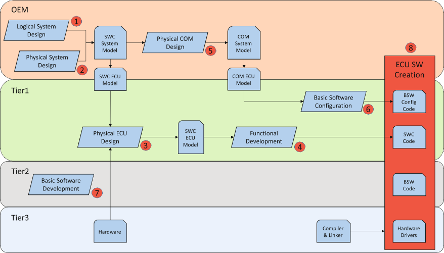
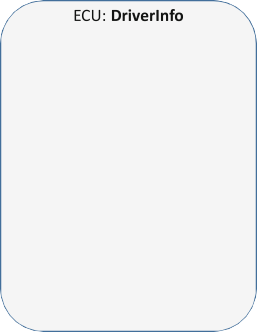
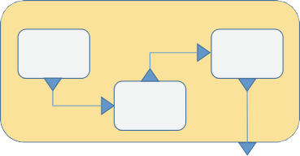
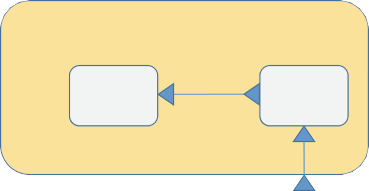
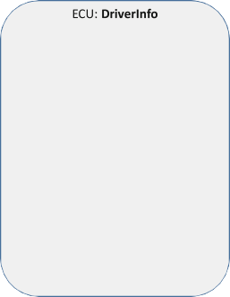
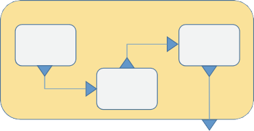
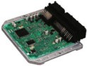
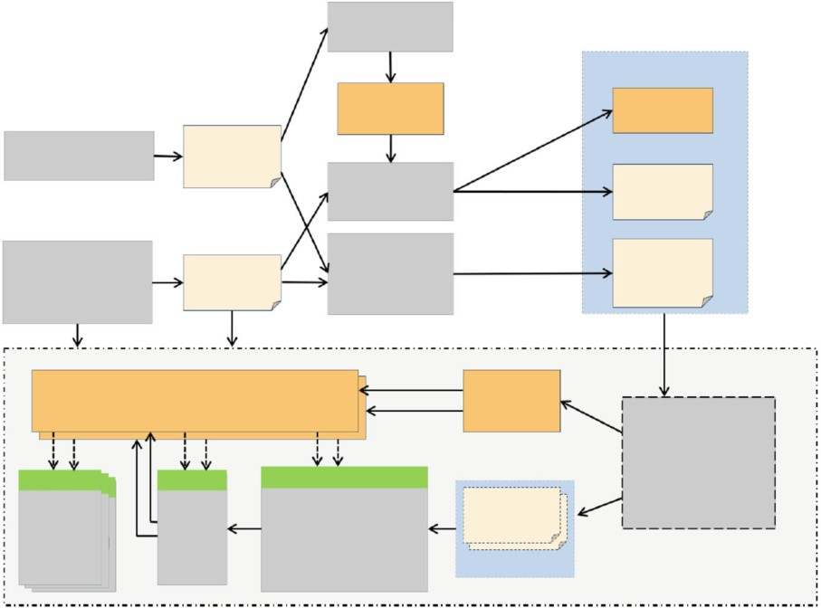

# AUTOSAR (AUTomotive Open System ARchitecture)

###### Darko Durisic, Volvo Car Group

`Abstract` In this chapter, we describe the role of the AUTOSAR standard in the development of automotive software/system architectures. AUTOSAR defines the reference architecture and the methodology for the development of automotive software systems built on top of the AUTOSAR platform (middleware). It also provides the language (meta-model) for their architectural models. The AUTOSAR platform comes in two flavors – the AUTOSAR Classic Platform designed for the development of traditional mechatronics systems such as climate control and doors and the AUTOSAR Adaptive Platform designed for the development of modern automotive software systems in the area of, e.g., autonomous drive and connectivity. For both of these platforms, we show the AUTOSAR’s reference architecture and describe the proposed development methodology. We also explain the role of the AUTOSAR meta-model in the development process of both the AUTOSAR Classic and Adaptive Platforms and show examples of the architectural models that instantiate this meta-model. Finally, we explain the use of the AUTOSAR metamodel for configuring the AUTOSAR platform modules in the middleware layer.

> `摘要` 在本章中，我们描述了汽车标准在汽车软件/系统体系结构开发中的作用。Autosar 定义了在 AutoSar 平台(中间件)顶部建立的汽车软件系统开发的参考体系结构和方法。它还为其架构模型提供了语言(元模型)。Autosar 平台有两种口味 - **Autosar Classic 平台，旨在开发传统的机电一体化系统**，例如气候控制和门以及为开发现代汽车软件系统在例如自动驱动器和自动驱动器和自动驱动器和连接性。对于这两个平台，我们都会显示 AutoSar 的参考体系结构并描述所提出的开发方法。我们还解释了 Autosar Meta 模型在 Autosar Classic 和自适应平台的开发过程中的作用，并显示了实例化该元模型的架构模型的示例。最后，我们解释了使用 AutoSar Meta-Model 用于配置中间件中的 AutoSar 平台模块的使用。

## Introduction

Traditionally, the most valued engineering skills in the automotive domain were the skills of mechanical engineers, with their passion for `gasoline` as the main motivating factor. Nowadays, this is taken over by the skills of electrical/software engineers whose passion for `code` is the main motivating factor [[Mer20](#_bookmark359)]. The main reason for this shift is the need of the majority of car functionalities today to be controlled by software, aiming to transform the mechanical nature of cars to `computers on wheels`[[Hil17](#_bookmark351)]. Software is also already today representing a key innovation factor in the automotive domain and gives competitive advantage to one car manufacturer (original equipment manufacturer (OEM)) over another.

> 传统上，汽车领域中最有价值的工程技能是机械工程师的技能，他们对 `汽油` 的热情是主要的激励因素。如今，这是由电气/软件工程师的技能接管的，他们对 `代码` 的热情是主要的激励因素[[MER20](#_bookmark359)]。这种转变的主要原因是当今**大多数汽车功能都需要由软件控制**，旨在将汽车的机械性质转换为 `车轮上的计算机` [[HIL17](#_bookmark351)]。如今，软件也已经代表了汽车域中的关键创新因素，并为一家汽车制造商(原始设备制造商(OEM))提供了竞争优势。

The gap caused by the inferiority of the software engineering skills at OEMs in favor of mechanical engineering skills was quickly filled by a number of software and hardware electronics suppliers delivering complete solutions to OEMs for the majority of traditional car functionalities. Some examples of these functionalities are engine control and transmission, door locking/unlocking, and digitalization of the driver head display. This raised the need for standardization in the development of automotive software systems in the following two major areas:

> 由 OEMS 的软件工程技能的自卑而造成的差距，支持机械工程技能，迅速填补了许多软件和硬件电子供应商，这些软件和硬件电子供应商为大多数传统汽车功能提供了完整的解决方案。这些功能的一些示例包括发动机控制和变速箱，门锁定/解锁以及驾驶员头显示器的数字化。这增加了以下两个主要领域中汽车软件系统开发的标准化的需求：

1. `Methodology` – a standardized methodology for designing and verifying the complete automotive software system was needed since the responsibility for system design and verification lies with OEMs and its implementation is distributed among usually many different suppliers.

> 1. `方法论`- 需要一种用于设计和验证完整汽车软件系统的标准化方法，因为系统设计和验证的责任与 OEMS 有关，其实施是在通常的许多不同供应商中分配的。

2. `Architecture` – a standardized reference architecture was needed to increase the reusability of the architectural components developed by the software suppliers between different OEMs, thereby reducing their cost.

> 2. `架构` - 需要进行标准化的参考体系结构，以增加由不同 OEM 之间软件供应商开发的架构组件的可重复性，从而降低了成本。

These needs were successfully addressed in 2003 by the introduction of the AUTOSAR (AUTomotive Open System ARchitecture) standard, today known as the AUTOSAR Classic Platform [[AUT19b](#_bookmark318)], as a joint partnership of automotive OEMs and their software and hardware electronics suppliers. Today, AUTOSAR consists of more than 200 global partners [[AUT20](#_bookmark338)] and is therefore considered the de facto standard in the development of automotive software systems.

> 这些需求在 2003 年通过引入 AutoSar(汽车开放系统体系结构)标准成功解决了这些需求，如今称为 AutoSar Classic Platform [[AUT19B](#_bookmark318)]，作为汽车 OEM 及其软件 OEM 及其软件和硬件的联合合作电子供应商。如今，Autosar 由 200 多个全球合作伙伴[[AUT20](#_bookmark338)]组成，因此被认为是汽车软件系统开发的事实标准。

During the first decade of AUTOSAR’s development, electrical engineering and more precisely software engineering competencies in the automotive domain were rising rapidly. This resulted in completely new expectations from future cars. Firstly, they are expected to contribute to the sustainability of our environment both in terms of carbon and nitrogen footprint during the exploitation of the vehicles (the goal of the EU is to have zero emission by 2035 for all newly produced vehicles [[Tra20](#_bookmark367)]) and in terms of low/zero emissions in the car development process including the development of their parts (e.g., batteries). Many believe that electric cars are the solution for meeting this goal.

> 在汽车开发的前十年中，汽车领域中的电气工程和更精确的软件工程能力正在迅速上升。这导致了未来汽车的全新期望。首先，他们有望在开发车辆期间在碳和氮足迹方面为我们的环境的可持续性做出贡献(欧盟的目的是在 2035 年到 2035 年对所有新生产的车辆的排放零[[TRA20])，就汽车开发过程中的低/零排放而言，包括其零件的开发(例如电池)。许多人认为电动汽车是实现这一目标的解决方案。

Secondly, future cars are expected to contribute to the goals of safe transportation systems which will not be satisfied until we achieve zero dead or severely injured people in all means of transport. It is becoming more apparent today that passive safety systems in cars such as belts and airbags and in general the construction of the vehicles are slowly hitting their limits in terms of safety improvement. This means that major improvements can be achieved only with active safety systems that rely on software with the ultimate goal of software being to be able to perform the entire journey fully autonomously without human intervention.

> 其次，预计未来的汽车将为安全运输系统的目标做出贡献，直到我们在所有运输工具中实现零死亡或严重受伤的人，才能得到满足。如今，越来越明显的是，皮带和安全气囊等汽车中的被动安全系统，通常，车辆的建造在安全改善方面正在逐渐达到其极限。这意味着**只有通过依靠软件的主动安全系统才能实现重大改进，其最终目标是能够在不进行人工干预的情况下完全自主执行整个旅程**。

The third expectation from future cars is tightly related to the second one (autonomous vehicles), and it reads `connectivity.` The part of connectivity relevant to autonomous vehicles is related to car-to-car communication or the communication between cars and the road infrastructure (e.g., traffic signs) including people’s `smart` devices in order for cars to gather relevant data about their environment in real time. But there is also another expectation related to connectivity coming directly from car users, and that is intuitive and fully integrable car infotainment system with other smart electronic devices such as mobile phones.

> 未来汽车的第三个期望与第二辆汽车(自动驾驶汽车)紧密相关，并且解释为 `连通性`。与自动驾驶汽车相关的连接部分与汽车到车通信或汽车与道路基础设施之间的通信(例如，交通标志)(包括人们的 `智能` 设备)有关实时环境。但是，还有另一种与直接来自汽车用户的连接性有关的期望，它与其他智能电子设备(例如手机)是直观且完全集成的汽车信息娱乐系统。

In order to meet these expectations with software, the automotive software development process needs to gain speed and flexibility (adaptability). This means that it needs to follow one of the well-known Agile development methodologies, such as Scrum or Lean, to assure fast and seamless deployment of new software functionalities to cars that are already on the road using over-the-air (OTA) software update. This includes safety-critical software for autonomous vehicles.

> 为了通过软件满足这些期望，汽车软件开发过程需要提高速度和灵活性(适应性)。这意味着它需要遵循众所周知的敏捷开发方法之一，例如 Scrum 或 Lean，以确保快速，无缝部署新的软件功能，以向已经使用过电流(OTA)在道路上的汽车上(OTA)软件更新。这包括用于自动驾驶汽车的安全至关重要软件。

This new future of the automotive domain required drastic changes in the AUTOSAR’s architecture and its development methodology. These changes were hard to be accommodated by the evolution of the AUTOSAR Classic Platform, so AUTOSAR decided in 2016 to introduce a new AUTOSAR Adaptive Platform [[AUT19a](#_bookmark319)] which is more revolution than evolution of the Classic Platform. Since traditional car functionalities that worked well on the AUTOSAR Classic Platform also need to be present in future cars, the goal of AUTOSAR’s Adaptive Platform was not to replace the Classic Platform but coexist with it and potentially other platforms (e.g., GENIVI [[GEN20](#_bookmark349)] and Android) in one software system.

> 汽车领域的新未来需要对汽车架构及其开发方法进行巨大变化。Autosar Classic 平台的演变很难适应这些变化，因此 AutoSar 在 2016 年决定引入一个新的 Autosar 自适应平台[[AUT19A](#_bookmark319)]，这比经典平台的演变更革命。由于在 Autosar Classic Platform 上运行良好的传统汽车功能也需要在未来的汽车中存在，因此 AutoSar 的自适应平台的目标不是取代经典平台，而是与 IT 和其他潜在平台共存(例如 Genivi [Gen20](%EF%BC%83_Bookmark349)]和 Android)在一个软件系统中。

For this reason, we describe in this chapter both the AUTOSAR Classic Platform in Sect. [5.2](#autosar-classic-platform) and the AUTOSAR Adaptive Platform in Sect. [5.3](#autosar-adaptive-platform) and the common parts shared between the two platforms in Sect. [5.4](#autosar-foundation). After the detailed description of these two platforms with examples, we also provide guidelines for further reading on AUTOSAR in Sect. [5.5](#further-reading-2) and conclude with a brief summary in Sect. [5.6](#summary-3).

> 因此，我们在本章中描述了 Sect 中的 Autosar Classic 平台。[5.2](%EF%BC%83Autosar-Classic-Platform) 和 Sect 中的 Autosar 自适应平台。[5.3](%EF%BC%83autosar-aptaptive-platform) 和各个两个平台之间共享的公共零件。[5.4](%EF%BC%83autosar-foundation)。在对这两个平台的详细描述和示例进行了详细说明之后，我们还提供了有关 Sect Autosar 的进一步阅读的指南。[5.5](%EF%BC%83%E8%BF%9B%E4%B8%80%E6%AD%A5%E9%98%85%E8%AF%BB-2)，并在 Sect 中简要摘要结束。[5.6](%EF%BC%83%E6%91%98%E8%A6%813)。

## AUTOSAR Classic Platform

Traditionally, the architecture of the automotive software systems, as softwareintensive systems, was seen from a set of views described by Kruchten in his `4+1 architectural view model`[[Kru95](#_bookmark354)]. Two of these architectural views deserve special attention in this chapter, namely, the logical and the physical views.

> 传统上，从 Kruchten 在其 `4+1 架构视图模型` [[KRU95](#_bookmark354) 中描述的一系列视图中可以看出，汽车软件系统的体系结构是软件系统的。在本章中，这些架构观点中的两个值得特别关注，即逻辑和物理观点。

The logical architecture of the automotive software systems is responsible for defining and structuring high-level vehicle functionalities, such as auto-braking, when a pedestrian is detected on the vehicle’s trajectory. These functionalities are usually realized by a number of logical software components, e.g., the `PedestrianSensor` component detects a pedestrian and requests full auto-brake from the `BrakeControl` component. These components communicate by exchanging data, e.g., about the pedestrian detected in front of the vehicle. Based on the type of functionalities they realize, logical software components are usually grouped into logical subsystems that in turn are grouped into logical domains, e.g., active safety and powertrain.

> 当在车辆轨迹上检测到行人时，汽车软件系统的逻辑架构负责定义和构建高级车辆功能，例如自动制动。这些功能通常通过许多逻辑软件组件来实现，例如，`PedestrianSensor` 组件检测行人，并请求从 `brakecontrol` component` 请求完整的自动制动器。这些组件通过交换数据来通信，例如，关于车辆前发现的行人。基于他们意识到的功能类型，**逻辑软件组件通常分为逻辑子系统，这些子系统又分组为逻辑域，例如主动安全性和动力总成**。

The physical architecture of the automotive software systems is usually distributed over a number of computers (today usually more than 200 in premium cars) referred to as electronic control units (ECUs). ECUs are connected via electronic buses of different kinds (e.g., CAN, FlexRay, and Ethernet) and are responsible for executing one or several high-level vehicle functionalities defined in the logical architecture. This is done by deploying logical software components responsible for realizing these functionalities to ECUs, thereby transforming them into runnable ECU application software components. Each logical software component is allocated to at least one ECU, but the mapping between logical and runnable software components is usually not one-to-one.

> 汽车软件系统的物理体系结构通常在许多计算机(今天通常超过 200 辆高级汽车)上分配，称为电子控制单元(ECUS)。ECU 通过不同种类的现场总线(例如，Can，Flexray 和以太网)连接，并负责执行逻辑体系结构中定义的一个或几个高级车辆功能。这是通过部署负责将这些功能实现为 ECU 的逻辑软件组件来完成的，从而将它们转换为可运行的 ECU 应用程序软件组件。**每个逻辑软件组件都至少分配给一个 ECU，但是逻辑和可运行的软件组件之间的映射通常不是一对一的**。

Each ECU has its own physical architecture (often also referred to as the ECU architecture) which consists of the following main parts:

> 每个 ECU 都有自己的物理体系结构(通常也称为 ECU 体系结构)，其中包括以下主要部分：

- Application software that consists of a number of runnable software components and is responsible for executing vehicle functionalities realized by this ECU, e.g., detecting pedestrians on the vehicle’s trajectory
- Middleware software responsible for providing services to the application software, e.g., transmission/reception of data on the electronic buses and tracking diagnostic events
- Hardware that includes a number of drivers responsible for controlling different hardware units, e.g., electronic buses and CPU of the ECU

> - 由许多可运行的软件组件组成的应用程序软件，负责执行该 ECU 实现的车辆功能，例如检测车辆轨迹上的行人
> - 负责为应用程序软件提供服务的中间件软件，例如，电子总线上的数据传输/接收和跟踪诊断事件
> - 硬件包括许多负责控制不同硬件单元的驱动程序，例如电子总线和 ECU 的 CPU

The development of the logical and physical architectural views of the automotive software systems and their ECUs is mostly done following the MDA (model-driven architecture) approach [[Obj14](#_bookmark362)]. This means that the logical and the physical system architecture and the physical ECU architecture are described by means of architectural models. Looking into the traditional automotive architectural design from the process point of view, on the one hand, OEMs are commonly responsible for the logical and physical design of the system. On the other hand, a hierarchy of suppliers are responsible for the physical design of specific ECUs, for the implementation of their application and middleware software, and for providing the necessary hardware [[BKPS07](#_bookmark342)].

> 自动软件系统及其 ECU 的逻辑和物理体系结构视图的开发主要是按照 MDA(模型驱动体系结构)方法[[OBJ14](#_bookmark362)]进行的。这意味着逻辑和物理系统体系结构和物理 ECU 体系结构是通过体系结构模型描述的。从流程的角度来看，一方面，OEM 通常负责系统的逻辑和物理设计，研究传统的汽车架构设计。另一方面，供应商的层次结构负责特定 ECU 的物理设计，其应用程序和中间件软件的实现以及提供必要的硬件[[BKPS07](#_bookmark342)]。

In order to facilitate this distributed design and development of the automotive software systems and their architectural components, the AUTOSAR standard was introduced with the following major objectives:

> 为了促进汽车软件系统及其架构组件的**分布式设计和开发，引入了 Autosar 标准**，并具有以下主要目标：

1. Standardization of the reference ECU architecture and its layers. This increases the reusability of the application software components in different car projects (within one or multiple OEMs) developed by the same software suppliers.
2. Standardization of the development methodology. This enables collaboration between a number of different parties (OEMs and a hierarchy of suppliers) in the software development process for all ECUs in the system.
3. Standardization of the language (meta-model) for the architectural models of the system/ECUs. This enables a smooth exchange of architectural models between different modeling and code generation tools used by different parties in the development process.
4. Standardization of the ECU middleware (basic software, BSW) architecture and functionality. This allows engineers from OEMs to focus on the design and implementation of high-level vehicle functionalities that can, in contrast to ECU middleware, create competitive advantage.

> 1. 参考 ECU 体系结构及其层的标准化。这增加了由同一软件供应商开发的不同汽车项目(一个或多个 OEM 内)中应用程序软件组件的可重复性。
> 2. 发展方法的标准化。这使系统中所有 ECU 的软件开发过程中的许多不同方(OEM 和供应商的层次结构)之间的合作。
> 3. 对系统/ECU 的架构模型的语言标准化(元模型)。这使得在开发过程中不同各方使用的不同建模和代码生成工具之间可以平稳交换架构模型。
> 4. ECU 中间件(基本软件，BSW)体系结构和功能的标准化。这使 OEM 的工程师可以专注于高级车辆功能的设计和实施，与 ECU 中间件相比，这些功能可以创造竞争优势。

After AUTOSAR Adaptive Platform was introduced in 2017, this part of AUTOSAR is referred to as the AUTOSAR Classic Platform. In the next four subsections ([5.2.1](#reference-architecture)–[5.2.4](#autosar-ecu-middleware)), we show how this platform achieves each one of these four objectives.

> 在 2017 年推出了 Autosar 自适应平台之后，AutoSar 的这一部分被称为 Autosar Classic Platform。在接下来的四个小节([5.2.1](#参考 - 架构) - [5.2.4](%EF%BC%83autosar-ecu-middleware))中，我们展示了该平台如何实现这四个目标中的每一个。

### `Reference Architecture`

The architectural design of ECU software based on the AUTOSAR Classic Platform is done according to the three-layer architecture which runs on a microcontroller, as presented in Fig. [5.1](#_bookmark277).

> 基于 AutoSar Classic 平台的 ECU 软件的体系结构设计是根据图 [5.1](#_bookmark277) 在微控制器上运行的三层体系结构完成的。

> 
> <`Fig. 5.1` Layered software architecture: AUTOSAR Classic Platform [[AUT19j](#_bookmark326)]

The first layer, `Application software`, consists of a number of software components that realize certain vehicle functionalities by exchanging data using interfaces defined on these components (referred to as ports). This layer is based on the logical architectural design of the system. The second layer, `Runtime environment`(RTE), controls the communication between software components abstracting the fact that they may be deployed to different ECUs. This layer is usually generated automatically based on the interfaces on the software components. If two software components are deployed to different ECUs, transmission of the respective signals on the electronic buses is needed, which is handled by the third layer (_basic software_).

> 第一层 `应用程序软件` 由许多软件组合组成，这些软件组合通过使用这些组件上定义的接口(称为端口)来交换数据来实现某些车辆功能。该层基于系统的逻辑架构设计。
> 第二层 `运行时间环境`(RTE)控制了软件组件之间的通信，这些软件组件可以将它们部署到不同的 ECU 的事实中。该层通常是根据软件组件上的接口自动生成的。
> 如果将两个软件组件部署到不同的 ECU 中，则需要在电子总线上传输各个信号，这是由第三层(_BASIC 软件_)处理的。

The `Basic software` layer consists of a number of BSW modules, and it is responsible for the non-application-related ECU functionalities. One of the most important basic software functionalities is the `Communication` between ECUs, i.e., signal exchange. It consists of BSW modules such as `COM`(Communication Manager) that is responsible for signal transmission and reception. However, the AUTOSAR basic software also provides a number of `Services` to the `Application software` layer, e.g., diagnostics realized by `DEM`(Diagnostic Event Manager) and

> `基本软件` 层由许多 BSW 模块组成，它负责与非应用相关的 ECU 功能。最重要的基本软件功能之一是 ECUS 之间的 `通信`，即信号交换。它由负责信号传输和接收的 BSW 模块，例如 `COM`(通信经理)。但是，AutoSar 基本软件还为 `dem'(Demotic eventic Manager)和

_DCM_(Diagnostic Communication Manager) BSW modules responsible for logging errors and transmitting diagnostic messages, respectively, and the `Operating System` for scheduling ECU runnables. The majority of BSW modules are configured automatically based on the architectural models of the physical system [[LH09](#_bookmark356)], e.g., periodic transmission of a set of signals packed into frames on a specific bus.

> _DCM_(诊断通信管理器)BSW 模块分别负责记录错误和传输诊断消息，以及用于调度 ECU 运行的 `操作系统`。大多数 BSW 模块是根据物理系统的架构模型自动配置的[[LH09](#_bookmark356)]，例如，定期传输一组信号，这些信号被包装到特定总线上的帧中。

Communication between higher-level functionalities of the ECU `Basic software` and drivers controlling the ECU hardware realized by the BSW modules of the `Microcontroller Abstraction` layer is done by the BSW modules of the `ECU Abstraction` layer, e.g., bus interface modules such as `CanIf` that is responsible for the transmission of frames containing signals on the CAN bus. Finally, AUTOSAR provides the possibility for the application software components to communicate directly with hardware, thus bypassing the layers of the AUTOSAR software architecture, by means of custom implementations of `Complex Drivers`. This approach is, however, not considered as standardized.

> ECU `基本软件` 的高级功能与控制 ecu 硬件的较高水平功能之间由 `microcontrollloller Abstraction` layer 实现的 ECU 硬件进行了例如 `Canif` 负责传输 CAN 总线上包含信号的帧。最后，AutoSar 提供了应用程序软件组件直接与硬件通信的可能性，从而通过 `复杂驱动程序` 的自定义实现绕过 Autosar 软件体系结构的层。但是，这种方法不被视为标准化。

Apart from the `Complex Drivers`, the `RTE` and other BSW modules are completely standardized by AUTOSAR, i.e., AUTOSAR provides a detailed functional specifications and configuration parameters for each module. This standardization, together with a clear distinction between the `Application software`, `RTE`, and `Basic software` layers, allows ECU designers and developers to focus on the realization of high-level vehicle functionalities, i.e., without the need to think about the underlying middleware and hardware. The application software components and BSW modules are often developed by different suppliers who specialize in either one of these areas, as explained in more details in the following section.

> 除了 `复杂驱动程序` 之外，`rte` 和其他 BSW 模块都由 AutoSar 完全标准化，即 AutoSar 为每个模块提供了详细的功能规范和配置参数。**这种标准化以及 `应用程序软件`，`RTE` 和 基本软件 `layerers` 之间的明确区分，使 ECU 设计师和开发人员能够专注于实现高级车辆功能的实现，即无需考虑思考关于基础中间软件和硬件。应用程序软件组件和 BSW 模块通常是由专门从事这些领域之一的不同供应商开发的**，如以下部分所述。

### `Development Methodology`

On the highest level of abstraction, automotive vendors developing architectural components following the methodology of the AUTOSAR Classic Platform can be classified into one of the following four major roles in the development process:

> 在最高水平的抽象水平上，遵循 AutoSar Classic 平台的方法论开发架构组件的汽车供应商可以将其分为以下四个主要角色之一：开发过程中：

- `OEM`: responsible for the logical and physical system design
- `Tier1`: responsible for the physical ECU design and implementation of the software components allocated onto this ECU
- `Tier2`: responsible for the implementation of the ECU basic software
- `Tier3`: responsible for supplying ECU hardware, hardware drivers, and the corresponding compilers for building the ECU software

> - `OEM`：负责逻辑和物理系统设计
> - `tier1`：负责分配给此 ECU 的软件组件的物理 ECU 设计和实施
> - `tier2`：负责实施 ECU 基本软件
> - `tier3`：负责提供 ECU 硬件，硬件驱动程序和用于构建 ECU 软件的相应编译器

In most cases, different roles represent different organizations/companies involved in the development process. For example, one car manufacturer plays the role of OEM; two software vendors play the roles of Tier1 and Tier2, respectively; and one `silicon` vendor plays the role of Tier3. However, these roles can also be played by the same company, e.g., a car manufacturer plays the role of OEM and Tier1 by doing the logical and physical system design, physical ECU design, and implementation of the allocated software components (in-house development).

> 在大多数情况下，不同的角色代表参与开发过程的不同组织/公司。例如，一家汽车制造商扮演 OEM 的角色。两个软件供应商分别扮演 Tier1 和 Tier2 的角色。一位 `硅` 供应商扮演 Tier3 的角色。但是，这些角色也可以由同一家公司扮演，例如，汽车制造商通过进行逻辑和物理系统设计，物理 ECU 设计以及分配的软件组件(内部开发)来扮演 OEM 和 Tier1 的角色)。

Another example is a software vendor playing the role of Tier1 and Tier2 by doing the implementation of both the software components and BSW modules. The development process involving all roles and their tasks is presented in Fig. [5.2](#_bookmark279).

> 另一个示例是软件供应商通过执行软件组件和 BSW 模块的实现来扮演 Tier1 和 Tier2 的角色。涉及所有角色及其任务的开发过程如图 [5.2](#_bookmark279)。

> 
> <`Fig. 5.2` AUTOSAR development process

OEMs start with the `logical system design`(1) by modeling a number of composite logical software components and their port interfaces representing data exchange points. These components are usually grouped into logical subsystems that are in turn grouped into logical domains. In the later stages of the development process, usually in the `physical ECU design`(3), the composite software components are broken down into a number of atomic software components, but this could be done already in the logical system design phase by OEMs. An example of the logical system design of the minimalistic system created for the purpose of this chapter that calculates the vehicle speed and presents its value to the driver is presented in Fig. [5.3](#_bookmark280).

> OEM 从 `逻辑系统设计`(1)开始，通过对代表数据交换点的许多复合逻辑软件组件及其端口接口进行建模。这些组件通常分为逻辑子系统，然后将其分组为逻辑域。在开发过程的后期阶段，通常在 `物理 ECU 设计`(3)中，复合软件组件被分解为许多原子软件组件，但这可以在 OEM 的逻辑系统设计阶段中完成。为了计算车辆速度并向驾驶员提供其价值的简约系统的逻辑系统设计的一个示例，如图 [5.3](#_bookmark280)。

The example contains two subsystems, `Brake` and `Info`, that each consist of one composite software component, `SpeedCalc` and `Odometer`, respectively. The `SpeedCalc` component is responsible for calculating the vehicle speed and provides this information via the `VehicleSpeed` sender port. The `Odometer` component is responsible for presenting the vehicle speed information to the driver and requires this information via the `VehicleSpeed` receiver port.

> 该示例包含两个子系统，`制动器` 和 `info`，每个子系统分别由一个复合软件组件组成，分别为 `speedcalc` 和 `Odometer`。`speedCalc` 组件负责计算车辆速度，并通过 `车辆 peedpeed` 端口端口提供此信息。`里程表` 组件负责向驾驶员提供车辆速度信息，并需要通过 `车辆 peed` 接收器端口提供此信息。

As soon as a certain number of subsystems and software components have been defined in the `logical system design` phase (1), OEMs can start with the `physical system design`(2) that involves modeling a number of ECUs connected using different electronic buses and deployment of the software components to these ECUs. In case two communicating software components (with connected ports) are allocated to different ECUs, this phase also involves the creation of the system signals that will be transmitted over the electronic bus connecting these two ECUs. An example of the physical system design of our minimalistic system is presented in Fig. [5.4](#_bookmark281).

> `逻辑系统设计`(1)中都定义了一定数量的子系统和软件组件，OEM 可以从 ` 物理系统设计`(2)开始，该(2)涉及使用使用不同电子连接的许多 ECU 进行建模公共汽车和软件组件部署到这些 ECUS。如果两个通信软件组件(带有连接的端口)分配给不同的 ECU，则此阶段还涉及创建系统信号，这些信号将通过连接这两个 ECU 的电子总线传输。图 [5.4](#_bookmark281) 提供了我们简约系统的物理系统设计的一个示例。

> 
> <`Fig. 5.3` Example of the logical system design done by OEMs (1)
> 
> <`Fig. 5.4` Example of the physical system design done by OEMs (2)

The example contains two ECUs, `BrakeControl` and `DriverInfo`, connected using `Can1` bus. The `SpeedCalc` component is deployed to the `BrakeControl` ECU, while the `Odometer` component is deployed to the `DriverInfo` ECU. As these two components are deployed to different ECUs, information about the vehicle speed is exchanged between them in a form of system signal named `VehicleSpeed`.

> 该示例包含两个使用 `can1` bus 连接的 `brakecontrol` 和 `driverInfo` 的 ECU。`speedcalc` component 部署到 `brakecontrol` cu 部署，而 `odmor` component 部署到 `driverInfo` cu。由于这两个组件被部署到不同的 ECU，因此有关车辆速度的信息以一种名为 `车辆 peed` 的系统信号形式交换。

After the `physical system design` phase (2) is finished, a detailed design of the car functionalities allocated to composite software components deployed to different ECUs (`physical ECU design`) can be performed by Tier1s (3). As different ECUs are usually developed by different Tier1s, OEMs are responsible for extracting the relevant information about the deployed software components from the generated

> 完成 `物理系统设计`(2)后，可以通过 TIER1S(3)执行分配给部署到不同 ECU 的复合软件组件的汽车功能的详细设计。由于通常由不同的 tier1 开发不同的 ECU，因此 OEM 负责从生成的

_SWC system model_(A) into the `SWC ECU model`(B), known as the `ECU extract`. The main goal of the physical ECU design phase is to break down the composite software components into a number of atomic software components that will in the end represent runnable entities at ECU runtime. An example of the physical ECU design of our minimalistic system is presented in Fig. [5.5](#_bookmark282).

> _SWC 系统模型_(a)进入 `SWC ECU 模型`(B)，称为 `ECU 提取物`。物理 ECU 设计阶段的主要目标是将复合软件组件分解为许多原子软件组件，这些组件最终代表 ECU 运行时可运行的实体。图 [5.5](#_bookmark282) 提供了我们简约系统的物理 ECU 设计的一个示例。

> 
> <`Fig. 5.5` Example of the physical ECU design done by Tier1s (3). (`a`) BrakeControl ECU. (`b`) DriverInfo ECU

The example shows detailing of the `SpeedCalc` and `Odometer` composite software components into a number of atomic software components that will represent runnables in the final ECU software. `SpeedCalc` consists of the `RpmSensor` sensor component that measures the speed of axis rotation, the `RpmValue` atomic software component that calculates the value of the rotation, and the `BrakeControl` atomic software component that calculates the actual vehicle speed based on the value of the axis rotation. `Odometer` consists of the `InfoControl` atomic software component that receives the information about the vehicle speed and the `Odometer` atomic software component that presents the vehicle speed value to the driver.

> 该示例详细说明了 `SpeedCalc` 和 `Odometer` 复合软件组件到多个原子软件组件的细节，这些组件将代表最终 ECU 软件中的可运行组件 `SpeedCalc` 由测量轴旋转速度的 `RpmSensor` 传感器组件、计算旋转值的 `RpmValue` 原子软件组件和基于轴旋转值计算实际车辆速度的 `BrakeControl` 原子软件组成 `里程表` 由接收车速信息的 `信息控制` 原子软件组件和向驾驶员显示车速值的 `里程表` 原子软件组成。

The ECU design phase is also used to decide upon the concrete implementation of data types used in the code for the data exchanged between software components based on the choice of the concrete ECU `hardware`(C) delivered by the Tier3s. For example, data can be stored as floats if the chosen CPU has a support for working with the floating points.

> ECU 设计阶段还用于根据 Tier3 提供的具体 ECU `硬件` (C)的选择，决定软件组件之间交换数据代码中使用的数据类型的具体实现。例如，如果所选 CPU 支持使用浮点，则可以将数据存储为浮点。

Based on the detailed `SWC ECU model` containing the atomic software components (D), Tier1s can continue with the `functional development` of the car functionalities (4) allocated onto these components. This is usually done with the help of behavioral modeling in the modeling tools such as MATLAB Simulink, as explained in Sect. [5.2](#autosar-classic-platform), that are able to generate the source `SWC code` for the atomic software components (E) automatically from the Simulink models [[LLZ13](#_bookmark357)]. This part is outside of the AUTOSAR scope.

> 基于包含原子软件组件(D)的详细 `SWC ECU 模型` ，Tier1 可以继续对分配到这些组件上的汽车功能(4)进行 `功能开发` 。这通常是在建模工具(如 MATLAB Simulink)中的行为建模的帮助下完成的，如第节所述。[5.2](#autosar 经典平台)，**能够从 Simulink 模型[[LLZ13](#_bookmark357)]自动生成原子软件组件(E)的源 `SWC 代码`**。该部分不在 AUTOSAR 范围内。

During the physical ECU design and functional development phases performed by Tier1s, OEMs can work on the `physical COM design`(5) that aims to complete the system model with packing of signals into frames that are transmitted on the electronic buses. This phase is necessary for configuring the communication (COM) part of the AUTOSAR `basic software configuration`(6). An example of the physical COM design of our minimalistic system is presented in Fig. [5.6](#_bookmark283).

> 在 Tier1 执行的物理 ECU 设计和功能开发阶段，OEM 可以进行 `物理 COM 设计` (5)，旨在通过将信号打包到电子总线上传输的帧中来完成系统模型。该阶段是配置 AUTOSAR `基本软件配置` (6)的通信(COM)部分所必需的。图 [5.6](#_bookmark283) 给出了我们的极简系统的物理 COM 设计示例。

> 
> <`Fig. 5.6` Example of the physical COM design done by OEMs (5)

The example shows one frame of eight bytes named `CanFrm01` that is transmitted by the `BrakeControl` ECU on the `Can1` bus and received by the `DriverInfo` ECU. It transports the `VehicleSpeed` signal into its first two bytes.

> 该示例显示了一个名为 `CanFrm01` 的八字节帧，该帧由 `BrakeControl` ECU 在 `Can1` 总线上发送，并由 `DriverInfo` ECU 接收。它将 `车辆速度` 信号传输到前两个字节。

After the physical COM design phase has been completed for the entire system, OEMs are responsible for creating `COM ECU model` extracts (G) from the generated `COM system model`(F) for each ECU that contains only ECU-relevant information about the COM design. This step is similar to the step done after the logical and physical system design related to the extraction of the ECU-relevant information about the application software components. These ECU extracts are then sent to Tier1s who use them as input for configuring the COM part of the ECU `basic software configuration`(6) and, together with configuring the rest of BSW (diagnostics services, operating system, etc.), generate the complete `BSW configuration code`

> 在整个系统的物理 COM 设计阶段完成后，OEM 负责从生成的 `COM 系统模型` (F)中为每个 ECU 创建 `COM ECU 模型` 摘录(G)，该摘录仅包含有关 COM 设计的 ECU 相关信息。该步骤类似于在逻辑和物理系统设计之后完成的步骤，该系统设计涉及提取关于应用软件组件的 ECU 相关信息。然后将这些 ECU 摘录发送给 Tier1，Tier1 将其用作配置 ECU `基本软件配置` (6)COM 部分的输入，并与配置其余 BSW(诊断服务、操作系统等)一起生成完整的 `BSW 配置代码` `

(H) for the developed ECU. An example of the BSW configuration design of our minimalistic system is presented in Fig. [5.7](#_bookmark284).

> (H)对于发达的 ECU。图 [5.7](#_bookmark284) 提供了我们简约系统的 BSW 配置设计的示例。

The example shows different groups of BSW modules, i.e., `Operating System`, `Services` including modules such as `DEM` and `DCM`, `Communication` including modules such as `COM`, and `ECU Abstraction` including modules such as `CanIf` needed for the transmission of frames on the CAN bus in our example.

> 该示例显示了 BSW 模块的不同组，即 `操作系统` 、 `服务` (包括诸如 `DEM` 和 `DCM` 之类的模块)、 `通信` (包括例如 `COM` 之类的组件)和 `ECU 抽象` (包括在我们的示例中在 CAN 总线上传输帧所需的诸如 `CanIf` 之类的)。

<`Fig. 5.7` Example of the BSW configuration design done by Tier1s (6). (`a`) BrakeControl ECU.

The actual ECU `basic software development`(7) is done by Tier2s based on the detailed specifications of each BSW module provided by the AUTOSAR standard, e.g., `COM`, `CanIf`, or `DEM` modules. The outcome of this phase is a complete `BSW code`(I) for the entire basic software that is usually delivered by Tier2s in a form of libraries. The `hardware drivers` for the chosen hardware (J), in our example `CAN` driver, are delivered by Tier3s.

> 实际的 ECU `基本软件开发` (7)由 Tier2s 根据 AUTOSAR 标准提供的每个 BSW 模块的详细规范进行，例如 `COM` 、 `CanIf` 或 `DEM` 模块。该阶段的结果是整个基本软件的完整 `BSW 代码` (I)，通常由第 2 层以库的形式提供。所选硬件(J)的 `硬件驱动程序` (在我们的示例中为 `CAN` 驱动程序)由 Tier3 提供。

The last stage in the `ECU software creation`(8) is to compile and link the functional `SWC code`(E), `BSW configuration code`(H), functional `BSW code`(I), and the `hardware drivers`(J). This is usually done using the `compiler and linker`(K) delivered by Tier3s.

> `ECU 软件创建` (8)的最后阶段是编译和链接功能性 `SWC 代码` (E)、 `BSW 配置代码` (H)、功能性 `BSW 代码` (I)和 `硬件驱动程序` (J)。这通常使用 Tier3 提供的 `编译器和链接器` (K)完成。

Despite the fact that the described methodology of AUTOSAR is reminiscent of the traditional waterfall development approach, except from the decoupled development of the ECU functional code and the ECU BSW code, in practice, it just represents one cycle of the entire development process. In other words, steps (1), (2), (3), (4), (5), and (6) are usually repeated a number of times, adding new functionalities to the system and its ECUs. For example, the new composite software components are introduced first in the logical system design (1) requiring new signals in the physical system design (2). Then, the new atomic software components are introduced as part of the new composite software components in the physical ECU design (3) and implemented in the functional development (4).

> 尽管所描述的 AUTOSAR 方法令人想起传统的瀑布式开发方法，但实际上，除了 ECU 功能代码和 ECU BSW 代码的解耦开发之外，它只代表了整个开发过程的一个周期。换句话说，步骤(1)、(2)、(3)、(4)、(5)和(6)通常重复多次，为系统及其 ECU 添加新功能。例如，在逻辑系统设计(1)中首先引入新的复合软件组件，在物理系统设计(2)中需要新的信号。然后，在物理 ECU 设计(3)中引入新的原子软件组件作为新的复合软件组件的一部分，并在功能开发(4)中实现。

Finally, new frames to transport the new signals are introduced in the physical COM design (5) and configured in the BSW configuration design (6) phase. Sometimes even the ECU hardware (C) and its compiler/linker (K) and drivers (J) can be changed between different cycles, in case it cannot withstand the added functionality.

> 最后，在物理 com 设计(5)中引入了传输新信号的新帧，并在 BSW 配置设计(6)阶段配置。有时，即使 ECU 硬件(C)及其编译器/链接器(K)和驱动程序(J)也可以在不同的周期之间更改，以防它无法承受添加的功能。

Despite being able to support iterative development as explained above, the development methodology of the AUTOSAR Classic Platform is not really able to support Agile development approaches [[Agi01](#_bookmark316)]. This is mainly due to the involvement of several actors/companies in the development and top-down design approach which requires relatively long development cycles (months rather than days).

> 尽管能够如上所述支持迭代开发，但 AutoSar Classic 平台的开发方法确实无法支持敏捷开发方法[[AGI01](#_bookmark316)]。这主要是由于几个参与者/公司参与开发和自上而下的设计方法，该方法需要相对较长的开发周期(几个月而不是几天)。

Examples of the logical system design (1), physical system design (2), physical ECU design (3), and physical COM design (5) based on the AUTOSAR Classic Platform are presented in Sect. [5.2.3](#autosar-meta-model). Examples of the basic software development (7) and basic software configuration (6) based on the AUTOSAR Classic Platform are presented in Sect. [5.2.4](#autosar-ecu-middleware). As already stated, the functional development of the software components (4) is outside of the scope of AUTOSAR.

> 第节介绍了基于 AUTOSAR 经典平台的逻辑系统设计(1)、物理系统设计(2)、物理 ECU 设计(3)和物理 COM 设计(5)的示例。[5.2.3](#autosar 元模型)。第节介绍了基于 autosar 经典平台的基本软件开发(7)和基本软件配置(6)的示例。[5.2.4](#autosar ecu 中间件)。如上所述，软件组件(4)的功能开发不在 autosar 的范围内。

### `AUTOSAR Meta-Model`

As we have seen in the previous section, a number of architectural models, as outcomes of different phases in the development methodology, are exchanged between different roles in the development process. In order to assure that the modeling tools used by OEMs in the logical (1), physical (2), and communication system design (5) phases are able to create models that could be read by the modeling tools used by Tier1s in the physical ECU design (3) and BSW configuration phases (6), AUTOSAR defines a meta-model that specifies the language for these exchanged models [[NDWK99](#_bookmark361)]. Therefore, models (A), (B), (D), (F), and (G) represent instances of the AUTOSAR meta-model that specifies their abstract syntax in the UML language. The models itself are serialized into XML (referred to as ARXML, AUTOSAR XML), which represents their concrete syntax, and are validated by the AUTOSAR XML schema that is generated from the AUTOSAR meta-model [[PB06](#_bookmark365)].

> 正如我们在上一节中所看到的，作为开发方法中不同阶段的结果，许多架构模型在开发过程中的不同角色之间交换。为了确保 OEM 在逻辑(1)、物理(2)和通信系统设计(5)阶段使用的建模工具能够创建可由 Tier1 在物理 ECU 设计(3)和 BSW 配置阶段(6)中使用的模型工具读取的模型，AUTOSAR 定义了指定这些交换模型语言的元模型[[NDWK99](#_bookmark361)]。因此，模型(A)、(B)、(D)、(F)和(G)表示 AUTOSAR 元模型的实例，该模型在 UML 语言中指定其抽象语法。模型本身被序列化为表示其具体语法的 XML(称为 ARXML、AUTOSAR XML)，并由 AUTOSAR 元模型[[PB06](#_bookmark365)]生成的 AUTOSAR XML 模式验证。

In this section, we first describe the AUTOSAR meta-modeling environment in Sect. [5.2.3.1](#autosar-meta-modeling-environment). We then show an example use of the AUTOSAR meta-model in the logical system design (1), physical system design (2), physical ECU design (3), and physical COM design (5) phases in Sect. [5.2.3.2](#architectural-design-based-on-the-autosar-meta-model) using our minimalistic system presented in the previous section and show examples of these models in the ARXML syntax. Finally, we show in Sect. [5.2.3.3](#autosar-template-specifications) examples of the AUTOSAR model semantics described in the AUTOSAR template specifications.

> 在本节中，我们首先在第节中描述 AUTOSAR 元建模环境。[5.2.3.1](#autosar%E5%85%83%E5%BB%BA%E6%A8%A1%E7%8E%AF%E5%A2%83)。然后，我们在第节中展示了 AUTOSAR 元模型在逻辑系统设计(1)、物理系统设计(2)、物理 ECU 设计(3)和物理 COM 设计(5)阶段的示例使用。[5.2.32](#%E5%9F%BA%E4%BA%8Eautosar%E5%85%83%E6%A8%A1%E5%9E%8B%E7%9A%84%E4%BD%93%E7%B3%BB%E7%BB%93%E6%9E%84%E8%AE%BE%E8%AE%A1) 使用我们在上一节中介绍的极简系统，并以 ARXML 语法显示这些模型的示例。最后，我们在门派中展示。[5.2.3.3](#autosar%E6%A8%A1%E6%9D%BF%E8%A7%84%E8%8C%83)autosar 模板规范中描述的 autosar 模型语义示例。

###### AUTOSAR Meta-Modeling Environment

As opposed to the commonly accepted meta-modeling hierarchy of MOF [[Obj04](#_bookmark363)] that defines four layers [[BG01](#_bookmark340)], the AUTOSAR modeling environment is described as a five-layer hierarchy, as presented below (the names of the layers are taken from the AUTOSAR `Generic Structure` specification [[AUT19i](#_bookmark327)]):

> 与定义四个层[[BG01](#_bookmark340)]的 MOF[[Obj04](#_bookmark363)]的普遍接受的元建模层次结构不同，AUTOSAR 建模环境被描述为五层层次结构，如下所示(层的名称取自 AUTOSAR `通用结构` 规范[[AUT19i](#_blaookmark327)])：

> 1. The `ARM4`: MOF 2.0, e.g., the MOF Class
> 2. The `ARM3`: UML and AUTOSAR UML profile, e.g., the UML Class
> 3. The `ARM2`: Meta-model, e.g., the SoftwareComponent
> 4. The `ARM1`: Models, e.g., the WindShieldWiper
> 5. The `ARM0`: Objects, e.g., the WindShieldWiper in the ECU memory

The mismatch between the number of layers defined by MOF and AUTOSAR lies in the fact that MOF considers only layers connected by the linguistic instantiation (e.g., `SystemSignal` is an instance of UML `Class`), while AUTOSAR considers both linguistic and ontological layers (e.g., `VehicleSpeed` is an instance of `SystemSignal`) [[Küh06](#_bookmark355)]. To link these two interpretations of the metamodeling hierarchy, we can visualize the AUTOSAR meta-modeling hierarchy using two-dimensional representation (known as OCA, orthogonal classification architecture [[AK03](#_bookmark317)]), as shown in Fig. [5.8](#autosar-meta-modeling-environment). The linguistic instantiations ( `L` layers corresponding to MOF layers) are represented vertically and the ontological layers ( `O` layers) horizontally.

> MOF 和 AUTOSAR 定义的层数量之间的不匹配在于，MOF 只考虑由语言实例化连接的层(例如，`SystemSignal` 是 UML `Class` 的实例)，而 AUTOSAR 同时考虑语言和本体层(例如 `VehicleSpeed` 是 `SystemSignal` 的一个实例)[[Küh06](#_bookmark355)]。为了链接元建模层次的这两种解释，我们可以使用二维表示(称为 OCA，正交分类架构[[AK03](#_bookmark317)])来可视化 AUTOSAR 元建模层次，如图 [5.8](#AUTOSAR%E5%85%83%E5%BB%BA%E6%A8%A1%E7%8E%AF%E5%A2%83) 所示。语言实例(对应于 MOF 层的 `L` 层)垂直表示，本体层( `O` 层)水平表示。

> 
> <`Fig. 5.8` AUTOSAR meta-model layers [[DSTH16](#_bookmark346)]

The `ARM2` layer is commonly referred to as the `AUTOSAR meta-model,` and it ontologically defines, using UML syntax (i.e., AUTOSAR meta-model is defined as an instance of UML), the AUTOSAR models residing on the `M1` layer (both the AUTOSAR meta-model and AUTOSAR models are located on the `L1` layer). The AUTOSAR meta-model also uses a UML profile that extends the UML meta-model on the `ARM3` layer, which specifies the used stereotypes and tagged values.

> `ARM2` 层通常被称为 `AUTOSAR元模型` ，它使用 UML 语法(即，AUTOSAR 元模式被定义为 UML 的实例)在本体论上定义了驻留在 `M1` 层上的 AUTOSAR 模型(AUTOSAR 元模块和 AUTOSAR 模型都位于 `L1` 层上)。AUTOSAR 元模型还使用一个 UML 概要文件，该概要文件在 `ARM3` 层上扩展了 UML 元模型，该层指定了使用的原型和标记值。

Structurally, the AUTOSAR meta-model is divided into a number of top-level packages referred to as `templates.` Each template defines how to model one part of the automotive system. The modeling semantics, referred to as design requirements and constraints, are described in the AUTOSAR template specifications [[Gou10](#_bookmark350)].

> 从结构上讲，AUTOSAR 元模型被划分为多个顶级包，称为 `模板` ` 每个模板都定义了如何为汽车系统的一部分建模。AUTOSAR 模板规范[[Gou10](#_bookmark350)]中描述了建模语义，称为设计需求和约束。

Probably the most important templates for the design of automotive software systems are the `SWComponentTemplate`, which defines how to model the software components and their interaction; `SystemTemplate`, which defines how to model the ECUs and their communication; and `ECUCParameterDefTemplate` and `ECUCDescriptionTemplate`, which define how to configure the ECU basic software. In addition to these templates, the AUTOSAR GenericStructure template is used to define the general concepts (meta-classes) used by all other templates, e.g., handling different variations in the architectural models related to different vehicles. In the next subsection, we provide examples of these templates and the AUTOSAR models that instantiate them.

> 汽车软件系统设计最重要的模板可能是 `SWComponentTemplate` ，它定义了如何对软件组件及其交互进行建模 `SystemTemplate`，它定义了如何对 ECU 及其通信进行建模；以及定义如何配置 ECU 基本软件的 `ECUCPParameterDefTemplate` 和 `ECUCDescriptionTemplate` 。除了这些模板外，AUTOSAR GenericStructure 模板还用于定义所有其他模板使用的通用概念(元类)，例如，处理与不同车辆相关的架构模型中的不同变化。在下一小节中，我们将提供这些模板和实例化它们的 AUTOSAR 模型的示例。

###### Architectural Design Based on the AUTOSAR Meta-Model

A simplified excerpt from the `SWComponentTemplate` that is needed for the logical system and physical ECU design of our minimalistic example that calculates the vehicle speed and presents its value to the driver is presented in Fig. [5.9](#_bookmark289) (the metaclasses from the `SWComponentTemplate` are depicted in light green color).

> 图 [5.9](#_bookmark289) 中显示了 `SWComponentTemplate` 的简化摘录，该摘录是我们计算车辆速度并向驾驶员显示其值的最小示例的逻辑系统和物理 ECU 设计所需的(SWComponentTemplate 中的元类以浅绿色表示)。

The excerpt shows the abstract meta-class `SwComponent` that can be either `AtomicSwComponent` or `CompositeSwComponent` that may refer to multiple `AtomicSwComponent` s. Both types of `SwComponent` s may contain a number of `Port` s that can either be `ProvidedPort` s providing data to the other components in the system or `RequiredPort` s requiring data from the other components in the system. Ports on the `CompositeSwComponent` s are connected to the ports of the `AtomicSwComponent` s using `DelegationSwConnector` s that belong to the `CompositeSwComponent` s, i.e., `DelegationSwConnector` points to an `outerPort` of the `CompositeSwComponent` and an `innerPort` of the `AtomicSwComponent`. Finally, `Port` s refer to a corresponding `PortInterface`, e.g., `SenderReceiverInterface` or `ClientServerInterface` that contains the actual definition of the `DataType` that is provided or required by this port (e.g., unsigned integer of 32 bits or a structure ( `struct` in C programming language) that consists of an integer and a float).

> 摘录显示了抽象元类 `SwComponent` ，它可以是 `AtomicSwComponent` 或 `CompositeSwComponent` (可以引用多个 `AtomicSwComponent` )。两种类型的 `SwComponent` 都可以包含多个 `Port` ，这些 `Port` 可以是 `ProvidedPort` 向系统中的其他组件提供数据，也可以是 `RequiredPort` 要求系统中其他组件提供的数据。`CompositeSwComponent` 上的端口使用属于 `CompositeSwComponent` 的 `DelegationSwConnector` 连接到 `AtomicSwComponent` 的端口，即 `Delegation SwConnector` 指向 `CompositeSwiComponent` 的一个 `outerPort` 和 `Atomic SwComponent` 中的一个‘innerPort’。最后，`端口` 指的是相应的 `端口接口` ，例如 `SenderReceiverInterface` 或 `ClientServerInterface` ，其中包含此端口提供或要求的 `DataType` 的实际定义(例如，32 位的无符号整数或由整数和浮点数组成的结构(C 编程语言中的 `结构` )。

The model of our example of the logical system design presented in Fig. [5.3](#_bookmark280) that instantiates the `SWComponentTemplate` part of the meta-model is shown in Fig. [5.10](#_bookmark290) in the ARXML syntax. We chose ARXML as it is used as a model exchange format between OEMs and Tier1s, but UML or another format could be used as well.

> 图 [5.3](#_bookmark280) 所示逻辑系统设计示例的模型实例化了元模型的 `SWComponentTemplate` 部分，如 ARXML 语法中的图 [5.10](#_bookmark290) 所示。我们选择 ARXML 是因为它被用作 OEM 和 Tier1 之间的模型交换格式，但也可以使用 UML 或其他格式。

The example shows the definition of the `SpeedCalc` composite software component (lines 1–11) with the `VehicleSpeed` provided port (lines 4–9) and the `Odometer` composite software component (lines 12–22) with the `VehicleSpeed` required port (lines 15–20). Both ports refer to the same sender-receiver interface (lines 23–33) that in turn refers to the unsigned integer type of 16 bits (lines 34–36) for the provided/required data.

> 该示例显示了 `SpeedCalc` 复合软件组件(第 1–11 行)的定义，其中 `VehicleSpeed` 提供了端口(第 4–9 行)，`Odometer` 复合软件部件(第 12–22 行)具有 `Vehicle Speed` 所需端口(第 15–20 行)。两个端口都指向同一个发送器-接收器接口(第 23–33 行)，该接口又指向所提供/所需数据的 16 位无符号整数类型(第 34–36 行)。

<`Fig. 5.9` Excerpt of the logical system and physical ECU design (_SwComponentTemplate_)

According to the AUTOSAR methodology, these composite software components are, after their allocation to the chosen ECUs, broken down into a number of atomic software components during the physical ECU design phase. The partial model of our minimalistic example of the physical ECU design presented in Fig. [5.5](#_bookmark282) that instantiates the `SWComponentTemplate` part of the meta-model is shown in Fig. [5.11](#_bookmark291) in the ARXML syntax.

> 根据 AUTOSAR 方法，这些复合软件组件在分配给所选 ECU 后，在物理 ECU 设计阶段被分解为多个原子软件组件。图 [5.5](#_bookmark282) 所示的物理 ECU 设计的简化示例的部分模型实例化了元模型的 `SWComponentTemplate` 部分，如 ARXML 语法中的图 [5.11](#_bookmark291) 所示。

The example shows the definition of the `BrakeControl` atomic software component (lines 31–41) with the `VehicleSpeed` provided port (lines 34–39) that is referred (lines 12–17) from the `SpeedCalc` composite software component (lines 1–30). We can also see the delegation connector `Delegation1` inside the `SpeedCalc` composite software component (lines 20–28) that connects the provided ports in the `SpeedCalc` and `BrakeControl` software components.

> 该示例显示了 `BrakeControl` 原子软件组件(第 31–41 行)的定义，`VehicleSpeed` 提供了端口(第 34–39 行)，该端口(第 12–17 行)来自 `SpeedCalc` 复合软件组件(第一–30 行)。我们还可以看到 `SpeedCalc` 复合软件组件(第 20–28 行)中的委派连接器 `Delegation1` ，该组件连接 `SpeedCCalc` 和 `BrakeControl` 软件组件中提供的端口。

A simplified excerpt from the `SystemTemplate` that is needed for the physical and COM system design of our minimalistic example is presented in Fig. [5.12](#_bookmark292) (the meta-classes from the `SystemTemplate` are depicted in light blue color).

> 图 [5.12](#_bookmark292) 中显示了我们的极简主义示例的物理和 COM 系统设计所需的 `SystemTemplate` 的简化摘录( `SystemTemplate` 中的元类以浅蓝色表示)。

Related to the physical system design, the excerpt shows the `EcuInstance` meta-class with `diagnosticAddress` attribute that may contain a number of `CommunicationConnector` s that represent the connections of the `EcuInstance` to a `Physical\Channel`(e.g., `CanCommunicationConnector` connects one `EcuInstance` to a `CanPhysicalChannel`). A number of `SwComponent` s (`CompositeSwComponent`'s or `AtomicSwComponent` s) created in the logical design can be allocated onto one `EcuInstance` by means of `SwcToEcuMapping` s.

> 与物理系统设计相关，摘录显示了具有 `diagnosticAddress` 属性的 `EcuInstance` 元类，该类可能包含多个 `CommunicationConnector` ，表示 `Ecu实例` 与 `physical\Channel` 的连接(例如，`CanCommunication Connector` 将一个 `EcuInstance` 连接到 `CanPhysicalChannel` )。在逻辑设计中创建的多个 `SwComponent` ( `CompositeSwComponent` 或 `AtomicSwComponent` )可以通过 `SwcToEcuMapping` 分配到一个 `EcuInstance` 上。

Related to the physical COM design, the excerpt shows the `SenderReceiverToSignalMapping` of the `VariableData` created in the logical design to a `SystemSignal`. It also shows that one `SystemSignal` can be sent to multiple buses by means of creating different `ISignal` s and mapping them to `IPdu` s that are in turn mapped to `Frame` s. `IPdu` is one type of a `Pdu`(protocol data unit) that is used for transporting signals, and there may be other types of `Pdu` s, e.g., `DcmPdu` for transporting diagnostic messages.

> 与物理 COM 设计相关，摘录显示了逻辑设计中创建的 `VariableData` 的 `SenderReceiverToSignalMapping` 到 `SystemSignal` 。它还表明，通过创建不同的 `ISignal` 并将它们映射到 `IPdu` ，可以将一个 `SystemSignal` 发送到多个总线，而 `IPdu` 又映射到 `Frame` 。

The model of our example of the physical system design presented in Fig. [5.4](#_bookmark281) that instantiates the `SystemTemplate` part of the meta-model is shown in Fig. [5.13](#_bookmark294).

> 图 [5.4](#_bookmark281) 实例化元模型 `systemTemplate` part)示例的物理系统设计示例的模型如图 [5.13](#_bookmark294)。

The example shows the definition of the `BrakeControl` ECU with diagnostic address 10 (lines 1–9) that owns a CAN communication connector (lines 5–7).

> 该示例显示了拥有 CAN 通信连接器(第 5-7 行)的诊断地址 10(第 1-9 行)的 `Brakecontrol` ECU 的定义。

> <`Fig. 5.11` AUTOSAR model example: ECU design

It also shows the mapping of the `SpeedCalc` composite software component onto the `BrakeControl` ECU (lines 10–14). Finally, it shows the definition of the `Can1` physical channel (lines 15–24) that points to the CAN communication connector of the `BrakeControl` ECU (lines 19–21), thereby indicating that this ECU is connected to `Can1`.

> 它还显示了 `SpeedCalc` 复合软件组件到 `BrakeControl` ECU 的映射(第 10–14 行)。最后，它显示了指向 `BrakeControl` ECU 的 CAN 通信连接器(第 19–21 行)的 `Can1` 物理通道(第 15–24 行)的定义，从而表明该 ECU 连接到 `Can1)。

The model of our example of the COM system design presented in Fig. [5.6](#_bookmark283) that instantiates the `SystemTemplate` part of the meta-model is shown in Fig. [5.14](#_bookmark295).

> 图 [5.6](#_bookmark283) 实例化元模型的 `systemTemplate` part part of Meta-Model 的示例示例的模型，如图 [5.14](#_bookmark295)。

The example shows the definition of the `VehicleSpeed` system signal (lines 1– 3) that is mapped to the `SpeedCalc` variable data element defined in the logical design phase (lines 4–12). The example also shows the creation of the `ISignal VehicleSpeedCan1`(lines 13–19) with an initial value of 0 that is meant to transmit the vehicle speed on the `Can1` bus defined in the physical design phase. This `ISignal` is mapped to `Pdu1`(lines 20–22) using `ISignalToIPduMapping`(lines 23–27) that in turn is mapped to `CanFrame1`(lines 28–30) using `IPduToFrameMapping`(lines 31–35).

> 该示例显示了映射到逻辑设计阶段定义的 `SpeedCalc` 变量数据元素(第 4–12 行)的 `VehicleSpeed` 系统信号(第 1–3 行)的定义。该示例还显示了初始值为 0 的 `ISignal VehicleSpeedCan1` (第 13–19 行)的创建，该值用于在物理设计阶段定义的 `Can1` 总线上传输车辆速度。此 `ISignal` 使用 `ISignalToIPduMapping` (第 23–27 行)映射到 `Pdu1` (20–22 行)，然后使用 `IPduToFrameMapping` 映射到 `CanFrame1` (第 28–30 行)(第 31–35 行)。

<`Fig. 5.12` Physical ECU and physical COM design excerpt (_SystemTemplate_)

###### AUTOSAR Template Specifications

As other language definitions, the AUTOSAR meta-model defines only the syntax for different types of architectural models without explaining how its metaclasses shall be used to achieve certain semantics. This is done in the natural language specifications called templates [[Gou10](#_bookmark350)], e.g., `SwComponentTemplate` and `SystemTemplate`, which are explaining the different parts of the AUTOSAR metamodel. These templates consist of the following main items:

> 与其他语言定义一样，AUTOSAR 元模型只定义了不同类型架构模型的语法，而没有解释如何使用其元类来实现某些语义。这是在名为模板[[Gou10](#_bookmark350)]的自然语言规范中完成的，例如 `SwComponentTemplate` 和 `SystemTemplate` ，它们解释了 AUTOSAR 元模型的不同部分。这些模板包括以下主要项目：

> <`Fig. 5.13` AUTOSAR model example: physical design

> - Design requirements that should be fulfilled by the models (specification items)
> - Constraints that should be fulfilled by the models and checked by modeling tools
> - Figures explaining the use of a group of meta-classes
> - Class tables explaining the meta-classes and their attributes/connectors

> - 模型(规范项)应满足的设计要求
> - 模型应满足并由建模工具检查的约束
> - 解释一组元类使用的图
> - 解释元类及其属性/连接器的类表

As an example of a specification item related to our minimalistic example that calculates vehicle speed and presents its value to the driver, we present specification item no. 01009 from the `SystemTemplate`[[AUT19t](#_bookmark337)] that describes the use of `CommunicationConnector`'s:

> 作为与计算车辆速度并向驾驶员显示其值的最简示例相关的规范项目的一个示例，我们提供了 `系统模板` [[AUT19t](#_bookmark337)]中的规范项目 01009，该规范项目描述了 `通信连接器` 的使用：

[TPS_SYST_01009] Definition of `CommunicationConnector` [An `EcuInstance_uses` `CommunicationConnector` elements in order to describe its bus interfaces and to specify the sending/receiving behavior. ]

> [tps*syst_01009]`communicationConnector'的定义[ecuinstance_uses'communicationConnector` 元素以描述其总线接口并指定发送/接收行为。这是给予的

As an example of a constraint, we present constraint no. 1032 from the `SwComponentTemplate`[[AUT19q](#_bookmark334)] that describes the limitation in the use of `DelegationSwConnector` s.

> 作为约束的一个例子，我们提出约束。1032 从 `swcomponentTemplate` [[aut19q](#_bookmark334)]中描述了使用 `del-eggationswconnector 的限制。

[constr_1032] `DelegationSwConnector` can only connect `Port` s of the same kind [A `DelegationSwConnector_can` only connect `Port` s of the same kind, i.e., `ProvidedPort` to `ProvidedPort` and `RequiredPort` to `RequiredPort`.]

> [control_1032]`DelegationSwConnector` 只能连接同类的 `Port`[A `Delegation SwConnector_can` 只能连接同种的 `Port `，即 `ProvidedPort ` 到 `ProvidedPort`，`RequiredPort` 到 `RequiredPort `。]

The majority of constraints including `constr` 1032_could be specified directly in the AUTOSAR meta-model using OCL (Object Constraint Language). However, due to the complexity of OCL and thousands of automotive engineers in more than a hundred OEM and supplier companies that develop automotive software components based on AUTOSAR, natural language specifications are considered a better approach for such a wide audience [[NDWK99](#_bookmark361)].

> 包括 `constr` 1032_在内的大多数约束可以使用 OCL(对象约束语言)在 AUTOSAR 元模型中直接指定。然而，由于基于 AUTOSAR 开发汽车软件组件的 100 多家 OEM 和供应商公司中 OCL 和数千名汽车工程师的复杂性，自然语言规范被认为是面向如此广泛受众的更好方法[[NDWK99](#_bookmark361)]。

> <`Fig. 5.14` AUTOSAR model example: COM design

Meta-model figures show the relationships between a number of meta-classes using UML notation, and they are similar to Figs. [5.9](#_bookmark289) and [5.12](#_bookmark292) presented in the previous section. These figures are usually followed by class tables that describe the meta-classes in the figures in more details, e.g., description of the metaclasses, their parent classes, and attributes/connectors, so that the readers of the AUTOSAR specification do not need to look directly into the AUTOSAR metamodel maintained in the `Enterprise Architect` tool.

> 元模型图使用 UML 表示法显示了许多元类之间的关系，它们类似于上一节中的图 [5.9](#_bookmark289) 和 [5.12](#_bookmark292)。这些图后面通常是类表，它们更详细地描述了图中的元类，例如元类、它们的父类和属性/连接器的描述，因此 AUTOSAR 规范的读者不需要直接查看 `企业架构师` 工具中维护的 AUTOSAR 元模型。

In addition to specification items, constraints, figures, and class tables, the AUTOSAR template specifications also contain a substantial amount of plain text that provides additional explanations, e.g., introductions to the topic and notes after specification items and constraints.

> 除了规范项、约束、图形和类表之外，AUTOSAR 模板规范还包含大量的纯文本，这些文本提供了额外的解释，例如对主题的介绍以及规范项和约束之后的注释。

### `AUTOSAR ECU Middleware`

AUTOSAR provides detailed functional specifications for the modules of its middleware layer (basic software modules). For example, `COM` specification describes the functionality of the Communication Manager module that is mostly responsible for handling the communication between ECUs, i.e., transmitting signals received from the RTE onto electronic buses and vice versa. These specifications consist of the following main items:

> AUTOSAR 为其中间件层的模块(基本软件模块)提供了详细的功能规范。例如，`COM` 规范描述了通信管理器模块的功能，该模块主要负责处理 ECU 之间的通信，即将从 RTE 接收的信号传输到电子总线上，反之亦然。这些规范包括以下主要项目：

- Functional requirements that should be fulfilled by the implementation of the BSW modules
- Description of APIs of the BSW modules
- Sequence diagrams explaining the interaction between BSW modules
- Configuration parameters that are used for configuring the BSW modules

> - 实施 BSW 模块应满足的功能要求
> - BSW 模块 API 的描述
> - 序列图解释了 BSW 模块之间的相互作用
> - 用于配置 BSW 模块的配置参数

The functional side of the AUTOSAR BSW module specifications (functional requirements, APIs, and sequence diagrams) is outside of the scope of this chapter. However, we do describe here the general approach to the configuration of the BSW modules as it is done based on the AUTOSAR meta-model and its templates.

> Autosar BSW 模块规格(功能要求，API 和序列图)的功能侧不在本章的范围之外。但是，我们在这里确实描述了 BSW 模块配置的一般方法，因为它是基于 Autosar Meta 模型及其模板进行的。

Two of the AUTOSAR templates are responsible for specifying the configuration of the AUTOSAR basic software – `ECUCParameterDefTemplate` and `ECUCDescriptionTemplate` on the `ARM2` layer. `ECUCParameterDefTemplate` specifies the general definition of configuration parameters so that the parameters can be grouped into containers of parameters and that they can be configured at different configuration times (e.g., before or after building the complete ECU software). `ECUCDescriptionTemplate` specifies the modeling of concrete parameter and container values that reference their corresponding definitions from the `ECUCParameterDefTemplate`.

> 其中两个 AUTOSAR 模板负责指定 AUTOSAR 基本软件的配置—— `ARM2` 层上的 `ECUCPParameterDefTemplate` 和 `ECUCDescriptionTemplate` `ECUCParameterDefTemplate` 规定了配置参数的一般定义，以便将参数分组到参数容器中，并且可以在不同的配置时间(例如，在构建完整的 ECU 软件之前或之后)对其进行配置 `ECUCDescriptionTemplate` 指定引用 `ECUCPParameterDefTemplate` 中相应定义的具体参数和容器值的建模。

The values of configuration parameters from the `ECUCDescriptionTemplate` models can be automatically derived from the models of other templates, e.g., `SoftwareComponentTemplate` and `SystemTemplate`. This process is called `upstream mapping,` and it can be done automatically with the support from the ECU configuration tools [[LH09](#_bookmark356)]. A simplified example of the `ECUCParameterDefTemplate` and `ECUCParameterDefTemplate` and their models including the upstream mapping process is shown in Fig. [5.15](#_bookmark297) in UML syntax.

> `ECUCDescriptionTemplate` 模型中的配置参数值可以从其他模板的模型中自动导出，例如 `SoftwareComponentTemplate` 和 `SystemTemplate` 。该过程称为 `上游映射` ，可以在 ECU 配置工具[[LH09](#_bookmark356)]的支持下自动完成。UML 语法中的 `ECUCPParameterDefTemplate` 和 `ECUCPParametersDefTemplate` 及其模型(包括上游映射过程)的简化示例如图 [5.15](#_bookmark297) 所示。

The `ECUCParameterDefTemplate` on the `ARM2` layer (left blue box) specifies the modeling of the definition of configuration parameters (`ECUCParameterDef` s) and containers (`ECUCContainerDef` s), with an example of the integer parameter definition (`ECUCIntegerParameterDef`). The `ECUCDescriptionTemplate`(left yellow box) specifies the modeling of the values of containers (`ECUCContainerValue`'s) and parameters (`ECUCParameterValue`'s), with an example of the integer parameter value (`ECUCIntegerParameterValue`). As with the elements from the `SwComponentTemplate` and `SystemTemplate`, the elements from these two templates are also inherited from the common element in the `GenericStructureTemplate`(green box) named `Identifiable`, which provides them with the short name and unique identifier (UUID).

> `ARM2` 层上的 `ECUCParameterDefTemplate` (左蓝色框)指定了配置参数( `ECUCPparameterDef` )和容器( `ECUCContainerDef`)定义的建模，以及整数参数定义(`ECUCIntegerParameterDef` 的示例。`ECUCDescriptionTemplate`(左黄色框)指定了容器(`ECUCContainerValue`)和参数(`ECUCPParameterValue`)的值的建模，以及整数参数值(`ECUCIntegerParameterValue` 的示例。与 `SwComponentTemplate` 和 `SystemTemplate` 中的元素一样，这两个模板中的元素也继承自名为 `Identifiable` 的 `GenericStructureTemplate` (绿色框)中的公共元素，后者为它们提供了短名称和唯一标识符(UUID)。

>  >  >  > 
> <`Fig. 5.15` Example of the AUTOSAR templates and their models

The standardized model (i.e., provided by AUTOSAR) of the `ECUCParameterDefTemplate` can be seen on the `ARM1` layer (right blue box). It shows the `ECUCContainerDef` instance with `shortName` `ComSignal` that refers to the `ECUCParameterDef` instance with `shortName` `ComSignalInitValue.` These two elements both have the tagged value named `UM`, denoting upstream mapping. The `UM` tagged value for the `ComSignal` container instance refers to the `ISignal` metaclass from the `SystemTemplate`. The `UM` tagged value for the `ComSignalInitValue` parameter instance refers to the `initValue` attribute of the `ISignal`. This implies that for every `ISignal` instance in the `SystemModel`, one `ECUCContainerValue` instance in the `ECUCDescriptionModel` shall be created with an `ECUCParameterValue` instance. The value of this parameter instance shall be equal to the `initValue` attribute of that `SystemSignal` instance.

> `ECUCParameterDefTemplate` 的标准化模型(即，由 AUTOSAR 提供)可以在 `ARM1` 层上看到(右蓝框)。它显示了具有 `shortName` `ComSignal` 的 `ECUCContainerDef` 实例，该实例引用了具有 `shortName` `CompSignalInitValue` 的 `ECEPCarameterDef` 示例这两个元素都具有名为 `UM` 的标记值，表示上游映射。`ComSignal` 容器实例的 `UM` 标记值引用了 `SystemTemplate` 中的 `ISignal` 元类。`ComSignalInitValue` 参数实例的 `UM` 标记值引用了 `ISignal` 的 `initValue` 属性。这意味着，对于 `SystemModel` 中的每个 `ISignal` 实例，应使用 `ECUCPParameterValue` 实例创建 `ECUCDescriptionModel` 中一个 `ECUCContainerValue` 实例。此参数实例的值应等于该 `SystemSignal` 实例的 `initValue` 属性。

Considering the ` VehicleSpeedCan1` ISignal `with` initValue `0 (orange box) that we defined in our ` SystemModel `shown in Fig. [5.15](#_bookmark297) (COM design phase), the` ECUCDescriptionModel `(right yellow box) can be generated. This model contains one instance of the ` ECUCContainerValue `with` shortName ` ` VehicleSpeedCan1 `that is defined by the ` ComSignal `container definition and refers to one instance of the ` ECUCParameterValue `with` shortName ` ` initValue `of value 0 that is defined by the ` ComSignalInitValue`parameter definition.

> 考虑到我们在图 [5.15](#_bookmark297) 所示的 `系统模型` (COM 设计阶段)中定义的具有 `initValue` 0(橙色框)的 `VehicleSpeedCan1` ISignal，可以生成 `ECUCDescriptionModel` (右黄色框)。此模型包含一个由 `ComSignal` 容器定义定义的具有 `shortName` `VehicleSpeedCan1` 的 `ECUCContainerValue` 实例，并引用由 `ComSignalInitValue` 参数定义定义的值为 0 的具有 `shortName` `initValue` 的 `ECEPCarameterValue` 实例。

AUTOSAR provides the standardized `ARM1` models of the `ECUCParameterDefTemplate` for all configuration parameters and containers of the ECU basic software. For example, the `ComSignal` container with `ComSignalInitValue` are standardized for the `COM` BSW module. On the smallest granularity, the standardized models of the `ECUCParameterDefTemplate` are divided into a number of packages, where each package contains configuration parameters of one BSW module. On the highest granularity, these models are divided into different logical packages, including ECU communication, diagnostics, memory access, and IO access.

> AUTOSAR 为 ECU 基本软件的所有配置参数和容器提供 `ECUCParameterDefTemplate` 的标准化 `ARM1` 模型。例如，带有 `ComSignalInitValue` 的 `ComSignal` 容器对于 `COM` BSW 模块是标准化的。在最小粒度上，`ECUCParameterDefTemplate` 的标准化模型被划分为多个包，其中每个包包含一个 BSW 模块的配置参数。在最高粒度上，这些模型被划分为不同的逻辑包，包括 ECU 通信、诊断、内存访问和 IO 访问。

## AUTOSAR Adaptive Platform

In parallel to the development of the AUTOSAR Classic Platform designed for the traditional automotive ECUs (e.g., ECUs responsible for controlling the engine and brakes or handling comfort and body functions of the car such as seats and doors, respectively), AUTOSAR developed a new platform called `AUTOSAR Adaptive Platform` designed to support the development of new automotive functionalities which demand high-performance computing such as autonomous drive and connectivity. This means that these two platforms are planned to coexist, i.e., the AUTOSAR Adaptive Platform is not meant to be a replacement of the AUTOSAR Classic Platform.

> 与为传统汽车 ECU 设计的 AutoSar Classic 平台的开发(例如，ECUS 负责控制发动机和制动器，分别为汽车的舒适和车身功能(例如座椅和门)，Autosar 开发了一个新的平台被称为 `汽车自适应平台`，旨在支持新的汽车功能的发展，这些功能需要高性能计算，例如自主驱动器和连接性。这意味着计划这两个平台共存，即，Autosar 自适应平台并不是要替代 Autosar Classic Platform。

Some examples of the use cases the AUTOSAR Adaptive Platform is designed for are presented here (the list is not exhaustive):

> 在此处介绍了 AutoSar 自适应平台的用例示例(列表并不详尽)：

1. `Highly automated driving:` Support driving automation level 3 or higher according to the NHSTA (National Highway Safety Traffic Administration) [[NHT20](#_bookmark364)]. This includes limited driving automation where the driver is occasionally expected to take control of the vehicle and full driving automation where the vehicle is responsible for performing the entire journey by itself. This includes support for cross-domain computing platforms, high-performance microcontrollers, distributed and remote diagnostics, etc.

> 1.` 高度自动驾驶：` 支持驾驶自动化级别 ` 级别 3 或更高符合 NHSTA(国家公路安全交通管理局)[[NHT20](#_bookmark364)]。这包括有限的驾驶自动化，偶尔有时预计驾驶员可以控制车辆和完全驾驶自动化，其中车辆负责自行执行整个旅程。这包括对跨域计算平台，高性能微量拖钓者，分布式和远程诊断等的支持。

2. `Car-2-X applications:` Support interaction of vehicles with other vehicles and off-board systems as part of the common transportation ecosystem. This includes support for designing automotive systems with non-AUTOSAR ECUs based on, e.g., GENIVI [[GEN20](#_bookmark349)] and Android.

> 2.`CAR-2-X应用程序：` 作为普通运输生态系统的一部分，支持车辆与其他车辆和外部系统的交互作用。这包括支持基于 Genivi [[Gen20](#_bookmark349)]和 Android 的非 Autosar ecus 设计汽车系统的支持。

3. `Vehicle in the cloud:` Support vehicle to cloud communication to enable software update over-the-air (OTA) and off-board computation (e.g., for complex machine learning algorithms), including the exchange of data between a fleet of vehicles. This includes the development of secured on-board communication, security architecture, and secure cloud interaction.

> 3.` 云中的车辆：` 支持车辆以云通信以启用软件过时(OTA)和板外计算(例如，用于复杂的机器学习算法)，包括在一个机队之间交换数据汽车。这包括开发安全的车载通信，安全架构和安全的云交互。

The idea behind adaptive cars is depicted in Fig. [5.16](#_bookmark299) [[AUT19a](#_bookmark319)]. The figure shows several AUTOSAR Classic ECUs ( `C`) that are responsible for traditional vehicle functionalities, e.g., engine or brake control units. The figure also shows several non-AUTOSAR ECUs ( `N`) that are responsible for infotainment functionalities or communication to the outside world (e.g., GENIVI or Android ECUs). Finally, the figure shows certain AUTOSAR Adaptive ECUs ( `A`) that are responsible for the realization of advanced car functionalities that usually require inputs, or provide outputs, to both classic and non-AUTOSAR ECUs, such as car-2- X applications. These ECUs are commonly developed following Agile development methodologies and require more frequent OTA updates and runtime configuration.

> 自适应汽车背后的想法如图 [5.16](#_bookmark299)[[aut19a](#_bookmark319)]。该图显示了负责传统车辆功能(例如发动机或制动器控制单元)的几个 Autosar Classic ECU( `C`)。该图还显示了负责信息娱乐功能或与外界(例如 Genivi 或 Android Ecus)的几个非自动核心 ECU( `N`)。最后，该图显示了负责实现通常需要输入或向经典和非 Autosar ECU 提供输出的高级汽车功能的某些 Autosar 自适应 ECU( `A`)，例如 CAR-2- X 应用程序。这些 ECU 通常是按照敏捷开发方法开发的，需要更频繁的 OTA 更新和运行时配置。

> 
> <`Fig. 5.16` Adaptive AUTOSAR vehicle architecture [[AUT19g](#_bookmark323)]

Considering the functional drivers for the adaptive platform and the idea behind the adaptive vehicle architecture explained above, adaptive ECUs are expected to be designed using the following principles and technologies (the list is not exhaustive):

> 考虑到自适应平台的功能驱动因素以及上述自适应车辆架构背后的想法，预计将使用以下原理和技术设计自适应 ECU(列表并不详尽)：

- Agile development methodology enabling continuous functional growth that starts with a minimum viable product.

> - 敏捷开发方法，实现持续功能增长，始于最小可行的产品。

- OTA (wireless) updates of the application software. This enables `on-the-road` software updates without the need for taking the car to a workshop, thereby assuring fast software innovations cycles.

> -OTA(无线)应用程序软件的更新。这使 `公路` 软件更新无需将汽车带到研讨会，从而确保快速软件创新周期。

- Secured service-oriented point-to-point communication.

> - 有担保面向服务的点对点通信。

- Support for runtime configuration (e.g., via service discovery protocol). This enables dynamic adaptation of the system based on the available services to which software components can subscribe to.

> - 支持运行时配置(例如，通过服务发现协议)。这可以根据软件组件可以订阅的可用服务对系统进行动态改编。

- High bandwidth based on Ethernet inter-ECU communication. This enables faster transmission of large data.

> - 基于以太网间 ECU 通信的高带宽。这可以更快地传输大数据。

- Switched networks (Ethernet switches). This enables smart data exchange between different Ethernet buses.

> - 开关网络(以太网开关)。这可以使不同以太网总线之间的智能数据交换。

- Micro-processors with external memory instead of microcontrollers. This enables higher amounts of memory and peripherals that can be extended.

> - 具有外部内存而不是微控制器的微处理器。这实现了可以扩展的更高数量的内存和外围设备。

- Multi-core processors, parallel computing, and hardware acceleration. This enables faster execution of the vehicle functions.

> - 多核处理器，并行计算和硬件加速度。这可以更快地执行车辆功能。

- Integration with classic AUTOSAR ECUs or other non-AUTOSAR ECUs (e.g., GENIVI, Android). This enables unanimous design of the heterogeneous automotive software systems.

> - 与经典的 Autosar Ecus 或其他非 Autosar Ecus(例如 Genivi，Android)集成。这使得异质汽车软件系统的一致设计。

- Execution models of access freedom, e.g., full access or sandboxing. This enables security mechanism for separating running programs from each other, e.g., safety and security critical programs from the rest.

> - 访问自由的执行模型，例如完全访问或沙箱。这使得安全机制可以将运行程序彼此分开，例如安全和安全关键程序与其他计划。

Based on this, the main high-level differences between the AUTOSAR Adaptive and Classic Platforms can be summarized as follows:

> 基于这一点，可以概括如下：

- Service-oriented communication instead of signal-based communication between applications (software components).

> - 面向服务的通信，而不是应用程序之间的基于信号的通信(软件组件)。

- Runtime binding of the provided and required service interfaces of the software components instead of design-time binding.

> - 软件组件的提供和所需的服务接口的运行时绑定，而不是设计时间绑定。

- C++ language for the implementation of the software components instead of C (other languages are also allowed but not standardized).

> -C ++ 语言用于实现软件组件而不是 C(也允许其他语言但不标准化)。

- POSIX (PSE51)-compliant operating system (e.g., off-the-shelf implementations or Linux or QNX [[Bla20](#_bookmark343)]) instead of the AUTOSAR’s operating system. The PSE51 was chosen to enable portability for the existing POSIX applications.

> -POSIX(PSE51) - 组合操作系统(例如，现成的实现或 Linux 或 QNX [[BLA20](#_bookmark343)])，而不是 AutoSar 的操作系统。选择 PSE51 以启用现有 POSIX 应用程序的可移植性。

- GPUs (graphics processing units) together with multi-core CPUs (central processing units) for computation instead of usually single-core CPUs (even though multi-core CPUs are also supported by the AUTOSAR Classic Platform).

> -GPU(图形处理单元)以及用于计算的多核 CPU(中央进程单元)，而不是通常的单核 CPU(即使 AutoSar Classic Platform 也支持多核 CPU)。

- Parallel processing on the same machine (e.g., by means of a hypervisor) instead of single processing on each machine.

> - 在同一台计算机上并行处理(例如，通过管理程序)，而不是每台计算机上的单个处理。

- Ethernet as the only communication bus instead of CAN/Lin/FlexRay as the main communication buses (Ethernet is also available in the AUTOSAR Classic Platform and recommended to be used for the communication between the AUTOSAR Classic and AUTOSAR Adaptive software components).

> - 以太网作为唯一的通信总线，而不是 CAN/LIN/FLEXRAY 作为主要通信总线(以太网也可以在 Autosar Classic Platform 中使用，并建议用于 Autosar Classic 和 Autosar Autosar 自适应软件组件之间的通信)。

- Agile (Scrum) software development enabling fast innovation cycles relying on OTA instead of the development based on the V-model.

> - 敏捷(Scrum)软件开发实现了依靠 OTA 而不是基于 V 模型的开发的快速创新周期。

- Validation of concepts by prototype implementation (known as the AUTOSAR demonstrator) instead of `paper` validation (e.g., by means of inspection).

> - 通过原型实现(称为 Autosar 演示者)而不是 `纸` 验证(例如，通过检查)验证概念。

In the next four subsections ([5.3.1](#reference-architecture-1)–[5.3.4](#autosar-ecu-middleware-1)), we show how the AUTOSAR Adaptive Platform achieves each one of the four main AUTOSAR objectives described in Sect. [5.2](#autosar-classic-platform). These sections correspond to Sects. [5.2.1](#reference-architecture)–[5.2.4](#autosar-ecu-middleware) which show how the AUTOSAR Classic Platform achieves the same objectives.

> 在接下来的四个小节([5.1.3](#reference-architecture-1)–[5.3.4](#autosar-ecu-middleware-1))中，我们展示了 autosar 自适应平台如何实现第节中描述的四个主要 autosar 目标中的每一个。[5.2](#autosar%E7%BB%8F%E5%85%B8%E5%B9%B3%E5%8F%B0)。这些部分对应于 Sects。[5.2.1](#%E5%8F%82%E8%80%83%E6%9E%B6%E6%9E%84)–[5.2.4](#autosar ecu 中间件)，显示 autosar 经典平台如何实现相同目标。

### `Reference Architecture`

The logical architecture of the AUTOSAR Adaptive Platform running on real hardware or virtual machine (both referred to as `Machine` s to abstract potential virtualization) is presented in Fig. [5.17](#_bookmark301).

> 图 [5.17](#_Bookmark301) 列出了在真实硬件或虚拟机上运行的 AutoSar 自适应平台的逻辑体系结构(两者都称为 `抽象潜在虚拟化`)。

> 
> <`Fig. 5.17` Logical architecture: AUTOSAR Adaptive Platform [[AUT19a](#_bookmark319)]

The AUTOSAR Adaptive Applications run on top of ARA (AUTOSAR Runtime for Adaptive applications) which provides interfaces to the functional clusters. ARA is similar to RTE (_Runtime environment_) in the AUTOSAR Classic Platform, and its goal is to abstract the fact that the applications may be running as part of different processes or `Machine` s. However, in comparison to the AUTOSAR Classic Platform where RTE usually links services and clients during design time, ARA always links them dynamically during runtime. The functional clusters realize dedicated platform functionalities similar to BSW modules in the AUTOSAR Classic Platform, and they need to have at least one instance per (virtual) `Machine`. A few examples of the functional clusters and their functionalities are presented below.

> Autosar 自适应应用程序在 ARA(适应应用程序的 AutoSar 运行时)运行，该应用程序为功能簇提供接口。ARA 类似于 Autosar Classic 平台中的 RTE(_Runtime Environment_)，其目标是抽象以下事实：应用程序可能是作为不同过程或 `机器` 的一部分运行的事实。但是，与 Autosar Classic 平台相比，RTE 通常在设计时间内链接服务和客户端，ARA 总是在运行时动态链接它们。功能簇实现了与 AutoSar Classic 平台中类似于 BSW 模块类似的专用平台功能，并且他们需要至少有一个实例每个(虚拟)` 机器`。下面介绍了功能簇及其功能的一些示例。

The `Execution Management` cluster is responsible for the initialization of the Adaptive Platform and starting up and shutting down of the adaptive applications. The `Diagnostic Management` enables diagnostic communication according to the ISO 14229-1 (UDS) [[ISO20](#_bookmark353)] and ISO 13400-2 (DoIP) [[ISO19](#_bookmark352)] standards.

> `执行管理` 集群负责自适应平台的初始化，并启动和关闭自适应应用程序。根据 ISO 14229-1(UDS)[[ISO20](#_bookmark353)]和 ISO 13400-2(doip)[[ISO19](#_bookmark352)]标准的 `诊断管理` 诊断通信[[ISO20](#_bookmark353)]和 ISO 13400-2(doip)。

`Persistency` enables adaptive applications to store data in a non-volatile memory. `Communication Management` provides means for the adaptive applications (or other applications using ARA interfaces) to communicate using different communication protocols, e.g., SOME/IP [[AUT19r](#_bookmark335)] and IPC (inter-process communication). The time synchronization cluster enables the correlation of events by providing them with the same accurate timestamp.

> `持久性` 使自适应应用程序能够将数据存储在非易失性存储器中 `通信管理` 为自适应应用程序(或使用 ARA 接口的其他应用程序)提供了使用不同通信协议进行通信的手段，例如，SOME/IP[[AUT19r](#_bookmark335)]和 IPC(进程间通信)。时间同步集群通过为事件提供相同的准确时间戳来实现事件的关联。

The physical architecture of the `Machine` running AUTOSAR Adaptive Platform consists of a set of processes executing the adaptive applications and functional clusters. Each process may consist of one or more threads. Scheduling of these processes at runtime is done by the `Operating System (OS)`. The AUTOSAR Adaptive OS does not represent a new OS like it was the case in the Classic Platform but rather specifies the interfaces that adaptive applications can use from a POSIX PSE51-compliant OS [[AUT19s](#_bookmark336)]. As already mentioned, the common POSIX-compliant OS used by the AUTOSAR Adaptive Platforms is Linux or QNX.

> 运行 AUTOSAR 自适应平台的 `机器` 的物理架构由一组执行自适应应用程序和功能集群的进程组成。每个进程可以由一个或多个线程组成。这些进程在运行时的调度由 `操作系统(OS)` 完成。AUTOSAR 自适应操作系统并不像经典平台那样代表新的操作系统，而是指定了自适应应用程序可以从符合 POSIX PSE51 的操作系统[[AUT19s](#_bookmark336)]使用的接口。如前所述，AUTOSAR 自适应平台使用的常见 POSIX 兼容操作系统是 Linux 或 QNX。

### `Development Methodology`

As opposed to the main signal-based paradigm of the AUTOSAR Classic Platform, the AUTOSAR Adaptive Platform is based on the SOA (service-oriented architecture) [[Erl16](#_bookmark348)]. The term `service` is used to denote the functionality provided by the `Adaptive Application` s, i.e., not the functionality provided by the `functional cluster` s. As explained in the previous subsection, the `Communication Management` functional cluster provides mechanisms to offer or consume such services for intraand inter-machine communication. Each service consists of one or several of the following elements:

> 与 AUTOSAR 经典平台的主要基于信号的范例不同，AUTOSAR 自适应平台基于 SOA(面向服务的架构)[[Erl16](#_bookmark348)]。术语 `服务` 用于表示 `自适应应用程序` 提供的功能，即不是 `功能集群` 提供的服务。如前一小节所述，`通信管理` 功能集群提供了为机器内和机器间通信提供或使用此类服务的机制。每个服务由以下一个或多个元素组成：

1. `Events` – occurrence of an event (e.g., update of a certain data or expiration of a timer) at the server side will trigger the server to inform (when the server decides) the subscribed clients that the event occurred.

> 1. `事件`- 在服务器端发生事件(例如，更新某个数据或计时器的到期)的发生将触发服务器以通知(服务器决定时)订阅的客户端发生事件。

2. `Methods` – a function executed at the server side upon the request from a client.

> 2. `方法`- 客户端请求时在服务器端执行的功能。

3. `Fields` – a piece of data hosted by the server that is accessible by the clients (usually via get and set accessors). Clients can also subscribe to the updates of the fields.

> 3. `fields`- 服务器托管的一块数据，该数据可由客户端访问(通常是通过 GET 和 SET 访问者)。客户还可以订阅字段的更新。

Communication between server and its clients can be established at the design time (static) or startup/runtime (dynamic). The latter is achieved with the help of the `Service Discovery` Protocol that relies on the `Service Registry` component of the `Communication Management` functional cluster that acts as a broker. Each application that provides services registers them at the `Service Registry`. A consumer application needs to find the requested service by querying the `Service Registry` which is referred to as the `Service Discovery`. This process is depicted in Fig. [5.18](#_bookmark303).

> 可以在设计时间(静态)或启动/运行时(Dynamic)建立服务器与其客户端之间的通信。后者是借助 `服务发现` 协议实现的，该协议依赖于 `通信管理` 功能集群的 `服务注册` 组件，该集群充当经纪人。每个提供服务的应用程序都会在 `服务注册表` 上注册它们。消费者应用程序需要通过查询 `服务注册表` 来查找所请求的服务，该服务称为 ` 服务发现`。此过程如图 [5.18](#_bookmark303) 所示。

_Application 1_(server) registers services at the `Service Registry`. When `Application 2`(client) finds a certain service, it can then access its fields, call its methods, or subscribe to its events or changes to its fields.

> _application 1_(服务器)在 `服务注册表` 上注册服务。当 `应用 2`(客户端)找到某个服务时，它可以访问其字段，调用其方法或订阅其事件或对其字段的更改。

Software development process based on the AUTOSAR Adaptive Platform usually starts by defining the services in the system. The sketch of the process is presented in Fig. [5.19](#_bookmark304).

> 基于 Autosar 自适应平台的软件开发过程通常从定义系统中的服务开始。该过程的草图如图 [5.19](#_bookmark304) 所示。

Services are defined in the `Service Interface Description` files which serve as input, on the one side, to the development of the services and its methods, fields, and events (`Adaptive Application`) and, on the other side, to the configuration of the service-oriented communication. Another input to the configuration of the serviceoriented communication is the description of the actual machine (`Machine Manifest`) in terms of CPUs and cores. Instantiation of the service interfaces on a CPU core is described by the `Service Instance Manifest`. Together with machine hardware, the

> 服务在 `服务接口描述` 文件中定义，这些文件一方面作为服务及其方法、字段和事件( `自适应应用程序` )开发的输入，另一方面作为面向服务的通信配置的输入。面向服务的通信配置的另一个输入是根据 CPU 和内核描述实际机器( `机器清单` )。CPU 核心上服务接口的实例化由 `服务实例清单` 描述。与机器硬件一起

<`Fig. 5.18` Service registry [[AUT19g](#_bookmark323)]

<`Fig. 5.19` AUTOSAR Adaptive Platform methodology [[AUT19g](#_bookmark323)]

`Machine Manifest` also describes the `OS`, `functional clusters`, and `process` es available on this machine. The processes are needed so that the implemented `adaptive application` s can be mapped to them in the form of `executable` s. The `executable` s are described in the `Execution Manifest`.

> ` ` 机器清单 `还描述了此机器上可用的` 操作系统 `、` 功能集群 `和` 进程 `。需要这些过程，以便实现的` 自适应应用程序 `可以以` 可执行 ` 的形式映射到它们。` 可执行的 `在` 执行清单 ` 中描述。

*Adaptive application*s are implemented in the C++ language. A generator that is part of the development tools for the `Communication Management` software generates C++ classes that contain type-safe representations of the fields, events, and methods for each respective service. On the server side, these generated classes are called service provider skeletons. On the client side, they are called service requester proxies [[AUT19g](#_bookmark323)].

> *自适应应用程序*用 C ++ 语言实现。是 `通信管理` 软件开发工具的一部分的生成器生成的 C ++ 类，该类包含每个相应服务的字段，事件和方法的类型安全表示。在服务器端，这些生成的类称为服务提供商骨架。在客户端，它们被称为服务请求者代理[[aut19g](#_bookmark323)]。

_Service Instance Manifest_, `Machine Manifest`, and `Execution Manifest` are usually installed on the target `Machine` together with the `executable` s. This is done in order to configure the startup sequence of the `Execution Management` and the `OS`(e.g., scheduling of executables).

> _服务实例清单_、 `机器清单` 和 `执行清单` 通常与 `可执行文件` 一起安装在目标 `机器` 上。这样做是为了配置 `执行管理` 和 `操作系统` 的启动顺序(例如，可执行文件的调度)。

### `AUTOSAR Meta-Model`

There is just one AUTOSAR meta-model for both AUTOSAR Classic and Adaptive Platforms. This is because many modeling concepts are shared between the two platforms which could also be seen in the examples below. Modeling concepts from the AUTOSAR Adaptive Platform are structured in the AUTOSAR metamodel into different `manifests`(as shown in Fig. [5.19](#_bookmark304)) and are described in the supporting `Manifest` specification [[AUT19m](#_bookmark330)]. Similar to the templates in the AUTOSAR Classic Platform, the AUTOSAR Adaptive Platform manifests reside on the M2 layer of MOF [[Obj04](#_bookmark363)]. Despite its name, manifest describes both the design model elements (meta-classes) and the model elements related to deployment.

> AUTOSAR 经典和自适应平台只有一个 AUTOSAR 元模型。这是因为两个平台之间共享了许多建模概念，这也可以在下面的示例中看到。AUTOSAR 自适应平台的建模概念在 AUTOSAR 元模型中被结构化为不同的 `清单` (如图 [5.19](#_bookmark304) 所示)，并在支持 `清单` 规范[[AUT19m](#_bbookmark330)]中进行了描述。与 AUTOSAR 经典平台中的模板类似，AUTOSAR 自适应平台清单位于 MOF[[Obj04](#_bookmark363)]的 M2 层上。尽管名称不同，manifest 描述了设计模型元素(元类)和与部署相关的模型元素。

Instances of the AUTOSAR manifests related to deployment can be uploaded to the Adaptive Platform `Machine` s to support their configuration, i.e., the actual configuration can be directly instantiated from the manifests. Therefore, there is no need for an additional configuration model populated by the upstream mappings from the manifest instances like it was the case in the AUTOSAR Classic Platform with the instance of templates.

> 与部署相关的 AUTOSAR 清单实例可上传到自适应平台 `机器` 以支持其配置，即，实际配置可直接从清单中实例化。因此，不需要像 AUTOSAR 经典平台中的模板实例那样，由清单实例的上游映射填充额外的配置模型。

Similar to the models in the AUTOSAR Classic Platform, the serialization format of the manifest models is ARXML which can be broken down to several physical files. It is important to understand that this is just the standardized format and that in practice other formats can be used as well, e.g., YAML or JSON.

> 与 Autosar Classic 平台中的模型类似，清单模型的序列化格式是 ARXML，可以分解为几个物理文件。重要的是要了解这只是标准化格式，实际上也可以使用其他格式，例如 YAML 或 JSON。

The AUTOSAR meta-model for the Adaptive Platform is divided into the following four main manifests [[AUT19m](#_bookmark330)]:

> 自适应平台的 Autosar Meta 模型分为以下四个主要清单[[AUT19M](#_bookmark330)]：

- `Application Design Manifest` specifies how to design an application software running on the AUTOSAR Adaptive Platform. It is not necessary to deploy it to `Machine` s as it is mostly used as a prerequisite for the deployment of the application software described in the following two manifests.

> - `应用程序设计清单` 指定如何设计在 AUTOSAR 自适应平台上运行的应用程序软件。无需将其部署到 `机器` ，因为它主要用作部署以下两个清单中描述的应用程序软件的先决条件。

- `Execution Manifest` is used to specify the deployment of the applications running on the AUTOSAR Adaptive Platform. It is bundled with the executable code to support its deployment onto the `Machine`.

> - `执行清单` 用于指定 AUTOSAR 自适应平台上运行的应用程序的部署。它与可执行代码捆绑在一起，以支持它在 `机器` 上的部署。

- `Service Instance Manifest` is used to specify how service-oriented communication is configured for the underlying transport protocols. It is bundled with the executable code that implements the respective service-oriented communication.

> - `服务实例清单` 用于指定如何为底层传输协议配置面向服务的通信。它与实现各自面向服务的通信的可执行代码绑定在一起。

- `Machine Manifest` is used to describe the deployment information for the `Machine` without any applications running on it. It is bundled with the software representing the instance of the AUTOSAR Adaptive Platform.

> - `机器清单` 用于描述没有运行任何应用程序的 `机器` 的部署信息。它与表示 AUTOSAR 自适应平台实例的软件捆绑在一起。

In addition to these manifests, the AUTOSAR meta-model specifies how to design the automotive software system with both AUTOSAR Classic ECUs and AUTOSAR Adaptive Machines. This includes the potential mapping of signals to services to create a bridge between the service-oriented communication of the Adaptive Platform and the signal-based communication of the Classic Platform.

> 除了这些清单外，Autosar Meta 模型还指定了如何使用 AutoSar Classic ECUS 和 Autosar 自适应机设计汽车软件系统。这包括将信号映射到服务的潜在映射，以在自适应平台的以服务为导向的通信与经典平台的基于信号的通信之间建立桥梁。

###### Architectural Design Based on the AUTOSAR Meta-Model

In this section, we show excerpts from the AUTOSAR Adaptive Platform part of the AUTOSAR meta-model structured into four manifest files presented in Sect. [5.3.1](#reference-architecture-1). The examples of the actual ARXML models (on the M1 layer) of these files are not presented this time as they instantiate the Adaptive Platform part of the meta-model in the same way as the ARXML models presented in Figs. [5.10](#_bookmark290), [5.11](#_bookmark291), and [5.13](#_bookmark294) instantiate the Classic Platform part of the meta-model (templates).

> 在本节中，我们将展示从 Autosar 自适应平台的摘录，该摘录是 Autosar Meta 模型的一部分，该模型构成了 Sect 中的四个清单文件。[5.3.1](#参考 - 架构 1)。这些文件的实际 ARXML 模型(在 M1 层上)的示例这次没有显示，因为它们以与图 2 和图 2 所示的 ARXML 模型相同的方式实例化了元模型的自适应平台部分。[5.10](#_bookmark290)，[5.11](#_bookmark291) 和 [5.13](#_bookmark294) 实例化元模型(模板)的经典平台部分。

We start with Fig. [5.20](#_bookmark306) which shows a simplified excerpt from the `Application Design Manifest`(the meta-classes from the `Application Design Manifest` are depicted in dark green color, while the meta-classes from the `SwComponentTemplate` presented also in Fig. [5.9](#_bookmark289) which are shared between the two platforms are depicted in light green color).

> 我们从图 [5.20](#_bookmark306) 开始，该图显示了 `应用程序设计清单` 的简化摘录(从 `应用程序设计清单` 中描绘的元级，以深绿色描绘，而来自 The 的元级别则来自图 [5.9](#_bookmark289) 在两个平台之间共享的 swcomponentTem-plate `swcompontytemplateplate`'中也以浅绿色描绘)。

The excerpt shows `AdaptiveSwComponent`, a new specialization of the `SwComponent` meta-class which is used for representing the software components running on top of the AUTOSAR Adaptive Platform. It also shows `ServiceInterface`, a new specialization of the `PortInterface` meta-class which is used for representing the service-oriented communication between `AdaptiveSwComponent` s using their `ProvidedPort` s and `RequiredPort` s. Each `ServiceInterface` may contain a number of `event` s, `method` s, and `field` s that can be provided by the server `AdaptiveSwComponent` or requested by the client `AdaptiveSwComponent`(s).

> 摘录显示了 `AdaptiveSwComponent` ，这是 `SwComponent` 元类的一个新专门化，用于表示在 AUTOSAR 自适应平台上运行的软件组件。它还显示了 `ServiceInterface` ，这是 `PortInterface` 元类的一种新的专用化，用于表示 `AdaptiveSwComponent` 之间的面向服务的通信，以及可由服务器 `AdaptiveSwComponent` 提供或由客户端 `AdaptiveSwComponent` 请求的 `字段` 。

The mapping between these two types of `AdaptiveSwComponent` s is usually done at runtime using Service Discovery as presented in Fig. [5.18](#_bookmark303), but they can also be mapped at design time by means of connecting the concrete `ServiceInstance` s representing `ServiceInterface` s deployed to a specific `Machine`. This is presented in Fig. [5.21](#_bookmark307) (the meta-classes from the `Service Instance Manifest` are depicted in dark blue color, while the meta-classes from the `SwComponentTemplate` presented in Fig. [5.9](#_bookmark289) and `SystemTemplate` in Fig. [5.12](#_bookmark292) which are shared between the two platforms are depicted in light green and light blue color, respectively).

> 这两种类型的 `AdaptiveSwComponent` 之间的映射通常在运行时使用图 [5.18](#_bookmark303) 所示的服务发现进行，但也可以在设计时通过将表示 `ServiceInterface` 的具体 `ServiceInstance` 连接到特定 `Machine` 来进行映射。这如图 [5.21](#_bookmark307) 所示( `服务实例清单` 中的元类用深蓝色表示，而图 [5.9](#_bbookmark289) 中的 `SwComponentTemplate` 和图 [5.12](#_bookmark292) 中的两个平台共享的 `SystemTemplate` 中的元类分别用浅绿色和浅蓝色表示)。

> 
> <`Fig. 5.20` Simplified excerpt from the `Application Design Manifest` > 
> <`Fig. 5.21` Simplified excerpt from the `Service Instance Manifest`

`ServiceInstance` is defined by the `ServiceInterface` through the abstract `ServiceInterfaceDeployment` meta-class which defines how `field` s, `method` s, and `event` s of this `ServiceInstance` are bound to a specific transport protocol, e.g., SOME/IP, using specialized meta-classes. Regarding connections to other parts of the system design, `ServiceInterface` s are on the one side mapped to the `Port` s of the `AdaptiveSwComponent` s defined in the `Application Design Manifest` and on the other side mapped to the concrete `CommunicationConnector`(i.e., Ethernet) of the `Machine` defined in the `Machine Manifest` shown below using the corresponding mapping meta-classes. As already explained, the applications running on top of the AUTOSAR Adaptive Platform communicate in a service-oriented manner. Due to the fact that the complete automotive system will usually compose of both AUTOSAR Classic ECUs and AUTOSAR Adaptive Machines, it is also needed to enable communication between the AUTOSAR Adaptive and AUTOSAR Classic software components. If an AUTOSAR Classic ECU communicates via SOME/IP on Ethernet in a serviceoriented manner, the communication with an AUTOSAR Adaptive Machine works without the need for any adaptations. If the AUTOSAR Classic ECU communicates using signals on traditional automotive buses (e.g., CAN), the translation of the signals into services needs to be performed, e.g., in an AUTOSAR Classic gateway ECU. The modeling solution of this translation is presented in Fig. [5.22](#_bookmark308).

> `ServiceInstance` 由 `ServiceInterface` 通过抽象的 `ServiceInterfaceDeployment` 元类定义，该类定义了如何使用专用元类将此 `ServiceInstance` 的 `字段` 、 `方法` 和 `事件` 绑定到特定的传输协议，例如 SOM/IP。关于到系统设计的其他部分的连接，`ServiceInterface` 一方面映射到 `应用程序设计清单` 中定义的 `AdaptiveSwComponent` 的 `端口` ，另一方面使用相应的映射元类映射到下面所示的 `机器清单` 中所定义的 `机器` 的具体 `CommunicationConnector` (即以太网)。如前所述，运行在 AUTOSAR 自适应平台之上的应用程序以面向服务的方式进行通信。由于整个汽车系统通常由 AUTOSAR 经典 ECU 和 AUTOSAR 自适应机器组成，因此还需要在 AUTOSAR 自适应和 AUTOSAR 经典软件组件之间实现通信。如果 AUTOSAR 经典 ECU 以面向服务的方式通过以太网上的 SOME/IP 进行通信，则与 AUTOSAR 自适应机器的通信无需进行任何调整。如果 AUTOSAR 经典 ECU 使用传统汽车总线(例如 CAN)上的信号进行通信，则需要将信号转换为服务，例如在 AUTOSAR 经典网关 ECU 中。该转换的建模解决方案如图 [5.22](#_bookmark308) 所示。

<`Fig. 5.22` Simplified excerpt from the `mapping of service instances to signals`

You can see in this diagram that each `event`, `method`, and `field` of the `ServiceInstance` are mapped to one `ISignal` described in Fig. [5.12](#_bookmark292).

> 您可以在此图中看到每个 `event`，` 方法` 和 `serviceIn-stance ` at service instance` 的字段映射到图。

Finally, Fig. [5.23](#_bookmark309) shows the simplified excerpt from the `Machine Manifest` and the `Execution Manifest`(the relevant new meta-classes are depicted in gray color).

> 最后，图 [5.23](#_bookmark309) 显示了从 `机器清单` 和 `执行清单`(相关的新元级级别描绘的灰色)中的简化摘录。

>  >  > +connector 0..\*
> <`Fig. 5.23` Simplified excerpt from the `Machine and Execution Manifests`

`Machine Manifest` is mostly used for describing `CPU` s and their `Core` s that belong to one `Machine`. A `Machine` can commonly be understood as a multiCPU/multi-core version of the AUTOSAR Classic ECUs, but this is not always true as `Machine` s can also represent virtual execution environments (ECUs always include hardware). `Machine` s are usually connected to Ethernet buses indicated by their relation to the `EthernetCommunicationConnector` meta-class.

> `机器清单` 主要用于描述属于一台 `机器` 的 `CPU` 及其 `核心` 。`机器` 通常可以理解为 AUTOSAR 经典 ECU 的多 CPU/多核版本，但这并不总是正确的，因为 `机器` 也可以表示虚拟执行环境(ECU 总是包括硬件)`机器通常连接到以太网总线，由它们与 ` EthernetCommunicationConnector` 元类的关系表示。

`Execution Manifest` is mostly used for two purposes. The first purpose is to define the `Processes` executing a number of `Executable` s containing `AdaptiveSwComponent` s and map them to specific `Core`(and thereby `CPU`) on the `Machine`. The `SoftwareCluster` meta-class is used for describing the structure of the executing software by referencing a number of `UploadablePackageElement` s which can, e.g., be `ServiceInstance` s. The second purpose is to describe the startup configuration and the initialization sequence of tasks. This segment is not covered in this section.

> `执行清单` 主要用于两个目的。第一个目的是定义执行多个包含 `AdaptiveSwComponent` 的 `可执行文件` 的 `进程` ，并将它们映射到 `机器` 上的特定 `核心` (从而 `CPU` )。`SoftwareCluster` 元类用于通过引用多个 `UploadablePackageElement` (例如，可以是 `ServiceInstance` )来描述正在执行的软件的结构。第二个目的是描述任务的启动配置和初始化顺序。本节不涉及此部分。

###### AUTOSAR Manifest Specification

The `Manifest` specification of the AUTOSAR Adaptive Platform [[AUT19m](#_bookmark330)] is organized in the same way as the template specifications of the AUTOSAR Classic Platform. This means that it consists of design requirements, constraints, figures, class tables, and plain text providing additional explanatory description to the aforementioned items. One difference though is that there is only one manifest specification in the AUTOSAR Adaptive Platform in comparison to a dozen of template specifications in the AUTOSAR Classic Platform. Note also that many concepts (i.e., class tables, requirements, and constraints) from the template specifications are also used in the manifest specification, as shown in light green and light blue colors in the figures of the previous subsection.

> AUTOSAR 自适应平台[[AUT19m](#_bookmark330)]的 `清单` 规范以与 AUTOSAR 经典平台模板规范相同的方式组织。这意味着它由设计要求、约束、图形、类表和为上述项目提供额外说明的纯文本组成。但一个区别是，与 AUTOSAR 经典平台中的十几个模板规范相比，AUTOSAR 自适应平台中只有一个清单规范。还请注意，清单规范中还使用了模板规范中的许多概念(即，类表、需求和约束)，如前一小节的图中浅绿色和浅蓝色所示。

### `AUTOSAR ECU Middleware`

In comparison to the AUTOSAR Classic Platform which provides M1 models for the configuration parameters for each basic software module, the AUTOSAR Adaptive Platform has a different approach. The configuration of the specific functional cluster modules is described in the `Platform Module Development` part of the meta-model and the manifest specification on the M2 layer. The actual configuration for each functional cluster module can then be directly instantiated from the meta-classes explained there, so there is no need for the upstream mapping between models as in the AUTOSAR Classic Platform. A simplified excerpt from the `Platform Module Development` part of the meta-model is presented in Fig. [5.24](#_bookmark312). `(Machine, CPU, Core and ProcessToMachineMapping meta-classes are from the Machine and Execution Manifests)\`.

> 与 AUTOSAR 经典平台(为每个基本软件模块的配置参数提供 M1 个模型)相比，AUTOSAR 自适应平台具有不同的方法。特定功能集群模块的配置在元模型的 `平台模块开发` 部分和 M2 层的清单规范中进行了描述。然后，每个功能集群模块的实际配置可以从这里解释的元类中直接实例化，因此不需要像 AUTOSAR 经典平台中那样在模型之间进行上游映射。图 [5.24](#_bookmark312) 显示了元模型 `平台模块开发` 部分的简化摘录。`(机器、CPU、核心和ProcessToMachineMapping元类来自机器和执行清单)` 。

A distinction was made between the OS module whose configuration is provided in the meta-class `OSInstallation` and related meta-classes and the non-OS modules whose configuration is provided in the specialized meta-classes of the `NonOSInstallation`, e.g., `NMInstallation` and `TimeSyncInstallation`, and their related meta-classes. This distinction was needed as the non-OS modules need to be mapped to a specific process which is not true for the OS module (e.g., Linux or QNX) itself.

> 对其配置在元类 `OSInstall` 和相关元类中提供的 OS 模块和其配置在 `NonOSInstall` 的专用元类(例如 `NMInstallation` 和 `TimeSyncInstallation` )中提供的非 OS 模块及其相关元类进行了区分。由于非操作系统模块需要映射到特定的进程，因此需要进行这种区分，而对于操作系统模块(例如，Linux 或 QNX)本身来说，这是不正确的。

## AUTOSAR Foundation

The purpose of the AUTOSAR Foundation [[AUT19c](#_bookmark320)] is to enable interoperability between the AUTOSAR Classic and the AUTOSAR Adaptive Platforms. This is achieved by fulfilling a set of common requirements and technical specifications provided by this part of the AUTOSAR standard. Examples of the AUTOSAR Foundation specification are SOME/IP protocol [[AUT19r](#_bookmark335)] for communication over Ethernet, E2E protocol [[AUT19f](#_bookmark324)] for safety critical communication, or the description of the general objectives [[AUT19p](#_bookmark331)] and requirements [[AUT19l](#_bookmark328)] from both platforms such as decoupling application software from the underlying middleware.

> AUTOSAR 基金会[[AUT19c](#_bookmark320)]的目的是实现 AUTOSAR 经典版和 AUTOSAR 自适应平台之间的互操作性。这是通过满足 AUTOSAR 标准本部分提供的一组通用要求和技术规范来实现的。AUTOSAR Foundation 规范的示例是用于以太网通信的 SOME/IP 协议[[AUT19r](#_bookmark335)]、用于安全关键通信的 E2E 协议[[AUT19f](#_bookmark324)]、，或来自两个平台的一般目标[[AUT19p](#_bookmark331)]和要求[[AUT19](#_bbookmark328)]的描述，例如将应用软件与底层中间件分离。

> 
> <`Fig. 5.24` Simplified excerpt from the `Platform Module Development`

Similar to the functional description of the basic software modules in the AUTOSAR Classic Platform, the functional description of the functional clusters in the AUTOSAR Adaptive Platform is provided in the supporting specifications containing the functional requirements, APIs, and sequence diagrams. This is also outside of the scope of this document.

> 类似于 AutoSar Classic 平台中基本软件模块的功能描述，在包含功能要求，API 和序列图的支持规范中提供了 Autosar 自适应平台中功能簇的功能描述。这也超出了本文档的范围。

## Further Reading

For those of you who would like to learn the details of the AUTOSAR standard, it is important to understand that AUTOSAR is a huge standard with over 200 specifications and more than 20,000 requirements, so it is nearly impossible to become an expert in all of its areas. AUTOSAR’s specifications are divided into `standard` and `auxiliary` specifications, where only standardized specifications are required to be followed for achieving full AUTOSAR compliance. Nevertheless, both standardized and auxiliary specifications could be of interest to the readers who would like to learn the specifics about both AUTOSAR platforms presented above.

> 对于那些想了解 Autosar 标准细节的人来说，重要的是要了解 Autosar 是一个巨大的标准，具有 200 多个规格和超过 20,000 个要求，**因此几乎不可能成为其所有专家区域**。Autosar 的规格分为 `标准` 和 ` 辅助规范`，其中仅需要遵循标准化的规格才能实现完整的 AutoSar 合规性。然而，对于想了解上面介绍的两个汽车平台的细节的读者，标准化和辅助规范都可能引起人们的关注。

We recommend all AUTOSAR beginners to start reading the `Layered Software Architecture` document [[AUT19j](#_bookmark326)], as it defines the high-level features of the AUTOSAR architecture that should be known before diving deeper into other specifications. The AUTOSAR’s `Methodology` specification [[AUT19n](#_bookmark332)], covering both Classic and Adaptive Platforms, could be a natural continuation as it contains descriptions of the most important artifacts created by different roles in the AUTOSAR development process. However, it also contains many details that may not be understandable at this point, so it should be initially skimmed through focusing on the familiar topics.

> 我们建议所有 Autosar 初学者开始阅读 `分层软件体系结构` [[AUT19J](#_bookmark326)]，因为它定义了 AutoSar 体系结构的高级功能，这些功能在深入研究其他规范之前应知道。涵盖经典平台和自适应平台的 Autosar 的 `方法论` 规定[[AUT19N](#_bookmark332)]可能是自然的延续，因为它包含了对 AutoSar 开发过程中不同角色所创造的最重要的文物的描述。但是，它还包含许多目前可能无法理解的细节，因此最初应该通过关注熟悉的主题来浏览它。

The rest of the readings are specific to the interest topic of the reader. Readers interested in the architectural design of the automotive software systems built on the AUTOSAR Classic Platform should look into AUTOSAR’s template specifications (TPS). For example, if you are interested in the logical system/ECU design, you should take a look at the AUTOSAR `Software Component` template [[AUT19q](#_bookmark334)] in order to understand how to define the application software components and their data exchange points. Some general concepts used in all templates could be found in the `Generic Structure` template [[AUT19i](#_bookmark327)], but it is probably best to follow the references from the template being read to the concrete section in the `Generic Structure` template. This is because understanding the entire document at once could be challenging. There is no real need to look at the UML model of the AUTOSAR meta-model as all relevant diagrams are exported to the template specifications.

> 其余的读数特定于读者的兴趣主题。对在 AutoSar Classic Platform 上建造的汽车软件系统的架构设计感兴趣的读者应研究 Autosar 的模板规格(TPS)。例如，如果您对逻辑系统/ECU 设计感兴趣，则应查看 AutoSar `软件组件` template [[aut19q](#_bookmark334)]数据交换点。在所有模板中使用的一些一般概念可以在 `generic struction` -template [[aut19i](#_bookmark327)]中找到，但是最好遵循从读取的模板中读取的引用到 `通用结构中的混凝土` 部分 ` 模板。这是因为立即了解整个文档可能具有挑战性。无需查看 Autosar Meta 模型的 UML 模型，因为所有相关图都导出到模板规范。

Readers interested in the architectural design of the automotive software systems built on the AUTOSAR Adaptive Platform should start by reading the general description of the goal, methodology, and elements of this platform described in the Platform Design report [[AUT19g](#_bookmark323)]. After reading this and being familiar with the general modeling concepts of the AUTOSAR Classic Platform, the readers are ready to look into the `Manifest` specification [[AUT19m](#_bookmark330)] that, among others, covers the aspects of application design, deployment, and execution of the software components running on top of the AUTOSAR Adaptive Platform.

> 对在汽车自适应平台上构建的汽车软件系统的架构设计感兴趣的读者应首先阅读平台设计报告中描述的目标，方法和元素的一般描述[[AUT19G](#_bookmark323)]。在阅读了此书并熟悉 AutoSar Classic 平台的一般建模概念之后，读者准备好研究 `sustest'specification [[aut19m](#_bookmark330)]，除其他外，部署和执行软件组件在 Autosar 自适应平台之上运行。

Readers interested in the functionalities of the AUTOSAR basic software in the Classic Platform should read the software specifications (SWS) of the relevant basic software modules. For example, if you are interested in the ECU diagnostic functionality, you should look at the AUTOSAR `Diagnostic Event Manager`[[AUT19e](#_bookmark321)] and `Diagnostic Configuration Manager`[[AUT19d](#_bookmark322)] specifications. Requirements applicable to all basic software modules can be found in the `General Requirements on Basic Software Modules` specification [[AUT19h](#_bookmark325)]. Similar is true in the case of interest in the AUTOSAR functional clusters in the Adaptive Platform where, for example, the SWS specification of `Persistency`[[AUT19o](#_bookmark333)] specifies how to store information in non-volatile memory, and the SWS specification of `Log and Trace`[[AUT19k](#_bookmark329)] defines the interfaces for sending logging data on the bus or storing it in a file system.

> 对经典平台中 AUTOSAR 基本软件功能感兴趣的读者应阅读相关基本软件模块的软件规范(SWS)。例如，如果您对 ECU 诊断功能感兴趣，应查看 AUTOSAR `诊断事件管理器` [[AUT19e](#_bookmark321)]和 `诊断配置管理器` [[AUT19d](#_bookmark322)]规范。适用于所有基本软件模块的要求可在 `基本软件模块通用要求` 规范[[AUT19h](#_bookmark325)]中找到。在自适应平台中的 AUTOSAR 功能集群中感兴趣的情况下也是如此，例如，`持久性` [[AUT19o](#_bookmark333)]的 SWS 规范规定了如何在非易失性存储器中存储信息，`日志和跟踪` [[AUT19k](#_bookmark329)]的 SWS 规范定义了用于在总线上发送日志数据或将其存储在文件系统中的接口。

On a higher granularity level, the design requirements from the template specifications (TPS) including the manifest can be traced to the more formalized requirements from the requirements specifications (RS) documents. Similarly, the functional basic software requirements and the requirements of the functional clusters from the SWS specifications can be traced to the more formalized requirements from the software requirements specifications (SRS) documents [[MDS16](#_bookmark358)]. RS and SRS requirements can be traced to even higher-level specifications such as the

> 从较高的粒度级别上，包括清单在内的模板规格(TPS)的设计要求可以追溯到要求规格(RS)文档的更正式的要求。同样，可以从 SWS 规范中的功能基本软件要求和功能插入的要求可追溯到软件需求规格(SRS)文档[[MDS16](#_bookmark358)]的更正式要求。RS 和 SRS 要求可以追溯到甚至更高级别的规格，例如

1. Summary 133 ones describing the general AUTOSAR requirements [[AUT19l](#_bookmark328)] and AUTOSAR’s objectives [[AUT19p](#_bookmark331)]. However, we advise AUTOSAR beginners to stick to the TPS and SWS specifications, at least in the beginning, as these specifications contain explanations and diagrams needed for understanding the functionalities provided by AUTOSAR.

> 1.摘要 133 个描述一般汽车要求[[AUT19L](#_bookmark328)]和 Autosar 的目标[[AUT19P](#_bookmark331)]。但是，我们建议 Autosar 初学者至少在开始时坚持使用 TPS 和 SWS 规范，因为这些规格包含理解 Autosar 提供的功能所需的解释和图表。

There are two additional general recommendations that we could give to the readers who want to learn more about the AUTOSAR standard. First, AUTOSAR specifications are not meant to be read from the beginning until the end. It is therefore recommended to switch between different specifications in search of explanations related to a particular topic. Second, the readers should always read the latest AUTOSAR specifications as they contain up-to-date information about the current features of the AUTOSAR standard. These specifications are available at the AUTOSAR website [[AUT20](#_bookmark338)].

> 我们还可以向想要了解更多有关 Autosar 标准的读者提供两项其他一般建议。首先，从一开始到结束时，Autosar 规范并不是要读取的。因此，建议在不同规格之间切换与特定主题相关的解释。其次，读者应始终阅读最新的 Autosar 规格，因为它们包含有关 Autosar 标准当前功能的最新信息。这些规格可在 Autosar 网站[[aut20](#_bookmark338)]中获得。

Apart from the specifications released by AUTOSAR, readers interested to know more about the AUTOSAR standard could find useful information in a few scientific papers. Related to the AUTOSAR methodology, Briciu et al. [[BFH13](#_bookmark339)] and Sung et al. [[SH13](#_bookmark366)] show an example of how AUTOSAR software components shall be designed according to AUTOSAR, and Boss et al. [[Bos12](#_bookmark344)] explain in more details the exchange of artifacts between different roles in the AUTOSAR development process, e.g., OEMs and Tier1s.

> 除了 Autosar 发布的规格外，有兴趣了解更多有关 Autosar 标准的读者可以在一些科学论文中找到有用的信息。与 Autosar 方法相关，Briciu 等。[[BFH13](#_bookmark339)]和 Sung 等。[[SH13](#_bookmark366)]展示一个示例，说明如何根据 Autosar 设计 AutoSar 软件组件以及 Boss 等。[[BOS12](#_bookmark344)]在更多详细信息中解释了在汽车开发过程中不同角色之间的工件交换，例如 OEMS 和 TIER1S。

Related to the AUTOSAR meta-model, Durisic et al. [[DSTH16](#_bookmark346)] analyze the organization of the AUTOSAR meta-model and show possible ways in which it could be re-worked in order to be compliant to the theoretical meta-modeling concept of strict meta-modeling. The same authors also explain how the evolution of the AUTOSAR meta-model can be quantitatively analyzed related to its different features [[DSTH17](#_bookmark347)] and provide a tool for it [[DST15](#_bookmark345)]. Additionally, Pagel et al. [[PB06](#_bookmark365)] provide more details about the generation of the AUTOSAR’s XML schema from the AUTOSAR meta-model, and Brorkens et al. [[BK07](#_bookmark341)] show the benefits of using XML as an AUTOSAR exchange format.

> 与 Autosar Meta 模型有关，Durisic 等。[[DSTH16](#_bookmark346)]分析 Autosar Meta 模型的组织，并显示可能重新工作的方法，以便符合严格的元模型的理论元模型概念。同一位作者还解释了如何对 Autosar Meta 模型的演变进行定量分析，并与其不同的功能[[DSTH17](#_bookmark347)]进行定量分析，并为其提供工具[[DST15](#_bookmark345)]。此外，Pagel 等人。[[PB06](#_bookmark365)]提供了有关从 Autosar Meta 模型生成 Autosar XML 架构的更多详细信息，以及 Brourorkens 等。[[BK07](#_bookmark341)]显示使用 XML 作为 AutoSar Exchange 格式的好处。

Related to the configuration of the AUTOSAR basic software, Lee et al. [[LH09](#_bookmark356)] explain further the use of the AUTOSAR meta-model for the configuration of the AUTOSAR basic software modules. Finally, Mjeda et al. [[MLW07](#_bookmark360)] connect the phases of the automotive architectural design based on AUTOSAR and the functional implementation of the AUTOSAR software component in Simulink.

> 与 Autosar 基本软件的配置有关，Lee 等人。[[LH09](#_bookmark356)]进一步说明 Autosar Meta 模型用于配置 AutoSar 基本软件模块。最后，Mjeda 等人。[[MLW07](#_bookmark360)]基于 AutoSar 的汽车架构设计的阶段以及 Simulink 中 AutoSar 软件组件的功能实现。

## 5.6 Summary

Since its beginnings (2003), AUTOSAR soon became a worldwide standard in the development of automotive software architectures accepted by the majority of car manufacturers and their software/hardware suppliers in the world. Until recently (2017), AUTOSAR focused on supporting the development of traditional automotive functionalities such as engine and climate control embodied in its AUTOSAR Classic Platform. Today, AUTOSAR also supports the development of functionalities expected from future cars such as autonomous drive and connectivity to the outside world embodied in the AUTOSAR Adaptive Platform.

> 自从其开始(2003 年)以来，Autosar 很快就成为大多数汽车制造商及其软件/硬件供应商所接受的汽车软件体系结构的全球标准。直到最近(2017 年)，Autosar 一直致力于支持其 Autosar Classic Platform 在其 Autosar Classic Platform 中体现的传统汽车功能的发展。如今，Autosar 还支持未来汽车预期的功能，例如自动驾驶和与 Autosar 自适应平台体现的外界的连通性。

In this chapter, we explained the reference architecture defined by both Classic and Adaptive AUTOSAR Platforms that is instantiated in dozens of car ECUs (Classic) and `Machines`(Adaptive). We also showed how different architectural components are usually developed according to the AUTOSAR methodology. We showed the role of the AUTOSAR meta-model in the development methodology of both platforms and the exchange of architectural models between different roles in the automotive development process. We also described the major components of the AUTOSAR middleware layer (basic software in the Classic Platform and functional clusters in the Adaptive Platform) and how they should be configured.

> 在本章中，我们解释了由经典和自适应 AUTOSAR 平台定义的参考架构，该架构在数十个汽车 ECU(经典)和 `机器` (自适应)中实例化。我们还展示了如何根据 AUTOSAR 方法开发不同的架构组件。我们展示了 AUTOSAR 元模型在两个平台的开发方法中的作用，以及汽车开发过程中不同角色之间的架构模型交换。我们还描述了 AUTOSAR 中间件层的主要组件(经典平台中的基本软件和自适应平台中的功能集群)以及它们应该如何配置。

When it comes to the future of AUTOSAR, it is yet to be seen how it will deal with the new prominent trends in the development of automotive software systems. One of these trends is increased in-house development by car manufacturers, reducing the need for several layers of traditional suppliers in the development process. Another prominent trend is the entrance of Silicon Valley players into the automotive domain, such as NVidia and Google, with both hardware (e.g., high-performance processing units) and software (e.g., algorithms for autonomous drive and operating systems) with whom traditional car manufacturers would need to compete and/or collaborate. These trends will undoubtedly put different requirements on the standardization of automotive software/system architectures.

> 在 Autosar 的未来方面，尚未看到它将如何应对汽车软件系统开发的新著名趋势。这些趋势之一是汽车制造商增加了内部开发，从而减少了对开发过程中几层传统供应商的需求。另一个突出的趋势是硅谷玩家进入汽车领域，例如 NVIDIA 和 Google，并带有硬件(例如，高性能处理单元)和软件(例如，自动驱动器和操作系统的算法)，与他们一起使用传统汽车的算法(例如，传统汽车)制造商需要竞争和/或合作。这些趋势无疑将对汽车软件/系统体系结构的标准化提出不同的要求。

## References

> Agi01. `Agile Manifesto`. [www.agilemanifesto.org/](http://www.agilemanifesto.org/), 2001.
>
> AK03. C. Atkinson and T. Kühne. Model-Driven Development: A Metamodeling Foundation. `Journal of IEEE Software`, 20(5):36–41, 2003.
>
> AUT19a. `AUTOSAR Adaptive Platform`. [www.autosar.org/standards/adaptive-platform/](http://www.autosar.org/standards/adaptive-platform/), 2019. AUT19b. `AUTOSAR Classic Platform`. [www.autosar.org/standards/classic-platform/](http://www.autosar.org/standards/classic-platform/), 2019.
>
> AUT19c. `AUTOSAR Foundation`. [www.autosar.org/standards/foundation/](http://www.autosar.org/standards/foundation/), 2019.
>
> AUT19d. AUTOSAR, [www.autosar.org](http://www.autosar.org/). `Diagnostic Communication Manager R19-11`, 2019. AUT19e. AUTOSAR, [www.autosar.org](http://www.autosar.org/). `Diagnostic Event Manager R19-11`, 2019.
>
> AUT19f. AUTOSAR, [www.autosar.org](http://www.autosar.org/). `End to End Protocol Specification R19-11`, 2019. AUT19g. AUTOSAR, [www.autosar.org](http://www.autosar.org/). `Explanation of AUTOSAR Platform Design R19-11`, 2019\.
>
> AUT19h. AUTOSAR, [www.autosar.org](http://www.autosar.org/). `General Requirements on Basic Software Modules R19- 11`, 2019.
>
> AUT19i. AUTOSAR, [www.autosar.org](http://www.autosar.org/). `Generic Structure Template R19-11`, 2019. AUT19j. AUTOSAR, [www.autosar.org](http://www.autosar.org/). `Layered Software Architecture R19-11`, 2019. AUT19k. AUTOSAR, [www.autosar.org](http://www.autosar.org/). `Log and Trace Specification R19-11`, 2019. AUT19l. AUTOSAR, [www.autosar.org](http://www.autosar.org/). `Main Requirement R19-11`, 2019.
>
> AUT19m. AUTOSAR, [www.autosar.org](http://www.autosar.org/). `Manifest Specification R19-11`, 2019. AUT19n. AUTOSAR, [www.autosar.org](http://www.autosar.org/). `Methodology Template R19-11`, 2019. AUT19o. AUTOSAR, [www.autosar.org](http://www.autosar.org/). `Persistency Specification R19-11`, 2019. AUT19p. AUTOSAR, [www.autosar.org](http://www.autosar.org/). `Project Objectives R19-11`, 2019.
>
> AUT19q. AUTOSAR, [www.autosar.org](http://www.autosar.org/). `Software Component Template R19-11`, 2019. AUT19r. AUTOSAR, [www.autosar.org](http://www.autosar.org/). `SOME/IP Protocol Specification R19-11`, 2019.
>
> AUT19s. AUTOSAR, [www.autosar.org](http://www.autosar.org/). `Specification of Operating System Interface R19-11`, 2019.
>
> AUT19t. AUTOSAR, [www.autosar.org](http://www.autosar.org/). `System Template R19-11`, 2019.
>
> AUT20. AUTOSAR, [www.autosar.org](http://www.autosar.org/). `Automotive Open System Architecture`, 2020.
>
> BFH13. C. Briciu, I. Filip, and F. Heininger. A New Trend in Automotive Software: AUTOSAR Concept. In `Proceedings of the International Symposium on Applied Computational Intelligence and Informatics`, pages 251–256, 2013.
>
> BG01. Jean Bézivin and Olivier Gerbé. Towards a Precise Definition of the OMG/MDA Framework. In `International Conference on Automated Software Engineering`, pages 273–280, 2001.
>
> BK07. M. Brörkens and M. Köster. Improving the Interoperability of Automotive Tools by Raising the Abstraction from Legacy XML Formats to Standardized Metamodels. In `Proceedings of the European Conference on Model Driven Architecture-Foundations and Applications`, pages 59–67, 2007.
>
> BKPS07. M. Broy, I. Kruger, A. Pretschner, and C. Salzmann. Engineering Automotive Software. In `Proceedings of the IEEE`, volume 95 of `2`, 2007. Bla20. BlackBerry, [www.blackberry.qnx.com](http://www.blackberry.qnx.com/). `QNX`, 2020.
>
> Bos12. B. Boss. Architectural Aspects of Software Sharing and Standardization: AUTOSAR for Automotive Domain. In `Proceedings of the International Workshop on Software Engineering for Embedded Systems`, pages 9–15, 2012.
>
> DST15. D. Durisic, M. Staron, and M. Tichy. ARCA - Automated Analysis of AUTOSAR Meta-Model Changes. In `International Workshop on Modelling in Software Engineering`, pages 30–35, 2015.
>
> DSTH16. D. Durisic, M. Staron, M. Tichy, and J. Hansson. Addressing the Need for Strict MetaModeling in Practice - A Case Study of AUTOSAR. In `International Conference on Model-Driven Engineering and Software Development`, 2016.
>
> DSTH17. D. Durisic, M. Staron, M. Tichy, and J. Hansson. Assessing the Impact of MetaModel Evolution: A Measure and its Automotive Application. `Journal of Systems and Software Modeling`, 18(5):1–27, 2017.
>
> Erl16. T. Erl. `Service-Oriented Architecture: Analysis and Design for Services and Microservices`. Pearson, 2nd Edition, 2016.
>
> GEN20. GENIVI, [www.genivi.org](http://www.genivi.org/). `GENIVI`, 2020.
>
> Gou10. P. Gouriet. Involving AUTOSAR Rules for Mechatronic System Design. In `International Conference on Complex Systems Design & Management`, pages 305–316, 2010.
>
> Hil17. M. Hiller. `Surviving in an Increasingly Computerized and Software Driven Automotive Industry`. [http://icsa-conferences.org/2017/attending/keynotes/](http://icsa-conferences.org/2017/attending/keynotes/), 2017.
>
> ISO19. ISO 13400-2:2019. `Road vehicles Diagnostic communication over Internet Protocol (DoIP)`, 2019.
>
> ISO20. ISO 14229-1:2020. `Road vehicles Unified Diagnostic Services (UDS)`, 2020.
>
> Kru95. P. Kruchten. Architectural Blueprints - The `4+1` View Model of Software Architecture. `IEEE Software`, 12(6):42–50, 1995.
>
> Küh06. T. Kühne. Matters of (Meta-) Modeling. `Journal of Software and Systems Modeling`, 5(4):369–385, 2006.
>
> LH09. J. C. Lee and T. M. Han. ECU Configuration Framework Based on AUTOSAR ECU Configuration Metamodel. In `International Conference on Convergence and Hybrid Information Technology`, pages 260–263, 2009.
>
> LLZ13. Y. Liu, Y. Q. Li, and R. K. Zhuang. The Application of Automatic Code Generation Technology in the Development of the Automotive Electronics Software. In `International Conference on Mechatronics and Industrial Informatics Conference`, volume 321–324, pages 1574–1577, 2013.
>
> MDS16. C. Motta, D. Durisic, and M. Staron. Should We Adopt a New Version of a Standard? \- A Method and its Evaluation on AUTOSAR. In `International Conference on Product Software Development and Process Improvement`, 2016.
>
> Mer20. P. Mertens. `There Will Be Blood`. [https://cleantechnica.com/2020/06/13/there-will-be-](https://cleantechnica.com/2020/06/13/there-will-be-blood-peter-mertens-former-head-of-audi-rd-we-all-did-sleep/) [blood-peter-mertens-former-head-of-audi-rd-we-all-did-sleep/](https://cleantechnica.com/2020/06/13/there-will-be-blood-peter-mertens-former-head-of-audi-rd-we-all-did-sleep/), 2020.
>
> MLW07. A. Mjeda, G. Leen, and E. Walsh. The AUTOSAR Standard - The Experience of Applying Simulink According to its Requirements. `SAE Technical Paper`, 2007.
>
> NDWK99. G. Nordstrom, B. Dawant, D. M. Wilkes, and G. Karsai. Metamodeling - Rapid Design and Evolution of Domain-Specific Modeling Environments. In `IEEE Conference on Engineering of Computer Based Systems`, pages 68–74, 1999.
>
> NHT20. NHTSA, [www.nhtsa.gov](http://www.nhtsa.gov/). `National Highway Traffic Safety Administration`, 2020. Obj04. Object Management Group, [www.omg.org](http://www.omg.org/). `MOF 2.0 Core Specification`, 2004. Obj14. Object Management Group, [www.omg.org/mda/](http://www.omg.org/mda/). `MDA guide 2.0`, 2014.
>
> PB06. M. Pagel and M. Brörkens. Definition and Generation of Data Exchange Formats in AUTOSAR. In `European Conference on Model Driven Architecture-Foundations and Applications`, pages 52–65, 2006.
>
> SH13. K. Sung and T. Han. Development Process for AUTOSAR-based Embedded System. `Journal of Control and Automation`, 6(4):29–37, 2013.
>
> Tra20. Transportation & Environment, [www.transportenvironment.org/publications/road-](http://www.transportenvironment.org/publications/road-zero-last-eu-emission-standard-cars-vans-buses-and-trucks) [zero-last-eu-emission-standard-cars-vans-buses-and-trucks](http://www.transportenvironment.org/publications/road-zero-last-eu-emission-standard-cars-vans-buses-and-trucks). `Road to Zero: the last EU emission standard for cars, vans, buses and trucks`, 2020.
