# Detailed Design of Automotive Software

> #汽车软件的详细设计

**Abstract** Having discussed (architectural styles and one of the major standards impacting architectural design of automotive software systems, we can now discuss the next abstraction level—detailed design. In this chapter we continue to dive into the technical aspects of automotive software architectures and we describe ways of working when designing software within particular software components. We present methods for modelling functions using Simulink modelling and we show how these methods are used in the automotive industry. We dive deeper into the need for modelling of software systems with Simulink by presenting an example of the braking algorithm and its implementation in Simulink (the example can be extended by the Simulink tutorials from Matlab.com). After presenting the most common design method—Simulink modelling—we discuss the principles of design of safety-critical systems in C/C++. We also introduce the MISRA standard, which is a standard for documenting and structuring C/C++ code in safety-critical systems.

> **摘要**讨论了架构风格和影响汽车软件系统架构设计的主要标准之一，现在我们可以讨论下一个抽象级别的详细设计。在本章中，我们将继续深入汽车软件架构的技术方面，并描述在特定软件组件中设计软件时的工作方式。我们介绍了使用 Simulink 建模的函数建模方法，并展示了这些方法在汽车工业中的应用。通过提供制动算法及其在 Simulink 中的实现示例(该示例可通过 Matlab.com 的 Simulink 教程进行扩展)，我们深入探讨了使用 Simulink 对软件系统建模的需求。在介绍了最常见的设计方法 Simulink 建模后，我们讨论了 C/C++ 中安全关键系统的设计原则。我们还介绍了 MISRA 标准，这是一个在安全关键系统中记录和构造 C/C++ 代码的标准。

## Introduction

Architecting and high-level description of the automotive car software is usually the domain of OEMs. They decide what they want in their cars and what requirements they pose on their software system and electrical system. OEMs are responsible for breaking requirements on the system level to requirements on particular software components.

> 汽车汽车软件的架构和高级描述通常是 OEM 的领域。他们决定自己在汽车中想要什么以及在软件系统和电气系统上提出什么要求。OEM 负责在系统级别上对特定软件组件的要求违反要求。

However, detailed design of software components and their subsequent implementation is the domain of suppliers (both Tier-1, Tier-2 and Tier-3) or in-house software development teams. It is these suppliers and in-house development teams that understand the requirements of the components, design the architecture of the components, implement the software, integrate it and then test it before delivering to the OEMs.

> 但是，软件组件的详细设计及其随后的介入是供应商(Tier-1，Tier-2 和 Tier-3 和 Tier-3)或内部软件开发团队的领域。正是这些供应商和内部开发团队了解组件的要求，设计组件的体系结构，实现软件，将其集成，然后在运送到 OEM 之前进行测试。

In this chapter we go through the principles of detailed design of automotive software. We start by describing the method used widely—Simulink modelling— then move to the principles of programming of safety-critical embedded systems and finally discuss principles of good programming according to the MISRA standard.

> 在本章中，我们介绍了汽车软件详细设计的原则。我们首先描述使用的方法(简单的模型)，然后转化为安全关键嵌入式系统的编程原则，并根据 MISRA 标准讨论良好编程的原理。

<**Fig. 6.1** Designing using Simulink models—a conceptual overview

## Simulink Modelling

The models used in the design of automotive software often reflect the behavior of the function of a car and therefore, as such, are created in formalisms which reflect the physical world rather than the software world.

> 汽车软件设计中使用的模型通常反映了汽车功能的行为，因此，以反映物理世界而非软件世界的形式创建。

This kind of designing has implications on the design process and the competence of the designers. The process is shown in Fig. [6.1](#_bookmark370)

> 这种设计对设计过程和设计师的能力都有影响。流程如图[6.1]所示(#_bookmark370)

First of all, the process starts by describing the function of a car as a mathematical function in terms of its input, and outputs, with the focus on data flow. This means that the designers often operate with mathematical models to describe the function of a car. For instance, in order to describe the Anti-lock Breaking System (ABS, a well-known example from Matlab/Simulink), the designers need to describe the physical processes of wheel slippage, torque and velocity as a function (or functions) of time. When the mathematical descriptions are ready, each of the equations is translated to a set of Simulink blocks.

> 首先，该过程首先将汽车的功能描述为其输入和输出的数学函数，重点是数据流。这意味着设计师经常使用数学模型来描述汽车的功能。例如，为了描述抗锁断裂系统(ABS，MATLAB/SIMULINK 的一个众所周知的例子)，设计人员需要将轮滑，扭矩和速度的物理过程描述为功能(或功能)时间。当准备就绪数学描述时，每个方程式都会转换为一组 Simulink 块。

When translating the mathematical equations into Simulink blocks, transitions and functions, the designers focus on the flow of the data and the feedback loops present there. For example, in the ABS example the slippage of the wheel depends on the speed and the speed depends on the slippage. These feedback loops are present in the model. In more advanced cases, the designers need to write pieces of code in Matlab to describe some of the functions which are not available in the standard Simulink libraries.

> 当将数学方程式转换为 simulink 块，过渡和函数时，设计人员专注于数据的流量和存在的反馈循环。例如，在 ABS 示例中，车轮的滑移取决于速度，速度取决于滑移。这些反馈回路存在于模型中。在更高级的情况下，设计人员需要在 MATLAB 中编写代码，以描述标准 Simulink 库中无法使用的一些功能。

Once the model is completed and tested, it is used to generate the code in the target programming language—usually C or C++, depending on the system.

> 一旦模型完成并测试，它将用于生成目标编程语言(通常是 C 或 C++)的代码，具体取决于系统。

In this section we go into more depth about this process.

### _Basics of Simulink_

Simulink has a rich library of functions and blocks which help the designers to model their systems. We present the main blocks and describe their usage.

> Simulink 拥有丰富的函数和模块库，可帮助设计者对其系统进行建模。我们介绍主要模块并描述它们的用法。

The basic principle of each Simulink model is that it starts with the source and ends with a sink, which means that there is data flowing through a number of steps in the process, starting from the source and ending in the sink.

> 每个 Simulink 模型的基本原理是，它从源开始，到汇结束，这意味着数据在流程中流经多个步骤，从源开始到汇结束。

The usual sources of the data are the function blocks or the step blocks. The usual sinks in the model are either scope blocks (for observing the outcome) or the output ports of the models.

> 数据的通常来源是功能块或步骤块。模型中的通常接收器要么是范围块(用于观察结果)或模型的输出端口。

###### Sources

The model usually `starts` with the step block, which provides the basic input to the entire model and allows for its simulation. The standard source blocks are shown in Fig. [6.2](#_bookmark373). The figure shows only a subset of the most commonly used source blocks in automotive software design.

> 模型通常以步骤块 `开始` ，该步骤块为整个模型提供基本输入，并允许其模拟。标准源块如图 [6.2](#_bookmark373) 所示。该图仅显示了汽车软件设计中最常用的源块的子集。

The meaning of these blocks is:

- Constant—generates the signal of a constant value.
- Clock—generates the signal which is the current time of the simulation.
- Digital clock—generates the simulation signal at specific periods of time.
- Pulse generator—generates a pulse, where all parameters can be specified.
- Ramp—generates a signal which is constantly increasing or decreasing at a specified rate.
- Random number—generates a random number for the simulation.
- Signal generator—generates some of the most commonly used signals such as a Sine wave or a specific function.

> - 常量 - 生成恒定值的信号。
> - 时钟 - 生成的信号是模拟的当前时间。
> - 数字时钟 - 在特定时间段产生模拟信号。
> - 脉冲发生器 - 生成一个脉冲，其中可以指定所有参数。
> - 斜坡 - 产生以指定速率不断增加或减少的信号。
> - 随机数 - 生成模拟的随机数。
> - 信号发生器 - 产生一些最常用的信号，如正弦波或特定函数。

Pulse Generator
<**Fig. 6.2** Simulink basic blocks—sources of signals in the Simulink model

- Step—generates a discrete step signal of which the value and frequency can be specified.
- Uniform random number—generates a random number which is evenly distributed over a specified interval.
- From file—generates a set of signals which are stored in a file (which can be the result of simulations from other models).
- From workspace—similar to from a file, but with signals that do not store the time.

> - 步骤 - 生成一个可以指定值和频率的离散步骤信号。
> - 均匀的随机数 - 生成一个随机数，该数字均匀分布在指定的间隔上。
> - 从文件中 - 生成一组存储在文件中的信号(这可能是其他模型的模拟的结果)。
> - 从工作区 - 类似于文件，但带有没有时间的信号。

The source blocks can provide the input signals in terms of continuous signals (e.g. a Sine wave), discrete signals (e.g. Step blocks), random signals (e.g. random number) or a predefined sequence (e.g. from File).

> 源块可以根据连续信号(例如正弦波)，离散信号(例如步骤块)，随机信号(例如随机数)或预定义的序列(例如，从文件)提供输入信号。

###### Commonly Used Blocks

The blocks which are collected under the category of the most commonly used blocks are:

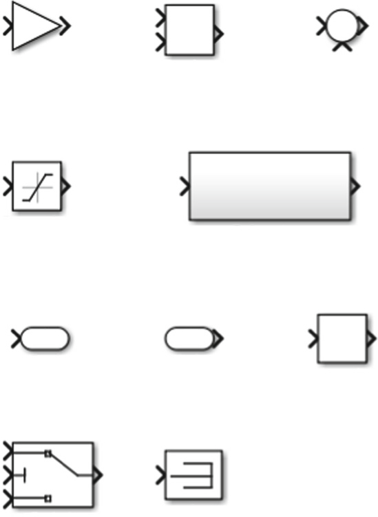
<**Fig. 6.3** Simulink commonly used blocks

- Gain—gives the output as a multiplication of the input (the multiplier is specified by the designer).
- Product—gives the output as the product of two inputs (e.g. signals).
- Sum—similar to the Product block, but shows the output as the sum of two signals.
- Saturation—imposes upper and lower limits on the input signal.
- Subsystem—a block representing a subsystem (e.g. an embedded model). This type of block is used very often to structure models into hierarchies and to use one model as part of another one.
- Out1—models a signal that goes outside of the current model (e.g. to another model).
- In1—the opposite to Out1—used to take the signal from outside of the current model into the simulation.
- Integrator—where the output is the integral of the input.
- Switch—a block which chooses between the first and the third input based on the value of the second input.
- Terminator—a block used to capture signals which do not connect to other blocks.

> - 增益 - 将输出作为输入的乘法(乘数由设计人员指定)。
> - 产品 - 将输出作为两个输入的乘积(例如信号)。
> - 总和 - 与产品块相似，但显示输出为两个信号的总和。
> - 饱和 - 输入信号上的上和下限。
> - 子系统 - 代表子系统的块(例如，嵌入式模型)。这种类型的块经常用于将模型构造到层次结构中，并将一种模型作为另一个模型的一部分。
> - out1-模型一个信号，该信号超出了当前模型(例如另一个模型)。
>   -IN1(与 OUT 1 的相对) - 被用来从当前模型外部将信号接收到仿真中。
> - 集成器 - 输出是输入的积分。
> - 开关 - 基于第二输入的值在第一个和第三个输入之间选择的块。
> - 终结器 - 用于捕获未连接到其他块的信号的块。

The graphical symbols for these blocks are shown in Fig. [6.3](#_bookmark374).

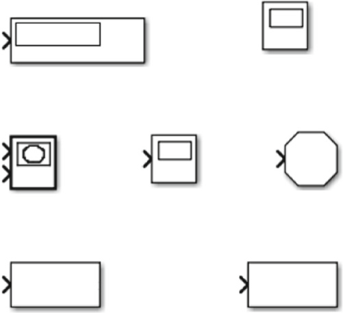To File To Workspace
<**Fig. 6.4** Simulink model sink blocks
<**Fig. 6.5** Simulink basic blocks—Matlab function encapsulation in the Simulink model

###### Sinks

The standard blocks that are used as sinks of the models are:

> 用作模型的水槽的标准块是：

- Display—the current value of the step of the simulation at specific location of the simulation.
- Scope—diagram showing the display as a function of time of the simulation.
- Stop—stopping the simulation when the signal is other than zero.
- To file—sending the signal to the specified file.
- To workspace—storing the signal without the time variable.
- XY graph—diagram used to plot two signals against each other (instead of against time).

> - 显示 - 在模拟的特定位置，模拟步骤的当前值。
> - 范围 - 图形显示显示为模拟时间的函数。
> - 停止 - 当信号不过零时，停止模拟。
> - 文件 - 将信号访问指定文件。
> - 到工作区 - 存储信号没有时间变量。
> - xy 图 - 用于绘制两个信号相互作用的图(而不是时间)。

The graphical representation of these blocks is presented in Fig. [6.4](#_bookmark375).

> 这些块的图形表示如图 [6.4](#_bookmark375)。

In the design of physical processes it is often the case that we need to describe a process as a mathematical function. The Matlab environment is well suited for that purpose and the Simulink environment can take advantage of all built-in and user-defined functions. The basic block used for that is presented in Fig. [6.5](#_bookmark376).

> 在物理过程的设计中，我们通常需要将过程描述为数学函数。Matlab 环境非常适合这一目的，Simulink 环境可以利用所有内置和用户定义的功能。图 [6.5](#_bookmark376) 显示了用于此目的的基本块。

<**Fig. 6.6** Digitalization of a signal value as designed in Simulink
<**Fig. 6.7** Specification of the digitalization function in the Digitalize signal block

### _Sample Model of Digitalization of a Signal_

Let us now focus on designing a simple Simulink model which converts an analog signal to a digital one. This process can be described in Formula 6.1.

> 现在，让我们专注于设计一个简单的模拟模型，该模型将模拟信号转换为数字信号。该过程可以用公式 6.1 进行描述。

This equation corresponds to the Simulink model presented in Fig. [6.6](#_bookmark377).

> 该方程对应于图 [6.6](#_bookmark377) 中显示的 Simulink 模型。

The equation is specified in the middle block—the `Compare to constant` block named `Digitalize signal` , as shown in Fig. [6.7](#sample-model-of-digitalization-of-a-signal).

> 如图[6.7]所示，该等式在中间块 `与常量比较` 中指定，该块名为 `数字化信号` (#sample-model-of-digitalization-of-a-signal)。

The main part of the figure is the two options—Operator and Constant. They are also shown in the icon in Fig. [6.6](#_bookmark377).

> 图的主要部分是两个选项 - 操作员和常数。它们也显示在图 [6.6](#_bookmark377) 中的图标中。

Now that we have the digitalization function, we need to package that into a block with two ports—input and output. We can also add an example function that will generate a signal used to test the block—as presented in Fig. [6.8](#_bookmark380).

> 现在我们拥有数字化功能，我们需要将其包装到一个带有两个端口的块中 - 输入和输出。我们还可以添加一个示例函数，该函数将生成用于测试块的信号 - 如图 [6.8](#_bookmark380) 所示。

Figure [6.8](#_bookmark380) shows three blocks: The sine wave function (left-hand side) generates the signal to digitalize; the scope block (right-hand side) is used to visualize the results of the simulation. The scope block has two inputs—one from the sine wave function itself and one from the digitalization function. These two inputs are visualized in two diagrams after the simulation, as shown in Fig. [6.9](#_bookmark381).

> 图 [6.8](#_bookmark380) 显示了三个模块：正弦波函数(左侧)生成信号进行数字化；范围块(右侧)用于可视化模拟结果。示波器块有两个输入，一个来自正弦波函数本身，另一个来自数字化函数。模拟后，这两个输入在两个图表中可视化，如图 [6.9](#_bookmark381) 所示。

<**Fig. 6.8** Making the digitalization into a Simulink block

<**Fig. 6.9** The result of the simulation visualized as two parallel diagrams—the digitalized result at the top and the original input as provided by sine wave source at the bottom

The newly designed block contains the diagram presented in Fig. [6.6](#_bookmark377) and is named `Digitalization of a sin wave function` .

> 新设计的块包含图 [6.6](#_bookmark377) 所示的图，命名为 `正弦波函数的数字化` 。

The model presented in this example is naturally very simple and illustrates the simplicity of using Simulink to model a mathematical equation. Now, this particular equation is about the process of digitalization of a signal, which is not based on physical processes in real life. The model also does not contain such elements as the feedback loop important in designing of control systems (which we expand on in the upcoming sections).

> 本例中给出的模型自然非常简单，说明了使用 Simulink 对数学方程建模的简单性。现在，这个特殊的方程是关于信号数字化的过程，而不是基于现实生活中的物理过程。该模型也不包含反馈回路等在控制系统设计中很重要的元素(我们将在接下来的章节中详细介绍)。

The next step in the design of a system based on the digitalization block is to generate the C/C++ code from the model. The code generated from this Simulink model has the property that it is hard to read for a human being and therefore the

> 基于数字化块的系统设计的下一步是从模型生成 C/C ++ 代码。该模型产生的代码具有很难阅读的属性，因此

<**Fig. 6.10** Code report for the digitalization function

Simulink environment provides a report about what has been generated. The report for this model is presented in Fig. [6.10](#_bookmark382).

> Simulink 环境提供了有关生成的内容的报告。该模型的报告如图 [6.10](#_bookmark382) 提供。

The report guides us to all the files that were generated ( `Model files` in the left-hand side of the figure) and provides the summary in the main window.

> 该报告将我们引导到生成的所有文件(图在图的左侧 `模型文件` )，并在主窗口中提供摘要。

The actual piece of code can look like the code presented in Fig. [6.11](#_bookmark383). The code in the figure presents a C structure with the initialization of the blocks (e.g. the sine wave parameters and the digitalization threshold `0` ).

> 实际的代码看起来像图 [6.11](#_bookmark383) 中的代码。图中的代码呈现了一个 C 结构，并具有块的初始化(例如，正弦波参数和数字化阈值 ` 0` )。

###### Comments on the Sample Model

In this simplistic example we managed to see the power of Simulink and at the same time we managed to follow the process of designing automotive software as shown in Fig. [6.1](#_bookmark370). In the design of the automotive software we have libraries which take care of this kind of process. These libraries, however, are part of the lowest layers of automotive software and can be seen in the architecture diagram of a communication layer in the CAN bus communication.

> 在这个简单的示例中，我们设法看到了 Simulink 的功能，同时我们设法遵循设计汽车软件的过程，如图 [6.1](#_bookmark370) 所示。在汽车软件的设计中，我们有库来处理此类过程。但是，这些库是汽车软件最低层的一部分，可以在 CAN BUS 通信中通信层的架构图中看到。

<**Fig. 6.11** Generated source code for the initialization of the block

<**Fig. 6.12** Relation between linear and wheel velocity

### _Translating Physical Processes to Simulink_

The example with the digitalization of the signal is rather trivial and has no physical process that is modelled. However, in most cases of Simulink modelling in automotive software, we have such models.

> 信号数字化的示例相当微不足道，没有建模的物理过程。但是，在大多数在汽车软件中进行模拟建模的情况下，我们都有这样的型号。

To illustrate that such processes are modelled both as mathematical equations and as Simulink blocks, let us consider an example of calculating the linear velocity of a wheel based on its wheel velocity and vice versa. Figure [6.12](#_bookmark384) shows the relation between these two kinds of velocity for a wheel of radius `radius` .

> 为了说明此类过程既是数学方程式又是 Simulink 块建模，让我们考虑一个基于车轮速度计算车轮线性速度的示例，反之亦然。图 [6.12](#_bookmark384) 显示了这两种速度与半径 `半径` 轮之间的关系。

The equations describing the relation between the two velocities are:

> 描述两个速度之间关系的方程式是：

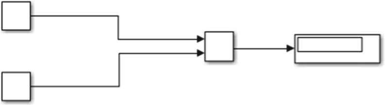
<**Fig. 6.13** Simulink model calculating the linear velocity

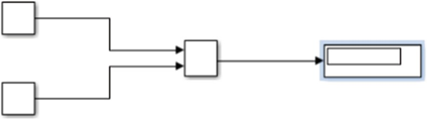linear*speed
<**Fig. 6.14** Simulink model calculating the wheel velocity
*ω_=

Both of the equations are rather simple and let us now build the model which will take two scalar values and calculate the linear velocity. The model is presented in Fig. [6.13](#_bookmark386).

> 两个方程式都很简单，现在让我们构建将采用两个标量值并计算线性速度的模型。该模型如图 [6.13](#_bookmark386) 所示。

The model consists of two scalar values (wheel speed and radius), their product and the display sink. Executing the model displays the result in the display sink.

> 该模型由两个标量值(车轮速度和半径)组成，它们的产品和显示槽。执行模型将结果显示在显示槽中。

The model which calculates wheel velocity based on linear velocity requires changing the product to be a fraction instead. The resulting model is presented in Fig. [6.14](#_bookmark387).

> 基于线性速度计算车轮速度的模型需要更改产品为部分。所得模型如图 [6.14](#_bookmark387) 提供。

The properties of the product block are changed as presented in Fig. [6.15](#_bookmark388).

> 如图 [6.15](#_bookmark388) 所示，更改了产品块的属性。

In the `Number of inputs` field we make a change, which denotes division instead of multiplication.

> 在 `输入数` 字段中，我们进行了更改，该字段表示分裂而不是乘法。

Before we move to another example, let us illustrate another important concept in the design of control systems using Simulink—feedback loops. The concept of a feedback loop is often used in control systems to design self-regulating systems. In Fig. [6.16](#_bookmark389) we can see an example of a simple feedback loop.

> 在我们转到另一个例子之前，让我们说明使用 Simulink 反馈回路设计控制系统的另一个重要概念。反馈回路的概念经常用于控制系统中，以设计自调节系统。在图 [6.16](#_bookmark389) 中，我们可以看到一个简单反馈回路的示例。

In the figure we can see that the loop takes a signal directly from the output of the summation and puts it back with a delay. The delay is needed in order to make sure that the first iteration of the simulation has the initial value in the summation. The properties of the delay block are shown in Fig. [6.17](#_bookmark390)

> 在图中，我们可以看到环路直接从求和的输出中获取信号，并将其延迟返回。需要延迟以确保模拟的第一次迭代在求和中具有初始值。延迟块的属性如图[6.17]所示(#_bookmark390)

<**Fig. 6.15** Properties of the product block
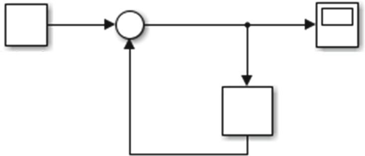
<**Fig. 6.16** Properties of the product block

The important part is the `Delay length` property, which denotes how many simulation cycles the input signal is postponed. Once we execute the simulation, we can see that the summation results in the gradual increase of the signal as shown in Fig. [6.18](#_bookmark392).

> 重要的部分是 `延迟长度` 属性，该属性表示输入信号被推迟了多少个模拟。执行模拟后，我们可以看到求和导致信号的逐渐增加，如图 [6.18](#_bookmark392) 所示。

<**Fig. 6.17** Properties of the product block

### _Sample Model of Car’s Interior Heater_

Now let us look into a bit more complex model—the heater of a car. The model introduces the feedback loop and has been inspired by the house heating model from the Matlab Simulink standard model library, but has been simplified to illustrate only the most important aspects of modelling systems with the control loop.

> 现在，让我们研究一个更复杂的模型 - 汽车的加热器。该模型引入了反馈循环，并受到 MATLAB Simulink 标准模型库的房屋加热模型的启发，但已简化以说明使用控制循环的建模系统的最重要方面。

In general the model of a heater contains three components, which we will turn into blocks:

> 通常，加热器的模型包含三个组件，我们将变成块：

- Car interior—describing the temperature of the car’s interior, including heat loss
- Heater—describing the heater, its on/off status and the heating temperature
- Thermostat—describing the switch for the heater

> - 汽车内部 - 描述汽车内部温度，包括热量损失
> - 加热器 - 描述加热器，其开/关状态和加热温度
> - 恒温器 - 描述加热器的开关

There are two inputs to this simulation model—the outdoor temperature and the desired temperature of the interior.

> 该模拟模型有两个输入：室外温度和内部所需温度。

Let us start with modelling the heater itself. The heater has an on/off switch for the flow of the air as well as the heater element. This means that when it is switched on, it blows hot air at a given temperature into the interior compartment of the modelled car. A simple model can look as in Fig. [6.19](#_bookmark393).

> 让我们从加热器本身的建模开始。加热器具有用于空气流和加热器元件的开/关开关。这意味着当它打开时，它会将给定温度的热空气吹到模型车的内部隔间中。一个简单的模型如图 [6.19](#_bookmark393) 所示。

11
<**Fig. 6.18** Results of the simulated feedback result

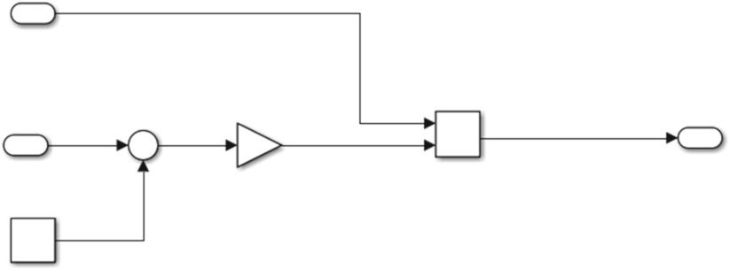
<**Fig. 6.19** Heater model

In this model the heater blows hot air of temperature $30$ at a given rate (modelled as Gain K). The gain block is configured as shown in Fig. [6.20](#_bookmark394).

> 在此型号中，加热器以给定速率(以增益 k 为模型)吹出温度 30 ◦C 的热空气。增益块的配置如图 [6.20](#_bookmark394) 所示。

The two constants that are multiplied by each other are (i) the air flow per hour, which we assume is a constant rate of 1 kg/s, which gives 3600 kg/h, and (ii) the heat capacity of the air, which is 1005.4 J/kg-K at the room temperature (in our model).

> 彼此乘以的两个常数是(i)每小时的气流，我们认为这是 1 kg/s 的恒定速率，可提供 3600 kg/h，以及(ii)空气的热容量，在室温下(在我们的型号中)，为 1005.4 j/kg-k。

We need to make a small observation here—the values which we use in the model are mostly constant, as we want to illustrate how to design an algorithm in Simulink. However, in real life the challenge is to model these constants as functions. For example, we assume the heat capacity of air to be constant, which is not accurate as it changes with the temperature of the air. The flow rate of the heater is also not constant as when the heater starts the fan needs some time to start spinning and therefore the flow rate changes. In reality we could have two equations modelling these two processes and use them as input instead of providing constants.

> 我们需要在这里做一个小观察，我们在模型中使用的值大多是恒定的，因为我们想说明如何在 Simulink 中设计算法。然而，在现实生活中，挑战是将这些常数建模为函数。例如，我们假设空气的热容是恒定的，这是不准确的，因为它随着空气温度的变化而变化。加热器的流速也不是恒定的，因为当加热器启动时，风扇需要一些时间来开始旋转，因此流速改变。实际上，我们可以有两个方程来模拟这两个过程，并将它们用作输入，而不是提供常数。

<**Fig. 6.20** Heater model—gain block properties
1
<**Fig. 6.21** Switcher model

Now, let us move over to the model of the switch of the heater, which needs to switch on and off the heater based on the difference in the temperature outside of the car. Let us configure the on/off deviation to be 3 ◦C compared to the desired temperature. We can use the relay block to model that, as shown in Fig. [6.21](#_bookmark395).

> 现在，让我们转到加热器开关的模型，它需要根据车外温度的差异来打开和关闭加热器。让我们将开/关偏差配置为 3◦</与所需温度相比。我们可以使用中继块对此进行建模，如图 [6.21](#_bookmark395) 所示。

The properties of the relay are the on/off criteria (+/– 3◦) and the output signal for on (1) and off (0), as shown in Fig. [6.22](#_bookmark396).

> 继电器的属性是 ON/OFF 标准(+/ 3 ◦)和 ON(1)和 OFF(0)的输出信号，如图 [6.22](#_Bookmark396)。

The next step is to link both blocks together as shown in Fig. [6.23](#_bookmark397). The link has to connect the input on/off port of the heater to the output on/off port of the switcher.

> 下一步是将两个块链接在一起，如图 [6.23](#_bookmark397) 所示。该链接必须将输入的输入输入连接加热器的输出端口，以开关端口的输出端口。

Now, we need to model the environment and the feedback loops before we go into modelling the car’s interior. In particular we need to model the calculation of the temperature difference between the interior and the desired temperature. We do it by adding a proxy for the car (an empty subsystem), which we will design in the next steps by adding the summation component to calculate the difference between the desired and the current temperature. We also need to add a constant which configures the model with the desired temperature. We do it by adding a constant block and setting the temperature to 21 ◦C. The resulting model is presented in Fig. [6.24](#_bookmark399)

> 现在，我们需要对环境和反馈回路进行建模，然后再对汽车内部进行建模。特别地，我们需要对内部温度与期望温度之间的温差的计算进行建模。我们通过为汽车添加一个代理(一个空的子系统)来实现这一点，我们将在接下来的步骤中通过添加求和组件来计算所需温度与当前温度之间的差值来设计该代理。我们还需要添加一个常数，以将模型配置为所需的温度。我们通过添加一个常量块并将温度设置为 21◦</高于 C。结果模型如图[6.24]所示(#_bookmark399)

<**Fig. 6.22** Switcher model—relay properties
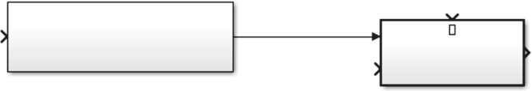
<**Fig. 6.23** Linking the heater to the switcher

The model has one port which is not connected—it is the current temperature port of the heater; we need to connect this to a signal from the interior of the car.

> 该模型具有未连接的一个端口 - 它是加热器的当前温度端口；我们需要将其连接到汽车内部的信号。

Now, we need to model the actual temperature of the car’s interior. The temperature of the car’s interior is the same as the temperature outside (which we need to add to our model) and increases as the heater blows in the hot air. The increase of the temperature of the interior can be described by the following equation:

> 现在，我们需要对汽车内部的实际温度进行建模。汽车内部的温度与外部温度(我们需要添加到型号中)相同，并且随着加热器在热空气中的吹动而升高。内部温度的升高可以通过以下等式描述：

d*T empcar* = 1
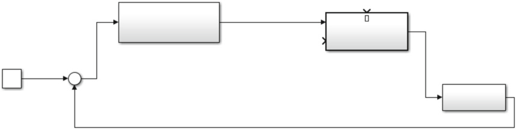
<**Fig. 6.24** First version of the air heater model with the feedback loop
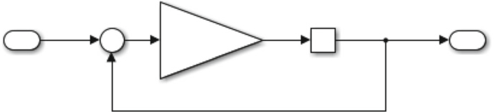
<**Fig. 6.25** Model of the interior of the car

Now, for a normal car, the mass of the air (_Mair_) is a product of the volume of the car’s interior and the density of the air (a constant of 1*.*2250kg/m3). In order to simplify things, let’s say that the volume of a personal vehicle’s interior is 3 cubic meters, which, multiplied by the density of the air gives 3.675 kg as the mass of the air. Now we have a model which looks like the one in Fig. [6.25](#_bookmark400).

> 现在，对于普通汽车，空气的质量(_M 空气 _)是汽车内部体积和空气密度的产物(常数为 1*。*2250kg/M  3 )。为了简化事物，假设个人车辆内部的体积为 3 立方米，乘以空气的密度乘以 3.675 千克作为空气的质量。现在，我们有了一个模型，看起来像图 [6.25](#_bookmark400) 中的模型。

In the model we use the gain block to increase the temperature and the integrator to set the initial temperature. We also add the feedback loop to make the increase in the temperature similar to a loop in a programming language. Inside the gain block we put the calculated increase in temperature as shown in Eq. [6.4](#_bookmark398), resulting in the configuration shown in Fig. [6.26](#_bookmark401)

> 在模型中，我们使用增益块来增加温度和积分器来设置初始温度。我们还添加了反馈循环，以使温度的升高类似于编程语言的循环。在增益块内部，我们将计算出的温度升高如等式中所示。[6.4](#_bookmark398)，导致图[6.26]所示的配置(#_bookmark401)

When we connect all the elements, we get the following model—Fig. [6.27](#summary-of-the-heater-model).

> 当我们连接所有元素时，我们将获得以下模型-FIG。[6.27](#摘要 - 备件模型)。

When we look at the plot of the temperature over time we can see the result as shown in Fig. [6.28](#_bookmark403)

> 当我们查看随着时间的时间的温度图时，我们可以看到结果，如图 [6.28](#_bookmark403) 所示

Now we can see that the model is too simplistic. The temperature of the car’s interior goes up from the initial value of 1 and then stays at the constant level. It is because our model of the car’s interior takes into consideration only the heating process of the interior, at the same time ignoring the process of chilling the interior when the heater is not working. In order to fix that without complicating the model too much, let us add a feedback loop after the gain block, in the way shown in Fig. [6.29](#_bookmark404)

> 现在我们可以看到，这个模型太简单了。汽车内部的温度从初始值 1 升高，然后保持在恒定水平。这是因为我们的汽车内部模型只考虑了内部的加热过程，同时忽略了加热器不工作时冷却内部的过程。为了在不使模型过于复杂的情况下解决这个问题，让我们在增益块之后添加一个反馈环，如图[6.29]所示(#_bookmark404)

Once we make this addition, we can see that the temperature of the car’s interior drops when the heater is not powered on, as shown in Fig. [6.30](#_bookmark406)

> 一旦我们增加了此增加，我们就可以看到，当加热器没有电动时，汽车的内部温度下降，如图 [6.30](#_bookmark406) 所示)

<**Fig. 6.26** Properties of the gain block in the interior
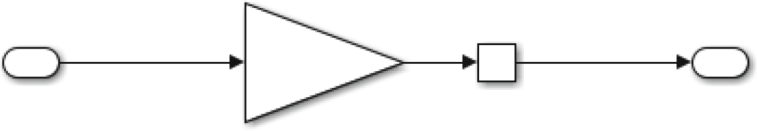
<**Fig. 6.27** Heating-only model of the car’s heater

###### Summary of the Heater Model

The heater model presented in this section is a simplistic model with a feedback loop and illustrates a few important principles which make Simulink modelling so popular in software development.

> 本节中介绍的加热器模型是一个具有反馈循环的简单模型，并说明了一些重要的原理，这些原理使 Simulink 建模在软件开发中如此受欢迎。

Once the model is somewhat complete, the designers can execute the model and observe the results. As the `Scope` sink can be placed virtually at any signal, it is easy to debug the models and to understand where it does not work (if needed).

> 一旦模型完成，设计者就可以执行模型并观察结果。由于 `作用域` 接收器可以虚拟地放置在任何信号处，因此很容易调试模型并了解其不工作的位置(如果需要)。

Another principle is the ability to make the model modular. The designers can use constants and assumptions during early prototyping phases of their software development. As the development progresses and the designers know more about the physical processes, they can replace constants with calculations of values using blocks and Matlab functions. These functions can be developed either analytically based on the designer’s knowledge of the physical processes or they can be done using mathematical regression and statistical modelling techniques.

> 另一个原则是使模型模块化的能力。设计者可以在软件开发的早期原型阶段使用常量和假设。随着开发的进展和设计者对物理过程的了解，他们可以使用块和 Matlab 函数计算值来代替常数。这些功能可以根据设计者对物理过程的了解进行分析开发，也可以使用数学回归和统计建模技术进行开发。

<**Fig. 6.28** Result of a simulation of the heater model
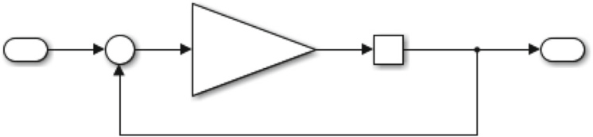
<**Fig. 6.29** Model of the interior with cooling effect

And finally the ability to generate source code which can be executed on target platforms. If a model can be executed, then the code for it can be generated, which is a very big help for automotive software engineers.

> 最后是生成可在目标平台上执行的源代码的能力。如果可以执行一个模型，那么就可以生成它的代码，这对汽车软件工程师来说是一个很大的帮助。

## Simulink Compared to SySML/UML

SySML is a notation based on the Unified Modelling Language (UML). Compared to the Simulink notation, it is different and neither of them has a specific software development process which the notation supports. However, in practice these two notations support different development processes. In Fig. [6.31](#_bookmark407) we outline these differences per phase of software development.

> SySML 是基于统一建模语言(UML)的符号。与 Simulink 表示法相比，它是不同的，两者都没有表示法支持的特定软件开发过程。然而，在实践中，这两种符号支持不同的开发过程。在图 [6.31](#_bookmark407) 中，我们概述了软件开发每个阶段的这些差异。

<**Fig. 6.30** Result of the simulation with the cooling effect
<**Fig. 6.31** Simulink and SySML process models comparison

In the **analysis** phase these two notations support different types of analysis and modelling. Simulink is based on describing the system using mathematical equations (as we saw in the examples in this chapter) whereas SySML/UML use conceptual models and class diagrams (with low level of detail). The models created in SySML/UML are intended to be high level and non-executable whereas the mathematical models need to be rather complete as they will be used in modelling in the **design** phase.

> 在**分析**阶段，这两种符号支持不同类型的分析和建模。Simulink 基于使用数学方程描述系统(正如我们在本章的示例中看到的)，而 SySML/UML 使用概念模型和类图(细节层次较低)。SySML/UML 中创建的模型是高级的，不可执行的，而数学模型需要相当完整，因为它们将用于**设计**阶段的建模。

In the design phase the main goal is to develop a detailed model of the software and there these two notations differ significantly. In SySML/UML the main entities are classes (corresponding to programming language classes/modules), statecharts and sequence diagrams. Although the SySML/UML notations provide more types of diagrams than these three, these three are by far the most popular ones. In Simulink the primary entities are blocks and signals, as we saw in the examples in this chapter. The **implementations** of the two designs differ significantly—Simulink usually results in 100% code generation. The generated code can be compiled and executed. The SySML/UML notations usually do not result in full code generation, but in so-

> 在设计阶段，主要目标是开发软件的详细模型，这两种符号有很大的不同。在 SySML/UML 中，主要实体是类(对应于编程语言类/模块)、状态图和序列图。尽管 SySML/UML 符号提供了比这三种更多的图表类型，但这三种是目前最流行的。在 Simulink 中，主要实体是块和信号，正如我们在本章的示例中看到的。两种设计的**实现**有显著差异，Simulink 通常会产生 100% 的代码生成。生成的代码可以编译和执行。SySML/UML 符号通常不会生成完整的代码，但会生成

1. Principles of Programming of Embedded Safety-Critical Systems 157 called skeleton code. The skeleton code needs to be complemented by the designers with manually written code in the target programming language.

> 1.称为骨架代码的嵌入式安全关键系统编程原理 157。设计人员需要用目标编程语言手动编写代码来补充框架代码。

Once the designs are implemented, they are **tested**, which in Simulink happens through simulations (sometimes using test environments to execute the simulations), whereas for the SySML/UML generated code, the code is tested in a traditional manner, e.g. using unit tests.

> 一旦实现了设计，就对其进行**测试**，这在 Simulink 中是通过模拟(有时使用测试环境来执行模拟)实现的，而对于 SySML/UML 生成的代码，则以传统方式测试代码，例如使用单元测试。

The SySML/UML languages are often called architectural languages because they come from the field of object-oriented analysis and design and focus on the conceptual modelling of objects in the real world. This means that the main part of the effort is on the development of the design models, because all details of the target programming language have to be taken into consideration—otherwise we cannot generate the code. Therefore we can see that in the automotive domain these languages are often used to specify logical component architectures, whereas the detailed design of automotive systems is done using Simulink.

> SySML/UML 语言通常被称为体系结构语言，因为它们来自面向对象分析和设计领域，专注于现实世界中对象的概念建模。这意味着工作的主要部分是开发设计模型，因为必须考虑目标编程语言的所有细节，否则我们无法生成代码。因此，我们可以看到，在汽车领域，这些语言通常用于指定逻辑组件架构，而汽车系统的详细设计是使用 Simulink 完成的。

## Principles of Programming of Embedded Safety-Critical Systems

Safety-critical systems have entered the automotive industry quite recently compared to the aviation and space industry [[Sto96](#_bookmark448), [Kni02](#_bookmark439)]. Historically, the aviation industry and the space industry relied on the **Ada programming language** due to its well-defined semantics and mechanisms for parallel programming.

> 与航空和航天行业相比，安全关键系统最近才进入汽车行业[[Sto96](#_bookmark448)、[Kni02](#_bookmark439)]。历史上，航空业和航天业依赖于 Ada 编程语言，因为它定义良好的语义和并行编程机制。

In the telecommunication industry engineers use functional programming languages such as Haskell or Erlang, even if the safety criticality is not that crucial there.

> 在电信行业中，工程师使用功能编程语言(例如 Haskell 或 Erlang)，即使安全关键性并不是那么重要。

In the automotive industry, however, it is the generated C/C++ code which is the most common. C/C++ have the advantage of being relatively well known by the software engineering community, relatively simple if needed and with good compiler support. In practice this means that the code can be ported easily between different operating systems, as the majority of the safety critical OSs have the Unix kernel at their core.

> 然而，在汽车行业，**生成的 C/C++ 代码是最常见的**。C/C++ 的优点是软件工程界相对熟悉，如果需要的话相对简单，并且具有良好的编译器支持。实际上，这意味着代码可以很容易地在不同的操作系统之间移植，因为大多数安全关键操作系统都以 Unix 内核为核心。

The operating systems often used in automotive software are VxWorks and QNX, which are relatively simple, with great schedulers and task handlers. It is their simplicity that allows the designers to retain a large degree of control over the programs and therefore makes them so popular. The AUTOSAR standard standardizes a number of elements of the underlying operating systems, as discussed in Chap. [4](#_bookmark185).

> **汽车软件中常用的操作系统是 VxWorks 和 QNX**，它们相对简单，具有强大的调度器和任务处理程序。正是它们的简单性使得设计者能够对程序保持很大程度的控制，从而使它们如此受欢迎。AUTOSAR 标准标准化了底层操作系统的许多元素，如第[4]章(#_bookmark185)所述。

As the software system of the car is distributed over multiple ECUs, it is the communication between the ECUs which is important. From the designer’s perspective this communication means that there are signals exchanged between different software components and state machines need to be synchronized. Often, in the programming language this means that the messages are packaged as packages or sent using sockets.

> 由于汽车的软件系统是在多个 ECU 上分布的，因此**重要的是 ECU 之间的通信**。从设计师的角度来看，这种通信意味着需要**同步不同的软件组件和状态机器之间的信号**。通常，在编程语言中，这意味着将消息包装为软件包或使用套接字发送。

From the physical perspective the designers have a number of different communication protocols available, such as:

> 从物理角度来看，设计师有许多不同的通信协议，例如：

- CAN bus—Specified in the ISO standard [[Org93](#_bookmark443)], it is currently the most frequently used bus in the automotive industry. It allows us to send messages with a speed of up to 1 MBps, which allows to send even video streams in the car’s bus (e.g. from the parking camera). The standard is popular because of its relatively simple architecture and specifications of the MAU (Medium Access Unit) and the DLL (Data Link Layer) parts.

> -CAN 总线在 ISO 标准[[Org93](#_bookmark443)]中指定，是目前汽车行业中使用最频繁的总线。它允许我们以高达 1Mbps 的速度发送消息，甚至可以在汽车的公交车上发送视频流(例如，从停车摄像头)。该标准因其相对简单的架构和 MAU(媒体访问单元)和 DLL(数据链路层)部分的规范而受到欢迎。

- Flexray bus—Specified in the ISO 17458 standard, is one of the possible future directions of development in the automotive industry. It allows communications with a speed of up to 10 Mbps over a similar type of wiring and has two independent data channels (one for fault tolerance).

> -ISO 17458 标准中规定的 **Flexray 总线是汽车行业未来可能的发展方向之一**。它允许通过类似类型的线路以高达 10Mbps 的速度进行通信，并具有两个独立的数据通道(一个用于容错)。

- Ethernet bus—Used throughout the internet for communications, it is now being considered for speeds of up to 1 Gbps. At the time of writing of this book the protocol is used for downloading new software to ECUs for many car manufacturers and for communications during driving some cars. As the protocol is prone to electrostatic distortions, the majority of the manufacturers are waiting for more mature specifications before they start using this protocol more widely in their electrical systems.

> -以太网总线在整个互联网上用于通信，现在考虑的速度高达 1 Gbps。在撰写本书时，该协议用于为许多汽车制造商将新软件下载到 ECU，以及在驾驶某些汽车时进行通信。由于该协议**容易产生静电失真**，大多数制造商都在等待更成熟的规范，然后才开始在其电气系统中更广泛地使用该协议。

- MOST bus—Used in the automotive industry for sending/receiving multimediarelated content (e.g. video and audio signals). The communication speeds are up to 25–150 Mbps depending on the version of the standard.

> -MOST 总线用于汽车行业，用于发送/接收多媒体相关内容(例如视频和音频信号)。通信速度高达 25–150 Mbps，具体取决于标准的版本。

- LIN bus—used for low cost communications with speeds of up to 20 Kbps between mechatronic nodes in the car.

> -LIN 总线用于汽车机电节点之间的低成本通信，速度高达 20 Kbps。

In the design of the automotive systems, the architects usually decide upon the topology of the network and its communication buses rather early. As we can see from the description of each of these protocols, they are aimed at different purposes and therefore their choice is rather straightforward.

> 在汽车系统的设计中，架构师通常很早就决定了网络及其通信总线的拓扑结构。正如我们从这些协议的描述中所看到的，它们针对不同的目的，因此它们的选择非常简单。

## MISRA

When designing the software for automotive applications, we need to follow certain design guidelines. The automotive industry has adopted the MISRA-C standard where the details of the design of computer programs are in the C programming language [[A+08](#_bookmark424)]. The standard contains the principle of how to document embedded C code—in terms of naming conventions, documentation and the use of certain programming constructs. The rules are grouped into such categories as:

> 在设计汽车应用软件时，我们需要遵循某些设计准则。汽车工业采用了 MISRA-C 标准，其中计算机程序的设计细节采用 C 编程语言[[A+08](#_bookmark424)]。该标准包含了如何在命名约定、文档和某些编程构造的使用方面记录嵌入式 C 代码的原则。规则分为以下类别：

1. Environment—rules related to the programming environment used in the development (e.g. mixing of different compilers).

> 1.环境 - 与开发中使用的编程环境相关的符号(例如，不同编译器的混合)。

<!-- -->

1. MISRA 159
2. Language extension—rules specifying which types of comments are to be used, enclosing assembly code or removing commente code.

> 1.语言扩展 - 指定要使用哪些类型的注释，封闭汇编代码或删除注释代码的序列。

2. Documentation—rules defining which code constructs should be documented and how.

> 2.文档 - 定义应记录哪些代码构建的符号以及如何记录。

3. Character sets—usage of ISO C character sets and trigraphs.

> 3.字符集 - ISO C 角色集和三幅图的使用。

4. Identifiers—defining the length and naming convention of identifiers as well as the usage of typedef.

> 4.标识符 - 定义标识符的长度和命名惯例以及 TypeDEF 的使用。

5. Types—the usage of the `char` type, the naming convention of new types and the usage of bit fields.

> 5.类型 - ` char` 类型的使用，新类型的命名约定和位字段的使用。

6. Constants—preventing the usage of octal constants.

> 6.常数 - 预防八十常数的使用。

7. Declarations and definitions—rules about the explicit visibility of types of functions and their declarations.

> 7.声明和定义 - 关于功能类型及其声明的明确可见性的符号。

8. Initialisation—rules about default values of variables at their declaration.

> 8.初始化 - 关于变量声明时默认值的符号。

9. Arithmetic type conversions—describing implicit and explicit rules for type conversions as well as the dangerous conversions.

> 9.算术类型转换 - 描述类型转换的隐式和明确规则以及危险的转换。

10. Pointer type conversions—rules regarding the interchangeability of different types of pointers.

> 10.指针类型转换 - 关于不同类型指针的互换性的符号。

11. Expressions—rules about the evaluation of arithmetical expressions in programs.

> 11.表达式 - 关于研究中算术表达式评估的符号。

12. Control statement expressions—rules about the expressions used in for loops, explicit evaluations of values to Boolean (instead of 0).

> 12.控制语句表达式 - 关于循环中使用的表达式的符号，对布尔值的值进行明确评估(而不是 0)。

13. Control flow—rules about the dead code, null statements and their location and prohibited goto statements.

> 13.控制流 - 关于死亡代码，无效陈述及其位置的符号，并禁止使用 goto 语句。

14. Switch statements—rules about the structure of the switch statements (a subset of possible structures from the C language).

> 14.开关语句 - 关于开关语句结构的符号(C 语言中可能结构的子集)。

15. Functions—rules prohibiting such unsafe constructs as variable argument lists or recursion.

> 15.函数 - 符号禁止这样的不安全构造，例如可变参数列表或递归。

16. Pointers and arrays—rules about the usage of pointers and arrays.

> 16.指针和阵列 - 关于指针和阵列的用法。

17. Structures and unions—rules about the completeness of union declarations and their location in memory; prohibiting the usage of unions.

> 17.结构和工会 - 关于联盟声明的完整性及其在记忆中的位置的符号；禁止工会的使用。

18. Preprocessing directives—rules about the usage of \#include directives and C macros.

> 18.预处理指令 - 关于\ #include 指令和 C 宏的使用的符号。

19. Standard libraries—rules about the allocation of heap variables, checking the parameters of library functions and prohibiting certain standard library functions/variables (e.g. errno).

> 19.标准库 - 关于堆变量的分配，检查库函数的参数并禁止某些标准库函数/变量(例如 ERRNO)。

20. Run-time failures—rules prescribing of usage of static analysis, dynamic analysis and explicit coding for avoiding runtime failures.

> 20.运行时故障 - 规定静态分析，动态分析和避免运行时故障的明确编码的符号。

The MISRA rules are often encoded in the C/C++ compilers used in safetycritical systems. This inclusion in compilers makes it rather simple and straightforward and therefore widely used.

> MISRA 规则通常在安全系统中使用的 C/C ++ 编译器中编码。包含在编译器中使其相当简单明了，因此广泛使用。

The MISRA standard was revised in 2008 and later in 2012, leading to the addition of more rules. Today, we have over 200 rules, with the majority of them classified as `required` .

> **Misra 标准于 2008 年和 2012 年后期进行了修订，导致增加了更多规则。**今天，我们有 200 多个规则，其中大多数被列为 `必需` 。

Let us now analyze one of the rules and its implications—we take rule \#20.4: `Dynamic heap memory allocation shall not be used.` This rule in practice prohibits dynamic memory allocations for the variables. The rationale behind this rule is the fact that dynamic memory allocations can lead to memory leaks, overflow errors and failures which occur randomly. Taking just the defects related to the memory leaks can be very difficult to trace and thus very costly. If left in the code, the memory leaks can cause undeterministic behavior and crashes of the software. These crashes might require restart of the node, which is impossible during the runtime of a safetycritical system. Following this rule, however, also means that there is a limit on the size of the data structures that can be used, and that the need for memory of the system is predetermined at design time, thus making the use of this software `safer` .

> 现在让我们分析其中一条规则及其含义，我们采用规则 20.4： `**不应使用动态堆内存分配。**` 实际上，该规则禁止为变量分配动态内存。此规则背后的基本原理是**动态内存分配可能导致内存泄漏、溢出错误和随机发生的故障**。仅考虑与内存泄漏相关的缺陷可能很难追踪，因此成本很高。如果留在代码中，内存泄漏可能会导致无法确定的行为和软件崩溃。这些崩溃可能需要重新启动节点，这在安全关键系统运行时是不可能的。然而，遵循这一规则也意味着对可以使用的数据结构的大小有限制，并且在设计时预先确定了对系统内存的需求，从而使该软件的使用 `更安全` 。

## NASA’s Ten Principles of Safety-Critical Code

> [!note]
> 这里前后有一些关于安全的内容，还是值得看一下

The United States-based NASA has a long tradition of developing and using safetycritical software. In fact, much of the initial reliability research has been done in the vicinity of NASA’s Jet Propulsion Laboratory. The reason for that is that NASA’s missions often require safety-critical software to steer their devices such as space shuttles or satellites.

> 总部位于美国的 NASA 具有开发和使用安全性软件的悠久传统。实际上，在 NASA 的 JET 推进实验室附近进行了许多最初的可靠性研究。这样做的原因是，美国宇航局的任务通常需要安全至关重要的软件来引导其设备，例如航天飞机或卫星。

In 2006 Holtzman presented ten rules of safety-critical programming, which come from NASA, but apply to all safety-critical software [[Hol06](#_bookmark435)]. These rules are (the original wording of the rules is kept):

> 2006 年，霍尔兹曼提出了十条安全关键编程规则，这些规则来自 NASA，但适用于所有安全关键软件[[Hol06](#_bookmark435)]。这些规则如下(保留规则的原始措辞)：

1. Restrict all code to very simple control flow constructs, do not use goto statements, setjmp or longjmp constructs, direct or indirect recursion.

> 1.将所有代码限制为非常简单的控制流构造，请勿使用 goto 语句，setJMP 或 longjmp 构造，直接或间接递归。

2. Give all loops a fixed upper bound. It must be trivially possible for a checking tool to prove statically that the loop cannot exceed a preset upper bound on the number of iterations. If a tool cannot prove the loop bound statically, the rule is considered violated.

> 2.给所有循环一个固定的上限。检查工具必须在静态上证明循环不能超过迭代次数上的预设上限。如果工具无法在静态上证明循环绑定，则认为该规则被视为违反。

3. Do not use dynamic memory allocation after initialization.

> 3.初始化后**不要使用动态内存分配**。

4. No function should be longer than what can be printed on a single sheet of paper in a standard format with one line per statement and one line per declaration. Typically, this means no more than about 60 lines of code per function.

> 4.没有功能应比以标准格式打印在单个纸上的函数更长，每行每句话一行和每条声明一行。通常，这意味着每个功能的代码不超过大约 60 行。

5. The code’s assertion density should average to minimally two assertions per function. Assertions must be used to check for anomalous conditions that should never happen in real-life executions. Assertions must be side effect-free and should be defined as Boolean tests. When an assertion fails, an explicit recovery action must be taken, such as returning an error condition to the caller of the function that executes the failing assertion. Any assertion for which a static checking tool can prove that it can never fail or never hold violates this rule.

> 5.代码的断言密度应该平均到**每个函数至少两个断言**。断言必须用于检查在实际执行中不应出现的异常情况。断言必须无副作用，并且应定义为布尔测试。当断言失败时，必须执行显式恢复操作，例如向执行失败断言的函数的调用方返回错误条件。静态检查工具可以证明它永远不会失败或永远不会保持的任何断言都违反了这一规则。

6. Declare all data objects at the smallest possible level of scope.

> 6.以最小范围的最小级别声明所有数据对象。

<!-- -->

1. Detailed Design of Non-safety-Critical Functionality 161

> 1.非安全关键功能的详细设计 161

<!-- -->

1. Each calling function must check the return value of non-void functions, and each called function must check the validity of all parameters provided by the caller.

> 1.每个呼叫功能必须检查非空隙函数的返回值，每个调用函数必须检查呼叫者提供的所有参数的有效性。

2. The use of the preprocessor must be limited to the inclusion of header files and simple macro definitions. Token pasting, variable argument lists (ellipses), and recursive macro calls are not allowed. All macros must expand into complete syntactic units. The use of conditional compilation directives must be kept to a minimum.

> 2.预处理器的使用必须仅限于包含标头文件和简单的宏定义。不允许使用令牌粘贴，可变参数列表(椭圆)和递归宏调用。所有宏必须扩展到完整的句法单元。必须将条件汇编指令的使用保持在最低限度。

3. The use of pointers must be restricted. Specifically, no more than one level of dereferencing should be used. Pointer dereference operations may not be hidden in macro definitions or inside typedef declarations. Function pointers are not permitted.

> 3.必须限制使用指针。具体而言，不得使用不超过一个级别的退化。指针解除操作可能不会隐藏在宏定义或 Typedef 声明内部。不允许使用功能指针。

4. All code must be compiled, from the first day of development, with all compiler warnings enabled at the most pedantic setting available. All code must compile without warnings. All code must also be checked daily with at least one, but preferably more than one, strong static source code analyzer and should pass all analyses with zero warnings.

> 4.从开发的第一天起，所有代码都必须在最迂腐的设置下启用所有编译器警告的情况下进行编译。所有代码都必须在没有警告的情况下编译。所有代码也必须每天至少使用一个(但最好是不止一个)强大的静态源代码分析器进行检查，并且应通过所有分析，无任何警告。

These rules are naturally captured by the MISRA rules and show the similarity of safety-critical systems regardless of the application domain. The `heart` of these rules is that the safety-critical should be simple and modularized. For example, the length of a typical function should be less than 60 lines of code (principle \#4), which is supported by the limits of the maintainability of large and complex code.

> 这些规则自然地被 MISRA 规则捕获，并显示安全关键系统的相似性，而不考虑应用领域。这些规则的 `核心` 是安全关键应简单且模块化。例如，一个典型函数的长度应该小于 60 行代码(原则 4)，这是由大型复杂代码的可维护性限制所支持的。

> [!note]
> 在代码安全上，这里提到的是 MISRA 规则
> 之前 jiaqi.li 提到一个 autosar 的规则，这个是不是有相关的地方

What these principles also show is the difficulty of automatically checking for their violation. For example, the principles \#6 ( `Declare all data objects at the smallest possible level of scope` ) requires parsing of the code in order to establish the boundary of the `smallest possible level of scope` ).

> 这些原则还表明，难以自动检查其违规行为。例如，原理\#6( `以最小的范围级别声明所有数据对象` )需要对代码进行解析，以建立 `最小可能的范围范围` 的边界)。

## Detailed Design of Non-safety-Critical Functionality

In the previous sections we focused on designing software which is often considered safety-critical to various extents. However, there is a significant amount of software in modern cars which is not safety-critical. One of such non-safety-critical domains is the infotainment domain, where the main focus is on connectivity and user experience of the interface. Let us look into one of the standards in this domain— GENIVI [[All09](#_bookmark425), [All14](#_bookmark426)].

> 在前面的部分中，我们专注于设计软件，该软件通常被视为对各种范围的安全至关重要。但是，现代汽车中有大量的软件，这不是安全至关重要的。这样的非安全临界域之一是信息娱乐域，其中主要重点是界面的连接性和用户体验。让我们看一下该领域中的标准之一-Genivi [[ALL09](#_bookmark425)，[all14](#_bookmark426)]。

### _Infotainment Applications_

The GENIVI standard is built upon a layered architecture with five basic layers, as shown in Fig. [6.32](#_bookmark413).

> Genivi 标准建立在具有五个基本层的分层体系结构上，如图 [6.32](#_bookmark413) 所示。

<**Fig. 6.32** GENIVI layered architecture overview

In the GENIVI architecture the top layers are designated to the user applications, which in turn can expose their services to one another. The standard itself, however, focuses on the basic and high-level functions [[All15](#_bookmark427)]. The following areas are included in the reference architecture:

> 在节奏体系结构中，顶层被指定为用户应用程序，这又可以使他们的服务彼此展示。但是，标准本身的重点是基本和高级函数[[all15](#_bookmark427)]。参考体系结构中包括以下区域：

- Persistence—providing persistent data storage
- Software management—supporting such functionality as SOTA (Software-OverThe-Air) updates
- Lifecycle—supporting the start-up and shutdown of the system
- User management—supporting multiple users and their profiles
- Housekeeping—supporting error management
- Security infrastructure—supporting cryptography and interactions with hardware security modules
- Diagnostics—supporting the diagnostics as specified in ISO 14229-1:2013
- Inter-Process Communications (IPC)—supporting communication between processes (e.g. message brokers)
- Networks—supports the implementation of different vehicle network technologies (e.g. CAN)
- Network management—supports the management of network connections
- Graphics support—providing graphics libraries
- Audio/Video processing—providing codecs for audio and video playback
- Audio management—supporting the streaming and prioritizing streams of audio
- Device management—providing support for devices via (for example) USB
- Bluetooth—providing the Bluetooth communication stack
- Camera—providing the functionalities needed for vehicle cameras (e.g. rearview camera)
- Speech—supporting voice commands
- HMI support—provides the functionality to handle user interactions
- CE Device integration—supports such protocols as CarPlay
- Personal Information management—supporting the basic functionality of address book and passwords
- Vehicle interface—provides the possibility to communicate with other vehicle systems
- Internet functions—provides the support for internet, e.g. web browsing
- Media sources—provides support for media sharing such as DLNA
- Media framework—provides the generic logic of media players
- Navigation and Location Based Services—supporting the navigation systems
- Telephony—provides the support for telephony stack
- Radio and tuners—provides the support for radio

> - 持久性 - 提供持久数据存储
> - 软件管理 - 支持诸如 SOTA(软件 - 播放)更新之类的功能
> - 生命周期 - 支持系统的启动和关闭
> - 用户管理 - 支持多个用户及其配置文件
> - 管家 - 支持错误管理
> - 安全基础架构 - 支持加密和与硬件安全模块的交互
> - 诊断 - 在 ISO 14229-1：2013 中指定的诊断基础
> - 过程间通信(IPC) - 支持程序之间的通信(例如，消息经纪人)
> - 网络 - 支持不同车辆网络技术的实施(例如 CAN)
> - 网络管理 - 支持网络连接的管理
> - 图形支持 - 提供图形库
> - 音频/视频处理 - 为音频和视频播放提供编解码器
> - 音频管理 - 支撑流和优先级的音频流
> - 设备管理 - 通过(例如)USB 提供对设备的支持
> - 蓝牙 - 提供蓝牙通信堆栈
> - 相机 - 提供车辆相机所需的功能(例如后视摄像头)
> - 语音 - 支持语音命令
> - HMI 支持 - 提供处理用户交互的功能
> - CE 设备集成 - 支持诸如 carplay 之类的协议
> - 个人信息管理 - 支持地址簿和密码的基本功能
> - 车辆界面 - 提供与其他车辆系统通信的可能性
> - 互联网功能 - 提供对互联网的支持，例如网络浏览
> - 媒体来源 - 提供对媒体共享(例如 DLNA)的支持
> - 媒体框架 - 提供媒体播放器的通用逻辑
> - 导航和基于位置的服务 - 支持导航系统
> - 电话 - 提供对电话堆栈的支持
> - 无线电和调谐器 - 提供对广播的支持

The above list shows that the GENIVI reference architecture is a large step towards standardization of the internals of infotainment systems, which will allow users to use common software ecosystems rather than OEM-specific solutions.

> 上面的列表表明，节奏参考体系结构是朝着信息娱乐系统内部标准化的重大步骤，该系统将允许用户使用常见的软件生态系统而不是 OEM 特定的解决方案。

Today we can see the GENIVI implementation in many car platforms, such as BMW with the system from Magneti Marelli (according to the GENIVI website). The standard ADL for the GENIVI applications is the Franca IDL which is used for defining interfaces in GENIVI software components.

> 今天，我们可以在许多汽车平台中看到 Genivi 实施，例如 Magneti Marelli 的系统(根据 Genivi 网站)。Genivi 应用程序的标准 ADL 是 Franca IDL，用于定义 Genivi 软件组件中的接口。

## Quality Assurance of Safety-Critical Software

Quality assurance of automotive software follows a number of standards, one of them being the ISO/IEC 25000 series of standards [[ISO16](#_bookmark436)]. The usual way that the standards describe the quality is that they divide the quality into a set of characteristics and a set of perspectives. The three perspectives on software quality are:

> 汽车软件的质量保证遵循许多标准，其中之一是 ISO/IEC 25000 系列标准[[ISO16](#_bookmark436)]。标准描述质量的通常方式是，它们将质量分为一组特征和一组观点。有关软件质量的三个观点是：

1. External software quality—describing the quality of the software product in relation to its requirements (hence the classification as `external` ).

> 1.外部软件质量 - 描述与其要求相关的软件产品质量(因此，分类为 `外部` )。

2. Internal software quality—describing the quality of the software in relation to the construction of the software (hence the classification as `internal` ).

> 2.内部软件质量 - 描述与软件构建有关的软件质量(因此分类为 `内部` )。

3. Quality in use—describing the quality of the software from the perspective of its users (hence the classification as `in use` ).

> 3.使用的质量 - 从其用户的角度描述软件的质量(因此，分类为 `使用` )。

In this chapter we focus on the internal quality of the software and the methods to monitor and control the internal quality—formal methods for verifying the correctness of the software and static analysis for verifying properties of software such as complexity. Testing as a technique for finding defects has been discussed in Chap. [3](#_bookmark154).

> 在本章中，我们着重于软件的内部质量以及监视和控制内部质量的方法 - 验证软件正确性的形式方法以及用于验证软件属性(例如复杂性)的静态分析。在第一章中讨论了作为查找缺陷的技术的测试。[3](#_bookmark154)。

### _Formal Methods_

Formal methods is a term used to collectively denote a set of techniques for specification, development and verification of software using formalisms related to mathematical logic, type theories, and symbolic type executions.

> 形式方法是一个术语，用于共同表示使用与数学逻辑，类型理论和符号类型执行相关的形式主义对软件进行规范，开发和验证的技术集。

In the automotive domain formal methods are required during the verification of ASIL D components (classified according to the ISO/IEC 26262 standard; see Chap. [8](#_bookmark493)).

> 在验证 ASIL D 组件(根据 ISO/IEC 26262 标准分类；请参见第 [8](#_bookmark493))，需要在汽车域中进行形式方法。

The verification in the formal way often follows a strict process where the software is specified using a formal notation (e.g. a VDM) and then gradually refined into source code of the program. Each step is shown to be correct and therefore the software is formally proven to be correct.

> 以形式的方式进行验证通常遵循严格的过程，在该过程中，使用正式符号(例如 VDM)指定软件，然后逐渐完善到程序的源代码中。显示每个步骤都是正确的，因此该软件被正式证明是正确的。

### _Static Analysis_

Another method for assuring the internal quality of automotive software is the static analysis [[BV01](#_bookmark429), [EM04](#_bookmark430)]. Static analysis refers collectively to a set of techniques for analyzing the source code (or the model code) of a software system. The analysis aims at discovering vulnerabilities in the software code and violations of programming good practices. Static analysis in the automotive systems usually looks for violations of MISRA rules and good coding rules.

> 确保汽车软件内部质量的另一种方法是静态分析[[bv01](#_bookmark429)，[em04](#_bookmark430)]。静态分析集体指的是一组用于分析软件系统源代码(或模型代码)的技术。该分析旨在发现软件代码中的漏洞和违反编程良好实践的行为。汽车系统中的静态分析通常会寻找违反 MISRA 规则和良好的编码规则的行为。

In addition to the MISRA rules, the static analysis often checks for the following (examples):

> 除了 MISRA 规则外，静态分析还经常检查以下(示例)：

- API usage errors, for example, using of private APIs
- Integer handling issues, for example, potentially dangerous type casts
- Integer overflows during calculations
- Illegal memory accesses, for example, using of pointer operations
- Null pointer dereferences
- Concurrent data access violations
- Race conditions
- Security best practices violations
- Uninitialized members

> -API 使用错误，例如，使用私有 API
>
> - 整数处理问题，例如，潜在的危险类型演员
> - 整数在计算过程中溢出
> - 非法内存访问，例如，使用指针操作
> - 零指针效率
> - 并发数据访问违规行为
> - 种族条件
> - 安全最佳实践违规行为
> - 非直接成员

In order to analyze a program statically no execution is needed and therefore this technique is very popular. The majority of static analysis tools do not need the code to actually execute and therefore there is no requirement for the code to be complete and runnable, which is the case for formal analysis (e.g. symbolic execution) or dynamic analysis.

> 为了分析程序在静态上不需要执行，因此该技术非常受欢迎。大多数静态分析工具不需要代码即可实际执行，因此不需要该代码完成和运行，这是正式分析(例如符号执行)或动态分析的情况。

An example screenshot from one of the tools for static analysis (SonarQube) is presented in Fig. [6.33](#_bookmark417).

> 图 [6.33](#_bookmark417) 中列出了其中一种用于静态分析工具(Sonarqube)的示例屏幕截图。

In the figure we can see the development of complexity per module. The complexity has direct impact on testability (higher complexity, lower testability), and therefore it is an important parameter of the internal quality of the software.

> 在图中，我们可以看到每个模块复杂性的发展。复杂性直接影响可测试性(较高的复杂性，较低的可检验性)，因此它是软件内部质量的重要参数。

Another view is presented in Fig. [6.34](#_bookmark418). The figure presents a custom view on the quality—complexity per class and percentage of duplicated (cloned) code.

> 另一种视图如图 [6.34](#_bookmark418)。该图提供了有关质量的自定义视图 - 每个类别的复杂性和重复(克隆)代码的百分比。

SonarQube can be expanded with the help of plug-ins to include multiple programming languages and analyses; it can also be extended by custom plug-ins. However, this lack of execution of software during analysis has its limitations. It cannot check for such problems as deadlocks, data race conditions and memory leaks.

> Sonarqube 可以在插件的帮助下扩展，以包括多种编程语言和分析；它也可以通过自定义插件扩展。但是，分析过程中缺乏软件执行的局限性。它无法检查僵局，数据竞赛条件和内存泄漏等问题。

<**Fig. 6.33** Screenshot from SonarQube static analysis software

<**Fig. 6.34** Screenshot from SonarQube static analysis software, customized dashboard

<**Fig. 6.35** Screenshot from XRadar static analysis software

Another example of a tool used for static analysis from the open source domain is the XRadar tool, which includes both the static and dynamic execution analysis. An example screenshot is presented in Fig. [6.35](#_bookmark419).

> Xradar 工具是从开源域中用于静态分析的工具的另一个示例，其中包括静态和动态执行分析。图 [6.35](#_bookmark419) 中显示了一个示例屏幕截图。

If the software development is done in the Eclipse environment ([www.eclipse.](http://www.eclipse.org/) [org](http://www.eclipse.org/)) then there are over 1000 plug-ins which provide the ability to statically analyze the software code. Many of these plug-ins implement the MISRA standard checks.

> 如果在 Eclipse 环境中完成软件开发([www.eclipse。](%5Bwww.eclipse.org/%5D(http://www.eclipse.org/))[org](%5Bwww.eclipse.org/%5D(http://www.eclipse.org/)))，则有超过 1000 提供静态分析软件代码的能力的插件。这些插件中有许多实施了 MISRA 标准检查。

### _Testing_

Testing is also a very well-known technique which should be mentioned here. However, we’ve already discussed it in Chap. [3](#_bookmark154).

> 测试也是一种非常著名的技术，应在此处提及。但是，我们已经在 Chap 中讨论了它。[3](#_bookmark154)。

## Further Reading

Readers who are interested in more hardware-software integration and programming for automotive systems can study the book by Schauffele and Zurawka [[SZ05](#_bookmark450)]. They describe in more detail the concepts used in the detailed design of automotive software, such as timing analysis and hardware-oriented programming.

> 对汽车系统的更多硬件软件集成和编程感兴趣的读者可以研究 Schauffele 和 Zurawka [[SZ05](#_bookmark450)]的书。他们更详细地描述了汽车软件详细设计中使用的概念，例如**正时分析和面向硬件的编程**。

cA good read for software engineers who move into the field of automotive software design is the book chapter by Saltzmann and Stauner [[SS04](#_bookmark447)], who describe the specifics of automotive software development compared to non-automotive development.

> 对于进入汽车软件设计领域的软件工程师来说，这是 Saltzmann 和 Stauner [[SS04](#_bookmark447)]的书籍章节，他们描述了与非 Automotive 开发相比，他们描述了汽车软件开发的细节。

For modelling in Simulink the best resource is the website of Matlab with its numerous tutorials—[www.matlab.com](http://www.matlab.com/). In order to strengthen one’s understanding of the process of translating the physical world to the Simulink models, we recommend the tutorial from [https://classes.soe.ucsc.edu/cmpe242/Fall10/simulink.](https://classes.soe.ucsc.edu/cmpe242/Fall10/simulink.pdf) [pdf](https://classes.soe.ucsc.edu/cmpe242/Fall10/simulink.pdf).

> 为了在 Simulink 中进行建模，最佳资源是 MATLAB 的网站，其众多教程 - [www.matlab.com](%5Bwww.matlab.com/%5D(http://www.matlab.com/))。为了加强人们对将物理世界转换为 Simulink 模型的过程的理解，我们建议[[classes.soe.ucsc.edu/cmpe242/fall10/simulink.](https://classes.soe.ucsc.edu/cmpe242/fall10/simulink.)]。

More advanced readers who are seeking methods for optimizing Simulink models should look at the article by Han et al. [[HNZ+13](#_bookmark434)], who focus on that topic discussing areas such as, for example, hydraulic servo mechanism. Another good read in this direction, about detection of model smells, is the paper by Gerlitz et al. [[GTD15](#_bookmark432)].

> 寻求优化 Simulink 模型的方法的更高级的读者应研究 Han 等人的文章。[[HNZ + 13](#_bookmark434)]，专注于该主题讨论区域，例如液压伺服机制。Gerlitz 等人的论文是在这个方向上的另一个良好读物，关于模型气味的检测。[[GTD15](#_bookmark432)]。

The MISRA standard is a well-known one, but it has been developed taking into consideration NASA’s 10 rules of safety-critical programming [[Hol06](#_bookmark435)]. The rationale and empirical evidence of using smaller sets of language constructs in safety-critical systems can be found in the article by Hatton [[Hat04](#_bookmark433)].

> MISRA 标准是一个众所周知的标准，但是考虑到 NASA 的 10 条安全至关重要编程规则[[HOL06](#_bookmark435)]。可以在 Hatton [[HAT04](#_bookmark433)]的文章中找到使用较小语言构造的基本原理和经验证据。

Readers who are interested in a more detailed description of programming languages and principles used in safety-critical programming can refer to Fowler’s compendium [[Fow09](#_bookmark431)] or to the classical position by Storey [[Sto96](#_bookmark448)]. We also recommend our previous work on the evolution of complexity of automotive software [[ASM+14](#_bookmark428)] and its impact on reliability [[RSM+13](#_bookmark444)].

> 对**安全至关重要编程中使用的对编程语言和原理的更详细说明**感兴趣的读者可以参考 Fowler 的 Compendium [[FOW09](#_bookmark431)]或通过 Storey [STO96](##_Bookmark448)]。我们还建议我们先前关于汽车软件复杂性演变的工作[[ASM + 14](#_bookmark428)]及其对可靠性的影响[[RSM + 13](#_bookmark444)]。

Using formal methods in the design of automotive software has been shown to be efficient to validate product configurations when the number of all potential variants is large. It is less efficient while the number of allowed variants is much smaller. Sinz et al. have shown one such application [[SKK03](#_bookmark445)]. Another area is the integration of software as shown by Jersak et al. [[JRE+03](#_bookmark438)].

> 在所有潜在变体的数量较大时，在汽车软件设计中使用正式方法已被证明可以有效地验证产品配置。它的效率较低，而允许变体的数量却少得多。Sinz 等。已经显示了一个这样的应用程序[[SKK03](#_bookmark445)]。另一个领域是软件的集成，如 Jersak 等人所示。[[JRE + 03](#_bookmark438)]。

As using formal methods in general is rather costly, researchers constantly seek new ways of decreasing cost, for example, by searching for lightweight methods, such as the one advocated by Jackson [[Jac01](#_bookmark437)].

> 由于通常使用正式方法是相当昂贵的，因此研究人员不断寻求新的降低成本的方法，例如，通过寻找轻量级方法，例如 Jackson [[Jac01](#_bookmark437)] ] ] ]。

For readers interested in using and customizing UML for the purpose of detailed design of automotive software I recommend taking a look at our previous work on the impact of different customization mechanisms on the quality of models [[SW06](#_bookmark449)] and the process of realizing MDA in industry [[SKW04](#_bookmark446), [KS02](#_bookmark440)] and the problems of inconsistent designs [[KS03](#_bookmark441)].

> 对于有兴趣使用和自定义 UML 的读者以详细设计汽车软件，我建议您了解我们以前关于不同自定义机制对模型质量的影响的工作 [SW06](#_bookmark4449)]和在行业中实现 MDA 的过程[[SKW04](#_bookmark446)，[ks02](#_bookmark440)]以及不一致的设计问题[[ks03](#_bookmark4441)]。

Finally, readers interested in the quality of automotive software may find it interesting to study defect classification schemes, where the attributes of faults encountered in automotive software are described in more detail [[MST12](#_bookmark442)].

> 最后，对汽车软件质量感兴趣的读者可能会发现研究缺陷分类方案很有趣，其中更详细地描述了汽车软件中遇到的故障属性[[mst12](#_bookmark442)]。

## Summary

Since automotive software consists of multiple domains and multiple types of computers, detailed design of it is based on many different paradigms, which we briefly introduced in this chapter.

> 由于汽车软件由多个域和多种类型的计算机组成，因此它的详细设计基于许多不同的范式，我们在本章中简要介绍了。

In this chapter we have explored ways in which software designers work with detailed design of automotive software. We have focused on model-based development using Simulink, which is the most common design tool and method for the automotive software.

> 在本章中，我们探讨了软件设计人员使用汽车软件详细设计的方式。我们专注于使用 Simulink 的基于模型的开发，这是汽车软件最常见的设计工具和方法。

We have also introduced the principles of programming of safety-critical systems, which are based on NASA’s principles and the MISRA standard. In short, these principles postulate the need to use simple programming constructs which allow us to verify the validity of the program before its execution and minimize the risk of unexpected behaviour of the software.

> 我们还介绍了基于 NASA 的原则和 MISRA 标准的安全关键系统编程原则。简而言之，这些原则假定使用简单的编程结构的需求使我们能够在执行程序之前验证程序的有效性，并最大程度地减少软件意外行为的风险。

In this chapter we have also looked at the GENIVI architecture of infotainment systems, which is one of the interesting areas in automotive software. Finally, towards the end of the chapter we looked at a number of different techniques for verifying automotive software, such as static analysis and formal verification.

> 在本章中，我们还研究了信息娱乐系统的节奏体系结构，该系统是汽车软件中有趣的领域之一。最后，在本章结束时，我们研究了许多用于验证汽车软件的技术，例如静态分析和正式验证。

## References

A+08. Motor Industry Software Reliability Association et al. _MISRA-C: 2004: guidelines for the use of the C language in critical systems_. MIRA, 2008.

All09. GENIVI Alliance. Genivi, 2009.

All14. GENIVI Alliance. Bmw case study, 2014. All15. GENIVI Alliance. Reference architecture, 2015.

ASM+14. Vard Antinyan, Miroslaw Staron, Wilhelm Meding, Per Österström, Erik Wikstrom, Johan Wranker, Anders Henriksson, and Jörgen Hansson. Identifying risky areas of software code in agile/lean software development: An industrial experience report. In _Software Maintenance, Reengineering and Reverse Engineering (CSMR-WCRE), 2014 Software Evolution Week-IEEE Conference on_, pages 154–163. IEEE, 2014.

BV01. Guillaume Brat and Willem Visser. Combining static analysis and model checking for software analysis. In _Automated Software Engineering, 2001.(ASE 2001). Proceedings. 16th Annual International Conference on_, pages 262–269. IEEE, 2001.

EM04. Dawson Engler and Madanlal Musuvathi. Static analysis versus software model checking for bug finding. In _International Workshop on Verification, Model Checking, and Abstract Interpretation_, pages 191–210. Springer, 2004.

Fow09. Kim Fowler. _Mission-critical and safety-critical systems handbook: Design and development for embedded applications_. Newnes, 2009.

GTD15. Thomas Gerlitz, Quang Minh Tran, and Christian Dziobek. Detection and handling of model smells for MATLAB/Simulink Models. In _Proceedings of the International Workshop on Modelling in Automotive Software Engineering. CEUR_, 2015.

Hat04. Les Hatton. Safer language subsets: An overview and a case history, MISRA C. _Information and Software Technology_, 46(7):465–472, 2004.

HNZ+13. Gang Han, Marco Di Natale, Haibo Zeng, Xue Liu, and Wenhua Dou. Optimizing the implementation of real-time simulink models onto distributed automotive architectures. _Journal of Systems Architecture_, 59(10, Part D):1115–1127, 2013.

Hol06. Gerard J Holzmann. The power of 10: rules for developing safety-critical code. _Computer_, 39(6):95–99, 2006.

ISO16. ISO/IEC. ISO/IEC 25000 - Systems and software engineering - Systems and software Quality Requirements and Evaluation (SQuaRE). Technical report, 2016.

Jac01. Daniel Jackson. Lightweight formal methods. In _International Symposium of Formal Methods Europe_, pages 1–1. Springer, 2001.

JRE+ 03. Marek Jersak, Kai Richter, Rolf Ernst, J-C Braam, Zheng-Yu Jiang, and Fabian Wolf. Formal methods for integration of automotive software. In _Design, Automation and Test in Europe Conference and Exhibition, 2003_, pages 45–50. IEEE, 2003.

Kni02. John C Knight. Safety critical systems: Challenges and directions. In _Software Engineering, 2002. ICSE 2002. Proceedings of the 24th International Conference on_, pages 547–550. IEEE, 2002.

KS02. Ludwik Kuzniarz and Miroslaw Staron. On practical usage of stereotypes in UMLbased software development. _the Proceedings of Forum on Design and Specification Languages, Marseille_, 2002.

KS03. Ludwik Kuzniarz and Miroslaw Staron. Inconsistencies in student designs. In _the Proceedings of The 2nd Workshop on Consistency Problems in UML-based Software Development, San Francisco, CA_, pages 9–18, 2003.

MST12. Niklas Mellegård, Miroslaw Staron, and Fredrik Törner. A light-weight software defect classification scheme for embedded automotive software and its initial evaluation. _Proceedings of the ISSRE 2012_, 2012.

Org93. International Standards Organization. ISO 11898, 1993. _Road vehicles–interchange of digital information–Controller Area Network (CAN) for high-speed communication_, 1993.

RSM+13. Rakesh Rana, Miroslaw Staron, Niklas Mellegård, Christian Berger, Jörgen Hansson, Martin Nilsson, and Fredrik Törner. Evaluation of standard reliability growth models in the context of automotive software systems. In _Product-Focused Software Process Improvement_, pages 324–329. Springer, 2013.

SKK03. Carsten Sinz, Andreas Kaiser, and Wolfgang Küchlin. Formal methods for the validation of automotive product configuration data. _AI EDAM: Artificial Intelligence for Engineering Design, Analysis and Manufacturing_, 17(01):75–97, 2003.

SKW04. Miroslaw Staron, Ludwik Kuzniarz, and Ludwik Wallin. Case study on a process of industrial MDA realization: Determinants of effectiveness. _Nordic Journal of Computing_, 11(3):254–278, 2004.

SS04. Christian Salzmann and Thomas Stauner. _Automotive Software Engineering_, pages 333–347. Springer US, Boston, MA, 2004.

Sto96. Neil R Storey. _Safety critical computer systems_. Addison-Wesley Longman Publishing Co., Inc., 1996.

SW06. Miroslaw Staron and Claes Wohlin. An industrial case study on the choice between language customization mechanisms. In _Product-Focused Software Process Improvement_, pages 177–191. Springer, 2006.

SZ05. Jörg Schäuffele and Thomas Zurawka. _Automotive software engineering – Principles, processes, methods and tools_. 2005.
