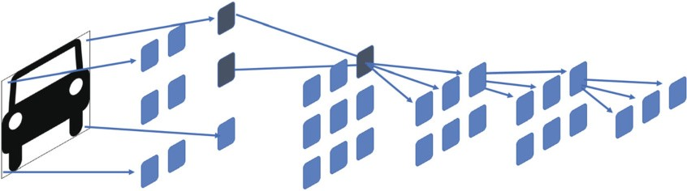
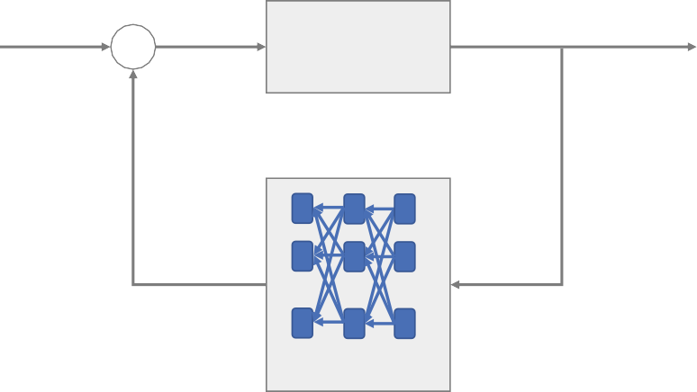
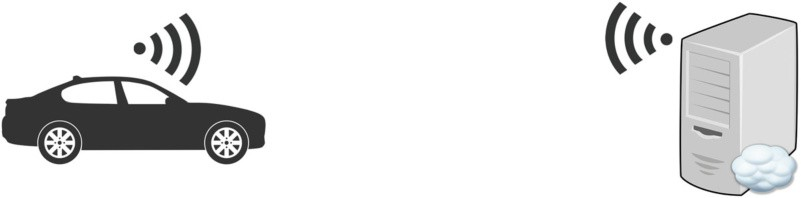

# Machine Learning in Automotive Software

**Abstract** Modern software is expected to grow, improve its operations, and adapt to new contexts. We often realize these requirements by introducing machine learning algorithms in the software architecture. In automotive software, we can observe the use of machine learning technology in recognizing objects on the road (active safety systems) and optimizations of control systems (engine and gearbox operation). In this chapter, we explore the use of deep learning for image classification and object recognition, and through this we explain the concepts of supervised learning. We also introduce the concepts of reinforced learning using an example algorithm for engine optimization.

> **摘要**现代软件有望增长，改善其运营并适应新的环境。我们经常通过在软件体系结构中引入机器学习算法来意识到这些要求。在汽车软件中，我们可以观察到机器学习技术在识别道路上的对象(主动安全系统)和控制系统(发动机和变速箱操作)的优化中。在本章中，我们探讨了对图像分类和对象识别的深度学习的使用，我们通过此解释了监督学习的概念。我们还使用示例算法进行发动机优化介绍了增强学习的概念。

## Introduction

In the first edition of this book, machine learning was an important technology to watch (see [[Sta17](#_bookmark489), Chapter 9]). A lot has changed since then. The technology has entered the mainstream of innovation in modern car software [[FLC17](#_bookmark476), [SG20](#_bookmark487)].

> 在本书的第一版中，机器学习是一项重要的技术(请参阅[[sta17](#_bookmark489)，第 9 章])。从那以后很多事情改变了。该技术已进入现代汽车软件中的创新主流[[flc17](#_bookmark476)，[sg20](#_bookmark487)]。

Machine learning is used in automotive software in the following cases (the most common scenarios):

> 在以下情况下，机器学习用于汽车软件(最常见的情况)：

- Object recognition in active safety cameras

> - 主动安全摄像机中的物体识别

- Censor fusion in situation awareness (LIDAR and camera pictures)

> - 审查情况融合在情况意识中(激光雷达和相机图片)

- Speech recognition in multimodal communication (in infotainment)

> - 多模式通信中的语音识别(在信息娱乐中)

- Intersection structure perception

> - 交叉结构感知

- Nighttime pedestrian detection

> - 夜间的行人检测

The reason for using more machine learning in automotive software is the availability of tensor processors (e.g., NVidia’s GPUs), fast and low-latency 5G telecommunication links, efficient algorithms for neural networks, and the ability to simulate high-fidelity environments using game engines (like Ubisoft’s Unreal game engine).

> 在汽车软件中使用更多机器学习的原因是张量处理器(例如 NVIDIA 的 GPU)，快速和低延迟 5G 电信链接，神经网络的有效算法以及使用游戏引擎模拟游戏引擎的能力，(例如 Ubisoft 的虚幻游戏引擎)。

One of the main differences between standard software development and machine learning is the training phase, which is illustrated in Fig. [7.1](#_bookmark453). The nonML software development is focused on implementation and testing. Depending on the type of the software development process, the length differs. In Agile software development, these phases are also iterative and not linear. However, the main principle remains – software is developed, calibrated, and tested before it is deployed.

> 标准软件开发和机器学习之间的主要区别之一是训练阶段，如图 [7.1](#_bookmark453) 所示。非 ML 软件开发的重点是实施和测试。根据软件开发过程的类型，长度有所不同。在敏捷软件开发中，这些阶段也是迭代的，而不是线性的。但是，主要原则仍然存在 - 软件在部署之前已经开发，校准和测试。

<**Fig. 7.1** Overview of software development phases without machine learning components (upper part of the figure) and with machine learning components (bottom part of the figure)

In ML software development, new phases are needed: data collection and management (data) and training (calibration). The machine learning process results in the development of a machine learning classifier. The classifier is the trained instance of a generic algorithm, which can be deployed: for example, a trained instance of a neural network for image recognition. This trained classifier needs to be evaluated in terms of the statistical probability of how often it is correct, how accurate it is, and how often it results in true positives (correctly recognized objects) and false positives (objects classified incorrectly). Depending on the machine learning task, these performance measures differ. The data collection and management phase is needed to find the right datasets to train the machine learning algorithms. This data needs to be of the right quality, as complete as possible, free from biases, and representative of real-world scenarios. Although it sounds straightforward, it is quite difficult. Let us consider the example of image data from driving scenarios. In order to train algorithms, we need to provide data which represents real-world scenarios. This means that we need to manage the diversity of scenarios – daytime vs. nighttime, yellow line road marking vs. white line road marking, city vs. highway scenarios. Managing this means that we need to control which sample data is used for training and which for evaluation.

> 在 ML 软件开发中，需要新的阶段：数据收集和管理(数据)和培训(校准)。机器学习过程导致机器学习分类器的开发。分类器是通用算法的训练实例，可以部署：例如，用于图像识别的神经网络的训练实例。这个经过训练的分类器需要根据统计概率进行评估，即它正确的频率、准确的程度，以及它产生真阳性(正确识别的对象)和假阳性(错误分类的对象)的频率。根据机器学习任务，这些性能指标有所不同。数据收集和管理阶段需要找到合适的数据集来训练机器学习算法。这些数据需要具有正确的质量，尽可能完整，没有偏见，并且能够代表真实场景。虽然这听起来很简单，但很难。让我们考虑驾驶场景中的图像数据示例。为了训练算法，我们需要提供代表真实场景的数据。这意味着我们需要管理场景的多样性——白天与夜间、黄线道路标记与白线道路标记、城市与公路场景。管理这意味着我们需要控制哪些样本数据用于培训，哪些用于评估。

The data collection and management phase is a cost-intensive phase, because it requires labeling of data. Each data point used in the training and evaluation of the machine learning classifier needs to be labeled. For example, if we want to use our classifier to recognize a traffic light, each image (or videosequence) used in the training/evaluation of the algorithm needs to be labeled: which traffic light is visible, whether there is a traffic light sign at all, or where in the image this traffic light is. This is often a manual process, which requires effort and grows as the size of the dataset grows. The general principle is that accuracy requires large datasets; the data

> 数据收集和管理阶段是一个成本密集型阶段，因为它需要标记数据。机器学习分类器的训练和评估中使用的每个数据点都需要标记。例如，如果我们想使用分类器识别交通信号灯，则需要对算法训练/评估中使用的每个图像(或视频序列)进行标记：哪个交通信号灯是可见的，是否有交通信号灯标志，或者该交通信号灯在图像中的位置。这通常是一个手动过程，需要付出努力，并随着数据集的大小而增长。一般原则是，准确性需要大数据集；数据

1. Introduction 173 labeling process is one of the new cost drivers in automotive software development. Therefore, the number of reusable datasets and frameworks is constantly growing, e.g., [[MK19](#_bookmark483)].

> 1.简介 173 标签过程是汽车软件开发中新的成本驱动因素之一。因此，可重复使用的数据集和框架的数量不断增长，例如[[mk19](#_bookmark483)]。

Thanks to modern frameworks, like TensorFlow or PyTorch, we do not need to implement machine learning algorithms. We do not need to reimplement a neural network from scratch; we only need to configure the framework with the number of layers, number of neurons, and which types of layers we need. However, we need to spend more time to test and evaluate the performance of the resulting systems. Therefore, in addition to standard testing, we need to assess whether the training process is sufficiently complete. In our example of image recognition, we need to complement the test of the hardware and software with our assessment of whether the machine learning classifier can recognize images correctly – to be precise, whether the machine learning classifier’s accuracy is sufficient. The sufficiency may vary from use case to use case – it is different for the classifier used for active safety and different for the classifier used to find vehicles to communicate with. NVidia drive labs is one of the research centers which showcases advanced machine learning technology for automotive software, e.g., object recognition and using active learning to improve machine learning classifiers over time. It provides technology, infrastructure, and knowledge for car manufacturers.

> 多亏了现代框架，例如 Tensorflow 或 Pytorch，我们不需要实现机器学习算法。我们不需要从头开始重新实现神经网络；我们只需要使用层数，神经元数量以及所需的层类型的框架配置框架。但是，我们需要花更多的时间来测试和评估所得系统的性能。因此，除了标准测试外，我们还需要评估培训过程是否足够完整。在我们的图像识别示例中，我们需要通过评估机器学习分类器是否可以正确识别图像的评估(确切地说是机器学习分类器的准确性是否足够了)，我们需要对硬件和软件的测试进行补充。充分性可能因用例而有所不同 - 用于主动安全性的分类器不同，对于用于查找可以与之通信的车辆的分类器不同。NVIDIA DRIVE LABS 是为汽车软件展示高级机器学习技术的研究中心之一，例如，对象识别并使用主动学习来随着时间的推移改善机器学习分类器。它为汽车制造商提供技术，基础设施和知识。

Game engines can provide a very realistic simulation of the environment, which can be used to train onboard cameras to recognize objects and driving situations. Instead of spending hours of driving, and thus spending precious human-driver time, we can generate realistic driving images in order to bootstrap the training of the machine learning classifier. Although there is a trade-off between the synthetic, simulated data, research studies are done to analyze how to estimate and understand that trade-off [[PBS19](#_bookmark484)].

> 游戏引擎可以对环境提供非常逼真的模拟，可用于训练板载摄像头以识别对象和驾驶情况。我们可以生成逼真的驾驶图像，以便为了引导机器学习分类器的培训，而不是花费数小时的驾驶，因此可以花费宝贵的人类驱动器时间。尽管合成，模拟数据之间存在权衡取舍，但进行了研究来分析如何估计和理解这一权衡[[PBS19](#_bookmark484)]。

5G telecommunication networks provide a platform for high-speed and highfidelity connectivity between cars and their infrastructure. All major telecommunication equipment manufacturers provide this possibility (e.g., Ericsson, Nokia). This connectivity enables remote management/driving of vehicles as well as using cloud infrastructure in cars. The cars can use cloud infrastructure for processing part of the data, thus decreasing the need for computing power in cars’ electronics. An example of this is the use of speech recognition – similar to the speech recognition technology in services like Siri or Alexa.

> 5G 电信网络为汽车及其基础架构之间的高速和高保真连接提供了一个平台。所有主要的电信设备制造商都提供了这种可能性(例如，爱立信，诺基亚)。这种连接使车辆的远程管理/驾驶以及在汽车中使用云基础架构。这些汽车可以使用云基础架构来处理部分数据，从而减少了汽车电子设备中计算能力的需求。一个例子是使用语音识别 - 类似于 Siri 或 Alexa 等服务中的语音识别技术。

In this chapter, we explore the use of machine learning from the perspective of software architecture. We start by describing how machine learning can be integrated into the architecture. We then present one case of using machine learning for image recognition, where we explore the main concepts of supervised learning. Then we show a simple case of reinforced learning, which is one of the most powerful ways of integrating deep learning in software systems today. Finally, we show the limitations of these technologies and what needs to be overcome to evolve machine learning technology in modern cars’ software.

> 在本章中，我们从软件体系结构的角度探讨了机器学习的使用。我们首先描述如何将机器学习集成到体系结构中。然后，我们提出了一种使用机器学习进行图像识别的案例，我们在其中探讨了监督学习的主要概念。然后，我们展示了一个简单的增强学习案例，这是当今软件系统中深入学习的最有力方法之一。最后，我们展示了这些技术的局限性以及在现代汽车软件中发展机器学习技术需要克服的局限性。

## Fundamentals of Supervised Learning

There are three major types of machine learning algorithms:

> 机器学习算法有三种主要类型：

- Supervised learning
- Unsupervised learning
- Reinforced learning

> - 监督学习
> - 无监督的学习
> - 加强学习

In supervised learning algorithms, the goal is to train the algorithm to mimic the decisions encoded in the dataset. We input the data where each instance is labeled with either a class or a predicted variable. The training of the algorithm is a process where we use statistics to optimize a classifier to be able to classify or predict a value. The training process requires that each data point has a label indicating where it belongs. An example of the use of such algorithms in the automotive domain is image recognition.

> 在监督的学习算法中，目标是训练该算法以模仿数据集中编码的决策。我们输入每个实例都用类或预测变量标记的数据。算法的培训是一个过程，我们使用统计信息来优化分类器以能够对值进行分类或预测值。培训过程要求每个数据点具有一个标签，指示其属于位置。在汽车域中使用此类算法的一个示例是图像识别。

The unsupervised learning algorithms are designed to find patterns in the input dataset. The goal is to group or automatically classify instances of objects in the dataset. There are no good examples in the automotive domain, but we can see examples of such algorithms in recommendation systems, e.g., when recommending songs to play or movies to watch.

> **无监督的学习**算法旨在在输入数据集中找到模式。目标是将对象在数据集中的实例进行分组或自动分类。**汽车域中没有很好的示例**，但是我们可以在推荐系统中看到此类算法的示例，例如推荐歌曲或观看电影。

Finally, reinforced learning algorithms are designed to make optimizations towards a specific function. They use as inputs the dataset and the function that they need to optimize towards. Some examples of using reinforced learning are engine optimizations and route planning in navigation systems.

> 最后，加强学习算法旨在对特定功能进行优化。它们用作输入数据集和需要优化的功能。使用增强学习的一些示例是导航系统中的引擎优化和路线计划。

To illustrate the concepts important in machine learning, let us explore an example of how machine learning works in image recognition using convolutional neural networks. We start with understanding the input data and the process of labeling it.

> 为了说明机器学习中重要的概念，让我们探索一个示例，说明机器学习如何使用卷积神经网络在图像识别中起作用。我们首先了解输入数据及其标记过程。

Figure [7.2](#_bookmark455) presents an example of a labeled picture with information about the location, time of day, and type of object. The labeling of the data is done manually, as we need to be certain about the labels. In the example in Fig. [7.2](#_bookmark455), the data analyst added information about the picture which is important in the classification. These labels are arbitrarily chosen, based on the needs for which we train the machine learning.

> 图 [7.2](#_bookmark455) 展示了一个标记图片的示例，其中包含有关位置，一天中的时间和对象类型的信息。数据的标签是手动完成的，因为我们需要确定标签。在图 [7.2](#_bookmark455) 中的示例中，数据分析师添加了有关图片的信息，这在分类中很重要。这些标签是根据我们训练机器学习的需求任意选择的。

We need to manually label the cases, for example, the pictures, as we need to keep the quality of the data high. Mistakes in labeling can result in either reducing the accuracy or, in the worst-case scenario, training the classifier to make the same mistakes. Naturally, the more data points we can label, the better, as the size of the dataset is important for the training process. The more examples we use, the better the accuracy of the resulting classifier and thus the better the car’s software becomes. The more diversity in the dataset, the better, as the resulting classifier will be able to recognize a wider variety of cases and therefore operate with higher precision and low error rate. However, the major challenge with labeling of data is its cost. Since it is a manual process, it is effort-intensive and therefore costly.

> 我们需要手动标记这些案例，例如图片，因为我们需要保持数据质量高。标记的错误可能会导致降低准确性，或者在最坏的情况下，训练分类器犯同样的错误。自然，我们可以标记的数据点越多，越好，因为数据集的大小对于培训过程很重要。我们使用的示例越多，所得分类器的准确性就越好，因此汽车的软件越好。数据集中的多样性越多，越好，因为所得分类器将能够识别更多的情况，因此以更高的精度和较低的误差率运行。但是，数据标签的主要挑战是其成本。由于这是一个手动过程，因此它是努力密集型的，因此昂贵。

1. Fundamentals of Supervised Learning 175 Image Labels

Object: Car
<**Fig. 7.2** Annotated image for supervised learning. Photograph: pixabay.com

Classification of images is only one machine learning task which is relevant for the vehicle’s software. Figure [7.3](#_bookmark457) is quite different from the examples in Fig. [7.2](#_bookmark455) as it shows multiple objects in one image – there are multiple cars, a pedestrian, several buildings, and persons. This figure shows a more realistic scenario that we need to address with machine learning – object detection and classification. The major difference is that we need to segment the figure, find objects, and classify them. Although this seems like a straightforward task for humans, it is significantly more challenging for machine learning.

> 图像的分类只是一项与车辆软件相关的机器学习任务。图 [7.3](#_bookmark457) 与图 [7.2](#_bookmark455) 中的示例完全不同，因为它在一个图像中显示了多个对象 - 有多个汽车，一辆行人，几个架构物和人员。该图显示了我们需要通过机器学习 - 对象检测和分类来解决的更现实的场景。主要区别在于，我们需要分割图，查找对象并对其进行分类。尽管对于人类来说，这似乎是一项简单的任务，但对于机器学习而言，这更具挑战性。

Figure [7.3](#_bookmark457) shows an example of a figure annotated with objects, which we can use for training the machine learning classifier for the task of object detection and classification.

> 图 [7.3](#_bookmark457) 显示了一个用对象注释的图的示例，我们可以将其用于训练机器学习分类器以完成对象检测和分类的任务。

When labeling the objects for classification tasks, we provide a predefined set of labels for each image – we call it a feature vector, where the labels are the classes to which the specific image belongs to, like position of the car. In the object detection and classification task, every image can have a different set of classes, as the number and types of objects can differ.

> 在标记分类任务的对象时，我们为每个图像提供一组预定义的标签 - 我们称其为特征向量，其中标签是特定图像所属的类，例如汽车的位置。在对象检测和分类任务中，每个图像都可以具有不同的类，因为对象的数量和类型可能会有所不同。

In all cases of labeling of data, we need to be able to provide the data in the format of an array, which can be used for machine learning tasks. In the case of images, we need to be able to transform the image data into a large vector where we have pixel intensity and image label(s). Table [7.1](#_bookmark456) presents an example of a few rows of an image. This feature matrix is used as an input to the machine learning classifier in the training process.

> 在所有标记数据的情况下，我们都需要能够以数组格式提供数据，该数据可用于机器学习任务。在图像的情况下，我们需要能够将图像数据转换为具有像素强度和图像标签的大量向量。表 [7.1](#_bookmark456) 提供了一个图像行的示例。此功能矩阵在培训过程中用作机器学习分类器的输入。

**Table 7.1** Example of a feature vector with the corresponding classes

The feature matrix in Table [7.1](#_bookmark456) shows each row as a vector, which is a simplified way of representing images. Since images are two-dimensional, each row of such a feature matrix is essentially a two-dimensional array – a two-dimensional tensor – which is then classified with `Class` as the last column. It is difficult to illustrate that in a table, so we can stay with the vector representation of images. We show how the images are used as input to neural networks in the forthcoming sections.

> 表 [7.1](#_bookmark456) 中的功能矩阵将每一行显示为向量，这是表示图像的简化方法。由于图像是二维的，因此此类特征矩阵的每一行本质上都是二维阵列 - 二维张量 - 然后将 `类` 分类为最后一列。很难在表中说明这一点，因此我们可以与图像的向量表示保持联系。我们展示了如何将图像用作即将到来的部分中神经网络的输入。

<**Fig. 7.3** Annotated image for object detection and recognition. Photograph: pixabay.com

## Neural Networks

Neural networks are one of the most powerful mechanisms used in machine learning, in particular for image recognition [[PDCLO98](#_bookmark485)]. The concept of neural networks is based on how human brains are structured – as a network of neurons connected via synapses. The main concept, the building block, is the artificial neuron, which is shown in Fig. [7.4](#_bookmark459).

> 神经网络是机器学习中使用的最强大的机制之一，尤其是图像识别[[PDCLO98](#_bookmark485)]。神经网络的概念基于人类大脑的结构方式 - 作为通过突触连接的神经元网络。主要概念是构建块，是人造神经元，如图 [7.4](#_bookmark459) 所示。

The neuron takes as input the output of neurons from the layer before and calculates the output for the neurons in the next layers. The values x of each neuron are multiplied by the weights w. The sum of these products is then filtered by the so-called activation function, which produces the value of 0 if the sum is below a given threshold or 1 if the value is above the threshold.

> 神经元在前面从层中输入神经元的输出，并在下一层中计算神经元的输出。每个神经元的值 x 乘以重量 w。然后，这些产品的总和由所谓的激活函数过滤，如果总和低于给定阈值，则会产生 0 的值，如果值高于阈值，则会产生 0。

Neurons are grouped into layers and the layers are stacked one upon another. The structure of the neurons can differ, but the major advantage of neural networks is how the neurons are grouped into layers and how they are connected. It is outside of the scope of this book to discuss these architectures, so we refer the interested readers to a great book by Gereon [[Ger18](#_bookmark479)].

> 神经元分为层，并将层堆叠在一起。神经元的结构可能会有所不同，但是神经网络的主要优势是神经元如何分成层以及它们如何连接。讨论这些体系结构的范围不在本书的范围之内，因此我们将感兴趣的读者推荐给 Gereon [[Ger18](#_bookmark479)]的一本好书。

<**Fig. 7.4** Artificial neuron

The most common architectures of the neural networks are:

> 神经网络最常见的体系结构是：

- Dense networks – where all in one layer are connected to all networks in the previous and the next layer

> - 密集的网络 - 一层全部连接到上一层和下一层的所有网络的地方

- Convolutional networks – where the layer before is wider than the next one and only the subset of neurons in those layers are connected to each other

> - 卷积网络 - 以前的层比下一个层宽，而这些层中的神经元的子集相互连接

- Recurrent networks – where networks in the same layers are connected to each other

> - 循环网络 - 相同层中的网络相互连接

- Autoencoders – where the network has a very narrow layer in the middle (the bottleneck)

> - 自动编码器 - 中间网络具有非常狭窄的层(瓶颈)

The dense networks are very good for problems of classification and prediction of data, similar to the regression problems, like predicting the price of a real estate. The convolutional networks are very good for image recognition, and we focus on them in the next section. The recurrent neural networks are used to solve problems which have a temporal dimension, e.g., in language translation. Autoencoders are used to reduce noise in images, and they are the main part for generative neural networks, which are often used for creative tasks – composing music, writing text, and painting [[Gan17](#_bookmark477)].

> 密集的网络非常适合分类和数据预测的问题，类似于回归问题，例如预测房地产价格。卷积网络非常适合图像识别，我们在下一节中专注于它们。复发性神经网络用于解决具有时间维度(例如语言翻译)的问题。自动编码器用于减少图像中的噪音，它们是生成神经网络的主要部分，这些神经网络通常用于创意任务 - 编写音乐，写作文本和绘画[[GAN17](#_bookmark477)]。

## Image Recognition Using Convolutional Neural Networks

Image recognition essentially encompasses several techniques – image classification, object recognition, image segmentation, or image description, just to name a few. In this chapter, we start with the first, image classification, as the rest of the techniques expand on it. Today, the state-of-the-art neural networks used for image classification are based on the concept of convolutions, where the first several layers are narrowed than the previous ones and the neurons are not fully connected in these layers. Figure [7.5](#_bookmark461) illustrates the concept of convolutional neural networks for image recognition/classification.

> 图像识别基本上包含几种技术 - 图像分类，对象识别，图像分割或图像描述仅举几例。在本章中，我们从第一个图像分类开始，因为其余技术在其上扩展。如今，用于图像分类的最新神经网络基于卷积的概念，在该概念上，前几层比以前的层狭窄，并且神经元在这些层中没有完全连接。图 [7.5](#_bookmark461) 说明了用于图像识别/分类的卷积神经网络的概念。

<**Fig. 7.5** Convolutional neural network for image recognition/classification

The whole idea behind convolutional neural networks is that they learn patterns in images, similar to how we, humans, perceive images [[Ger18](#_bookmark479), [KSH12](#_bookmark482)]. In the first layer (the left-most layer in Fig. [7.5](#_bookmark461)), the neurons are linked directly to pixels in the image – one neuron per pixel. However, in the subsequent few layers, the neurons are linked only to one neuron. Furthermore, the next layer’s neurons are only linked to a subset of neurons from the previous layer – this subset is called a _window_. The window can connect adjacent neurons or it can skip some, which is called a _stride_. Using the window allows the neurons to recognize parts of images, e.g., lines or points. The ability of the network to recognize shapes is designated by its depth – the deeper the network, the more complex shapes it can recognize.

> 卷积神经网络背后的整个想法是，它们在图像中学习模式，类似于我们，人类，感知图像[[ger18](#_bookmark479)，[ksh12](#_bookmark482)]。在第一层(图 [7.5](#_bookmark461) 中的最左侧层)中，神经元直接链接到图像中的像素 - 每个像素一个神经元。但是，在随后的几层中，神经元仅与一个神经元相关。此外，下一层的神经元仅链接到上一层神经元的子集 - 该子集称为 *Window*。窗口可以连接相邻的神经元，也可以跳过一些，这称为 *stride*。使用窗口允许神经元识别图像的一部分，例如线或点。网络识别形状的能力是通过其深度指定的 - 网络越深，它可以识别的越复杂。

After a number of convolutional layers, the network has two or three layers of fully connected neurons, the so-called dense layers. These layers learn what each shape in the image means – they classify the encoded image. The last layer is where the network provides its output – a probability that the image belongs to a specified class (label). All neural networks provide the probability for each image, which means that the output is a vector of probability, e.g., [0.1, 0.3, 0.6]. It’s the responsibility of the software components outside of the neural network to make the decisions based on these probabilities.

> 在多个卷积层之后，该网络具有两个或三层完全连接的神经元，即所谓的致密层。这些层了解图像中的每个形状的意思 - 它们对编码的图像进行了分类。最后一层是网络提供其输出的位置 - 图像属于指定类(标签)的概率。所有神经网络都提供了每个图像的概率，这意味着输出是概率的向量，例如[0.1，0.3，0.6 ]。神经网络之外的软件组件的责任是根据这些概率做出决策。

In typical machine learning applications, we use a _softmax_layer to, simply, pick the most probable class and output, instead of a set of probabilities for each class.

> 在典型的机器学习应用程序中，我们使用 *softMax* 层简单地选择最可能的类和输出，而不是每个类的一组概率。

It sounds quite straightforward, but there are a few aspects which are important in the context of automotive software: probabilistic output of the image classification and performance of the network.

> 这听起来很简单，但是在汽车软件的背景下，有一些方面很重要：图像分类的概率输出和网络性能。

To illustrate the challenges related to probabilistic outputs, let us consider the data flow architecture of a component which uses image classification, as presented in Fig. [7.6](#_bookmark462).

> 为了说明与概率输出相关的挑战，让我们考虑使用图像分类的组件的数据流架构，如图 [7.6](#_bookmark462) 所示。

Actuator: brake
<**Fig. 7.6** Data flow architecture with machine learning for driver support

In the figure, the probability vector is changed into a binary decision. In this example, it is done by the decision controller component, although it can be done by any component. The important aspect is that the probability is taken as a `fact` later in the data flow. In this example, the probability of the image showing a car is 0.7 (70%), which is quite high. However, it is not 100%, which means that there is a danger that the vehicle activates brakes when it is not needed. Such a situation is called a false-positive classification – we recognize a car when there is none. Activating the brakes can be dangerous as it can cause rear collision (from the vehicles behind). In the false-negative case, i.e., when we do not recognize a car when there is one, the decision controller would not recommend activation of brakes, and therefore the collision can still happen.

> 在图中，概率向量已更改为二进制决策。在此示例中，它由决策控制器组件完成，尽管可以由任何组件完成。重要的方面是，概率在数据流后期被视为 `事实` 。在此示例中，显示汽车的图像的概率为 0.7(70％)，相当高。但是，这不是 100％，这意味着在不需要时，车辆会激活制动器存在危险。这种情况称为虚假阳性分类 - 我们在没有的情况下认出一辆汽车。激活制动器可能很危险，因为它可能导致后碰撞(从后面的车辆上)。在错误的阴性情况下，即，当我们在有车时不认识汽车时，决策控制者不会建议激活制动器，因此碰撞仍然会发生。

In this scenario, we can fix the problem by adding a radar or lidar and use their data in the decision controller. However, there are scenarios where radar will not provide any useful information, for example, when we want to recognize the color of the traffic light ahead (or even which traffic light we should adhere to) [[GLY95](#_bookmark480)]. The probabilistic information can be deceptive and lead to more or less dangerous situations, e.g., autonomous cars ignoring the red light [[Dav17](#_bookmark475)].

> 在这种情况下，我们可以通过添加雷达或激光雷达并在决策控制器中使用其数据来解决问题。但是，在某些情况下，雷达将无法提供任何有用的信息，例如，当我们想识别前方交通灯的颜色时(甚至我们应该遵守的交通信号灯)[Gly95](#_bookmark480)]。概率信息可以具有欺骗性，并导致或多或少危险的情况，例如，自动驾驶汽车忽略了红灯[[dav17](#_bookmark475)]。

The second challenge which we want to bring up is the computing power needed to provide sufficient performance. High-quality image recognition, especially of color images, requires very deep networks, which means high performance. For example, the AlexNet network [[KSH12](#_bookmark482)] has eight layers and requires a desktop computer in order to output recommendations fulfilling the soft real-time requirements of a vehicle’s software. The process of training such networks is so computationally intensive that it is infeasible for the on-board computers.

> 我们要提出的第二个挑战是提供足够性能所需的计算能力。高质量的图像识别，尤其是对颜色图像的识别，需要非常深的网络，这意味着高性能。例如，Alexnet 网络[[KSH12](#_bookmark482)]有八层，并且需要一台台式计算机，以便输出满足车辆软件的软实时要求的建议。训练此类网络的过程在计算密集型上是如此密集，以至于板载计算机是不可行的。

## Object Detection

Image classification is a rather simple machine learning task if we compare it to the tasks that really bring value in the automotive context. One of the more complex tasks is object detection and recognition, especially in traffic scenarios [[ST09](#_bookmark488)]. Detecting and recognizing objects is about finding multiple objects in one image, and therefore it requires three activities:

> 如果我们将其与在汽车上下文中真正带来价值的任务进行比较，则图像分类是一个相当简单的机器学习任务。更复杂的任务之一是对象检测和识别，尤其是在流量方案[[ST09](#_bookmark488)]。检测和识别对象是关于在一个图像中查找多个对象，因此需要三个活动：

- Object localization – where the object detection algorithm finds regions with objects

> - 对象本地化 - 对象检测算法找到具有对象的区域

- Image segmentation – where the algorithm marks regions in the image which contain objects

> - 图像分割 - 算法标记包含对象的图像区域

- Image recognition – where the algorithm classifies the objects in these regions

> - 图像识别 - 算法对这些区域中的对象进行分类

In the object detection part, the algorithm finds contours of objects. It then exports the regions where these objects are placed out of the image for further processing. The illustration of this is presented in the example from Sect. [7.2](#fundamentals-of-supervised-learning), in particular in Fig. [7.3](#_bookmark457), where different objects are marked by bounding boxes.

> 在对象检测部分中，算法找到对象的轮廓。然后，它导出将这些对象放在图像中以进行进一步处理的区域。该教派的示例中介绍了此的例证。[7.2](#%E7%9B%91%E7%9D%A3%E5%AD%A6%E4%B9%A0%E5%AD%A6%E4%B9%A0%E7%9A%84%E5%9F%BA%E7%A1%80)，特别是在图 [7.3](#_bookmark457) 中，其中不同的对象由边界框标记。

Although the last part seems to be exactly the same as the image recognition task, it requires preprocessing of images as the regions found by the segmentation algorithm can be of different sizes. These differences in size require scaling of images or using different architectures of image recognition to be able to process images (as stated previously, the first layer of neurons maps one neuron to one pixel in the image, so the number of pixels and the number of neurons have to be the same).

> 尽管最后一部分似乎与图像识别任务完全相同，但它需要对图像进行预处理，因为分割算法发现的区域可能具有不同的大小。这些大小的差异需要图像的缩放或使用图像识别的不同架构来处理图像(如前所述，第一层神经元将一个神经元映射到图像中的一个像素，因此像素的数量和数量神经元必须相同)。

In scenarios like finding the traffic lights in the camera feed images, the algorithm finds the relevant objects only, which is called _single-object localization_, or finding one object in the image. In scenarios related to autonomous drive, the algorithm marks all objects it can recognize in the image, which is called _multiple-object detection_.

> 在诸如在摄像机馈电图像中找到交通信号灯的场景中，该算法仅找到相关对象，该对象称为 *single-object intimization* 或在图像中找到一个对象。在与自动驱动器有关的方案中，该算法标记了它在图像中可以识别的所有对象，该对象称为 *multiple-Object denection*。

There are two major approaches for the object detection task. The first one is Region-based Convolutional Neural Networks [[GDDM14](#_bookmark478)]. This approach is based on three parts or modules: region proposal, feature extraction, and the classifier. The second one is based on the same algorithm as mentioned previously – AlexNet. The most interesting part, object localization, is based on the selective search algorithm [[UVDSGS13](#_bookmark490)], which groups pixels into regions and then finds similarity between

> 对象检测任务有两种主要方法。第一个是基于区域的卷积神经网络[[GDDM14](#_bookmark478)]。这种方法基于三个部分或模块：区域建议，特征提取和分类器。第二个是基于与前面提到的相同算法 - Alexnet。最有趣的部分是对象本地化，基于选择性搜索算法[[uvdsgs13](#_bookmark490)]，该]将像素分组为区域，然后在区域中找到相似之处

1. Reinforced Learning and Parameter Optimization 181 these regions. The most similar regions are grouped together, and the steps are repeated until the entire image has been processed, i.e., no more similar regions are found. Once all regions are marked, they are then processed by the image segmentation and recognition part.

> 1.加强学习和参数优化 181 这些区域。将最相似的区域分组在一起，并重复进行步骤，直到处理整个图像，即找不到更多类似的区域。一旦标记了所有区域，就会通过图像分割和识别部分处理它们。

An alternative approach to the Region-based Convolutional Neural Networks is the YOLO algorithm (You Only Look Once, [[RDGF16](#_bookmark486)]). YOLO algorithms involve a single neural network, which takes an image as input and predicts and classifies the bounding boxes in one pass. It is much faster than the region-based networks and can achieve a real-time performance of over 45 images per second. However, it can result in more localization errors. YOLO algorithms resize the input to a specific dimension (448\*448 pixels in the original network), run a single convolutional network on the image, and threshold the resulting detections by the model’s confidence. The algorithm chooses the segments by dividing the image into a grid and predicting the center of a bounding box in that grid. The segment with the center of the bounding box is then used to predict the class of the box.

> 基于区域的卷积神经网络的另一种方法是 Yolo 算法(您只看一次，[[rdgf16](#_bookmark486)])。Yolo 算法涉及一个单个神经网络，该网络将图像作为输入，并预测并在一个通过中对边界框进行分类。它比基于区域的网络要快得多，并且可以实现每秒 45 张图像超过 45 张图像的实时性能。但是，这可能导致更多的本地化错误。Yolo 算法将输入大小为特定维度(原始网络中的 448 \*448 像素)，在图像上运行单个卷积网络，并通过模型的置信度阈值所得的检测。该算法通过将图像分为网格并预测该网格中的边界框的中心来选择片段。然后，使用边界框的中心的段用于预测框的类。

Both fast implementations of region-based networks and YOLO can be used for object tracking when applied for camera feeds. In the automotive domain, they are often used in tandem with radar to confirm objects in the images. They are then used in active safety systems to provide input to the system.

> 当应用相机供稿时，可以将基于区域网络和 YOLO 的快速实现用于对象跟踪。在汽车域中，它们通常与雷达同时使用以确认图像中的对象。然后将它们用于主动安全系统，以提供系统的输入。

## Reinforced Learning and Parameter Optimization

Reinforcement learning is similar to finding an optimal solution to a problem, given a specific goal. In essence, it is very similar to the concept of control loops, well known in the automotive software. The reinforcement learning algorithms, therefore, are often designed as part of these control loops, as shown in Fig. [7.7](#_bookmark465).

> 考虑到特定目标，增强学习类似于找到问题的最佳解决方案。从本质上讲，它与控制循环的概念非常相似，该控制循环在汽车软件中众所周知。因此，强化学习算法通常被设计为这些控制循环的一部分，如图 [7.7](#_bookmark465) 所示。

Figure [7.7](#_bookmark465) contains the system and the controller, which has the reinforcement learning algorithm. Reinforcement learning algorithms can vary from simple optimization algorithms to deep learning-based ones [[ZWLL20](#_bookmark492)].

> 图 [7.7](#_bookmark465) 包含系统和控制器，该系统具有增强学习算法。增强学习算法可能从简单的选择算法到基于深度学习的算法[[zwll20](#_bookmark492)]。

In reinforcement learning, the algorithm keeps a map of all possible choices at any given moment and the cost or reward for each of these moves. Every time the algorithm solves a given problem, it notes whether it was successful or not. If it was successful, then it updates the cost/reward matrix – reinforces the choices either in a positive or negative way (depending on whether we optimize for rewards or for costs). To understand the concepts behind reinforced learning, we can think of this as a process of playing a computer game – every time we play a game, we know a bit better how to react to events in the game. To win the game, we construct a model of the game structure, its rules, and events. The same is true for reinforcement learning. In deep learning-based algorithms, the controller is able to generalize from previous observations and therefore can solve new problems. This is often used when the decision space is so large that it cannot be specified in a matrix, i.e., it is not possible to keep all possible states and transitions. Deep neural networks provide the possibility of generalizing actions and therefore reduce the decision space – they can propose actions based on previous experiences rather than based on the statetransition matrix.

> 在强化学习中，该算法在任何给定时刻都保留所有可能选择的地图，以及这些动作中每一个的成本或回报。每次算法解决给定的问题时，都会注意到它是否成功。如果成功，它将更新成本/奖励矩阵 - 以正面或负面的方式加强选择(取决于我们是优化奖励还是成本)。为了了解增强学习背后的概念，我们可以将其视为玩电脑游戏的过程 - 每次玩游戏时，我们都会更好地对游戏中的事件做出反应。为了赢得游戏，我们构建了游戏结构，其规则和事件的模型。强化学习也是如此。在基于深度学习的算法中，控制器能够从先前的观察结果中概括，因此可以解决新的问题。当决策空间太大以至于无法在矩阵中指定时，通常会使用这种情况，即，不可能保持所有可能的状态和过渡。深度神经网络提供了概括行动并因此减少决策空间的可能性 - 他们可以根据以前的经验而不是基于国家过渡矩阵提出行动。

<**Fig. 7.7** Schematic view of reinforcement learning used as part of the controller loop in control systems

## On-Board and Off-Board Machine Learning Algorithms

Machine learning algorithms can be trained in different ways. Training can either be conducted once or repeated whenever required. The resources for training and using machine learning differ significantly; therefore, we can consider two different architectures for using machine learning – on-board training and off-board training. In on-board training, the ECU used for training the algorithm is placed as part of the vehicle’s electronics. In off-board training, the ECU is placed outside of the vehicle’s electronics, usually as part of the data center. There are advantages and disadvantages in both approaches, so let us explore these in more detail.

> 机器学习算法可以通过不同的方式进行培训。可以进行一次训练，也可以在需要时重复一次。培训和使用机器学习的资源差异很大；因此，我们可以考虑使用机器学习的两种不同的体系结构 - 车载培训和板外培训。在板载培训中，用于训练的 ECU 作为车辆电子设备的一部分放置算法。在板外训练中，ECU 通常作为数据中心的一部分放置在车辆的电子设备之外。两种方法中都有优势和缺点，因此让我们更详细地探索这些方法。

Figure [7.8](#_bookmark467) presents a diagram of on-board training. It shows the additional ECU, depicted as a larger computer, placed in the car. In on-board training, the vehicle’s sensors collect the data and send it to the training ECU, which trains the algorithm, and then a new version of the classifier is used.

> 图 [7.8](#_bookmark467) 提供了板载培训的图。它显示了放置在汽车中的较大计算机的额外的 ECU。在板载培训中，车辆的传感器收集数据并将其发送到训练算法的培训 ECU，然后使用新版本的分类器。

This additional ECU needs to be more powerful than the rest of the ECUs in the vehicle. It also needs to be placed on the edge of the architecture, as the process of training the machine learning classifier can take a long time. The classifier needs to be evaluated before it is used, because the additional data may decrease its performance, which is something that we do not want.

> 这种额外的 ECU 需要比车辆中其他 ECU 更强大。还需要将其放置在体系结构的边缘，因为训练机器学习分类器可能需要很长时间。在使用之前，需要对分类器进行评估，因为附加数据可能会降低其性能，这是我们不想要的。

1. On-Board and Off-Board Machine Learning Algorithms 183

> 1.机载和外机器学习算法 183

<!-- -->

1. Vehicle collects data using on-board sensors

> 1.车辆使用车载传感器收集数据

3. Machine learning classifiers are trained using on-board computers

> 3.机器学习分类器是使用机上计算机培训的

3\. Vehicle software is updated with the new version of the classifier

> 3 \。车辆软件已使用新版本的分类器更新

<**Fig. 7.8** On-board training and use of machine learning classifiers using an additional, more computationally powerful ECU

Cars which use on-board training, or even just use machine learning in live traffic, often have additional sensors. Figure [7.9](#_bookmark469)[1](#_bookmark468) presents Uber’s Volvo XC90 with the additional sensors on the roof of the car.

> 使用板载培训的汽车，甚至只是在实时流量中使用机器学习，通常都有其他传感器。图 [7.9](#_bookmark469)[ 1 ](#_bookmark468)在汽车屋顶上展示了 Uber 的 Volvo XC90。

The main advantage of using on-board training is the ability to adjust to individual driving preferences and conditions. For example, we can use on-board training to optimize route planning in GPS navigations or optimize engine parameters. By optimizing classifiers towards individual driving preferences, we increase the driving experience and improve the driving parameters, e.g., minimize the carbon footprint by optimal engine control. Using on-board training requires no Internet connection to a data center.

> 使用车载训练的主要优点是能够适应个体驾驶偏好和条件。例如，我们可以使用车载培训来优化 GPS 导航中的路由计划或优化引擎参数。通过优化分类器朝着单个驾驶偏好的偏好，我们增加了驾驶体验并改善驾驶参数，例如，通过最佳发动机控制来最大程度地减少碳足迹。使用车载培训不需要与数据中心的互联网连接。

However, on-board training has disadvantages, which come from the fact that the developer of the software has no control of the training and evaluation process. The training process is dependent on the data collected and therefore can result in optimizing towards local optima or, in extreme cases, even deteriorating the performance of classifiers. Therefore, the software architecture includes deterministic, non-ML components, which monitor the use of ML components. One of such mechanisms is the mechanism of a safety cage, where the non-ML component captures out-of-bound parameters and uses a safe mode (with predefined parameters) instead of the ML mode [[HGP+11](#_bookmark481)].

> 但是，车载培训的缺点是由于软件的开发人员无法控制培训和评估过程。培训过程取决于收集的数据，因此可能导致对本地 Optima 进行优化，或者在极端情况下，甚至会恶化分类器的性能。因此，软件体系结构包括确定的非 ML 组件，可监视 ML 组件的使用。这样的机制之一是安全笼的机制，其中非 ML 组件捕获了界外参数并使用安全模式(带有预定义参数)而不是 ML 模式[[HGP ++ 11](#_bookmark481)]。

1This file is licensed under the Creative Commons Attribution-Share Alike 4.0 International license. Source: commons.wikimedia.com, author: Dllu.

<**Fig. 7.9** Uber’s XC90 with additional sensors on the roof

On-board training also requires additional hardware – the ECU used for training needs to be more powerful than the one used for making decisions (classifying new data points). To be able to use advanced algorithms, like neural networks, the processing unit needs to be designed specifically for that purpose – instead of processing 8-, 16-, 32-, and 64-bit words, it needs to process tensors and vectors of words. These modern processing units are called tensor processing units (TPUs) or graphics processing units (GPUs) and provide orders of magnitude speed-up in training compared to traditional CPUs. However, they are also more expensive and require a different processing architecture. This cost and different architecture bring us to the other way of training machine learning classifiers – using off-board TPUs in data centers. Instead of adding new TPUs to the vehicle’s architecture, we use telecommunication components to send data to a data center, where it is processed, and download new versions of the trained classifier in return. This process is shown in Fig. [7.10](#_bookmark470).

> 车载培训还需要其他硬件 - 用于培训的 ECU 需要比用于做出决策(对新数据点进行分类)更强大。为了能够使用高级算法，例如神经网络，需要专门为该目的设计处理单元 - 而不是处理 8-，16-，32-和 64 位单词，需要处理的张量和向量字。这些现代处理单元称为张量处理单元(TPU)或图形处理单元(GPU)，与传统 CPU 相比，训练中的速度加速级别。但是，它们也更昂贵，需要不同的处理体系结构。这种成本和不同的体系结构将我们带入了训练机器学习分类器的其他方式 - 使用数据中心中的板外 TPU。我们没有将新的 TPU 添加到车辆的体系结构中，而是使用电信组件将数据发送到处理的数据中心，并下载训练有素的分类器的新版本作为回报。此过程如图 [7.10](#_bookmark470) 所示。

Off-board training is based on distributed architecture with asynchronous communication. It requires connection between the vehicle and the data center, but it provides software developers control over the training and validation process. It also resembles the traditional updates of the vehicle’s software, e.g., over-the-air update the data from its sensors, creating a dataset of it, and sending it to the data center. The data center collects datasets from multiple vehicles and uses them to train the classifier. The new version of the classifier is then evaluated and tested in the data center. If the results are satisfactory, then the vehicles receive the updated classifier as a software update.

> 板外培训基于分布式架构，并具有异步通信。它需要车辆与数据中心之间的连接，但它为软件开发人员提供了对培训和验证过程的控制。它还类似于车辆软件的传统更新，例如，直播从其传感器中更新数据，创建其数据集并将其发送到数据中心。数据中心从多辆车中收集数据集，并使用它们来训练分类器。然后在数据中心评估和测试新版本的分类器。如果结果令人满意，则车辆将收到更新的分类器作为软件更新。

In off-board training, the vehicle’s electronic system is responsible for collecting

> 在板外培训中，车辆的电子系统负责收集

<**Fig. 7.10** Off-board training of machine learning classifiers by communicating with external (to the vehicle) data center

The off-board training setup has a number of advantages. First, it provides more control over the training process than on-board training. The software development organization, usually the OEM, can stop the updates if the training is not satisfactory, for example, if the accuracy is not sufficient. Second, the use of the data center provides the possibility to use more advanced algorithms, as the TPU capacity can be much higher than if a TPU was placed in each car. It is also cheaper to maintain these TPUs if they are located in the data center.

> 外部培训设置具有许多优势。首先，它提供了对培训过程的控制权，而不是板上培训。软件开发组织通常是 OEM，如果培训不满意，则可以停止更新，如果准确性不够。其次，数据中心的使用提供了使用更高级算法的可能性，因为 TPU 容量可能比将 TPU 放置在每辆车中的情况要高得多。如果这些 TPU 位于数据中心，则将其维护这些 TPU 也更便宜。

Finally, when training the algorithms off-board, the datasets available for the training algorithms are much larger than for the individual vehicles. This means that the classifiers are better equipped to handle the variability in the datasets and that the results of the algorithms are more robust to changes in the operational environment. For example, training image recognition is more accurate for diverse driving scenarios (day vs. night, European vs. American lane markings).

> 最后，当训练算法外部训练算法时，可用于培训算法的数据集比单个车辆大得多。这意味着分类器可以更好地处理数据集中的可变性，并且算法的结果对操作环境的变化更为强大。例如，训练图像识别对于各种驾驶场景(夜晚，欧洲与美国车道标记)更为准确。

However, there are some disadvantages. One of them is the transfer of user/customer data to the data center. Privacy and security challenges need to be solved, and the OEM needs to ensure that the data cannot be traced to individuals. Another challenge is the fact that the algorithms are trained on datasets from multiple vehicles, which means that the classifier is not specific for each individual vehicle but is in some kind of a middle ground.

> 但是，有一些缺点。其中之一是将用户/客户数据传输到数据中心。隐私和安全挑战需要解决，OEM 需要确保无法将数据追溯到个人。另一个挑战是，该算法是在多个车辆的数据集上训练的，这意味着分类器并非针对每种车辆特定，而是在某种中间地面。

## Challenges with Using Machine Learning in Automotive Software

Artificial intelligence and machine learning methods have become increasingly popular in the last few years. Developments in image recognition paved the way for efficient object recognition. This development has been fueled by the initiatives of large companies that used crowdsourcing to label large datasets. Every time we get an image `captcha,` we help AI algorithms in learning.

> 在过去的几年中，人工智能和机器学习方法变得越来越流行。图像识别中的发展为有效的对象识别铺平了道路。大型公司的举措推动了这种发展，这些公司使用众包标记大型数据集的标签。每次获得图像 ` Captcha` 时，我们都会帮助 AI 算法学习。

Another development was the development of deep reinforcement learning – combining the power of generalization of deep networks with the power of reinforcement learning. This helped to solve complex problems and even win complex computer games (like StarCraft [[VBC+19](#_bookmark491)]).

> 另一个发展是深入强化学习的发展 - 将深网的概括与强化学习的力量相结合。这有助于解决复杂的问题，甚至赢得复杂的计算机游戏(例如 Starcraft [[VBC + 19](#_bookmark491)])。

However, there are still challenges in using machine learning in modern vehicles: the availability of high-quality data for training and safety assurance.

> 但是，在现代车辆中使用机器学习仍然存在挑战：**高质量数据用于培训和安全保证**。

Data is extremely important, but it is also very costly to provide. Labeling of data, noise reduction, and quality assurance are activities that need to be performed manually. There are specialized companies which provide services for that, which means that there is a business case in data provision. This also means that it is difficult to get open data, which does not cost much. At the same time, since using the data for training affects the performance of the software, vehicle manufacturers need to have a legal contract with data providers to ensure traceability and legal responsibility.

> **数据非常重要，但是提供的数据也很昂贵**。数据，降低降噪和质量保证的标签是需要手动执行的活动。有一些专业公司为此提供服务，这意味着数据提供中有业务案例。这也意味着很难获取开放数据，这不会花费太多。同时，由于使用数据进行培训会影响软件的性能，因此车辆制造商需要与数据提供商签订法律合同，以确保可追溯性和法律责任。

Therefore, from my experience, the availability of high-quality data under the right license is crucial. It is also the major hurdle for the adoption of machine learning at the large scale in the automotive domain.

> 因此，根据我的经验，在正确的许可下提供高质量数据至关重要。这也是在汽车领域大规模采用机器学习的主要障碍。

In addition to the availability of data, we need to solve challenges with using machine learning in a safe way. In today’s systems, safety argumentation is difficult if we have probabilistic reasoning (machine learning) and almost impossible to formally validate. This means that it is almost impossible to use machine learning in ASIL D components. Today, this is solved by using safety mechanisms around the machine learning components, e.g., safety cages. These mechanisms help to keep the system safe, but they reduce the benefits from machine learning – as we use predefined boundaries when the safety cages take over the control. They are also costly to develop and introduce complexity to the overall architectural design.

> 除了数据的可用性外，我们还需要以安全的方式解决使用机器学习的挑战。在当今的系统中，如果我们有概率推理(机器学习)，并且几乎不可能正式验证，那么安全论证就很难。这意味着在 ASIL D 组件中使用机器学习几乎不可能。如今，通过使用机器学习组件(例如安全笼)周围的安全机制来解决这一问题。这些机制有助于确保系统的安全，但是它们会降低机器学习的好处 - 因为当安全笼接管控制时，我们使用预定义的边界。它们的发展和引入整体架构设计的复杂性也很高。

So, although machine learning is getting more popular and we start using it in the automotive domain, we need to solve the above challenges before we can unleash the full potential of machine learning.

> 因此，尽管机器学习变得越来越流行，并且我们开始在汽车领域中使用它，但我们需要解决上述挑战，然后才能释放机器学习的全部潜力。

## Summary

Software in modern cars get increasingly prevalent, which drives the complexity of such software but also the need to handle more use cases. The first software components in cars handled simple use cases – controlling the engine or the gearbox. There, the input data was predictable and provided by a handful of sensors. In modern cars, there are over 100 computers that execute even more processes. Some of these processes execute code that realize complex use cases, for example, collision avoidance by braking.

> 现代汽车中的软件变得越来越普遍，这推动了此类软件的复杂性，也需要处理更多用例。汽车中的第一个软件组件处理了简单的用例 - 控制发动机或变速箱。在那里，输入数据是可以预测的，并由少数传感器提供。在现代汽车中，有 100 多个计算机执行更多的流程。其中一些过程执行的代码可以实现复杂的用例，例如，通过制动避免碰撞。

As the use cases grow more complex, so does the software. The software has to adapt to diverse situations, and therefore machine learning becomes an appealing technology for modern cars. However, it comes with a price – the software development effort shifts from the development of algorithms to calibrating them (known as `training` in machine learning). The procurement costs require new posts – data for training and driving time for collecting the data.

> 随着用例越来越复杂，软件也变得更加复杂。该软件必须适应各种情况，因此机器学习成为现代汽车的吸引力技术。但是，它带有价格 - 软件开发工作从算法的开发转变为校准它们(在机器学习中被称为 `训练` )。采购成本需要新的帖子 - 用于培训的数据和收集数据的驱动时间。

In this chapter, we looked into machine learning as part of the vehicle’s software. We started by understanding the fundamentals of machine learning, in particular neural networks. We then explored the use of machine learning for image recognition and for optimizations. Finally, we explored how machine learning is trained on-board and off-board the vehicle’s software system.

> 在本章中，我们研究了机器学习作为车辆软件的一部分。我们首先了解机器学习的基础知识，特别是神经网络。然后，我们探索了机器学习用于图像识别和优化的使用。最后，我们探讨了如何在车载和板外培训车辆的软件系统。

We strongly believe that machine learning will change the face of automotive software, and with that, it will also change the way in which automotive software is engineered.

> 我们坚信机器学习将改变汽车软件的面貌，因此，它也将改变汽车软件的设计方式。

## References

CLR+18. Thomas Chowdhury, Eric Lesiuta, Kerianne Rikley, Chung-Wei Lin, Eunsuk Kang, BaekGyu Kim, Shinichi Shiraishi, Mark Lawford, and Alan Wassyng. Safe and secure automotive over-the-air updates. In _International Conference on Computer Safety, Reliability, and Security_, pages 172–187. Springer, 2018.

Dav17. Alex Davies. As Uber launches self-driving in sf, regulators shut it down. _Wired_, 2017(14), 2017.

FLC17. Fabio Falcini, Giuseppe Lami, and Alessandra Mitidieri Costanza. Deep learning in automotive software. _IEEE Software_, 34(3):56–63, 2017.

Gan17. Kuntal Ganguly. _Learning Generative Adversarial Networks: Next-generation Deep Learning Simplified_. Packt Publishing, 2017.

GDDM14. Ross Girshick, Jeff Donahue, Trevor Darrell, and Jitendra Malik. Rich feature hierarchies for accurate object detection and semantic segmentation. In _Proceedings of the IEEE conference on computer vision and pattern recognition_, pages 580–587, 2014.

Ger18. A Gereon. _Hands-on Machine Learning with Scikit-Learn and Tensor Flow_. OReily Media Inc., USA, 2018.

GLY95. Dan Ghica, Si Wei Lu, and Xiaobu Yuan. Recognition of traffic signs by artificial neural network. In _Proceedings of ICNN’95-International Conference on Neural Networks_, volume 3, pages 1444–1449. IEEE, 1995.

HGP+11. Karl Heckemann, Manuel Gesell, Thomas Pfister, Karsten Berns, Klaus Schneider, and Mario Trapp. Safe automotive software. In _International Conference on Knowledge-Based and Intelligent Information and Engineering Systems_, pages 167– 176\. Springer, 2011.

KSH12. Alex Krizhevsky, Ilya Sutskever, and Geoffrey E Hinton. Imagenet classification with deep convolutional neural networks. In _Advances in neural information processing systems_, pages 1097–1105, 2012.

MK19. Michael Meyer and Georg Kuschk. Automotive radar dataset for deep learning based 3d object detection. In _2019 16th European Radar Conference (EuRAD)_, pages 129– 132\. IEEE, 2019.

PBS19. Raphael Pfeffer, Kai Bredow, and Eric Sax. Trade-off analysis using synthetic training data for neural networks in the automotive development process. In _2019 IEEE Intelligent Transportation Systems Conference (ITSC)_, pages 4115–4120. IEEE, 2019.

PDCLO98. Raffaele Parisi, Elio D Di Claudio, G Lucarelli, and G Orlandi. Car plate recognition by neural networks and image processing. In _ISCAS’98. Proceedings of the 1998 IEEE International Symposium on Circuits and Systems (Cat. No. 98CH36187)_, volume 3, pages 195–198. IEEE, 1998.

RDGF16. Joseph Redmon, Santosh Divvala, Ross Girshick, and Ali Farhadi. You only look once: Unified, real-time object detection. In _Proceedings of the IEEE conference on computer vision and pattern recognition_, pages 779–788, 2016.

SG20. Martin Schleicher and Sorin Mihai Grigorescu. How neural networks change automotive software development. _ATZelectronics worldwide_, 15(1):18–24, 2020.

ST09. Sayanan Sivaraman and Mohan Manubhai Trivedi. Active learning based robust monocular vehicle detection for on-road safety systems. In _2009 IEEE intelligent vehicles symposium_, pages 399–404. IEEE, 2009.

Sta17. Miroslaw Staron. _Automotive software architectures_. Springer, 2017.

UVDSGS13. Jasper RR Uijlings, Koen EA Van De Sande, Theo Gevers, and Arnold WM Smeulders. Selective search for object recognition. _International journal of computer vision_, 104(2):154–171, 2013.

VBC+19. Oriol Vinyals, Igor Babuschkin, Wojciech M Czarnecki, Michaël Mathieu, Andrew Dudzik, Junyoung Chung, David H Choi, Richard Powell, Timo Ewalds, Petko Georgiev, et al. Grandmaster level in StarCraft II using multi-agent reinforcement learning. _Nature_, 575(7782):350–354, 2019.

ZWLL20. Yafu Zhou, Hantao Wang, Linhui Li, and Jing Lian. Bench calibration method for automotive electric motors based on deep reinforcement learning. _Journal of Intelligent & Fuzzy Systems_, (Preprint):1–20, 2020.
