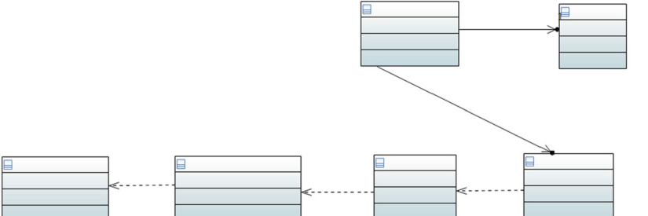

# Evaluation of Automotive Software Architectures

**Abstract** In this chapter we introduce methods for assessing the quality of software architectures and we discuss one of the techniques—ATAM. We discuss the nonfunctional properties of automotive software and we review the methods used to assess such properties as dependability, robustness and reliability. We follow the ISO/IEC 25000 series of standards when discussing these properties. In this chapter we also address the challenges related to the integration of hardware and software and the impact of this integration. We review differences with stand-alone desktop applications and discuss examples of these differences. Towards the end of the chapter we discuss the need to measure these properties and introduce the need for software measurement.

> **摘要**在本章中，我们介绍了**评估软件体系结构质量的方法，并讨论了其中一种技术 - ATAM**。我们讨论汽车软件的非功能性能，并回顾用于评估可靠性，鲁棒性和可靠性等属性的方法。讨论这些属性时，我们遵循 ISO/IEC 25000 系列标准。在本章中，我们还解决了与硬件和软件集成以及该集成的影响有关的挑战。我们回顾了独立桌面应用程序的差异，并讨论了这些差异的示例。在本章结束时，我们讨论了测量这些属性并介绍软件测量的需求的必要性。

## Introduction

Having the architecture in place, as we discussed in Chap. [2](#_bookmark54), is a process which requires a number of steps and revisions of the architecture. As the evolution of the architecture is a natural step, it is often guided by some principles. In this chapter we look into aspects which drive the evolution of the architectures—non-functional requirements and architecture evaluation methods.

> 正如我们在 Chap 中讨论的那样，建立了架构。[2](#_bookmark54) 是一个过程，它需要架构的许多步骤和修订。由于体系结构的演变是自然的一步，因此通常以某些原则为指导。在本章中，我们研究了驱动体系结构演变的方面 - 无功能要求和体系结构评估方法。

During this process the architects take a number of decisions about their architecture—starting from the basic one on what style should be used in which part of the architecture and ending in the one on the distribution of signals over the car’s communication buses. All of these evaluations lead to a better or worse architecture and in this chapter we focus on the question that each software architect confronts—_How good is my architecture?_

> 在此过程中，架构师对其架构做出了许多决定，从基本的决定开始，介绍了在架构的哪个部分中使用哪种样式，并以汽车通信总线上的信号分发为止。所有这些评估都会导致更好或更糟的体系结构，在本章中，我们关注的是**每个软件架构师面对的问题 - _我的体系结构有多好？**__

Although the question is rather straightforward, the answer to it is rather complicated, because the answer to it depends on a number of factors. The major complication is related to the need to balance all of these factors. For example, the performance of the software needs to be balanced with the cost of the system, the extensibility needs to be balanced with the reliability and performance, etc. Since the size of the software system is often large the question whether the architecture is optimal, or even good enough, requires an organized way of evaluating the architecture.

> 尽管问题相当简单，但答案非常复杂，因为答案取决于许多因素。主要的并发症与平衡所有这些因素有关。例如，该软件的性能必须与系统成本保持平衡，因此，可扩展性需要与可靠性和性能等等。，甚至足够好，需要一种有组织的方法来评估架构。

In Chap. [3](#_bookmark154) we discussed the notion of a requirement as a customer demand on the functionality of the software and the need for the fulfillment of certain quality attributes. In this chapter we dive deeper into the question—_What quality attributes are important for the automotive software architectures?_and _How do we evaluate that an architecture fulfills these requirements?_

> 在第一章中。[3](#_bookmark154) 我们讨论了需求的概念，因为客户对软件功能的需求以及满足某些质量属性的需求。在本章中，我们更深入地研究了问题 - _哪些质量属性对于汽车软件体系结构很重要？

To answer the first question we review the newest software engineering standard in the area of product quality—ISO/IEC 25023 (Software Quality Requirements and Evaluation—Product Quality, [[ISO16b](#_bookmark544)]). We look into the construction of the standard and focus on how software quality is described in this standard, with the particular focus on product quality.

> 为了回答第一个问题，我们回顾了产品质量领域的最新软件工程标准 - ISO/IEC 25023(软件质量要求和评估 - 产品质量，[ISO16B](#_bookmark544)])。我们研究了标准的构建，并重点介绍了该标准中如何描述软件质量的方式，并特别关注产品质量。

To answer the second question about the evaluation of architectures, we look into one of the techniques for evaluating quality of software architectures—Architecture Trade-off Analysis Method (ATAM), which is one of the many techniques for assessing quality of software architectures.

> 为了回答有关体系结构评估的第二个问题，我们研究了评估软件体系结构质量的技术之一，即架构权衡分析方法(ATAM)，这是评估软件体系结构质量的众多技术之一。

So, let us dive deeper into the question of what software quality is and how it is defined in modern software engineering standards.

> 因此，让我们更深入地了解哪种软件质量以及如何在现代软件工程标准中定义的问题。

## ISO/IEC 25000 Quality Properties

One of the main standards in the area of software quality is the ISO/IEC 25000 series of standards—Software Quality Requirements and Evaluation (SQuaRE) [[ISO16a](#_bookmark543)]. The standard is an extension of the old standard in the same area—ISO/IEC 9126 [[OC01](#_bookmark549)]. Historically, the view of the software quality concept in ISO/IEC 9126 was divided into a number of sub-areas such as reliability or correctness. This view was found to be too restrictive as the quality needs to be related to the context of the product—its requirements, operating environment and measurement. Therefore, the new ISO/IEC 25000 series of standards is more extensive and has a modular architecture with a clear relation to other standards. An overview of the main quality attributes, grouped into quality characteristics, is presented in Fig. [8.1](#_bookmark496). The dotted line shows a characteristic which is not part of the ISO/IEC 25000 series, but another standard—ISO/IEC 26262 (Road Vehicles—Functional Safety).

> 软件质量领域的主要标准之一是 ISO/IEC 25000 系列标准 - 软件质量要求和评估(Square)[[ISO16A](#_bookmark543)]。该标准是同一区域中旧标准的扩展-ISO/IEC 9126 [[OC01](#_bookmark549)]。从历史上看，ISO/IEC 9126 中软件质量概念的观点被分为许多次级区域，例如可靠性或正确性。发现这种观点过于限制，因为质量需要与产品的环境(要求，操作环境和测量)相关。因此，新的 ISO/IEC 25000 系列标准更为广泛，并且具有与其他标准有明确关系的模块化体系结构。图 [8.1](#_bookmark496) 列出了主要质量属性的概述，分为质量特征。虚线显示了一个不属于 ISO/IEC 25000 系列的特征，而是另一个标准，即 ISO/IEC 26262(道路车辆 - 功能安全性)。

These quality characteristics describe various aspects of software quality, such as whether it fulfills the functions described by the requirements correctly (functionality) and whether it is easy to maintain (maintainability). However, for safety-critical systems like the software system of a car, the most important part of the quality model is actually the reliability part, which defines the reliability of a software system, such as _Degree to which a system, product or component performs specified functions under specified conditions for a specified period of time_[[ISO16b](#_bookmark544)].

> 这些质量特征描述了软件质量的各个方面，例如它是否可以正确地满足要求正确描述的功能(功能性)以及是否易于维护(可维护性)。但是，对于诸如汽车的软件系统之类的安全至关重要系统，质量模型的最重要部分实际上是可靠性部分，它定义了软件系统的可靠性，例如 *DEGREE，系统，产品或组件执行该软件系统的可靠性指定条件下指定的条件的指定功能*[[ISO16B](#_bookmark544)]。

<**Fig. 8.1** ISO/IEC 25000 quality attributes

### _Reliability_

Reliability of a software system in common understanding is the ability of the system to work according to the specification during a period of time [[RSB+13](#_bookmark551)]. This characteristic is important as car’s computer system, including software, has to be in operation for years after its manufacturing. The ability to `reset` the car’s computer system is very limited as it needs to operate constantly, controlling the powertrain, brakes, and safety mechanisms.

> 软件系统的共同理解的**可靠性是系统在一段时间内根据规范工作的能力**[[RSB + 13](#_bookmark551)]。这种特征很重要，因为汽车的计算机系统(包括软件)必须在其制造后多年运行。`重置` 汽车的计算机系统的能力非常有限，因为它需要不断运行，控制动力总成，制动器和安全机制。

Reliability is a generic quality characteristics and contains four subcharacteristics as shown in Fig. [8.2](#isoiec-25000-quality-properties)—maturity, availability, recoverability and fault tolerance.

> 可靠性是一种通用的质量特征，包含四个子特征，如图[8.2](#isoiec-25000 质量特性)所示——**成熟度、可用性、可恢复性和容错性**。

Maturity is defined as _degree to which a system, product or component meets needs for reliability under normal operation_. The concept defines how the software operates over time, i.e. how many failures the software has over time, which is often shown as a curve of the number of defects over time; see Fig. [8.2](#_bookmark498) from [[RSM+13](#_bookmark553)] and [[RSB+16](#_bookmark552)].

> 成熟度定义为系统、产品或组件在正常运行下满足可靠性需求的程度。该概念定义了软件如何随时间运行，即软件随时间发生了多少故障，这通常表现为缺陷数量随时间的变化曲线；参见[[RSM+13](#_bookmark553)]和[[RSB+16](#_bbookmark552)]中的图 [8.2](#_backmark498)。

The figure shows that the number of faults discovered during the design and operation of the software system can have different shapes depending on the type of development, type of the functionality being developed and the time of the lifecycle of the software. The type of development (discussed in Chap. [3](#_bookmark154)) determines how and when the software is tested and the testing determines the type of faults that are discovered—e.g. the late testing phases often uncovers more severe defects, while the early testing phases can isolate simpler defects that can be fixed easily. Flattening of the curve towards the end of the development shows that the maturity of the system is higher as the number of defects found gets lower—the software is ready for its release and deployment.

> 该图显示，在软件系统的设计和运行过程中发现的故障数量可以根据开发类型、正在开发的功能类型和软件生命周期的时间而具有不同的形状。开发类型(在第[3]章(#_bookmark154)中讨论)决定了软件测试的方式和时间，测试决定了发现的故障类型——例如，后期测试阶段通常会发现更严重的缺陷，而早期测试阶段可以隔离更简单的缺陷，这些缺陷可以很容易地修复。在开发结束时，曲线变平表明，随着发现的缺陷数量越来越少，系统的成熟度越高，软件已准备好发布和部署。

<**Fig. 8.2** Reliability growth of three different software systems in the automotive domain

Another sub-characteristic of reliability is the availability of the system, which is defined as _degree to which a system, product or component is operational and accessible when required for use_. The common sense of this definition is the ability of the system to be used when needed, which can be seen as a momentary property. High availability systems do not need to be available over time, all the time, but they need to be available when needed. This means that these systems can be restarted often and the property of `downtime` is not as important as for faulttolerant systems which should be available all the time (e.g. 99.999% of the time, which is ca. 4 min of downtime per year).

> 可靠性的另一个子特征是系统的可用性，它被定义为系统、产品或组件在需要使用时可操作和可访问的程度。这个定义的常识是系统在需要时使用的能力，这可以被视为一种瞬时特性。高可用性系统不需要随时可用，但需要在需要时可用。这意味着这些系统可以经常重新启动，`停机时间` 的性质不像容错系统那样重要，容错系统应始终可用(例如 99.999% 的时间，即每年约 4 分钟的停机时间)。

Recoverability is defined as _Degree to which, in the event of an interruption or a failure, a product or system can recover the data directly affected and reestablish the desired state of the system_. This quality property is often quoted in the research on self-\* systems (e.g. self-healing, self-adaptive, self-managing) where the software itself can adjust its structure in order to recover from failure. In the automotive domain, however, this is still in the research phase as the mechanisms of self-\* often should be formally proven that the transition between states is safe. The only exception is the ability of the system to restart itself, which has been used as a `last resort` mechanism for tackling failures.

> 可恢复性定义为在发生中断或故障时，产品或系统可以恢复直接受影响的数据并重新建立系统所需状态的程度。这种质量特性经常被引用在自修复系统(例如，自我修复、自适应、自我管理)的研究中，软件本身可以调整其结构以从故障中恢复。然而，在汽车领域，这仍处于研究阶段，因为自我机制通常应正式证明状态之间的转换是安全的。唯一的例外是系统自行重启的能力，这被用作解决故障的 `最后手段` 机制。

Fault tolerance is defined as _degree to which a system, product or component operates as intended despite the presence of hardware or software faults_. This property is very important as the car’s software consists of hundreds of software components distributed over tens of ECUs communicating over a few buses— something is bound to go wrong in this configuration. Therefore we discuss this property separately in the next section.

> 容错定义为：尽管存在硬件或软件故障，系统、产品或组件仍按预期运行的程度。这一特性非常重要，因为汽车的软件由数百个软件组件组成，这些组件分布在数十个 ECU 上，通过几条总线进行通信-这种配置中肯定会出现问题。因此，我们将在下一节中单独讨论此属性。

<**Fig. 8.3** Engine check control light indicating reduced performance of the powertrain, Volvo XC70

### _Fault Tolerance_

Fault tolerance, or robustness is a concept of _the degree to which a computer system can operate in the presence of errors_[[SM16](#_bookmark556)]. Robustness is important as the software system of a car needs to operate, sometimes with reduced functionality, even if there are problems (or errors) during runtime.

> 容错性或鲁棒性是计算机系统在出现错误时可以运行的程度的概念。[[SM16](#_bookmark556)]。鲁棒性很重要，因为汽车的软件系统需要运行，有时功能会降低，即使在运行时出现问题(或错误)。

A common manifestation of the robustness of the car is the ability to operate with reduced functionality when the diagnostics system indicates a problem with, for example, the powerline. In many modern cars the diagnostics system can detect problems with the exhaust system and reduce the power of the engine (degradation of the functionality), but still enable the operation of the car. The driver is only notified by a control lamp on the instrument panel as in Fig. [8.3](#_bookmark499).

> 汽车鲁棒性的一个常见表现是，当诊断系统指示例如电力线有问题时，能够以降低的功能运行。在许多现代汽车中，诊断系统可以检测排气系统的问题，并降低发动机的功率(功能退化)，但仍能使汽车运行。如图 [8.3](#_bookmark499) 所示，驾驶员只能通过仪表板上的控制灯进行通知。

As the figure shows, the software system (the diagnostics) has detected the problem and has taken action to allow the driver to continue the journey—which shows high robustness to failures.

> 如图所示，软件系统(诊断)已经检测到了问题，并采取了行动以使驾驶员继续旅程 - 这表现出很高的稳健性。

### _Mechanisms to Achieve Reliability and Fault Tolerance_

The traditional ways of achieving fault tolerance are often found on the lower levels of system design—hardware level. The ECUs used in the computer system can rely on hardware redundancy and fail-safe takeover mechanisms in order to ensure the operation of the system in the presence of faulty component. However, this approach is often non-feasible in the car’s software as the electrical system of the car cannot be duplicated and hardware redundancy is not possible. Instead, the designers of the software systems usually rely on substituting data from different sensors in order to obtain the same (or similar) information once one of the components fails.

> 实现容错的传统方法通常位于系统设计硬件级别的较低级别。计算机系统中使用的 ECU 可以依赖硬件冗余和故障安全接管机制，以确保在存在故障部件的情况下系统的运行。然而，这种方法在汽车的软件中通常是不可行的，因为汽车的电气系统不能复制，硬件冗余也不可能。相反，软件系统的设计者通常依赖于替换来自不同传感器的数据，以便在其中一个组件发生故障时获得相同(或类似)信息。

One of the main mechanisms used in modern software is the mechanism of _graceful degradation_. Shelton and Koopman [[SK03](#_bookmark555)] define graceful degradation as _a measure of the system’s ability to provide its specified functional and nonfunctional capabilities_. They show that a system that has all of its components functioning properly has maximum utility and `losing` one or more components leads to reduced functionality. They claim that `a system degrades gracefully if individual component failures reduce system utility proportionally to the severity of aggregate failures.` For the architecture, this means that the following decisions need to be prioritized:

> 现代软件中使用的主要机制之一是快速退化机制。谢尔顿和库普曼[[SK03](#_bookmark555)]将优雅的降级定义为系统提供其指定功能和非功能能力的一种衡量标准。他们表明，一个所有组件都正常运行的系统具有最大效用，而 `丢失` 一个或多个组件会导致功能降低。他们声称，`如果单个组件的故障与总故障的严重程度成比例地降低了系统的效用，那么系统就会优雅地退化。` 对于架构，这意味着需要优先考虑以下决策：

- No single point of failure—this means that no component should be exclusively dependent on the operation of another component. Service-oriented architectures and middleware architectures often do not have a single point of failure.

> - 没有单个故障 - 这意味着不应仅应仅取决于另一个组件的操作。面向服务的体系结构和中间件架构通常没有单点故障。

- Diagnosing the problems—the diagnostics of the car should be able to detect malfunctioning of the components, so mechanisms like heartbeat synchronization should be implemented. The layered architectures support the diagnostics functionality as they allow us to build two separate hierarchies—one for handling functionality and one for monitoring it.

> - **诊断问题** - 汽车的诊断应该能够检测到组件的故障，因此应实施诸如心跳同步之类的机制。分层体系结构支持诊断功能，因为它们使我们能够构建两个单独的层次结构 - 一个用于处理功能的层次结构，另一种用于监视它。

- Timeouts instead of deadlocks—when waiting for data from another component, the component under operation should be able to abort its operation after a period of time (timeout) and signal to the diagnostics that there was a problem in the communication. Service-oriented architectures have built-in mechanisms for monitoring timeouts.

> - 超时而不是僵局(等待来自另一个组件的数据时，操作中的组件应该能够在一段时间(超时)后流产其操作，并向诊断信号发出通信中存在问题的信号。面向服务的体系结构具有用于监视超时的内置机制。

Prioritizing such decisions should lead to an architecture where a single failure in a component leaves the entire system operational and signals the need for manual intervention (e.g. workshop visit to replace a faulty component).

> 确定此类决策的优先级应导致一个架构，其中组件中的单个故障使整个系统运行并表示需要手动干预的需求(例如，访问研讨会以替换有缺陷的组件)。

A design principle to achieve fault-tolerant software is to use programming mechanisms which reduce the risk of both design and runtime errors, such as:

> 实现容忍故障软件的设计原理是使用编程机制，以降低设计和运行时错误的风险，例如：

- using static variables when programming—using static variables rather than variables allocated dynamically on the heap allows taking advantage of atomic write/read operations; when addressing a memory dynamically on the heap the read/write operation requires at least two steps (read the memory address, write/read to the address), which can pose threats when using multithreaded programs or interrupts.

> - **在编程时使用静态变量** - 使用静态变量而不是在堆上动态分配的变量可以利用原子写入/读取操作；当在堆上动态地解决内存时，读/写操作至少需要两个步骤(读取内存地址，写入/读取地址)，在使用多线程程序或中断时，这可能会构成威胁。

- using safety bits for communication—any type of communication should include the so-called safety bits and checksums in order to prevent operation of software components based on faulty inputs and thus failure propagation.

> - 使用安全位进行通信 - 任何类型的通信都应包括所谓的安全位和校验和校验和，以防止基于故障输入的软件组件操作，从而导致失败传播。

1. Architecture Evaluation Methods 195 The automotive industry has adopted the MISRA-C standard, where the details of the design of computer programs in C programming language [[A+08](#_bookmark534)], which has been discussed in more detail in the previous chapter.

> 1.体系结构评估方法 195 汽车行业采用了 Misra-C 标准，其中 C 编程语言中计算机程序设计的详细信息[[[a + 08](#_bookmark534)]，在上一章中对此进行了详细讨论。

However, since the architecture of the software is an artifact that is abstract and cannot be tested, the evaluation of the architecture needs to be done based on its description as a model and often manually.

> 但是，由于该软件的体系结构是一个抽象且无法测试的工件，因此需要根据其描述作为模型并经常手动进行体系结构的评估。

## Architecture Evaluation Methods

> [!note]
> 当我深入到控制领域中的时候，我越来越发现编写高质量软件的重要性
> 这也是我暂时转向到计算机技术领域的原因之一
> 另外，这个自动驾驶领域与控制理论也有十足的相关性，有纵向扩展的机会
> 同时在横向扩展方面也有很多的机会，可能还可以回到机器人技术中去

In our discussion of the quality of the system we highlighted the need to balance different quality characteristics against each other. This balancing needs to be evaluated and therefore we look into an example software architecture evaluation technique.

> 在讨论系统质量时，我们强调了需要**平衡彼此不同质量特征的必要性**。需要评估这种平衡，因此我们研究了一种示例软件体系结构评估技术。

The goals behind evaluating architectures can differ from case to case, from the general understanding of the architectural principles to the exploration of specific risks related to software architectures. Let us explore what kinds of architecture analysis methods are the most popular today and why.

> 从对架构原理的一般理解到对与软件架构相关的特定风险的探索，评估体系结构背后的目标可能有所不同。让我们探索当今最受欢迎的架构分析方法以及原因。

Techniques used for analysis of architectures, as surveyed by Olumofin [[OM05](#_bookmark550)]:

> Olumofin [[OM05](#_bookmark550)] ]的研究，**用于架构分析的技术**：

1. Failure Modes and Effects Analysis (FMEA)—a method to analyze software designs (including the architecture) from the perspective of risk of failures of the system. This method is one of the most generic ones and can come either in fully qualitative form (based on expert analysis) or as a combination of qualitative expert analysis and quantitative failure analysis using mathematical formulas for failure modelling.

> 1.故障模式和效果分析(FMEA) - 一种从系统故障风险的角度分析软件设计(包括体系结构)的方法。该方法是最通用的方法之一，可以完全定性形式(基于专家分析)或使用数学公式进行故障建模的定性专家分析和定量失败分析的组合。

2. Architecture Trade-off Analysis Method (ATAM)—a method to evaluate software architectures from the perspective of the quality goals of the system. ATAM, based on expert-based reviews of the architecture from the perspective of scenarios (more about it later in this chapter).

> 2.体系结构权衡分析方法(ATAM) - 一种从系统质量目标的角度评估软件体系结构的方法。ATAM，基于从方案的角度对架构的基于专家的评论(在本章后面稍后有关)。

3. Software Architecture Analysis Method (SAAM)—a method which is seen as a precursor to ATAM is based on the evaluation of software architectures from the perspective of different types of modifiability, portability and extendability. This method has multiple variations, such as: SAAM Founded on Complex Scenarios (SAAMCS), Extending SAAM by Integration in the Domain (ESAAMI) and Software Architecture Analysis Method for Evolution and Reusability (SAAMER).

> 3.软件体系结构分析方法(SAAM) - 一种被视为 ATAM 的先驱的方法基于对软件体系结构的评估，从不同类型的可修改性，可移植性和可扩展性的角度来看。该方法具有多种变化，例如：SAAM 建立在复杂的 SCE-Narios(SaAMC)上，通过集成在域(ESAAMI)(ESAAMI)中扩展 SAAM，以及用于进化和可重复使用性(Saamer)的软件体系结构分析方法。

4. Architecture Level Modifiability Analysis (ALMA)—a method for evaluating the ability of the software architecture to withstand continuous modifications, [[BLBvV04](#_bookmark537)].

> 4.体系结构级别可修改性分析(ALMA) - 一种评估软件体系结构承受连续修改能力的方法，[[BLBVV04](#_bookmark537)]。

<**Fig. 8.4** Parking assistance camera showing the view behind the car while backing up, Volvo XC70

The above evaluation methods constitute an important method portfolio for software architects who need to make judgements about the architecture of the system before the system is actually implemented. It seems like a straightforward task, but in reality it requires skills and experience to be performed correctly.

> 上面的评估方法构成了一个重要的方法组合，对于需要在系统实现系统实施之前需要对系统架构进行判断的软件架构师。这似乎是一项简单的任务，但实际上，它需要正确执行技能和经验。

An example of the need for skills and experiences is the evaluation of the performance of the system before it is implemented. When designing the software system in cars the performance of the communication channels is often a bottleneck—the bandwidth of the CAN bus is usually limited. Therefore adding new, bandwidthgreedy components and functions requires analysis of both the scenario of using the function in question and the entire system. A simple case is the function of providing a camera video feed from the back of the car when backing-up—used in the majority of premium segment cars today. Figure [8.4](#_bookmark503) shows this function on the instrument panel.

> 对技能和经验的需求的一个例子是在实施系统之前对系统的表现进行评估。在汽车中设计软件系统时，通信渠道的性能通常是瓶颈 - 罐头总线的带宽通常受到限制。因此，添加新的，带宽的贪婪组件和功能需要分析使用相关函数和整个系统的方案。一个简单的案例是在备份时从汽车后部提供相机视频供稿的功能 - 如今大多数高级段汽车。图 [8.4](#_bookmark503) 在仪器面板上显示了此功能。

When adding the camera to the electrical system the amount of data transmitted from the back of the car to the front of the car increases dramatically (depending on the resolution of the camera, it could be up to 1Mbit/s). Since the data is to be transmitted in real time the communication bus must constantly prioritize between the video feed data and the signals from such sensors as parking assist sensors.

> 将摄像头添加到电气系统时，从汽车后部传输到汽车正面的数据量会急剧增加(取决于相机的分辨率，可能高达 1Mbit/s)。由于要实时传输数据，因此通信总线必须在视频供稿数据与诸如停车辅助传感器之类的传感器的信号之间不断优先级。

In this scenario the architects need to answer the question—will it be possible to add the camera component to the electrical system without jeopardizing such safety critical functions as park assist?

> 在这种情况下，**架构师需要回答这个问题 - 是否可以将摄像机组件添加到电气系统中，而不会损害公园辅助等此类安全关键功能？**

## ATAM

ATAM has been designed as a response to the need of the American Department of Defense in the 1990s to be able to evaluate the quality of software systems in their early development stage (i.e. before the system is implemented). The origins of ATAM are at the Software Engineering Institute, in the publication of Kazman et al. [[KKB+98](#_bookmark545)]. The ATAM method, which can be used to answer this question is based on [[KKC00](#_bookmark546)]:

> **ATAM 被设计为对 1990 年代美国国防部的需求的回应**，以便能够在早期开发阶段评估软件系统的质量(即在实施系统之前)。ATAM 的起源是在 Kazman 等人出版的软件工程学院。[[KKB + 98](#_bookmark545)]。可以用来回答此问题的 ATAM 方法基于[[KKC00](#_bookmark546)] ]：

The Architecture Tradeoff Analysis Method (ATAM) is a method for evaluating software architectures relative to quality attribute goals. ATAM evaluations expose architectural risks that potentially inhibit the achievement of an organization’s business goals. The ATAM gets its name because it not only reveals how well an architecture satisfies particular quality goals, but it also provides insight into how those quality goals interact with each other and how they trade off against each other.

> 体系结构权衡分析方法(ATAM)是一种相对于质量属性目标评估软件体系结构的方法。ATAM 评估暴露了架构风险，可能会抑制组织业务目标的实现。ATAM 之所以获得其名称，是因为它不仅揭示了架构如何满足特定质量目标的程度，而且还提供了有关这些质量目标如何相互相互作用以及它们如何相互交易的见解。

As stressed in the above definition, the method relates the system to its quality, i.e. non-functional requirements on its performance, availability, reliability (fault tolerance) and other quality characteristics of ISO/IEC 25000 (or any other quality model).

> 如上所述，该方法将系统与其质量相关联，即对其性能，可用性，可靠性(容错)和 ISO/IEC 25000(或任何其他质量模型)的其他质量特征的非功能要求。

### _Steps of ATAM_

ATAM is a stepwise method which is similar to reading techniques used in software inspections (e.g. perspective-based reading [[LD97](#_bookmark547)] or checklist-based reading [[TRW03](#_bookmark557)]). The steps are as follows (after [[KKC00](#_bookmark546)]).

> ATAM 是一种逐步方法，类似于软件检查中使用的阅读技术(例如，基于透视的读数[[ld97](#_bookmark547)]或基于清单的阅读[[trw03](#_kmark557)])。步骤如下([[KKC00](#_bookmark546)] ])。

Step 1: Present ATAM. In this step the architecture team presents the ATAM method to the stakeholders (architects, designers, testers and product managers). The presentation should explain the principles of the evaluation, evaluation scenarios and its goal (e.g. which quality characteristics should be prioritized).

> 步骤 1：现在的 ATAM。在此步骤中，架构团队向利益相关者(架构师，设计师，测试人员和产品经理)提供了 ATAM 方法。演讲应解释评估，评估方案及其目标的原则(例如，应优先考虑哪些质量特征)。

Step 2: Present business drivers. After presenting the purpose of the evaluation, the purpose of the business behind this architecture is presented. Topics covered in this step should include: (1) the main functions of the system (e.g. new car functions), (2) the business drivers behind these functions and their optionality (e.g. which functions are to be included in all models and which should be optional), business case behind the architecture and its main principles (e.g. performance over extendability, maintainability over cost).

> 步骤 2：目前的业务驱动力。在介绍了评估的目的之后，介绍了该体系结构背后的业务目的。此步骤中涵盖的主题应包括：(1)系统的主要功能(例如新车功能)，(2)这些功能背后的业务驱动程序及其选项(例如，所有功能都应包含在所有模型中，哪些功能应应可选)，架构背后的业务案例及其主要原则(例如，可扩展性，可维护性超过成本)。

Step 3: Present architecture. The architecture should be presented in a sufficient level of detail to make the evaluation. The designers of the ATAM method do not propose a specific level of detail, but it is customary that the architects guide the reading of the architecture model—show where to start and where to stop reading the architecture model.

> 步骤 3：当前体系结构。该体系结构应以足够的细节介绍以进行评估。ATAM 方法的设计师没有提出特定的细节级别，但是习惯上，架构师指导架构模型的阅读 - 展示从哪里开始以及在哪里停止阅读体系结构模型。

Step 4: Identify architectural approaches. In this step the architects introduce the architectural styles to the analysis team and present the high-level rationale behind these approaches.

> 步骤 4：确定架构方法。在此步骤中，架构师向分析团队介绍了架构风格，并介绍了这些方法背后的高级原理。

Step 5: Generate quality attribute utility tree. In this step, the evaluation team constructs the system utility measure tree by combining the relevant quality factors, specified with scenarios, stimuli and responses.

> 步骤 5：生成质量属性实用树。在此步骤中，评估团队通过将相关质量因素(用方案，刺激和响应指定的相关质量因素组合在一起)来构建系统实用程序测量树。

Step 6: Analyze architectural approaches. This is the actual evaluation step where the evaluation team explores the architecture by studying the prioritized scenarios from step 5 and architectural approaches which address these scenarios and their corresponding quality characteristics. This step results in identifying architectural risks, sensitivity points, and tradeoff points.

> 步骤 6：分析架构方法。这是实际的评估步骤，评估团队通过研究步骤 5 的优先级方案和架构方法来探索架构，这些方案及其相应的质量特征及其相应的质量特征。此步骤导致确定架构风险，敏感性点和权衡点。

Step 7: Brainstorm and prioritize scenarios. After the initial analysis of the architectural approaches is done, there is a lot of scenarios and sensitivity points elicited from the evaluation team. Therefore they need to be prioritized to guide the further analysis of the architecture. The 100 dollar technique, planning game and analytical-hierarchy-process are useful prioritization techniques at this stage. Step 8: Analyze architectural approaches. In this step the team reiterates the analysis from step 6 with a focus on the highly prioritized scenarios from step 7.

> 步骤 7：集思广益并确定场景的优先级。在对架构方法进行初步分析后，评估团队会引起许多场景和敏感性点。因此，他们需要优先考虑对体系结构的进一步分析。在此阶段，100 美元的技术，计划游戏和分析层次制过程是有用的优先级技术。步骤 8：分析架构方法。在此步骤中，团队重申步骤 6 的分析，重点是步骤 7 的高度优先级方案。

The result is again the list of risks, sensitivity points and trade-off points.

> 结果再次是风险，敏感点和权衡点的清单。

Step 9: Present results. After the analysis the team compiles and presents a report about the found risks, sensitivity points, non-risks and tradeoffs in the architecture.

> 步骤 9：目前的结果。分析后，团队汇编并介绍了有关在体系结构中发现的风险，灵敏度，非风险和权衡的报告。

The results of the analysis can only be as good as the input to the analysis, i.e. the quality of the architecture documentation (its completeness and correctness), the quality of the scenarios, the templates used in the analysis and the experience of the evaluation team.

> 分析结果只能与分析的输入一样好，即体系结构文档的质量(其完整性和正确性)，场景的质量，分析中使用的模板和评估团队的经验。

### _Scenarios Used in ATAM in Automotive_

ATAM is an extensible method which allows us to identify scenarios by the evaluation team, which is strongly encouraged. In this chapter we present a set of inspirational scenarios to guide the evaluation team. Our example set is based on the example set of scenarios presented by Bass et al. [[BM+01](#_bookmark538)] and in this chapter we present a set of scenarios important for the evaluation of automotive software.

> **ATAM 是一种可扩展的方法**，它使我们能够通过评估团队来识别场景，这受到强烈鼓励。在本章中，我们介绍了一组鼓舞人心的场景，以指导评估团队。我们的示例集基于 Bass 等人提出的场景示例集。[[BM + 01](#_bookmark538)]在本章中，我们提供了一组对于评估汽车软件的方案。

We present them in generic terms and in compact textual format. We group them according to quality characteristics, following the approach presented by Bass et al.

> 我们以通用术语和紧凑的文本格式呈现它们。根据 Bass 等人提出的方法，我们根据质量特征对它们进行分组。

###### Modifiability

We start with the set of scenarios which date back to the origins of ATAM and address one of the main challenges for the work of the software architects—How extendable and modifiable is our architectural design?

> 我们从可以追溯到 ATAM 的起源的一组场景开始，并解决了软件架构师工作的主要挑战之一 - 我们的架构设计是如何扩展和修改的？

It is worth noting that some of the scenarios impact the design (or the internal quality) of the product and some impact the external quality. The modifiability scenarios impact the internal quality of the product.

> 值得注意的是，某些场景影响了产品的设计(或内部质量)，有些情况会影响外部质量。可修改性方案会影响产品的内部质量。

Scenario 1: A request arrives to change the functionality of the system. The change can be to add new functionality, to modify existing functionality, or to delete functionality [[BM+01](#_bookmark538)].

> 方案 1：A 请求到达更改系统功能的请求。更改可以是添加新功能，修改现有功能，或删除功能[[BM + 01](#_bookmark538)]。

Scenario 2: A request arrives to change one of the components (e.g. because of a technology shift); the scenario needs to consider the change propagation to the other components.

> 方案 2：一个请求到达更改其中一个组件(例如，由于技术转移)；该方案需要考虑对其他组件的变化传播。

Scenario 3: Customer wants different systems with different capabilities but using the same software and therefore advanced variability has to be built into the system [[BM+01](#_bookmark538)].

> 方案 3：客户需要具有不同功能的不同系统，但使用相同的软件，因此必须在系统中内置高级可变性[[BM + 01](#_bookmark538)]。

Scenario 4: New emission laws: the constantly changing environmental laws require adaptation of the system to decrease its environmental impact [[BM+01](#_bookmark538)].

> 方案 4：新的排放法：不断变化的环境法需要对系统进行适应，以减少其环境影响[[[BM + 01](#_bookmark538)]。

Scenario 5: Simpler engine models: Replace the engine models in the software with simple heuristics for the low-cost market [[BM+01](#_bookmark538)].

> 方案 5：更简单的引擎模型：用低成本市场的简单启发式替换软件中的引擎模型[[BM + 01](#_bookmark538)]。

Scenario 6: An additional ECU is added to the vehicle’s network and causes new messages to be sent through the existing network. In the scenario we need to understand how the new messages impact the performance of the entire system. Scenario 7: An existing ECU after the update adds a new message type: same messages but with additional fields that we are currently not set up to handle (based on [[BM+01](#_bookmark538)]).

> 方案 6：将额外的 ECU 添加到车辆的网络中，并导致通过现有网络发送新消息。在这种情况下，我们需要了解新消息如何影响整个系统的性能。方案 7：更新后现有的 ECU 添加了新消息类型：相同消息，但使用当前未设置的其他字段(基于[[BM + 01](#_bookmark538))])。

Scenario 8: A new AUTOSAR version is adopted and requires update of the base software. We need to understand the impact of the new version in terms of the number of required modifications to the existing components.

> 方案 8：采用新的 AutoSar 版本，需要更新基本软件。我们需要根据所需的修改对现有组件的数量来了解新版本的影响。

Scenario 9: Reduce memory: During development of an engine control, the customer demands we reduce costs by downsizing the flash-ROM on chip (adapted from [[BM+01](#_bookmark538)]). We need to understand what the impact of this reduction is on the system performance.

> 方案 9：减少内存：在开发发动机控制期间，Customer 要求我们通过缩小芯片上的闪光灯来降低成本(改编自[[BM + 01](#_kmark538)])。我们需要了解这种减少的影响对系统性能的影响。

Scenario 10: Continuous actuator: Changing two-point (on/off) actuators to continuous actuators within 1 month (e.g., for the EGR or purge control valve). We need to understand the impact of this change on the behavior of our models [[BM+01](#_bookmark538)].

> 方案 10：连续执行器：在 1 个月内将两点(开/关)执行器更改为连续执行器(例如，对于 EGR 或清除控制阀)。我们需要了解这种变化对模型行为的影响[[BM + 01](#_bookmark538)]。

Scenario 11: Multiple engine types in one car need to coexist: hybrid engine. We need to understand how to adapt the electrical system and isolate the safetycritical functions from the non-safety-critical ones.

> 方案 11：一辆汽车中的多种发动机类型需要共存：混合引擎。我们需要了解如何适应电气系统并将安全性功能与非安全关键功能隔离。

###### Availability and Reliability

Availability and reliability scenarios impact the external quality of the product— allow us to reason about the potential defects which come from unfulfilled performance requirements (non-functional requirements).

> 可用性和可靠性方案会影响产品的外部质量 - 使我们能够理解来自未实现的穿孔要求(非功能性要求)的潜在缺陷。

Scenario 12: A failure occurs and the system notifies the user; the system may continue to perform in a degraded manner. What graceful degradation mechanisms exist? (based on [[BM+01](#_bookmark538)]).

> 方案 12：发生故障，系统通知用户；该系统可能会继续以退化的方式执行。存在哪些优美的降解机制？(基于[[BM + 01](#_bookmark538)])。

Scenario 13: Detect software errors existing in third-party or COTS software integrated into the system to perform safety analysis [[BM+01](#_bookmark538)].

> 方案 13：检测第三方或 COTS 软件中存在的软件错误，集成到系统中以执行安全分析[[BM + 01](#_bookmark538)]。

###### Performance

Performance scenarios also impact the external quality of the product and allow us to reason about the ability of the system to fulfill performance requirements.

> 性能方案还会影响产品的外部质量，并使我们能够理解系统满足性能要求的能力。

Scenario 14: Start the car and have the system active in 5 s (adapted from [[BM+01](#_bookmark538)]).

> 方案 14：启动汽车，并在 5 s 中使系统活动(改编自[[BM + 01]](#_bookmark538)])。

> [!note]
> 这里给出来的两点，感觉就可以对应上现在港口车上的问题
> 整车上电的时候，网络中有较多的中断和负载

Scenario 15: An event is initiated with resource demands specified and the event must be completed within a given time interval [[BM+01](#_bookmark538)].

> 方案 15：指定的资源要求启动事件，必须在给定时间间隔[[BM + 01](#_bookmark538)]中完成事件。

Scenario 16: Using all sensors at the same time creates congestion and this causes

> 方案 16：同时使用所有传感器会产生拥塞，这是原因

loss of safety-critical signals.

> 损失安全 - 关键信号。

###### Developing Custom Scenarios

It is natural that during an ATAM assessment the assessment group combines standard scenarios with custom ones. The literature about ATAM encourages us to create custom scenarios and use them in the evaluations, and therefore a few key points emerge which can help the development of scenarios.

> 在 ATAM 评估中，评估组将标准方案与自定义方案相结合，这很自然。关于 ATAM 的文献鼓励我们创建自定义方案并在评估中使用它们，因此出现了一些关键点，可以帮助方案的开发。

Scenarios should be relevant to both the quality model’s chosen/prioritized quality attributes and the business model of the company. It is important that the evaluation of the architecture be done in order to ensure that it fulfills the boundaries of product development. The BAPO model (Business Architecture Process and Organization, [[LSR07](#_bookmark548)]) from the evaluation of product lines can be used to make the link.

> 方案应与质量模型所选/优先级的质量属性和公司的业务模型有关。重要的是要对体系结构进行评估，以确保其满足产品开发的界限。可以使用评估产品线评估的 BAPO 模型(业务架构过程和组织，[[LSR07](#_bookmark548)])。

The criteria applied for the scenarios should be clear to the assessment team and the organization. It is important that all stakeholders understand what `good` , `wrong` , `insufficient` , and `enough` mean in the evaluation situation. It is all too easy to get stuck in a detailed discussion of mechanisms used in the evaluation without the good support of measures or checklists.

> 评估团队和组织应清楚适用该方案的标准。重要的是，所有利益相关者都必须了解在评估情况下的 `好` ，`错误` ，`不足` 和 `足够` 的含义。在没有衡量标准或清单的良好支持的情况下，对评估中使用的机制的详细讨论陷入了详细的讨论，这太容易了。

When defining custom scenarios we can get help of the table with the elements presented in Fig. [8.5](#_bookmark507).

> 在定义自定义方案时，我们可以通过图 [8.5](#_bookmark507) 中介绍的元素获得桌子的帮助。

<**Fig. 8.6** Template for the description of a scenario in ATAM

### _Templates Used in the ATAM Evaluation_

The first template which is needed in the ATAM evaluation is the template to specify the scenarios. An example scenario template is presented in Fig. [8.6](#templates-used-in-the-atam-evaluation).

> ATAM 评估中需要的第一个模板是指定方案的模板。图[8.6](#模板中使用的 ATAM 评估)显示了一个示例场景模板。

One of the templates, needed after the ATAM evaluation is completed, is the risk description template, which should be included in the results and their presentation. An example template is presented in Fig. [8.7](#_bookmark510).

> ATAM 评估完成后所需的模板之一是风险描述模板，该模板应包括在结果及其演示中。图 [8.7](#_bookmark510) 中显示了一个示例模板。

<**Fig. 8.7** Template for the description of risks found in ATAM

Another part of the results from ATAM is the set of sensitivity points which have been found in the architecture. A sensitivity point is defined by the Software Engineering Institute as a property of one or more components (and/or component relationships) that is critical for achieving a particular quality attribute response. Sensitivity points are places in a specific architecture to which a specific response measure is particularly sensitive (that is, a little change is likely to have a large effect). Unlike tactics, sensitivity points are properties of a specific system A tradeoff template is presented in Fig. [8.8](#_bookmark512).

> ATAM 结果的另一部分是在架构中发现的一组敏感点。软件工程协会将敏感点定义为一个或多个组件(和/或组件关系)的属性，该属性对于实现特定质量属性响应至关重要。敏感点是特定体系结构中特定响应措施特别敏感的地方(即，微小的变化可能会产生很大的影响)。与战术不同，敏感点是特定系统的属性。权衡模板如图 [8.8](#_bookmark512) 所示。

## Example of Applying ATAM

Now that we have reviewed the elements of ATAM and its process, let us illustrate ATAM analysis using the example of placing the functionality related to a rear-view camera on the back bumper of the car. As we have just introduced ATAM in this chapter, let us start with the introduction of the business drivers.

> 现在，我们已经回顾了 ATAM 及其过程的元素，让我们使用将与后视摄像头相关的功能放在汽车后保险杠上的功能的示例来说明 ATAM 分析。正如我们刚刚在本章中介绍的 ATAM 一样，让我们从引入业务驱动因素开始。

<**Fig. 8.8** Template for the description of trade-offs identified after the ATAM analysis

### _Presentation of Business Drivers_

The major business driver in this architecture is achieving a high degree of safety.

> 该架构中的主要业务驱动力是实现高度安全性。

### _Presentation of the Architecture_

First, let us present the function architecture of the car in Fig. [8.9](#_bookmark515).

> 首先，让我们在图[8.9]中介绍汽车的功能体系结构(#_bookmark515)。

Since we focus on camera functionality, we only include the major functions from the domains of active safety and infotainment. The functions presented in the figure represent the basic functions of braking and ABS in the active safety domain and the displaying of information on screens (both the main screen and the head-up display HUD).

> 由于我们专注于摄像头功能，我们只包括主动安全和信息娱乐领域的主要功能。图中所示的功能代表了主动安全领域中制动和 ABS 的基本功能以及屏幕(主屏幕和抬头显示器 HUD)上的信息显示。

Let us now introduce the simplistic architecture of the car’s electrical system—

> 现在让我们介绍汽车电气系统的简单架构 -

i.e. the physical view of the architecture. The physical view is presented in Fig. [8.10](#_bookmark516). In the example architecture we have two buses:

> 即体系结构的物理观点。物理视图如图 [8.10](#_bookmark516) 所示。在示例架构中，我们有两辆公交车：

- CAN bus: connecting the ECUs related to the infotainment domain.

> - 可以使用：连接与信息娱乐域相关的 ECU。

- Flexray bus: connecting the ECUs related to the safety domain and the chassi domain

> - Flexray Bus：连接与安全域和底盘域相关的 ECU

We can also see the following ECUs :

> 我们还可以看到以下 ECU：

- Main ECU: the main computer of the car, controlling the configuration of the car, initialization of the electronics and diagnostics of the entire system. The main ECU has the most powerful computing unit in the car, with the largest memory (in our example).

> -ECU：汽车的主计算机，控制汽车的配置，电子设备的初始化和整个系统的诊断。主要 ECU 具有汽车中最强大的计算单元，其中最大的内存(在我们的示例中)。

<**Fig. 8.9** Function dependencies in the architecture in our example
<**Fig. 8.10** Physical view of the architecture in our example

<**Fig. 8.11** Logical view of the architecture in our example

- ABS (Anti-locking Brake System): the control unit responsible for the braking system and the related functionality; it is a highly safety-critical unit, with only the highest safety integrity level software.

> - ABS(防锁制动系统)：负责制动系统和相关功能的控制单元；它是一个高度安全至关重要的单元，只有最高的安全完整性级别的软件。

- ADAS (Advanced Driver Assistance and Support): the control unit responsible for higher-level decisions regarding active safety, such as collision avoidance by braking, emergency braking and skid prevention; it is also responsible for such functions as parking assistance.

> - ADA(高级驾驶员协助和支持)：负责主动安全性的高级决策的控制单元，例如通过制动，紧急制动和防止防滑避免碰撞；它还负责停车援助等功能。

- Steering: the control unit responsible for the steering functionality such as the electrical servo; it is also the controller of parts of the functions or parking assistant.

> - 转向：负责转向功能的控制单元，例如电气伺服器；它也是功能或停车助手部分的控制器。

- BBC (Back Body Controller): the unit responsible for controlling non-safety critical functions related to the back of the car, such as adjusting of anti-dim lights, turning on and off of blinkers (back), and electrical opening of the trunk.

> -BBC(背部控制器)：负责控制与汽车背面相关的非安全关键功能的单元，例如调整抗 Dim 灯，打开和关闭闪光器(背面)和电气开口树干。

In the logical view of the architecture we focus on showing the main components used in the display of information and its processing from the camera unit, as we need them to perform the architecture analysis. Now let us introduce the logical architecture of the system in Fig. [8.11](#_bookmark517).

> 在体系结构的逻辑视图中，我们着重于显示信息显示及其从相机单元进行处理的主要组件，因为我们需要它们执行体系结构分析。现在，让我们介绍图 [8.11](#_bookmark517) 中系统的逻辑体系结构。

And finally let us show the potential deployment alternative of the architecture, where the majority of the processing takes place in the BBC node—as we can see in Fig. [8.12](#_bookmark519).

> 最后，让我们展示该体系结构的潜在部署替代方案，其中大多数处理发生在 BBC 节点中 - 如图 [8.12](#_bookmark519) 所示。

### _Identification of Architectural Approaches_

In this example let us focus on the deployment of software components on the target ECUs. We also say that the physical architecture (hardware) does not change and therefore we analyze the software aspects of the car’s electrical system. As an alternative approach let us consider deploying all the processes on the main ECU instead of dividing the components between the Main ECU and the BBC. This results in the deployment as shown in Fig. [8.13](#_bookmark520). The dominant architectural style is pipes-and-filters as the processing of images is the main functionality here. The car’s electrical system should support the advanced mechanisms of active safety (i.e. controlled by software) and should ensure that none of the mechanisms interfere with another one, jeopardizing safety.

> 在这个示例中，让我们重点关注在目标 ECU 上部署软件组件。我们还说，物理架构(硬件)不会改变，因此我们分析了汽车电气系统的软件方面。作为一种替代方法，让我们考虑在主 ECU 上部署所有流程，而不是在主 ECU 和 BBC 之间划分组件。这导致了如图 [8.13](#_bookmark520) 所示的部署。主要的架构风格是管道和过滤器，因为图像处理是这里的主要功能。汽车的电气系统应支持先进的主动安全机制(即由软件控制)，并应确保任何机制都不会干扰其他机制，从而危及安全。

<**Fig. 8.12** The first deployment alternative in our example

<**Fig. 8.13** The second deployment alternative in our example

In our subsequent considerations we look into these two alternatives and decide which one should be chosen to support the desired quality goals—i.e. what decision the architect should take given his quality attribute tree.

> 在我们随后的考虑中，我们研究了这两个备选方案，并决定应该选择哪一个方案来支持期望的质量目标——即，考虑到架构师的质量属性树，他应该做出什么决定。

### _Generation of Quality Attribute Tree and Scenario_ Identification

In this example let us consider two scenarios which complement each other. We could naturally generate many more for each of the quality attributes presented earlier in this chapter, but we focus on the safety attribute—a scenario where there is congestion on the CAN bus when reverse driving and using a camera, and a scenario where we overload the main ECU when the video feed computations can interfere with other functions such as the operation of windshield wipers and low beam lights. We can use the scenario description template to outline the scenario in Fig. [8.14](#_bookmark522).

> 在本例中，让我们考虑两种相互补充的场景。我们自然可以为本章前面介绍的每个质量属性生成更多的属性，但我们将重点放在安全属性上，即当逆向行驶和使用摄像头时，CAN 总线上出现拥堵的情况，以及当视频馈送计算可能干扰挡风玻璃雨刮器和近光灯等其他功能时，我们使主 ECU 过载的场景。我们可以使用场景描述模板概述图 [8.14](#_bookmark522) 中的场景。

<**Fig. 8.14** Scenario described with its stimulus, response, environment and measure
<**Fig. 8.15** Scenario of congestion on the communication bus

Let us also fully describe the first scenario as presented in Fig. [8.15](#_bookmark523).

In this scenario we are interested in the safety aspect of the reverse camera. We need to understand what kind of implications the video feed data transfer has on the capacity of the CAN bus which connects the BBC computer with the main ECU. We therefore need to consider both alternative architectural decisions—deployment of the video processing functionality on the BBC and the main ECU. We assume that none of the deployments result in adding new hardware and therefore do not influence the performance of the electrical system as a whole.[1](#_bookmark525)

> 在这种情况下，我们对倒车摄像头的安全方面感兴趣。我们需要了解视频馈送数据传输对连接 BBC 计算机和主 ECU 的 CAN 总线容量的影响。因此，我们需要考虑在 BBC 和主 ECU 上部署视频处理功能的备选架构决策。我们假设所有部署都不会导致添加新硬件，因此不会影响整个电气系统的性能。[1] (#_bookmark525)

<**Fig. 8.16** Scenario of overloading of the main ECU

We also can identify a scenario which is complementary to this one—see Fig. [8.16](#_bookmark524).

> 我们还可以确定一个与该场景相辅相成的方案 - 请参见图 [8.16](#_bookmark524)。

The reason for including both scenarios is the fact that they illustrate different possibilities of reasoning about deployment of functionality on nodes.

> 包括两种情况的原因是，它们说明了在节点上部署功能的推理的不同可能性。

The quality attribute utility tree in our case consists of these two scenarios linked to two attributes—performance and safety. Both of these scenarios are ranked as high (H) in the utility tree, as shown in Fig. [8.17](#_bookmark526).

> 在我们的情况下，质量属性的实用树包括与两种属性相关的这两种情况 - 绩效和安全。这两种情况在实用树中排名为高(h)，如图 [8.17](#_bookmark526) 所示。

Now that we have the utility tree let us analyze the two architecture scenarios, and describe the trade-offs and sensitivity points.

> 现在，我们拥有实用树，让我们分析两个架构方案，并描述权衡和敏感性点。

<**Fig. 8.17** Quality attribute utility tree
<**Fig. 8.18** Risk description

### _Analysis of the Architecture and the Architectural_ Decision

Now we can analyze the architecture and its two deployments. In this analysis we can use a number of risks, for example the risk that the signal does not reach its destination. We can describe the risk using the template described in this chapter. The description is presented in Fig. [8.18](#_bookmark527).

> 现在我们可以分析体系结构及其两种部署。在此分析中，我们可以使用许多风险，例如信号未到达目的地的风险。我们可以使用本章中描述的模板描述风险。描述如图 [8.18](#_bookmark527) 所示。

<**Fig. 8.19** Tabular summary of the example ATAM evaluation

Since the risk presented in Fig. [8.18](#_bookmark527) affects the safety of the passengers, it should be reduced. Reduction of this risk means that communication over the bus should not affect the safety-critical signals. Therefore the architectural decision is that priority should be given the deployment alternative 1—i.e. placing the processing of the video feed on the BBC ECU rather than on the main ECU.

> 由于图 [8.18](#_bookmark527) 所示的风险会影响乘客的安全，因此应降低风险。这种风险的降低意味着总线上的通信不应影响安全关键信号。因此，架构决定应优先考虑部署备选方案，即将视频馈送的处理放在 BBC ECU 上，而不是放在主 ECU 上。

The alternative means that the BBC ECU should have sufficient processing power to process the video in real time, which may increase the cost of the electrical components in the car. However, safety can allow the company to pursue its main business model (as described by the business drivers) and therefore balance the increased cost with increased sales of cars.

> 另一种方法是，BBC ECU 应具有足够的处理能力来实时处理视频，这可能会增加汽车中电气部件的成本。然而，安全可以使公司追求其主要业务模式(如业务驱动因素所述)，从而平衡增加的成本和增加的汽车销量。

### _Summary of the Example_

In this example we presented a simple assessment of a part of the software architecture for a car. The intention of this example is to provide an insight on how to think and reason when conducting such an assessment. In practice, the main purpose of an assessment like this one is all the discussions and presentations conducted by the assessment and the architecture teams. The questions, scenarios, prioritizations, and simply, brainstorming of ideas are the main point and benefit of the architecture. We summarize them in table presented in Fig. [8.19](#_bookmark529).

> 在本例中，我们对汽车软件架构的一部分进行了简单评估。本示例的目的是提供在进行此类评估时如何思考和推理的见解。实际上，像这样的评估的主要目的是评估和架构团队进行的所有讨论和演示。问题、场景、优先级，以及简单的想法头脑风暴是架构的要点和好处。我们在图 [8.19](#_bookmark529) 所示的表格中对它们进行了总结。

The ATAM procedure is defined for software architectures, but in the automotive domain the deployments of the software components and physical hardware architectures are tightly connected to the software—they both influence the software architecture and are influenced by the architecture (as this example assessment shows). Therefore, our advice is to always broaden the assessment team to include both software specialists and the hardware specialists—to cover the system properties of software architectures.

> ATAM 程序是为软件体系结构定义的，但在汽车领域，软件组件和物理硬件体系结构的部署与软件紧密相连，它们既影响软件体系结构，也受体系结构的影响(如本示例评估所示)。因此，我们的建议是始终扩大评估团队，包括软件专家和硬件专家，以涵盖软件架构的系统属性。

## Further Reading

An interesting overview of scenario-based software architecture evaluation methods has been presented by Ionita et al. [[IHO02](#_bookmark542)]. Readers interested in a comparison between the methods are directed to this interesting article.

> Ionita 等人提出了基于方案的软件体系结构评估方法的有趣概述。[[IHO02](#_bookmark542)]。对这些方法之间的比较感兴趣的读者与这篇有趣的文章有关。

This article can be complemented by the work of Dobrica and Niemela [[DN02](#_bookmark539)], which focused on a more general overview and comparison of architecture evaluation methods.

> Dobrica 和 Niemela [[DN02](#_bookmark539)]的工作可以补充本文，该文章的重点是更一般的概述和架构评估方法的比较。

A comprehensive work on the notion of graceful degradation has been presented by Shelton [[She03](#_bookmark554), [SK03](#_bookmark555)] who discusses the notion of graceful degradation in the context of an example safety-critical system of an elevator, its modelling and measurement.

> Shelton [[SHE03](#_bookmark554)，[sk03](#_bookmark55555)]提出了有关优雅退化概念的全面工作电梯的建模和测量。

Readers interested in a wider view of the applicability of ATAM in other domains can look into the work of Bass et al. [[BM+01](#_bookmark538)], who analyzed the architecture evaluation scenarios of a number of safety-critical systems.

> 对 ATAM 在其他领域中适用性的更广泛看法感兴趣的读者可以研究 Bass 等人的工作。[[BM + 01](#_bookmark538)]，他分析了许多安全 - 关键系统的体系结构评估方案。

The original works of Bass and Kazman have been expanded to other domains and other quality attributes than the original few (modifiability, reliability, availability). An example of such extensions is presented by Govseva et al. [[GPT01](#_bookmark541)] and Folmer and Bosch [[FB04](#_bookmark540)].

> 低音和卡兹曼的原始作品已扩展到其他域和其他质量属性，而不是原始的少数(可修改性，可靠性，可用性)。Govseva 等人提出了此类扩展的一个例子。[[GPT01](#_bookmark541)]和 folmer and bosch [[fb04](#_bookmark540)] ]。

In the automotive domain we often consider different car models as product lines with the equipment levels as product line members. For this kind of view on automotive software architectures one could find the extension of ATAM to capture product lines to be interesting [[OM05](#_bookmark550)].

> 在汽车域中，我们经常将不同的汽车模型视为产品线，作为产品线成员。对于汽车软件体系结构的这种观点，人们可以找到 ATAM 的扩展，以捕获产品线很有趣[[OM05](#_bookmark550)]。

Readers interested in further examples of architecture evaluations can be found in the article by Bergey et al. [[BFJK99](#_bookmark536)], who describe the experiences of using ATAM in the context of software acquisitions. The readers can also consider the work of Barbacci et al. [[BCL+03](#_bookmark535)].

> Bergey 等人的文章可以找到对架构评估进一步示例感兴趣的读者。[[BFJK99](#_bookmark536)]，他描述了在软件获取的背景下使用 ATAM 的经验。读者还可以考虑 Barbacci 等人的工作。[[BCL + 03](#_bookmark535)]。

## Summary

Architecting is a discipline of high-level design which is often described in the form of diagrams. However, equally important to the design is the set of decisions taken when creating the architecture. These decisions delineate a set of principles which designers have to follow in order to make sure that the software system fulfills its purpose.

> **架构是高级设计的学科，通常以图表的形式描述。**但是，对设计同样重要的是创建体系结构时做出的一系列决策集。这些决定描述了一组设计人员必须遵循的原则，以确保软件系统实现其目的。

Arriving at the right decisions is a process of combining the expertise of architects and the considerations of architects and designers. In this chapter we presented a method to elicit architectural decisions based on discussions between an external evaluation team and the architecture team—ATAM (Architecture Tradeoff Analysis Method). Through the assessments we can learn about the principles behind the architectural design and design decisions. We can learn about the alternative choices and why they are rejected.

> 做出正确的决定是一个将建筑师的专业知识与建筑师和设计师的考虑因素相结合的过程。在本章中，我们提出了一种基于外部评估团队和架构团队 ATAM(架构权衡分析方法)之间的讨论得出架构决策的方法。通过评估，我们可以了解建筑设计和设计决策背后的原则。我们可以了解其他选择，以及它们被拒绝的原因。

In this chapter we focus on the `human` aspects of software architecture evaluation, which is by definition bound to be subjective to a certain degree. In the next chapter, however, we focus on the monitoring of the architecture quality given the set of information needs. This monitoring is done by conducting measurements and quantifying quality attributes discussed in this chapter.

> 在本章中，我们关注软件体系结构评估的 `人类` 方面，从定义上讲，这在一定程度上是主观的。但是，在下一章中，我们将重点介绍了一系列信息需求的监视体系结构质量。通过进行测量和量化本章讨论的质量属性来完成此监视。

## References

A+08. Motor Industry Software Reliability Association et al. _MISRA-C: 2004: guidelines for the use of the C language in critical systems_. MIRA, 2008.

BCL+ 03. Mario Barbacci, Paul C Clements, Anthony Lattanze, Linda Northrop, and William

Wood. Using the architecture tradeoff analysis method (ATAM) to evaluate the software architecture for a product line of avionics systems: A case study. 2003.

BFJK99. John K Bergey, Matthew J Fisher, Lawrence G Jones, and Rick Kazman. Software architecture evaluation with ATAM in the DoD system acquisition context. Technical report, DTIC Document, 1999.

BLBvV04. PerOlof Bengtsson, Nico Lassing, Jan Bosch, and Hans van Vliet. Architecture-level modifiability analysis (ALMA). _Journal of Systems and Software_, 69(1):129–147, 2004.

BM+01. Len Bass, Gabriel Moreno, et al. Applicability of general scenarios to the architecture tradeoff analysis method. Technical report, DTIC Document, 2001.

DN02. Liliana Dobrica and Eila Niemela. A survey on software architecture analysis methods. _IEEE Transactions on Software Engineering_, 28(7):638–653, 2002.

FB04. Eelke Folmer and Jan Bosch. Architecting for usability: a survey. _Journal of systems and software_, 70(1):61–78, 2004.

GPT01. Katerina Goševa-Popstojanova and Kishor S Trivedi. Architecture-based approach to reliability assessment of software systems. _Performance Evaluation_, 45(2):179–204, 2001.

IHO02. Mugurel T Ionita, Dieter K Hammer, and Henk Obbink. Scenario-based software architecture evaluation methods: An overview. _Icse/Sara_, 2002.

ISO16a. ISO/IEC. ISO/IEC 25000 - Systems and software engineering - Systems and software Quality Requirements and Evaluation (SQuaRE). Technical report, 2016.

ISO16b. ISO/IEC. ISO/IEC 25023 - Systems and software engineering - Systems and software Quality Requirements and Evaluation (SQuaRE) - Measurement of system and software product quality. Technical report, 2016.

KKB+98. Rick Kazman, Mark Klein, Mario Barbacci, Tom Longstaff, Howard Lipson, and Jeromy Carriere. The architecture tradeoff analysis method. In _Engineering of Complex Computer Systems, 1998. ICECCS’98. Proceedings. Fourth IEEE International Conference on_, pages 68–78. IEEE, 1998.

KKC00. Rick Kazman, Mark Klein, and Paul Clements. ATAM: Method for architecture evaluation. Technical report, DTIC Document, 2000.

LD97. Oliver Laitenberger and Jean-Marc DeBaud. Perspective-based reading of code documents at Robert Bosch GmbH. _Information and Software Technology_, 39(11):781– 791, 1997.

LSR07. Frank Linden, Klaus Schmid, and Eelco Rommes. The product line engineering approach. _Software Product Lines in Action_, pages 3–20, 2007.

OC01. International Standard Organization and International Electrotechnical Commission. ISO IEC 9126, software engineering, product quality part: 1 quality model. Technical report, International Standard Organization/International Electrotechnical Commission, 2001.

OM05. Femi G Olumofin and Vojislav B Misic. Extending the ATAM architecture evaluation to product line architectures. In _5th Working IEEE/IFIP Conference on Software Architecture (WICSA’05)_, pages 45–56. IEEE, 2005.

RSB+ 13. Rakesh Rana, Miroslaw Staron, Christian Berger, Jörgen Hansson, Martin Nilsson, and Fredrik Torner. Evaluating long-term predictive power of standard reliability growth models on automotive systems. In _Software Reliability Engineering (ISSRE), 2013 IEEE 24th International Symposium on_, pages 228–237. IEEE, 2013.

RSB+ 16. Rakesh Rana, Miroslaw Staron, Christian Berger, Jörgen Hansson, Martin Nilsson, and Wilhelm Meding. Analyzing defect inflow distribution and applying Bayesian inference method for software defect prediction in large software projects. _Journal of Systems and Software_, 117:229–244, 2016.

RSM+13. Rakesh Rana, Miroslaw Staron, Niklas Mellegård, Christian Berger, Jörgen Hansson, Martin Nilsson, and Fredrik Törner. Evaluation of standard reliability growth models in the context of automotive software systems. In _Product-Focused Software Process Improvement_, pages 324–329. Springer, 2013.

She03. Charles Preston Shelton. _Scalable graceful degradation for distributed embedded systems_. PhD thesis, Carnegie Mellon University, 2003.

SK03. Charles Shelton and Philip Koopman. Using architectural properties to model and measure graceful degradation. In _Architecting dependable systems_, pages 267–289. Springer, 2003.

SM16. Miroslaw Staron and Wilhelm Meding. Mesram–a method for assessing robustness of measurement programs in large software development organizations and its industrial evaluation. _Journal of Systems and Software_, 113:76–100, 2016.

TRW03. Thomas Thelin, Per Runeson, and Claes Wohlin. An experimental comparison of usage-based and checklist-based reading. _IEEE Transactions on Software Engineering_, 29(8):687–704, 2003.
