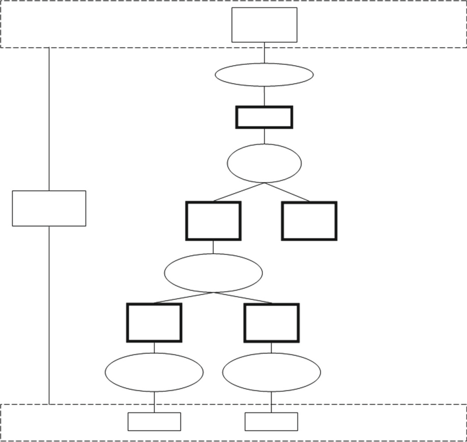
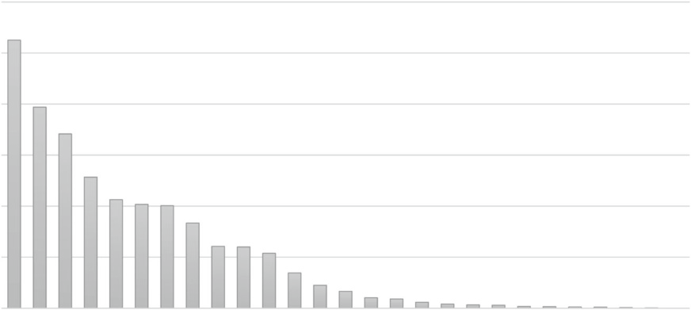

# Metrics for Software Design and Architectures

###### This chapter has been co-authored with Wilhelm Meding, Ericsson AB

**Abstract** Understanding the architecture in a qualitative manner can be timeconsuming and effort-intensive. Therefore the qualitative methods such as assessments presented in Chap. [6](#_bookmark368) are often done periodically at given milestones. However, architects need to monitor the quality of the architecture constantly and ensure that the characteristics of the architecture are within the limits of the product boundaries. In this chapter we present a set of measures used for measuring architectures and detailed designs. We explore the existing measures and present the ones which are common in industrial applications. Towards the end of the chapter we show the limits of selected measures by using an openly available industrial data set from an automotive OEM.

> **摘要**以定性的方式理解体系结构可能是耗时和努力的。因此，诸如 Chap 中提出的评估等定性方法。[6](#_bookmark368) 通常以给定的里程碑定期进行。但是，架构师需要不断监视体系结构的质量，并确保体系结构的特性在产品边界的范围内。在本章中，我们介绍了一套用于测量架构和详细设计的措施。我们探索现有措施，并介绍工业应用中常见的措施。在本章结束时，我们通过使用来自汽车 OEM 的公开可用的工业数据集来显示所选度量的限制。

## Introduction

In the previous chapter we explored one way of understanding the architecture— qualitative assessment based on scenarios. This method has multiple advantages as it allows architects to dive deeply into the details of a selected set of prioritized aspects of the architecture. The major disadvantage is the fact that qualitative evaluation is effort-intensive and can be done as soon as the architecture is somehow mature.

> 在上一章中，我们探讨了一种**理解体系结构的方式 - 基于场景的定性评估**。该方法具有多个优点，因为它允许架构师深入研究架构的一组优先方面的细节。主要缺点是，定性评估是努力密集的，一旦架构以某种方式成熟，就可以完成。

Architecting, however, is not done when the architecture is finished but is done intensively before the architecture is finished. Moreover, it is done constantly, so periodical assessments need to be complemented with methods for continuous quality assessment. In order to achieve this continuity we need to use automated methods which are usually based on measuring properties of architectures and properties of detailed designs.

> 但是，当架构完成后，架构并未完成，但是在体系结构完成之前进行了深入完成。此外，它是不断进行的，因此需要与**持续质量评估的方法相辅相成**。为了实现这种连续性，我们需要使用通常基于架构的属性和详细设计属性的自动方法。

Software architecting as an area has gained increasing visibility in the last two decades as the software industry has recognized the role of software architectures in maintaining high quality and ensuring longevity and sustainability of software products [[Sta15](#_bookmark637), [LKM+13](#_bookmark609)]. Even though this recognition is not new, there is still no consensus on how to measure various aspects of software architectures beyond the basic structural properties of the software architecture as a design artifact. In the literature we can encounter studies applying base measures for object-oriented designs to software architectures [[LTC03](#_bookmark610)] and studies designing low-level software architecture measures such as number of interfaces [[SFGL07](#_bookmark626)].

> 在过去二十年中，随着软件行业认识到软件体系结构在保持软件产品的高质量和确保软件产品的寿命和可持续性方面的作用，软件体系结构作为一个领域的知名度越来越高[[Sta15](#_bookmark637)，[LKM+13](#_bbookmark609)]。尽管这种认识并不新鲜，但对于**如何衡量软件架构的各个方面**，除了作为设计工件的软件架构的基本结构属性之外，仍然没有达成共识。在文献中，我们可以遇到将面向对象设计的基本度量应用于软件体系结构的研究[[LTC03](#_bookmark610)]和设计低级软件体系结构度量(如接口数量)的研究[[SFGL07](#_bookmark626)]。

In order to understand the kinds of measures which are used in software architectures we have found a generic measurement portfolio of 54 measures in the literature. The portfolio can be applied to software architectures and designs, but interpreted differently based on where it is applied. The portfolio was developed by the literature review using snowballing and following the principles of systematic mapping of Petersen et al. [[PFMM08](#_bookmark619)]. The measures in the portfolio were then organized according to the ISO/IEC 15939 standard’s measurement information model [[OC07](#_bookmark615)] into base measures, derived measures and indicators.

> 为了了解软件体系结构中使用的度量类型，我们在文献中找到了 54 种度量的通用度量组合。该组合可以应用于软件架构和设计，但根据其应用的位置进行不同的解释。该投资组合是根据 Petersen 等人的系统制图原理，通过滚雪球式的文献综述开发的。[[PFMM08](#_bookmark619)]。然后根据 ISO/IEC 15939 标准的测量信息模型[[OC07](#_bookmark615)]将组合中的测量组织为基本测量、衍生测量和指标。

This chapter is structured as follows. Next, Sect. [9.2](#measurement-standard-in-software-engineeringisoiec-15939) presents our theoretical foundation for designing the portfolio—the ISO/IEC 15939 measurement information model. In Sect. [9.3](#measures-available-in-isoiec-25000) we present an overview of the standardized measures presented in the new quality standard `Software Product Quality Requirements and Evaluation` . In Sect. [9.4](#measures) we present more measures found in literature and we organize them in the portfolio in Sect. [9.5](#metrics-portfolio-for-the-architects) by identifying indicators. In Sect. [9.6](#industrial-measurement-data-for-software-designs) we present the limits of the selected measures based on an open data set from an automotive OEM. We conclude the chapter with further reading in Sect. [9.7](#further-reading-5).

> 本章的结构如下。接下来，
> 第 [9.2](#measurement-standard-in-softwareengineeringisoic-15939) 为设计 ISO/IEC 15939 测量信息模型提供了理论基础。
> 在第 [9.3](#measures-available-in-isoiec-25000) 我们概述了新质量标准 `软件产品质量要求和评估` 中提出的标准化措施。
> 在第 [9.4](#%E5%BA%A6%E9%87%8F%E5%80%BC) 我们提供了文献中发现的更多度量值，并将其组织在第[9.5](#_Measurement combination of architect)节的投资组合中。
> 在第 [9.6](#%E8%BD%AF%E4%BB%B6%E8%AE%BE%E8%AE%A1%E7%9A%84%E5%B7%A5%E4%B8%9A%E6%B5%8B%E9%87%8F%E6%95%B0%E6%8D%AE) 我们基于来自汽车 OEM 的开放数据集给出了所选测量的极限。
> 我们在第节中以进一步阅读结束本章。[9.7](#%E8%BF%9B%E4%B8%80%E6%AD%A5%E9%98%85%E8%AF%BB-5)。

## Measurement Standard in Software Engineering—ISO/IEC 15939

The ISO/IEC 15939:2007 [[OC07](#_bookmark615)] standard is a normative specification for processes used to define, collect, and analyze quantitative data in software projects or organizations. The central role in the standard is played by the information product, which is a set of one or more indicators with their associated interpretations that address the information need. The information need is an insight necessary for a stakeholder to manage objectives, goals, risks, and problems observed in measured objects. These measured objects can be entities like projects, organizations, software products, etc. characterized by a set of attributes. We use the following definitions from ISO/IEC 15939:2007:

> ISO/IEC 15939：2007 [[OC07](#_bookmark615)]标准是用于在软件项目或组织中定义，收集和分析定量数据的程序的规范规范。该标准中的核心角色是由信息产品扮演的，这是一组或多种指标，其相关解释可满足信息的需求。信息需求是利益相关者管理目标，目标，风险和问题的洞察力。这些测量的对象可以是项目，组织，软件产品等的实体。以一组属性为特征。我们使用 ISO/IEC 15939：2007 的以下定义：

- Base measure, defined in terms of an attribute and the method for quantifying it. This definition is based on the definition of base quantity from [[oWM93](#_bookmark617)].

> - 基础度量，根据属性和量化它的方法定义。该定义基于[[OWM93](#_bookmark617)]的基本数量的定义。

- Derived measure, defined as a function of two or more values of base measures. This definition is based on the definition of derived quantity from [[oWM93](#_bookmark617)].

> - 定义为两个或多个基础测量值的函数的派生度量。该定义基于[[OWM93](#_bookmark617)]的派生数量的定义。

- Indicator, provides an estimate or evaluation of specified attributes derived from a model with respect to defined information needs.

> - 指标，提供了根据定义信息需求从模型得出的指定属性的估计或评估。

- Decision criteria—thresholds, targets, or patterns used to determine the need for action or further investigation, or to describe the level of confidence in a given result.

> - 决策标准 - 用于确定采取行动或进一步研究的需求或描述给定结果的信心水平的阈值，目标或模式。

- Information product—one or more indicators and their associated interpretations that address an information need.

> - 信息产品 - 一个或更多指标及其相关的解释，以满足信息需求。

1. Measurement Standard in Software Engineering—ISO/IEC 15939 217

> 1.软件工程的测量标准 - ISO/IEC 15939 217

<!-- -->

- Measurement method—a logical sequence or operations, described generically, used in quantifying an attribute with respect to a specified scale.

> - 测量方法 - 一种逻辑序列或操作，一般描述，用于量化相对于指定比例的属性。

- Measurement function—an algorithm or calculation to combine two or more base measures.

> - 测量函数 - 结合两个或多个基础测量的算法或计算。

- Attribute—a property or characteristic of an entity that can be distinguished quantitatively or qualitatively by human or automated means.

> - 属性 - 可以通过人类或自动化方式在定量或定性上区分的实体的属性或特征。

- Entity—an object that is to be characterized by measuring its attributes.

> - 实体 - 通过测量其属性来表征的对象。

- Measurement process—a process for establishing, planning, performing and evaluating measurement within an overall project, enterprise or organizational measurement structure.

> - 测量过程 - 在整个项目，企业或组织测量结构中建立，计划，执行和评估测量的过程。

- Measurement instrument a procedure to assign a value to a base measure.

> - 测量仪器一种将值分配给基本量度的程序。

The view on measures presented in ISO/IEC 15939 is consistent with other engineering disciplines; the standard states at many places that it is based on such standards as ISO/IEC 15288:2007 (Software and Systems engineering—Measurement Processes), ISO/IEC 14598-1:1999 (Information technology—Software product evaluation), ISO/IEC 9126-x, the ISO/IEC 25000 series of standards, and the International vocabulary of basic and general terms in metrology (VIM) [[oWM93](#_bookmark617)]. Conceptually, the elements (different kinds of measures) which are used in the measurement process can be presented as in Fig. [9.1](#measures-available-in-isoiec-25000).

> ISO/IEC 15939 中提出的措施的观点与其他工程学科一致；在许多地方的标准国家基于 ISO/IEC 15288：2007(软件和系统工程 - 测量过程)，ISO/IEC 14598-1：1999(信息技术 - 软件产品评估)，ISO/IEC 9126-X，ISO/IEC 25000 系列标准，以及计量学基本和一般术语的国际词汇(VIM)[[OWM93](#_bookmark617)]。从概念上讲，在测量过程中使用的元素(不同类型的度量)可以如图 [9.1](#Measure-in-Is-Isoiec-25000) 所示。

The model provides a very good abstraction and classification of measures— from very basic ones to more complicated ones. The base measures are often close to the entities they measure, such as architectural designs, and as such reflect the entities relatively well, although using a different domain of mathematical symbols and numbers. The indicators, on the other hand, serve the different purpose of fulfilling the information need of their stakeholder and as such are closer to the concepts which the stakeholders want to get information about, e.g. the architecture’s quality, stability or complexity.

> 该模型提供了非常好的抽象和措施分类 - 从非常基本的抽象到更复杂的措施。基本措施通常接近他们测量的实体，例如架构设计，因此相对反映了实体，尽管使用了不同的数学符号和数字领域。另一方面，这些指标实现了满足其利益相关者信息需求的不同目的，因此更接近利益相关者想要获得有关信息的概念，例如体系结构的质量，稳定性或复杂性。

As the indicators provide insight into what the stakeholders would like to measure, see and observe, it is often easy to provide an analysis model (or coloring) of the values of the indicators. It can be illustrated as in Fig. [9.2](#_bookmark563).

> 由于指标提供了有关利益相关者想要衡量，查看和观察的洞察力，因此通常很容易地提供指标值的分析模型(或着色)。可以说明如图 [9.2](#_bookmark563) 所示。

We use this model to describe the measures used for quantifying properties of software architectures. Conceptually we can also consider the fact the higher in the model the measure is, the more advanced the information need it fulfills. In Fig. [9.3](#_bookmark564) we can see a number of measures divided into three levels—the more basic ones at the bottom and the more complex ones at the top.

> 我们使用此模型来描述用于量化软件体系结构属性的度量。从概念上讲，我们还可以考虑该度量模型中的事实越高，其所需信息所需的信息就越高。在图 [9.3](#_bookmark564) 中，我们可以看到许多措施分为三个级别 - 底部较基本的级别，顶部较复杂。

The more advanced information needs are related to the work of the architects whereas the more basic ones are more related to the architecture as an artifact in software development. So, now that we have the model, let’s look into one of the standards where the software measures are defined—ISO/IEC 25000.

> 更高级的信息需求与架构师的工作有关，而基本的信息的需求越多，与体系结构作为软件开发中的工件更相关。因此，既然我们有了模型，那么让我们研究一下定义软件度量的标准之一 - ISO/IEC 25000。

<**Fig. 9.1** Measurement Information Model—adopted from ISO/IEC 15939

## Measures Available in ISO/IEC 25000

The ISO/IEC 25000 Software Quality Requirements and Evaluation (SQuaRE) standard provides a set of reference measures for software designs and architectures. At the time of writing of this book the standard is not fully adopted but the main parts are already approved and the work is fully ongoing regarding the measures, their definitions and usage. The standard presents the following set of measures related to product, design and architecture in one of its chapters—ISO/IEC 25023— Software and Software Product Quality Measures [[ISO16](#_bookmark600)]:

> ISO/IEC 25000 软件质量要求和评估(Square)标准提供了一组软件设计和体系结构的参考度量。在撰写本书时，标准尚未完全采用，但主要部分已经被批准，并且有关措施，定义和用法的工作正在进行中。该标准在其章节之一(ISO/IEC 25023)中介绍了以下与产品，设计和架构相关的措施，软件和软件产品质量度量[[ISO16](#_bookmark600)]：

- Quality measures for functional suitability—example measure: functional implementation coverage addressing the information need of functional completeness

> - 功能适用性的质量措施 - 示例措施：功能性覆盖范围，以解决功能完整性的信息需求

- Quality measures for performance efficiency—example measure: response time addressing the information need of time behavior performance

> - 绩效效率的质量措施 - 示例措施：响应时间解决时间行为表现的需求

1. Measures Available in ISO/IEC 25000 219

> 1. ISO/IEC 25000 219 中可用的措施

<**Fig. 9.2** Conceptual levels of architecture measures
<**Fig. 9.3** Higher-level measures correspond to more advanced information needs—an example

- Quality measures for compatibility—example measure: connectivity with external systems addressing the information need of interoperability

> -兼容性的质量度量示例度量：与解决互操作性信息需求的外部系统的连接

- Quality measures for usability—example measure: completeness of user documentation addressing the information need of learnability of the product

> - 可用性的质量措施 - 示例措施：用户文档的完整性解决了产品可学习性的信息

- Quality measures for reliability—example measure: test coverage addressing the information need of reliability assessment

> - 可靠性的质量措施 - 示例措施：测试覆盖范围，解决可靠性评估的信息需求

- Quality measures for security—example measure: data corruption prevention addressing the information need of integrity

> - 安全质量措施 - 示例措施：预防数据腐败，以解决完整性信息的需求

- Quality measures for maintainability—example measure: modification complexity addressing the information need of modifiability

> - 可维护性的质量措施 - 示例措施：修改复杂 - 解决可修改性的信息需求

- Quality measures for portability—example measure: installation time efficiency addressing the information need of installability of the software product

> - 可移植性的质量措施 - 示例措施：安装时间效率解决软件产品可安装性的信息需求

The list of the areas and the example measures illustrate how the measures are discussed in the standards related to product quality. We can see that these measures are related to the execution of the product and do not focus on the internal quality of the product with such example measures as size (e.g. number of components) or complexity (e.g. control flow complexity). Therefore we need to turn to scientific literature to understand the measures and indicators related to software architectures. There we can find measures which are of interest to software architects.

> 区域列表和示例度量列表说明了如何在与产品质量有关的标准中讨论措施。我们可以看到，这些度量与产品的执行有关，并且不关注产品的内部质量，例如大小(例如组件数)或复杂性(例如，控制流动复杂性)。因此，我们需要转向科学文献来了解与软件体系结构相关的措施和指标。在那里，我们可以找到软件架构师感兴趣的措施。

## Measures

Let’s start with the base measures which quantify the architecture shows in Table [9.1](#_bookmark566)—we can quickly notice that these measures correspond to the entities they measure. The measurement method (the algorithms to calculate the base measure) are very similar and are based on counting entities of a specific type. The list in Table [9.1](#_bookmark566) shows a set of example base measures.

> 让我们从量化表 [9.1](#_bookmark566) 中显示的体系结构的基础度量开始 - 我们可以快速注意到这些措施与它们测量的实体相对应。测量方法(计算基本度量的算法)非常相似，并且基于特定类型的计数实体。表 [9.1](#_bookmark566) 中的列表显示了一组示例基础测量。

Collecting the measures presented in the table provides the architects with the understanding of the properties of the architecture, but the architects still need to provide context to these numbers in order to reason about the architectures. For example, the number of components by itself does not provide much insight; however, if put together with a timeline and plotted as a trend, allow to extrapolate the information and therefore allow the architects to assess if the architecture is overly large and should be refactored.

> 收集表中提出的措施为架构师提供了对体系结构属性的理解，但是架构师仍然需要为这些数字提供上下文，以便推理架构。例如，组件的数量本身并不能提供太多洞察力。但是，如果将时间表放在一起并将其绘制为趋势，则可以推断信息，因此允许架构师评估体系结构是否过大，应重新分配。

In addition to the measures for the architecture we can also find many measures which are related to software design in general—e.g. object-oriented measures or complexity measures [[ASM+14](#_bookmark587), [SKW04](#_bookmark629)]. Examples of these are presented in Table [9.2](#_bookmark568).

> 除了对体系结构的措施外，我们还可以找到许多与软件设计相关的措施，例如。面向对象的度量或复杂性度量[[ASM + 14](#_bookmark587)，[skw04](#_bookmark629)]。这些示例在表 [9.2](#_Bookmark568) 中列出。

Once again these examples show that the measures are related to the design the quantification of its properties. Such measures as the _abstractness of a Simulink block_, however, are composed of multiple other measures and therefore are classified as derived measures and as such are closer to the information need of architects. In the literature we can find a large number of measures for designs and their combinations and therefore when choosing measures it is crucial to start from the information needs of the architects [[SMKN10](#_bookmark634)] since these information needs can effectively filter out measures which are possible to collect, but not relevant for the company (and as such could be considered as waste).

> 这些示例再次表明，这些度量与设计的量化有关。但是，诸如 simulink 块_的_abstractngess 的度量是由多个其他措施组成的，因此被分类为派生措施，因此更接近架构师的信息需求。过滤掉可以收集但与公司无关的措施(因此可以被视为废物)。

In the next section we identify which measures from the above two groups are to be included in the portfolio and what areas they belong to.

> 在下一部分中，我们确定将包括上述两组的哪些措施包括在投资组合中以及它们所属的区域。

<**Table 9.1** Base measures for software architectures Measure Description

## Metrics Portfolio for the Architects

The measures presented so far can be collected, but, as the measurement standards prescribe, they need to be useful for the stakeholders in their decision processes [[Sta12](#_bookmark636), [OC07](#_bookmark615)]. Therefore we organize these measures into three areas corresponding to the information needs of software architects. As architecting is a process which involves software architecture artifacts, we recognize the need of grouping these indicators into areas related to both the product and the process.

> 到目前为止，可以收集迄今为止提出的措施，但是，按照测量标准的规定，他们在决策过程中需要对利益相关者有用[[sta12](#_bookmark636)，[oc07](#_bookmark615)]。因此，我们将这些措施组织成与软件架构师的信息需求相对应的三个领域。由于架构是一个涉及软件体系结构工件的过程，因此我们认识到需要将这些指标分组为与产品和过程相关的领域。

<**Table 9.2** Base measures for software design

### _Areas_

In our portfolio we group the indicators into three areas related to basic properties of the design, its stability and its quality:

> 在我们的投资组合中，我们将指标分为与设计的基本特性，其稳定性和质量有关的三个领域：

**Area: architecture measures**—this area groups product-related indicators that address the information need about _how to monitor the basic properties of the architecture, like its component coupling_.

> **区域：体系结构测量** - 该区域组与产品相关的指标，这些指标可以解决有关*如何监视体系结构的基本属性的信息，例如其组件耦合*。

**Area: design stability**—this area groups process-related indicators that address the information need about _how to ascertain controlled evolution of the architectural design_.

> **区域：设计稳定性** - 该区域组与过程相关指标，该指标解决了有关*如何确定架构设计*的信息所需的信息。

**Area: technical debt/risk**—this area groups product-related indicators that address the information need about _how to ascertain the correct implementation of the architecture_.

> **领域：技术债务/风险** - 该区域组与产品相关的指标，这些指标解决了有关_如何确定架构的正确实现的信息。

In the following subsections we present the measures and the suggested way to present them. One of the criteria for each of these areas in our study was that the upper limit on the number of indicators be four. The limitations are based on

> 在以下小节中，我们介绍了提出措施和建议的方式。我们研究中每个领域的标准之一是指标数量的上限为四个。限制是基于

empirical studies of cognitive aspects of measurement, such as the ability to take in information by the stakeholders [[SMH+13](#_bookmark632)].

> 对测量的认知方面的经验研究，例如利益相关者接受信息的能力[[SMH + 13](#_bookmark632)]。

### _Area: Architecture Measures_

In our portfolio we could identify 14 measures as applicable to measure the basic properties of the architecture. However, when discussing these measures with the architects, the majority of the measures seemed to quantify basic properties of the designs. The indicators found in the study in this area are:

> 在我们的投资组合中，我们可以**将 14 个措施确定为适用于衡量体系结构的基本属性**。但是，在与架构师讨论这些度量时，大多数措施似乎都可以量化设计的基本特性。该领域的研究中发现的指标是：

**Software architecture changes:** To monitor and control changes over time the architects should be able to monitor the trends in changes of software architecture at the highest level [[DNSH13](#_bookmark593)]. Based on our literature studies and discussions with practitioners we identified the following measure to be a good indicator of the changes—_number of changes in the architecture per time unit (e.g. week)_[[DSTH14a](#_bookmark595), [DSTH14b](#_bookmark596), [DSN11](#_bookmark594)].

> **软件体系结构更改：**为了随着时间的推移监视和控制变化，架构师应能够监视最高级别的软件体系结构变化的趋势[[DNSH13](#_bookmark593)]。基于我们的文献研究和与从业者的讨论，我们确定以下措施是变化的良好指标 - _number 每一个时间单元的架构变化(例如周)_[[DSTH14A](#_bookmark595)，[dsth14b](#_Bookmark596)，[DSN11](#_bookmark594)]。

**Complexity:** To manage module complexity, the architects need to understand the degree of coupling between components, as the coupling is perceived as costconsuming and error-prone in the long-term evolution of the architecture. The identified indicator is _Average squared deviation of actual fanout from the simplest structure_.

> **复杂性：**要管理模块的复杂性，架构师需要了解组件之间的耦合程度，因为在架构的长期演化中，耦合被认为是易于成本和错误的。确定的指示器是实际扇形与最简单结构的偏差的平方偏差。

**External interfaces:** To control the degree of coupling on the interface level (i.e. a subset of all types of couplings), the architects need to observe the number of internal interfaces—_number of interfaces_.

> **外部接口：**要控制接口级别的耦合度(即所有类型的耦合的子集)，架构师需要观察内部接口的数量 - interfaces_number _number。

**Internal interfaces:** To control of external dependencies of the product, the architects need to monitor the coupling of the product to external software products—_number of interfaces_.

> **内部接口：**为了控制产品的外部依赖关系，架构师需要监视产品与外部软件产品的耦合 - interfaces_number。

The suggested presentation of these measures is presented in Fig. [9.4](#_bookmark571).

> 这些措施的建议介绍如图 [9.4](#_bookmark571)。

**Number of changes in the architecture per week**
<**Fig. 9.4** Visualization of the measures in the architecture property area

### _Area: Design Stability_

The next area which is of importance for the architects is related to the need for monitoring the large code base for stability. Generally, in this area we used visualizations from our previous research into code stability [[SHF+13](#_bookmark627)]. We identified the following three indicators to be efficient in monitoring and visualizing the stability:

> 对于架构师而言，重要的下一个区域与监视稳定性大型代码库的需求有关。通常，在此领域，我们使用了以前对代码稳定性的研究的视觉融合[[SHF + 13](#_bookmark627)]。我们确定了以下三个指标有效监视和可视化稳定性：

**Code stability:** To monitor the code maturity over the time the architects need to see how much code has been changed over time as it allows them to identify code areas where more testing is needed due to recent changes. The measure used for this purpose is _number of changes per module per time unit_.

> **代码稳定性：**在架构师需要查看随着时间的时间更改的代码时，监视代码成熟度，因为它允许他们识别由于最近更改而需要进行更多测试的代码区域。用于此目的的度量是_每个模块的更改，每个模块。

**Defects per modules:** To monitor the aging of the code the architects need to monitor defect-proneness per component per time, using a similar measure as that for code stability—_number of defects per module per time unit (e.g. week)_.

> **每个模块的缺陷：**要监视架构师每次每次每次组件的缺陷 - 主持性，使用与代码稳定性相似的措施 - _每个模块每个模块的缺陷单位(例如，一周)_。

**Interface stability:** To control the stability of the architecture over its interfaces the architects measure the stability of the interfaces—_number of changes to the interfaces per time unit_.

> **接口稳定性：**为了控制体系结构在其接口上的稳定性，架构师测量了接口的稳定性 - _number 每个时间单位的接口变化。

We have found that it is important to be able to visualize the entire code/product base in one view and therefore the dashboard which depicts the stability is based on the notion of heatmaps [[SHF+13](#_bookmark627)]. In Fig. [9.5](#_bookmark574) we present such a visualization with three heatmaps corresponding to these three stability indicators. Each of the figures is a heatmap which depicts different aspects, but each of them is organized in the same way—columns designate weeks, rows designate the single code modules or interfaces and the intensity of the color of each cell designates the number of changes to the module or interface during the particular week.

> 我们发现，能够在一个视图中可视化整个代码/产品基础很重要，因此描述稳定性的仪表板是基于热图的概念[[SHF + 13](#_Bookmark627)]。在图 [9.5](#_bookmark574) 中，我们提供了与这三个稳定指标相对应的三个热图的可视化。每个数字都是一个描绘不同方面的热图，但每个图都以相同的方式组织 - 列指定数周，行指定单个代码模块或接口以及每个单元的颜色的强度指定更改的数量在特定周内的模块或界面。

### _Area: Technical Debt/Risk_

The last area in our portfolio is related to the quality of the architecture over a longer period of time. In this area we identified the following two indicators:

> 我们的投资组合中的最后一个区域与较长时间内架构的质量有关。在该领域，我们确定了以下两个指标：

**Coupling:** To have manageable design complexity the architects need to have a way to get a quick overview over the coupling between the components in the architecture—measured by _number of explicit architectural dependencies_, where the explicit dependencies are links between the components which are introduced by the architects.

> **耦合：**要具有可管理的设计复杂性，架构师需要有一种方法来快速概述体系结构中组件之间的耦合 - 由显式架构依赖关系_number 进行，其中显式依赖关系是组件之间的链接这是由架构师介绍的。

**Implicit architectural dependencies:** To monitor where the code deviates from the architecture the architects need to observe whether there are any additional dependencies introduced during the detailed design of the software—this is measured by _number of implicit architectural dependencies_, where the implicit dependencies are such links between the components which are part of the code, but not introduced in the architecture documentation diagrams [[SMHH13](#_bookmark633)].

> **隐式架构依赖性：**为了监视代码与体系结构的偏差位置，架构师需要观察该软件详细设计期间是否还引入了其他依赖关系 - 这是由隐式架构依赖性的_number 衡量的，隐含的位置依赖项是代码一部分的组件之间的链接，但在体系结构文档图中未介绍[[SMHH13](#_bookmark633)]。

<**Fig. 9.5** Visualization of the measures in the architecture stability area

The visualization of the architectural dependencies shows the degree of coupling and is based on circular diagrams, as presented in Figs. [9.6](#_bookmark575) and [9.7](#_bookmark576), where each area on the border of the circle represents a component and a line shows a dependency between two components.

> 如图 1 和 2 所示，架构依赖性的可视化显示了耦合的程度，并基于圆形图。[9.6](#_bookmark575) 和 [9.7](#_bookmark576)，其中圆圈边框上的每个区域都表示一个组件，并且线路显示两个组件之间的依赖关系。

<**Fig. 9.6** Visualization of the measures in the architecture technical debt/risk: implicit

<**Fig. 9.7** Visualization of the measures in the architecture technical debt/risk: explicit

## Industrial Measurement Data for Software Designs

The metrics portfolio for software architects should be complemented with a set of metrics for software designs, which we presented in Table [9.2](#_bookmark568). One of these measures is software complexity, measured as a number of independent paths in the program (McCabe complexity). In order to illustrate how complex automotive systems are, let us look into one of the industrial data sets publicly available

> 软件架构师的指标投资组合应配有用于软件设计的一组指标，我们在表 [9.2](#_bookmark568) 中介绍。这些措施之一是软件复杂性，以程序中的许多独立路径(McCabe 复杂性)测量。为了说明汽车系统的复杂程度，让我们研究公开可用的工业数据集之一

[[ASD+15](#_bookmark585)].

In general, software complexity can be measured in multiple ways, but there is a small number of measures which have been found to be correlated with each other—

> 通常，可以通过多种方式测量软件复杂性，但是发现少数措施相互关联 -

e.g. McCabe cyclomatic complexity, lines-of-code. The inherent correlations (cf. [[ASH+14](#_bookmark586)]) allow us to simplify the problem to only one of them (for the sake of the discussion)—we choose the McCabe complexity due to its spread in practice. In short, the metric measures the number of independent execution paths in the source code.

> 例如 McCabe 循环复杂性，编码线。固有的相关性(cf. [[Ash + 14](#_bookmark586)])允许我们简化问题，只有一个(为了讨论) - 我们选择 McCabe 的复杂性是由于其在实践中的传播而引起的。简而言之，该指标测量源代码中独立执行路径的数量。

In the automotive sector, in data from the open domain we find that the complexity of software modules is highly over the theoretical limit of 30 (execution paths), as presented in Fig. [9.8](#_bookmark578).

> 在汽车扇区中，在开放域中的数据中，我们发现软件模块的复杂性高于理论限制 30(执行路径)，如图 [9.8](#_bookmark578) 所示。

What the data shows is that there are components where the number of execution paths is over 160, which means that only to test each of the execution paths once there is a need for 160+ test cases. However, in order to achieve full coverage one needs more than 500 test cases for the entire component. If we need to test each path with a positive and a negative case (so called boundary case) we need to at least double the number of test cases. Exploring the other metrics provided in the same data set shows that the trends are very similar—the numbers are highly over the theoretical complexity limits.

> 数据显示的是，在某些组件中，执行路径的数量超过 160，这意味着一旦需要 160+ 测试用例，才能测试每个执行路径。但是，为了实现全面覆盖，整个组件需要超过 500 个测试用例。如果我们需要用正案例(所谓的边界案例)测试每个路径，我们**需要至少将测试用例数量增加一倍**。探索同一数据集中提供的其他指标表明趋势非常相似 - 数字高于理论复杂性限制。

These numbers indicate that it is increasingly more difficult to provide full verification of the software functionality in order to ensure the safety of software systems. Therefore we need new approaches than just testing.

> 这些数字表明，为了确保软件系统的安全性，提供对软件功能的全面验证越来越困难。因此，我们需要新的方法，而不仅仅是测试。

1. Industrial Measurement Data for Software Designs 227

<**Fig. 9.8** Complexity of software modules (C programming language) as a McCabe cyclomatic complexity

In Chap. [5](#_bookmark273) we explored the detailed designs in terms of simulink models. In the data set presented in the studied paper [[ASD+15](#_bookmark585)], the size of such models can be huge—as shown in Fig. [9.9](#_bookmark579).

> 在第一章中。[5](#_bookmark273) 我们根据模型探索了详细的设计。在研究论文中提出的数据集中[[ASD + 15](#_bookmark585)]，此类模型的大小可能很大 - 如图 [9.9](#_bookmark579))。

<**Fig. 9.9** Sizes of the models in the example data set

As the figure shows, some of the models (Johnson.mdl) are huge models with over 50,000 blocks and models of over 10,000 blocks are not uncommon. One should note that this data comes only from one domain and one manufacturer; however, the scale of the size shows how much software is included in modern cars. It also shows the effort required to develop and to test such software.

> 如图所示，一些模型(Johnson.mdl)是超过 50000 块的大型模型，超过 10000 块的模型并不罕见。应该注意，这些数据仅来自一个域和一个制造商；然而，规模的大小显示了现代汽车中包含了多少软件。它还显示了开发和测试此类软件所需的努力。

## Further Reading

Some of the most popular methods for evaluating software architectures in general are to use qualitative methods like ATAM [[KKC00](#_bookmark604)], where the architecture is analyzed based on scenarios or perspectives. These methods are used for final assessments of the quality of the architectures, but as they are manual they need effort and therefore cannot be conducted in a continuous manner. However, as many contemporary projects are conducted using Agile methodologies, Lean software development [[Pop07](#_bookmark620)] or the minimum viable product approach [[Rie11](#_bookmark621)], these methods are not feasible in practice. Therefore the architects are willing to trade off quality of evaluation for speed of the feedback on their architecture, which leads to more extensive use of measure-based evaluation of software architectures.

> 一般来说，评估软件架构的一些最流行的方法是使用定性方法，如 ATAM[[KKC00](#_bookmark604)]，其中基于场景或视角分析架构。这些方法用于架构质量的最终评估，但由于它们是手动的，因此需要努力，因此不能以连续的方式进行。然而，由于许多当代项目是使用敏捷方法、精益软件开发[[Pop07](#_bookmark620)]或最小可行产品方法[[Rie11](#_bbookmark621)]进行的，这些方法在实践中是不可行的。因此，架构师愿意以评估质量换取对其架构的反馈速度，这将导致更广泛地使用基于度量的软件架构评估。

In our previous work we have studied metrics used for monitoring of architectural changes [[DNSH13](#_bookmark593), [DSN11](#_bookmark594)]. The results showed that the use of a modified coupling metric can provide a very good estimation of the impact of the change in the architecture between two different releases of the architecture.

> 在我们以前的工作中，我们研究了用于监视体系结构更改的指标[[dnsh13](#_bookmark593)，[dsn11](#_bookmark594)]。结果表明，使用修改后的耦合度量可以很好地估计架构的两个不同版本之间的架构变化的影响。

One of the tools and methods supporting the architects’ work with measures is the MetricViewer [[TLTC05](#_bookmark638)], which augments software architecture diagrams expressed in UML with such measures as coupling, cohesion and depth of inheritance tree. This augmentation is important for reasoning about the designs, but it is not linked to the information needs of the stakeholders. Having such a link allows the stakeholders to monitor attainment of their goals, which otherwise require them to conduct the same analyses manually.

> MetricViewer [[tltc05](#_bookmark638)]是支持架构师工作的工具和方法之一，它增强了在 UML 中表达的软件体系结构图，诸如耦合，凝聚力，凝聚力和继承树的凝聚力和深度。这种增强对于关于设计的推理很重要，但与利益相关者的信息需求无关。建立这样的链接可以使利益相关者可以监视其目标的实现，否则要求他们手动进行相同的分析。

Similarly to Tameer et al., Vasconcelos et al. [[VST07](#_bookmark640)] propose a set of metrics for measuring architectures based on low-level properties of software architectures, such as number of possible operating systems or number of secure components. Our work complements their study by focusing on internal quality properties related to the design and not quality in use.

> 与 Tameer 等人类似，Vasconcelos 等人。[[VST07](#_bookmark640)]建议一组基于软件体系结构的低级属性来测量体系结构的指标，例如可能的操作系统数量或安全组件数量。我们的工作通过关注与设计相关的内部质量特性而不是使用质量来补充他们的研究。

In the same vein, Dave [[Dav01](#_bookmark592)] patented the method for co-synthesis of software and hardware using measures such as scheduling and task allocation metrics, which complement the portfolio of architecture metrics presented in this chapter. The major difference in the approach of the patent and our research is our focus on three areas and their associated information needs rather than on a specific goal— integration.

> 同样，Dave [[DAV01](#_bookmark592)]使用调度和任务分配指标等措施，为软件和硬件共同合成的方法申请了专利，该方法补充了本章中介绍的架构指标组合。专利方法和我们的研究的主要区别在于我们专注于三个领域及其相关信息需求，而不是针对特定目标 - 集成。

Additionally, even though it is a decade old, the technical recommendation for the architecture evaluation still provides useful guidelines for choosing the right method [[ABC+97](#_bookmark583)]. In particular, the recommendation is to customize the evaluation to a specific quality or goal. In the case of the study presented in this chapter, this goal is the set of information needs represented by the stakeholder.

> 此外，即使已经过去了十年，架构评估的技术建议仍然提供了选择正确的方法[[ABC + 97](#_bookmark583)]。特别是，建议是将评估定制为特定质量或目标。就本章介绍的研究而言，该目标是利益相关者代表的一组信息需求。

The specific view, information need or goal which is prescribed in the architecture evaluation is a specific case of the _domain context_of the metrological properties of measures [[Abr10](#_bookmark584)]. In software engineering in general and in software architectures in particular there is no consensus about the universal values of measures (e.g. how strongly coupled two entities should be), and therefore the stakeholders approximate this using their experience and mandate in product development organizations [[RSB+13](#_bookmark622), [RSB+14](#_bookmark623), [RSM+13](#_bookmark624)].

> 架构(architecture)评估中规定的特定视图、信息需求或目标是度量的计量属性的域上下文的特定情况[[Abr10](#_bookmark584)]。在一般的软件工程中，特别是在软件架构中，对于度量的普遍价值(例如两个实体应该有多强的耦合)没有共识，因此利益相关者使用他们在产品开发组织中的经验和授权来近似这一点[[RSB+13](#_bookmark622)、[RSB+14](#_bbookmark623)、[SMS+13](#_bookmark624)]。

Readers interested in other examples of information needs for software metrics are referred to a survey study conducted at Microsoft where the authors interview over 100 engineers, managers, and testers to map their current and future information needs [[BZ12](#_bookmark590)].

> 对软件度量信息需求的其他例子感兴趣的读者可以参考微软进行的一项调查研究，作者采访了 100 多名工程师、经理和测试人员，以描绘他们当前和未来的信息需求[[BZ12](#_bookmark590)]。

Using business intelligence and corporate performance measurement can be of interest to readers interested in decision making at the strategic level, e.g., [[Pal07](#_bookmark618), [RW01](#_bookmark625), [KN98](#_bookmark605)].

> 使用商业智能和企业绩效衡量可能会引起对战略决策感兴趣的读者，例如[[PAL07](#_bookmark618)，[rw01](#_bookmark625)，[kn98](#_bookmark605)]。

Readers interested in mechanisms of effective visualization and manipulation of measurement data can explore the field of visual analytics, e.g., [[VT07](#_bookmark641), [Tel14](#_bookmark639), [BOH11](#_bookmark589)].

> 对有效可视化和操纵测量数据的机制感兴趣的读者可以探索视觉分析的领域，例如[[VT07](#_bookmark641)，[tel14](#_bookmark639)，[boh11](#_boh11](#_bookmark589)]。

Close to the field of visual analytics is the field of project telemetry, which focuses on online visualization of selected software metrics; interested readers should explore:

> 靠近视觉分析领域的是项目遥测领域，该领域的重点是对选定软件指标的在线可视化；有兴趣的读者应该探索：

- tools like Hackystat that are examples in this field [[Joh01](#_bookmark602), [JKA+03](#_bookmark601)]
- the SonarQube tool suite for monitoring internal quality of software products during development [[HMK10](#_bookmark599)] and
- dashboards for visualizing product development where the authors describe experiences from introducing dashboards for a single team [[FSHL13](#_bookmark598)].

> - Hackystat 等工具是该领域的示例[[Jh01](#_bookmark602)，[JKA+03](#_bookmark601)]
> - 用于在开发过程中监控软件产品内部质量的 SonarQube 工具套件[[HMK10](#_blaookmark599)]，
> - 以及用于可视化产品开发的仪表板，其中作者描述了为单个团队引入仪表板的经验[[FSHL13](#_tookmark598)]。

Readers interested in the concepts of measurement systems should explore the following publications:

> 对测量系统概念感兴趣的读者应探讨以下出版物：

- ISO/IEC 15939 (and its IEEE correspondent), defining the conceptsrelated to measurement systems [[OC07](#_bookmark615)].
- Practical Software Measurement [[McG02](#_bookmark612)].
- The classical book on software metrics by Fenton and Pfleeger[[FB14](#_bookmark597)].
- The process of designing measurement systems in industry[[SMN08](#_bookmark635)].
- The graphical way of designing measurement systems with the focus onthe information need of the stakeholders [[SM09](#_bookmark630)].

> - ISO/IEC 15939(及其 IEEE 通讯员)，将与测量系统相关的概念[[OC07](#_bookmark615)] \。
> - 实用的软件测量[[MCG02](#_bookmark612)]。
> - Fenton 和 Pfleeger [[FB14](#_bookmark597)] ]的《软件指标》的古典书。
> - 在行业中设计测量系统的过程[[SMN08](#_bookmark635)]。
> - 设计测量系统的图形方式，重点是利益相关者的信息需求[[SM09](#_bookmark630)]。

One of the trends observed in the software industry is the growing focus on customers even in measurement of internal quality attributes. Readers interested in how to work with customer data can find the following works of value:

> 在软件行业中观察到的趋势之一是，即使在衡量内部质量属性方面，对客户的关注越来越大。对如何与客户数据合作感兴趣的读者可以找到以下价值工作：

- Post-deployment data [[OB13](#_bookmark614)],
- developing customer profiles [[AT01](#_bookmark588)], and
- mining and visualizing customer data [[Kei02](#_bookmark603)].

> - 填写后数据[[ob13](#_bookmark614)]，
> - 开发客户 profiles [[AT01](#_bookmark588)]和
> - 挖掘和可视化客户数据[[KEI02](#_bookmark603)]。

In this context of customer data collections, it is also important to understand the defects in automotive software. In our previous work we have developed a method for classifying defects based on their criticality, targeted towards automotive software [[MST12](#_bookmark613)] which is related to studies on the understanding of inconsistencies in designs [[KS03](#_bookmark607)].

> 在客户数据收集的这种情况下，了解汽车软件中的缺陷也很重要。在我们以前的工作中，我们开发了一种基于缺陷的批判性分类的方法，针对汽车软件[[mst12](#_bookmark613)]，这与对设计的理解有关设计的理解有关](#_bookmark607)]。

## Summary

In this chapter we focused on the challenge of constantly monitoring the architecture quality and the properties of software designs. We have focused on two aspects— what measures exist in the literature that can be used for this purpose and which measures should be used as indicators.

> 在本章中，我们重点介绍了不断监视体系结构质量和软件设计属性的挑战。我们专注于两个方面 - 文献中存在哪些措施，可用于此目的，以及应将措施用作指标。

In the chapter we used the approach postulated by modern measurement standards in software engineering—ISO/IEC 15939 and ISO/IEC 25000. The first of this standard provided us with a way of structuring the measures and the second one provided us with a list of measures. Based on our work with industrial partners [[SM16](#_bookmark631)] we identified three areas of interest. In these areas we managed to identify a set of measures and indicators which address the needs of the stakeholders.

> 在本章中，我们使用了**软件工程中现代测量标准所假定的方法-ISO/IEC 15939 和 ISO/IEC 25000**。该标准的第一种为我们提供了一种构建措施的方法，第二个标准为我们提供了列表措施。根据我们与工业合作伙伴的合作[[SM16](#_bookmark631)]，我们确定了三个感兴趣的领域。在这些领域，我们设法确定了满足利益相关者需求的一组措施和指标。

Finally we have also presented reference visualizations of these indicators.

> 最后，我们还介绍了这些指标的参考可视化。

## References

ABC+ 97. Gregory Abowd, Len Bass, Paul Clements, Rick Kazman, and Linda Northrop. Recommended best industrial practice for software architecture evaluation. Technical report, DTIC Document, 1997.

Abr10. Alain Abran. _Software metrics and software metrology_. John Wiley & Sons, 2010.

ASD+ 15. Harry Altinger, Sebastian Siegl, Dajsuren, Yanja, and Franz Wotawa. A novel industry grade dataset for fault prediction based on model-driven developed automotive embedded software. In _12th Working Conference on Mining Software Repositories (MSR)_. MSR 2015, 2015.

ASH+ 14. Vard Antinyan, Miroslaw Staron, Jörgen Hansson, Wilhelm Meding, Per Osterström, and Anders Henriksson. Monitoring evolution of code complexity and magnitude of changes. _Acta Cybernetica_, 21(3):367–382, 2014.

ASM+14. Vard Antinyan, Miroslaw Staron, Wilhelm Meding, Per Österström, Erik Wikstrom, Johan Wranker, Anders Henriksson, and Jörgen Hansson. Identifying risky areas of software code in agile/lean software development: An industrial experience report. In _Software Maintenance, Reengineering and Reverse Engineering (CSMR-WCRE), 2014 Software Evolution Week-IEEE Conference on_, pages 154–163. IEEE, 2014.

AT01. Gediminas Adomavicius and Alexander Tuzhilin. Using data mining methods to build customer profiles. _Computer_, 34(2):74–82, 2001.

BOH11. Michael Bostock, Vadim Ogievetsky, and Jeffrey Heer. D3 data-driven documents. _IEEE transactions on visualization and computer graphics_, 17(12):2301–2309, 2011.

BZ12. Raymond PL Buse and Thomas Zimmermann. Information needs for software development analytics. In _Proceedings of the 34th international conference on software engineering_, pages 987–996. IEEE Press, 2012. CK94. Shyam R Chidamber and Chris F Kemerer. A metrics suite for object oriented design. _Software Engineering, IEEE Transactions on_, 20(6):476–493, 1994.

Dav01. Bharat P Dave. Hardware-software co-synthesis of embedded system architectures using quality of architecture metrics, January 23 2001. US Patent 6,178,542.

DNSH13. Darko Durisic, Martin Nilsson, Miroslaw Staron, and Jörgen Hansson. Measuring the impact of changes to the complexity and coupling properties of automotive software systems. _Journal of Systems and Software_, 86(5):1275–1293, 2013.

DSN11. Darko Durisic, Miroslaw Staron, and Martin Nilsson. Measuring the size of changes in automotive software systems and their impact on product quality. In _Proceedings of the 12th International Conference on Product Focused Software Development and Process Improvement_, pages 10–13. ACM, 2011.

DSTH14a. Darko Durisic, Miroslaw Staron, Milan Tichy, and Jorgen Hansson. Evolution of long-term industrial meta-models–an automotive case study of autosar. In _Software Engineering and Advanced Applications (SEAA), 2014 40th EUROMICRO Conference on_, pages 141–148. IEEE, 2014.

DSTH14b. Darko Durisic, Miroslaw Staron, Milan Tichy, and Jorgen Hansson. Quantifying longterm evolution of industrial meta-models-a case study. In _Software Measurement and the International Conference on Software Process and Product Measurement (IWSMMENSURA), 2014 Joint Conference of the International Workshop on_, pages 104–113. IEEE, 2014.

FB14. Norman Fenton and James Bieman. _Software metrics: a rigorous and practical approach_. CRC Press, 2014.

FSHL13. Robert Feldt, Miroslaw Staron, Erika Hult, and Thomas Liljegren. Supporting software decision meetings: Heatmaps for visualising test and code measurements. In _Software Engineering and Advanced Applications (SEAA), 2013 39th EUROMICRO Conference on_, pages 62–69. IEEE, 2013.

HMK10. Hiroaki Hashiura, Saeko Matsuura, and Seiichi Komiya. A tool for diagnosing the quality of java program and a method for its effective utilization in education. In _Proceedings of the 9th WSEAS international conference on Applications of computer engineering_, pages 276–282. World Scientific and Engineering Academy and Society (WSEAS), 2010.

ISO16. ISO/IEC. ISO/IEC 25023 - Systems and software engineering - Systems and software Quality Requirements and Evaluation (SQuaRE) - Measurement of system and software product quality. Technical report, 2016.

JKA+ 03. Philip M Johnson, Hongbing Kou, Joy Agustin, Christopher Chan, Carleton Moore, Jitender Miglani, Shenyan Zhen, and William EJ Doane. Beyond the personal software process: Metrics collection and analysis for the differently disciplined. In _Proceedings of the 25th international Conference on Software Engineering_, pages 641–646. IEEE Computer Society, 2003.

Joh01. Philip M Johnson. Project hackystat: Accelerating adoption of empirically guided software development through non-disruptive, developer-centric, in-process data collection and analysis. _Department of Information and Computer Sciences, University of Hawaii_, 22, 2001.

Kei02. Daniel A Keim. Information visualization and visual data mining. _IEEE transactions on Visualization and Computer Graphics_, 8(1):1–8, 2002.

KKC00. Rick Kazman, Mark Klein, and Paul Clements. Atam: Method for architecture evaluation. Technical report, DTIC Document, 2000.

KN98. Robert S Kaplan and DP Norton. Harvard business review on measuring corporate performance. _Harvard Business School Press, EUA_, 1998.

KPS+ 98. S Kalyanasundaram, K Ponnambalam, A Singh, BJ Stacey, and R Munikoti. Metrics for software architecture: a case study in the telecommunication domain. In _Electrical and Computer Engineering, 1998. IEEE Canadian Conference on_, volume 2, pages 715–718. IEEE, 1998.

KS03. Ludwik Kuzniarz and Miroslaw Staron. Inconsistencies in student designs. In _the Proceedings of The 2nd Workshop on Consistency Problems in UML-based Software Development, San Francisco, CA_, pages 9–18, 2003.

LK00. Chung-Horng Lung and Kalai Kalaichelvan. An approach to quantitative software architecture sensitivity analysis. _International Journal of Software Engineering and Knowledge Engineering_, 10(01):97–114, 2000.

LKM+13. Patricia Lago, Rick Kazman, Niklaus Meyer, Maurizio Morisio, Hausi A Müller, and Frances Paulisch. Exploring initial challenges for green software engineering: summary of the first greens workshop, at ICSE 2012. _ACM SIGSOFT Software Engineering Notes_, 38(1):31–33, 2013.

LTC03. Mikael Lindvall, Roseanne Tesoriero Tvedt, and Patricia Costa. An empirically-based process for software architecture evaluation. _Empirical Software Engineering_, 8(1):83– 108, 2003. McC76. Thomas J McCabe. A complexity measure. _Software Engineering, IEEE Transactions on_, (4):308–320, 1976.

McG02. John McGarry. _Practical software measurement: objective information for decision makers_. Addison-Wesley Professional, 2002.

MST12. Niklas Mellegård, Miroslaw Staron, and Fredrik Törner. A light-weight software defect classification scheme for embedded automotive software and its initial evaluation. _Proceedings of the ISSRE 2012_, 2012.

OB13. Helena Holmström Olsson and Jan Bosch. Towards data-driven product development: A multiple case study on post-deployment data usage in software-intensive embedded systems. In _Lean Enterprise Software and Systems_, pages 152–164. Springer, 2013.

OC07. International Standard Organization and International Electrotechnical Commission. Software and systems engineering, software measurement process. Technical report, ISO/IEC, 2007. Ols11. Marta Olszewska. Simulink-specific design quality metrics. _Turku Centre for Computer Science_, 2011.

oWM93. International Bureau of Weights and Measures. _International vocabulary of basic and general terms in metrology_. International Organization for Standardization, Geneva, Switzerland, 2nd edition, 1993.

Pal07. Bob Paladino. Five key principles of corporate performance management. _CMA MANAGEMENT_, 81(8):17, 2007.

PFMM08. Kai Petersen, Robert Feldt, Shahid Mujtaba, and Michael Mattsson. Systematic mapping studies in software engineering. In _12th international conference on evaluation and assessment in software engineering_, volume 17, pages 1–10. sn, 2008.

Pop07. Mary Poppendieck. Lean software development. In _Companion to the proceedings of the 29th International Conference on Software Engineering_, pages 165–166. IEEE Computer Society, 2007.

Rie11. Eric Ries. _The lean startup: How today’s entrepreneurs use continuous innovation to create radically successful businesses_. Random House LLC, 2011.

RSB+ 13. Rakesh Rana, Miroslaw Staron, Christian Berger, Jörgen Hansson, Martin Nilsson, and Fredrik Törner. Increasing efficiency of ISO 26262 verification and validation by combining fault injection and mutation testing with model based development. In _ICSOFT_, pages 251–257, 2013.

RSB+ 14. Rakesh Rana, Miroslaw Staron, Christian Berger, Jörgen Hansson, Martin Nilsson, Fredrik Törner, Wilhelm Meding, and Christoffer Höglund. Selecting software reliability growth models and improving their predictive accuracy using historical projects data. _Journal of Systems and Software_, 98:59–78, 2014.

RSM+13. Rakesh Rana, Miroslaw Staron, Niklas Mellegård, Christian Berger, Jörgen Hansson, Martin Nilsson, and Fredrik Törner. Evaluation of standard reliability growth models in the context of automotive software systems. In _Product-Focused Software Process Improvement_, pages 324–329. Springer, 2013.

RW01. R Ricardo and D Wade. Corporate performance management: How to build a better organization through measurement driven strategies alignment, 2001.

SFGL07. Cláudio SantAnna, Eduardo Figueiredo, Alessandro Garcia, and Carlos JP Lucena. On the modularity of software architectures: A concern-driven measurement framework. In _Software Architecture_, pages 207–224. Springer, 2007.

SHF+ 13. Miroslaw Staron, Jorgen Hansson, Robert Feldt, Anders Henriksson, Wilhelm Meding, Sven Nilsson, and Christoffer Hoglund. Measuring and visualizing code stability – A case study at three companies. In _Software Measurement and the 2013 Eighth International Conference on Software Process and Product Measurement (IWSMMENSURA), 2013 Joint Conference of the 23rd International Workshop on_, pages 191–200. IEEE, 2013.

SJZ14. Srdjan Stevanetic, Muhammad Atif Javed, and Uwe Zdun. Empirical evaluation of the understandability of architectural component diagrams. In _Proceedings of the WICSA 2014 Companion Volume_, page 4. ACM, 2014.

SKW04. Miroslaw Staron, Ludwik Kuzniarz, and Ludwik Wallin. Case study on a process of industrial MDA realization: Determinants of effectiveness. _Nordic Journal of Computing_, 11(3):254–278, 2004.

SM09. Miroslaw Staron and Wilhelm Meding. Using models to develop measurement systems: a method and its industrial use. In _Software Process and Product Measurement_, pages 212–226. Springer, 2009.

SM16. Miroslaw Staron and Wilhelm Meding. A portfolio of internal quality measures for software architects. In _Software Quality Days_, pages 1–16. Springer, 2016.

SMH+13. Miroslaw Staron, Wilhelm Meding, Jörgen Hansson, Christoffer Höglund, Kent Niesel, and Vilhelm Bergmann. Dashboards for continuous monitoring of quality for software product under development. _System Qualities and Software Architecture (SQSA)_, 2013.

SMHH13. Miroslaw Staron, Wilhelm Meding, Christoffer Hoglund, and Jorgen Hansson. Identifying implicit architectural dependencies using measures of source code change waves. In _Software Engineering and Advanced Applications (SEAA), 2013 39th EUROMICRO Conference on_, pages 325–332. IEEE, 2013.

SMKN10. M. Staron, W. Meding, G. Karlsson, and C. Nilsson. Developing measurement systems: an industrial case study. _Journal of Software Maintenance and Evolution: Research and Practice_, page 89107, 2010.

SMN08. Miroslaw Staron, Wilhelm Meding, and Christer Nilsson. A framework for developing measurement systems and its industrial evaluation. _Information and Software Technology_, 51(4):721–737, 2008.

Sta12. Miroslaw Staron. Critical role of measures in decision processes: Managerial and technical measures in the context of large software development organizations. _Information and Software Technology_, 54(8):887–899, 2012.

Sta15. Miroslaw Staron. Software engineering in low-to middle-income countries. _Knowledge for a Sustainable World: A Southern African-Nordic contribution_, page 139, 2015.

Tel14. Alexandru C Telea. _Data visualization: principles and practice_. CRC Press, 2014. TLTC05. Maurice Termeer, Christian FJ Lange, Alexandru Telea, and Michel RV Chaudron. Visual exploration of combined architectural and metric information. In _Visualizing Software for Understanding and Analysis, 2005. VISSOFT 2005. 3rd IEEE International Workshop on_, pages 1–6. IEEE, 2005.

VST07. André Vasconcelos, Pedro Sousa, and José Tribolet. Information system architecture metrics: an enterprise engineering evaluation approach. _The Electronic Journal Information Systems Evaluation_, 10(1):91–122, 2007.

VT07. Lucian Voinea and Alexandru Telea. Visual data mining and analysis of software repositories. _Computers & Graphics_, 31(3):410–428, 2007.
