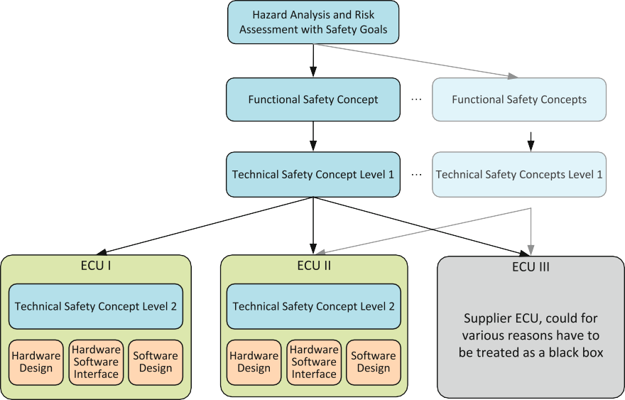

# Functional Safety of Automotive Software

###### Per Johannessen

**Abstract** In the previous chapters we explored generic methods for assessing quality of software architecture and software designs. In this chapter we continue with a much related topic, functional safety of software, in which functional safety assessment is one of the last activities during product development. We describe how the automotive industry works with functional safety. Most of this chapter is based on the ISO 26262 standard that was first published in 2011. That version of the standard was only applicable for passenger cars up to 3500 kg. In 2018 a second version of the standard was published. This version is also applicable to buses, motorcycles, and trucks. The scope of the ISO 26262 standard is more than software development, and for better understanding we give an overview of these other development phases in this chapter. However, we focus on software development according to ISO 26262. The different phases that are covered are software planning, software safety requirements, software architectural design, software unit design and implementation, software integration and testing, and verification of software.

> **摘要**在上一章中，我们探讨了评估软件体系结构和软件设计质量的通用方法。在本章中，我们将继续提供一个非常相关的主题，即软件的**功能安全性**，其中功能安全评估是产品开发过程中的最后一个活动之一。我们描述了汽车行业如何与功能安全性运作。本章的**大部分基于 2011 年首次发布的 ISO 26262 标准**。该版本的标准**仅适用于最高 3500 公斤的乘用车。在 2018 年，该标准的第二版出版。此版本也适用于公交车，摩托车和卡车**。ISO 26262 标准的范围不仅仅是软件开发，为了更好地理解，我们概述了本章的其他开发阶段。但是，我们专注于根据 ISO 26262 的软件开发。涵盖的不同阶段是软件计划，软件安全要求，软件架构设计，软件单元设计和实施，软件集成和测试以及软件的验证。

## Introduction

Functional safety is in ISO 26262 defined as `absence of unreasonable risk due to hazards caused by malfunctioning behaviour of E/E systems`. In a simplified way, we could say that there shall not be any harm to persons resulting from faults in electronics or software. At the same time, for an automotive product, this electronic and software is within a vehicle. Hence, when working with functional safety, it is important to consider the vehicle, the surrounding traffic situations including other vehicles and road users as well as the persons involved.

> 功能安全在 ISO 26262 中定义为 `由于 E/E 系统的故障行为导致的危险而不存在不合理的风险` 。简单来说，我们可以说，**电子或软件故障不会对人员造成任何伤害**。同时，对于汽车产品，该电子和软件位于车辆内。因此，在使用功能安全时，必须考虑车辆、周围交通状况，包括其他车辆和道路使用者以及相关人员。

The safety lifecycle of ISO 26262 starts with planning of product development, continues with product development, production, operation and ends with disassembling the vehicle. In ISO 26262, the base for product development is Items. An Item in ISO 26262 is defined as a `system or combination of systems, to which ISO 26262 is applied, that implement a function or part of a function at the vehicle level`. The key words here are `function at the vehicle level`, which defines which components are involved. This also implies that a vehicle consists of many Items, to which ISO 26262 is applied.

> ISO 26262 的安全生命周期从产品开发规划开始，从产品开发、生产、运营开始，到拆卸车辆结束。在 ISO 26262 中，产品开发的基础是项目。ISO 26262 中的项目定义为 `应用 ISO 26262 的系统或系统组合，在车辆层面实现功能或部分功能` 。这里的关键词是 `车辆级别的功能` ，它定义了所涉及的部件。这也意味着车辆由许多项目组成，ISO 26262 适用于这些项目。

The work on the ISO 26262 standard started in Germany in the early 2000 and was based on another standard, ISO/IEC 61508—Functional Safety of Electrical/Electronic/Programmable Electronic Safety-related Systems. As ISO/IEC 61508 [[C+99](#_bookmark676)] originates from the process control industry, there was a need to adapt it to the automotive industry. The work within the ISO standardization organization started in 2005 and resulted in the first edition of ISO 26262 published in 2011 [[Org11](#_bookmark680)]. As this edition was limited to passenger cars, the revision work for the second edition was started directly and resulted in the second edition of ISO 26262 for all road vehicles excluding mopeds, published in 2018 [[Org18](#_bookmark682)].

> **ISO 26262 标准的工作于 2000 年初在德国开始，并基于另一个标准 ISO/IEC 61508 电气/电子/可编程电子安全相关系统的功能安全。**由于 ISO/IEC 61508[[C+99](#_bookmark676)]源自过程控制行业，因此有必要使其适应汽车行业。ISO 标准化组织的工作始于 2005 年，并于 2011 年发布了第一版 ISO 26262[[Org11](#_bookmark680)]。由于该版本仅限于乘用车，第二版的修订工作直接开始，并于 2018 年发布了适用于所有道路车辆(不包括轻便摩托车)的 ISO 26262 第二版[[Org18](#_bookmark682)]。

Even if the automotive industry had been working with functional safety since long, this was a significant step to standardize the work across the industry. As with standards in general, the key advantage is to simplify cooperation between different organizations. Another benefit with ISO 26262 is that it can be seen as a guideline on how to develop safe functions on vehicle level that to some degree are implemented in electronics and software. By following this guideline, the result is a harmonized safety level across the industry and this level is considered as acceptable.

> 即使汽车行业从长期以来就一直在工作安全性，这也是标准化整个行业工作的重要一步。与一般标准一样，关键优势是简化不同组织之间的合作。ISO 26262 的另一个好处是，**它可以视为有关如何在某种程度上在电子和软件中实施的车辆级别开发安全功能的指南**。通过遵循该准则，结果是整个行业的协调安全水平，该级别被认为是可以接受的。

When looking into ISO 26262, there are twelve different parts as shown in Fig. [10.1](#_bookmark644). In this chapter we focus on Part 6 for software development. At the same time, it is important to understand the context in which this software is developed and also the context where this software is used. Hence, there is a very brief overview of these other parts in ISO 26262 as well.

> 查看 ISO 26262 时，**有十二个不同的部分，如图 [10.1](#_bookmark644) 所示。在本章中，我们重点介绍第 6 部分的软件开发**。同时，重要的是要了解开发该软件的上下文以及使用该软件的上下文。因此，在 ISO 26262 中也有非常简短的概述。

As we can see in Fig. [10.1](#_bookmark644), Parts 4 to 6 are based on the V-model of product development which we discussed in Chap. [4](#_bookmark185) and which has been a de-facto standard in the automotive industry, even if one current trend is towards more agile development approaches. It should be noted that even if the V-model is the basis here, the standard is in reality applied in many different ways including e.g. distributed development across multiple organizations, iterative development and the mentioned agile approaches. Independent on the development approach used, the key is that an argumentation is available that the requirements and objectives in the standards have been appropriately fulfilled.

> 如图 [10.1](#_bookmark644) 所示，第 4 至第 6 部分基于我们在第[4]章(#_bbookmark185)中讨论的产品开发 V 模型，该模型已成为汽车行业的事实标准，即使当前的一个趋势是更敏捷的开发方法。应该注意的是，即使 V 模型是这里的基础，该标准实际上也以许多不同的方式应用，包括跨多个组织的分布式开发、迭代开发和所提到的敏捷方法。独立于所使用的开发方法，关键是要有一个论证，证明标准中的要求和目标已经得到了适当的满足。

In the forthcoming sections we briefly describe Parts 2 to 8 of the standard. Part 1 contains definitions and abbreviations used in the standard. The safety analysis methods described in Part 9 is only covered implicitly in this chapter as they are referenced from the activities in Parts 3 to 6. Also, Part 10 and Part 11 are not described here as these parts are informative collections of guidelines for how to apply ISO 26262 in general and semiconductors in detail. Part 12 includes requirements on how to comply with ISO 26262 for motorcycles, but is not described here as there are no differences with respect to software development.

> 在接下来的章节中，我们**简要介绍了标准的第 2 部分至第 8 部分**。第 1 部分包含标准中使用的定义和缩写。第 9 部分中所述的安全分析方法在本章中仅隐式涵盖，因为第 3 部分至第 6 部分中的活动引用了这些方法。此外，第 10 部分和第 11 部分在这里没有描述，因为这些部分是如何应用 ISO 26262 的指南的信息性集合，以及如何详细应用半导体。第 12 部分包括摩托车如何符合 ISO 26262 的要求，但由于在软件开发方面没有差异，因此此处不作描述。

1. Management and Support for Functional Safety 237

<**Fig. 10.1** The twelve different parts in the ISO 26262 standard, adopted from [[Org18](#_bookmark682)]

## Management and Support for Functional Safety

When an organization works with functional safety, there are other processes that should be established. In Part 2 of the ISO 26262 standard, there are requirements to have a quality management system in place, e.g. ISO 9001 [[Org15](#_bookmark681)] or IATF 16949 [[Aut16](#_bookmark675)], to have all relevant processes established in the quality management system, sufficient competence and experience in the organization, and field monitoring established. Field monitoring from a functional safety perspective is in particular important to detect potential faults in electronics and software when the vehicle is in use to be able to correct these to ensure safe use of all vehicles.

> 当一个组织从事功能安全工作时，应该建立其他流程。在 ISO 26262 标准的第 2 部分中，要求建立质量管理体系，例如 ISO 9001[[Org15](#_bookmark681)]或 IATF 16949[[Aut16](#_bbookmark675)]，在质量管理体系中建立所有相关流程，在组织中建立足够的能力和经验，并建立现场监控。从功能安全角度进行现场监控对于在车辆使用时检测电子设备和软件中的潜在故障尤其重要，以便能够纠正这些故障，确保所有车辆的安全使用。

During product development, there are also requirements on assigning proper responsibilities for functional safety, to plan activities related to functional safety and to monitor that the planned activities are done accordingly.

> 在产品开发过程中，还要求为功能安全分配适当的责任，计划与功能安全相关的活动，并监督计划的活动是否相应完成。

In addition, there are requirements to have proper support according to Part 8, including:

> 此外，根据第 8 部分，还要求提供适当的支撑，包括：

- Interfaces within distributed developments, which ensure that responsibilities are clear between different organizations that shared the development work, e.g. between a vehicle manufacturer and its suppliers. It is often referred to as a Statement of Work.

> -分布式开发中的接口，确保共享开发工作的不同组织之间的责任明确，例如车辆制造商与其供应商之间的责任。它通常被称为工作说明书。

- Requirement management, which ensure that requirements, in particular the safety requirements are properly managed. This includes identification of requirements, requirement traceability, and status of the requirements.

> -需求管理，确保正确管理需求，特别是安全需求。这包括需求的识别、需求可追溯性和需求状态。

- Configuration management, which ensure that the item including all documentation, systems and components belong together and at any time these can be identified and reproduced. There are other standards for configuration management, e.g. ISO 10007, referenced from ISO 26262.

> -配置管理，确保项目包括所有文件、系统和组件属于一个整体，并且在任何时候都可以识别和复制。还有其他配置管理标准，例如 ISO 10007，参考 ISO 26262。

- Change management, which in ISO 26262 ensures that functional safety is maintained when there are changes to an Item. It is based on an analysis of proposed changes and control of those changes. Change management and configuration management typically goes hand in hand with each other.

> - 更改管理，在 ISO 26262 中，该项目可确保在项目发生更改时保持功能安全性。它基于对这些变化的更改和控制的分析。更改管理和配置管理通常相互息息。

- Documentation management, which in ISO 26262 ensures that all documents are managed such that they are retrievable and contain certain formalities such as unique identification, author and approver.

> - 文档管理，在 ISO 26262 中确保对所有文档进行管理，以便它们可以检索并包含某些手续，例如唯一的身份证明，作者和批准者。

- Confidence in the use of software tools, which shall be done when compliance with the ISO 26262 standard relies on correct behavior of software tools used during product development, e.g. code generators and compilers. The first step is a tool classification to determine if the tool under consideration is critical and if critical a tool qualification is done to ensure that the tool can be trusted.

> -对软件工具使用的信心，当符合 ISO 26262 标准依赖于产品开发过程中使用的软件工具(如代码生成器和编译器)的正确行为时，应做到这一点。第一步是工具分类，以确定所考虑的工具是否关键，如果关键，则进行工具鉴定，以确保工具可被信任。

These requirements mean that ISO 26262 poses requirements on the product development databases described in Chap. [4](#_bookmark185) in terms of which kind of connections and relations that should be maintained.

> 这些要求意味着 ISO 26262 对第[4]章(#_bookmark185)中描述的产品开发数据库提出了应维护哪种连接和关系的要求。

## Concept and System Development

According to ISO 26262, product development starts with the development of a concept as described in Part 3. In this phase, the vehicle level function of an Item is developed. Also, the context of the Item is described, i.e. the vehicle and other technologies such as mechanical and hydraulical components. After the concept phase, there is the system development phase according to Part 4 in ISO 26262. In ISO 26262, the system only contains electronic hardware and software components, no other components of other technology such as hydraulic and mechanical components. The development of these other components is not covered by ISO 26262.

> 根据 ISO 26262，产品开发始于第 3 部分中所述的概念的发展。在此阶段，开发了项目的车辆级功能。此外，描述了该项目的上下文，即车辆和其他技术，例如机械和液压组件。在概念阶段之后，根据 ISO 26262 的第 4 部分存在系统开发阶段。在 ISO 26262 中，该系统仅包含电子硬件和软件组件，没有其他技术的其他组件，例如液压和机械组件。ISO 26262 不涵盖这些其他组件的开发。

The first step in concept development is to define the Item to which ISO 26262 is applied. This definition of the Item contains functional and non-functional requirements, use of the Item including its context, and all relevant interfaces and interactions of the Item. It is an important step as this Item definition is the basis for the continued work.

> 概念开发的第一步是定义应用 ISO 26262 的项目。该项目的定义包含功能和非功能性要求，包括其上下文在内的项目以及项目的所有相关接口和交互。这是一个重要的步骤，因为此项目定义是继续工作的基础。

The following step is the hazard analysis and risk assessment which includes hazard identification and hazard classification. A hazard in ISO 26262 is a potential source of harm, i.e. a malfunction of the Item that could harm persons. Examples of hazards are no airbag deployment when intended and unintended steering column lock. These hazards are then further analyzed in relevant situations, e.g. driving in a curve with oncoming traffic is a relevant situation for the unintended locking of the steering column. The combination of a hazard and all relevant driving situations that could lead to harm are called hazardous events.

> 以下步骤是危害分析和风险评估，其中包括危害识别和危害分类。ISO 26262 中的危害是潜在的伤害来源，即可能伤害人的物品的故障。危险的示例不是预期和意外转向柱锁定的安全气囊部署。然后在相关情况下进一步分析这些危害，例如在弯曲的弯道中驾驶流量是转向柱的意外锁定的相关情况。危害和所有可能导致伤害的危险情况的结合称为危险事件。

During hazard classification, these hazardous evens are classified with an ASIL. ASIL is an ISO 26262 specific term defined as Automotive Safety Integrity Level. There are four ASILs ranging from ASIL A to ASIL D. The ASIL D is assigned to hazardous events that have the highest risk that need to be managed by ISO 26262 and ASIL A for the lowest risk. If there is no ASIL, it is assigned QM, i.e. Quality Management. The ASIL is derived by three parameters; Controllability, Exposure, and Severity. These parameters estimate the magnitude of the probability of being in a situation where a hazard could result in harm to persons (Exposure), the probability of someone being able to avoid that harm given the that situation and that hazard (Controllability), and an estimate of the severity of that harm (Severity). In Table [10.1](#_bookmark647), a brief explanation of the different ASILs and examples are shown.

> 在危险分类过程中，这些危险事件用 ASIL 进行分类。**ASIL 是一个 ISO 26262 专用术语，定义为汽车安全完整性等级。**有四种 ASIL，从 ASIL A 到 ASIL D。ASIL D 被分配给具有最高风险的危险事件，需要由 ISO 26262 和 ASIL A 管理，风险最低。如果没有 ASIL，则分配 QM，即质量管理。ASIL 由三个参数导出：；可控性、暴露和严重性。这些参数估计了处于危险可能导致人身伤害的情况下的概率的大小(暴露)，考虑到这种情况和危险，某人能够避免这种伤害的概率(可控性)，以及对这种伤害的严重程度(严重性)的估计。在表 [10.1](#_bookmark647) 中，显示了不同 ASIL 和示例的简要说明。

<**Table 10.1** Brief description of different ASILs with examples, the examples are dependent on vehicle type
Risk

In addition to ASIL being a measure of risk, it also puts requirements on safety measures that need to be taken to reduce the risk to an acceptable level. The higher the ASIL, the more safety measures are needed. Examples of safety measures are analysis, reviews, verification and validation, safety mechanisms implemented in electronic hardware and software to detect and handle fault, and independent safety assessments. If there is a QM, it means that there are no requirements on safety measures specified in ISO 26262. Still, a normal automotive development is needed and this includes proper quality management, reviews, analysis, verification and validation, and much more.

> 除了 ASIL 成为风险衡量标准外，它还对需要采取的安全措施的要求将风险降低到可接受的水平。ASIL 越高，需要采取的安全措施就越多。安全措施的示例包括分析，审查，验证和验证，在电子硬件和软件中实施的安全机制以检测和处理故障以及独立的安全评估。如果有 QM，则意味着对 ISO 26262 中指定的安全措施没有任何要求。尽管如此，仍需要进行正常的汽车开发，这包括适当的质量管理，评论，分析，验证和验证等等。

For hazardous events where there is an ASIL assigned, a Safety Goal shall be specified. A Safety Goal is a top level safety requirement to specify how the hazardous event can be avoided. A simplified hazard analysis and risk assessment is shown in Table [10.2](#_bookmark648).

> 对于分配了 ASIL 的危险事件，应指定安全目标。安全目标是指定如何避免危险事件的最高安全要求。表 [10.2](#_bookmark648) 显示了简化的危害分析和风险评估。

<**Table 10.2** A simplified hazard analysis and risk assessment with two separate examples

The third step is the functional safety concept where each Safety Goal with an ASIL is decomposed into a set of Functional Safety Requirements and allocated to a logical design. It is also important to provide an argumentation why the Functional Safety Requirements fulfill the Safety Goal, this argumentation can be supported by a fault tree analysis.

> 第三步是功能安全概念，其中具有 ASIL 的每个安全目标被分解为一组功能安全需求，并分配给逻辑设计。提供功能安全需求满足安全目标的原因的论证也很重要，这种论证可以通过故障树分析来支持。

During the Functional Safety Concept, and also during later refinements of safety requirements, it is possible to lower the ASILs if there is redundancy with respect to the requirements. However, it is always a trade-off between using redundancy or not. Redundant components could increase cost and lower availability. At the same time as lower ASILs could save development cost and development efforts. The choice to take need to be assessed on a case by case basis.

> 在功能安全概念期间，以及在安全要求的后续细化期间，如果要求存在冗余，则可以降低 ASIL。然而，使用或不使用冗余始终是一种权衡。冗余组件可能会增加成本并降低可用性。同时，较低的 ASIL 可以节省开发成本和开发工作。需要根据具体情况评估选择。

An example of a Functional Safety Concept is shown in Fig. [10.2](#_bookmark649). Here the logical design consists of three parts; the sensor element S, the decision element D and the actuation element A. The sensor element has been refined using redundancy of two sensor elements; S1 and S2. For all of these elements, there are Functional Safety Requirements allocated, denoted as FSR with a sequence number and an ASIL. For the argumentation why these Functional Safety Requirements fulfill the Safety Goal SG1, a fault tree with the violation of the Safety Goal, SG1, as a top event is used.

> 功能安全概念的示例如图 [10.2](#_bookmark649) 所示。这里的逻辑设计由三部分组成：；传感器元件 S、判定元件 D 和致动元件 A。已经使用两个传感器元件的冗余来细化传感器元件；S1 和 S2。对于所有这些元素，都分配了功能安全要求，用序列号和 ASIL 表示为 FSR。为了论证这些功能安全要求满足安全目标 SG1 的原因，使用了违反安全目标 SG2 的故障树作为顶级事件。

<**Fig. 10.2** The three parts of a functional safety concept; the Functional Safety Requirements noted as FSR, their allocation to logical design elements, and the argumentation in a fault tree why the Functional Safety Requirements fulfill the Safety Goal noted as SG

During system development according to Part 4, as shown in Fig. [10.1](#_bookmark644), the Functional Safety Concept is refined into a Technical Safety Concept. It is very similar to a Functional Safety Concept, but more specific in details. At this point, the architecture include actual systems and components, including signaling in between. It is common that the Technical Safety Concept includes interfaces, partitioning, and monitoring. The Technical Safety Concept includes Technical Safety Requirements that are allocated to actual systems and components, and an argumentation why the Technical Safety Concept fulfills the Functional Safety Concept. A simplified example of one possible level of design for a Technical Safety Concept is shown in Fig. [10.3](#_bookmark650). Here the design for the decision element has been refined to an ECU that consists of a microcontroller and an ASIC. For these two elements, there are Technical Safety Requirements allocated, denoted as TSR with a sequence number and an ASIL.

> 在根据第 4 部分进行系统开发期间，如图 [10.1](#_bookmark644) 所示，**功能安全概念被细化为技术安全概念**。它与功能安全概念非常相似，但在细节上更为具体。此时，体系结构包括实际的系统和组件，包括其间的信令。技术安全概念通常包括接口、分区和监控。技术安全概念包括分配给实际系统和组件的技术安全要求，以及技术安全概念满足功能安全概念的原因论证。图 [10.3](#_bookmark650) 显示了技术安全概念的一个可能设计级别的简化示例。这里，决策元件的设计已细化为由微控制器和 ASIC 组成的 ECU。对于这两个要素，分配了技术安全要求，用序列号和 ASIL 表示为 TSR。

During an actual development, it is common that there is a hierarchy of Technical Safety Concepts. In addition, for each Safety Goal with an ASIL there are other Functional Safety Concepts and Technical Safety Concepts. An example of the relationships between safety concepts is shown in Fig. [10.4](#_bookmark651). In this case, the top ones allocate Technical Safety Requirements to elements that consist of both software and hardware, e.g. an ECU. In the lowest one, the Technical Safety Requirements are allocated to software and hardware. In this lowest level of Technical Safety Concept, there is also a hardware-software interface. The following step in the design is detailed hardware and software development. In this chapter, we will only consider the software part. The hardware development has a similar structure as the software development.

> 在实际开发过程中，通常存在技术安全概念的层次结构。此外，对于具有 ASIL 的每个安全目标，还有其他功能安全概念和技术安全概念。安全概念之间的关系示例如图 [10.4](#_bookmark651) 所示。在这种情况下，排名靠前的将技术安全要求分配给由软件和硬件组成的元素，例如 ECU。在最低的一项中，技术安全要求分配给软件和硬件。在最低级别的技术安全概念中，还有一个硬件-软件接口。设计的下一步是详细的硬件和软件开发。在本章中，我们只考虑软件部分。硬件开发具有与软件开发类似的结构。

<**Fig. 10.3** A Technical Safety Concept is one level more detailed than a Functional Safety Concept, here with Technical Safety Requirements noted as TSR allocated to a microcontroller (μC) including software (SW) and an ASIC for ensuring correct activation

<**Fig. 10.4** An example of a hierarchy of Technical Safety Concepts derived from one Functional Safety Concept. Other parallel safety concepts are faded in the figure

## Planning of Software Development

The software development starts with a planning phase. In addition to the planning of all software activities, including assigning resources and setting schedule according to Part 2, the methods and tools used need to be decided according to Part 6. At this phase, the modeling or programming languages to be used are also decided. The software activities to be planned are shown in Fig. [10.5](#_bookmark653) and also described in more detail in this chapter.

> 软件开发从规划阶段开始。除了所有软件活动的计划，包括根据第 2 部分分配资源和设置时间表，还需要根据第 6 部分决定使用的方法和工具。在这个阶段，还将决定要使用的建模或编程语言。计划的软件活动如图 [10.5](#_bookmark653) 所示，并在本章中进行了更详细的描述。

<**Fig. 10.5** The software development activities according to ISO 26262, adopted from [[Org18](#_bookmark682)]

Even if ISO 26262 is described in a traditional context with manually written code according to a waterfall model, ISO 26262 both supports automatic code generation and it is possible to tailor the way of working to a more agile approach.

> 即使根据瀑布模型，ISO 26262 在传统上下文中以手动书面代码进行了描述，ISO 26262 都支持自动代码生成，并且可以根据更敏捷的方法来量身定制工作方式。

To support the development and to avoid common mistakes, there is a requirement to have modeling and coding guidelines. These shall address the following aspects:

> 为了支持发展并避免常见错误，需要制定建模和编码指南。这些应解决以下方面：

- **Enforcement of low complexity:** ISO 26262 does not define what low complexity is and it is up to the user to set an appropriate level of what is sufficiently low. An appropriate compromise with other methods in this part of ISO 26262 may be required. One method that can be used is to measure cyclomatic complexity and have guidance for what to achieve.

> - **低复杂性的执行：** ISO 26262 并未定义什么是低复合物，并且由用户设置适当的水平。在 ISO 26262 的这一部分中，使用其他方法的适当妥协。可以使用的一种方法是测量环境复杂性并为实现目标提供指导。

- **Use of language subsets:** When coding, depending on the programming language, there are language constructs that may be ambiguously understood or may easily lead to mistakes. Such language constructs should be avoided, e.g. by using MISRA-C [[A+08](#_bookmark674)] when coding in C.

> - **使用语言子集的使用：**编码时，根据编程语言，有些语言构造可能是模棱两可的，或者可能很容易导致错误。应该避免这种语言结构，例如通过使用 misra-c [[a + 08](#_bookmark674)]在 C 中进行编码时。

- **Enforcement of strong typing:** Either strong typing is inherent in the programming language used, or there shall be principles added to support this in the coding guidelines. The advantage of strong typing is that the behavior of a piece of software is more understandable during design and review as the behavior has to be explicit. When strong typing is inherent in the programming language, a value has a type and what can be done with that value depends on the type of the value, e.g. it is not possible to add a number to a text string.

> -**强制执行强类型化：\*\***强类型化是所使用的编程语言固有的\*\*，或者在编码指南中应添加支持这一点的原则。强类型的优点是，在设计和审查过程中，软件的行为更容易理解，因为行为必须明确。当强类型在编程语言中固有时，一个值有一个类型，可以使用该值做什么取决于该值的类型，例如，不可能将数字添加到文本字符串中。

- **Use of defensive implementation techniques:** The purpose of defensive implementation is to make the code robust to continue to operate even in the presence of faults or unforeseen circumstances, e.g. by catching or preventing exceptions.

> - **使用防御性实施技术：**防御性实施的目的是使代码强大，即使在存在故障或不可预见的情况下，例如通过捕获或预防例外。

- **Use of well-trusted design principles:** The purpose is to re-use principles that are known to work well.

> - **使用经过良好信任的设计原则：**目的是重新使用已知良好工作的原则。

- **Use of unambiguous graphical representation:** When using graphical representation, e.g. data flow diagrams, it should not be open for interpretation.

> - **使用明确的图形表示：**使用图形代表时，例如数据流程图，不应开放进行解释。

- **Use of style guides:** A good style when coding typically makes the code maintainable, organized, readable, and understandable. Hence, the likelihood for faults is lowered when using good style guides. One example of a style guide for C is MISRA-C [[A+08](#_bookmark674)].

> - **使用样式指南：**编码通常使代码可维护，有条理，可读性和可理解的款式。因此，使用良好的样式指南时，故障的可能性会降低。C 的样式指南的一个示例是 misra-c [[a + 08](#_bookmark674)]。

- **Use of naming conventions:** By using the same naming conventions the code becomes easier to read, e.g. by using Title Case for names of functions.

> - **使用命名约定：**通过使用相同的命名约定，代码变得易于阅读，例如通过将标题案例用于函数名称。

- **Concurrency:** The purpose is to cover aspects when having software executing out-of-order or in partial order, e.g. on multiple cores and multiple processors, to ensure correct outcome.

> - **并发：**目的是涵盖软件执行订购或部分顺序时的方面，例如在多个内核和多个处理器上，以确保正确的结果。

> [!note]
> 这里给出不少相应的编程原则
> 与自己之前对机械制图中的潜在原则很是类似
> 这些还是有很多相通的地方呀

## Software Safety Requirements

Once we have Technical Safety Requirements allocated to software and the software development planned, it is time to specify the software safety requirements. These are derived from the Technical Safety Concept and the system design specification, also considering the hardware-software interface. At the end of this step, we shall also verify that the software safety requirements including the hardware-software interface realize the Technical Safety Concept.

> 一旦我们为软件分配了技术安全要求，并计划了软件开发，现在就应该指定软件安全要求了。这些信息来源于技术安全概念和系统设计规范，也考虑了硬件-软件接口。在本步骤结束时，我们还应验证包括硬件-软件接口在内的软件安全要求是否实现了技术安全概念。

In a safety critical context, there are several services expected from software that are specified by software safety requirements, including:

> 在安全关键背景下，软件安全要求指定的软件期望有几种服务，包括：

- Correct and safe execution of the intended functionality.
- Monitoring that the system maintain a safe state.
- Transition the system to a degraded state with reduced or no functionality, and keeping the system in that state.
- Fault detection and handling of hardware faults, including setting diagnostic fault codes.
- Self-test to find faults before they are activated.
- Functionality related to production, service and decommissioning, e.g. calibration and deploying airbags during decommissioning.

> - 正确且安全地执行预期功能。
> - 监视系统保持安全状态。
> - 将系统过渡到降低或没有功能的降级状态，并将系统保持在该状态。
> - 硬件故障的故障检测和处理，包括设置诊断故障代码。
> - 自我测试在激活之前找到故障。
> - 与生产，服务和退役有关的功能，例如退役期间的碳纤维和部署安全气囊。

## Software Architectural Design

The software safety requirements need to be implemented in a software architecture together with the other software requirements that are not safety related. In the software architecture, the software units shall be identified. As the software units get different software safety requirements allocated to them, it is also important to

> 软件安全要求需要在软件体系结构中实现，以及与安全性无关的其他软件要求。在软件体系结构中，应确定软件单元。随着软件单元获得不同的软件安全要求分配给它们，也很重要

1. Software Architectural Design 245 consider if these requirements, potentially with different ASILs can coexist in the same software unit. There are certain criteria to be met for coexistence. If these criteria aren’t met, the software needs to be developed and tested according to the highest ASIL of all allocated safety requirements. These criteria may include memory protection and guaranteed execution time.

> 1.软件体系结构设计 245 考虑这些可能具有不同 ASIL 的需求是否可以共存于同一软件单元中。共存需要满足某些标准。如果不满足这些标准，则需要根据所有分配的安全要求中的最高 ASIL 来开发和测试软件。这些标准可以包括内存保护和保证的执行时间。

The software architecture includes both static and dynamic aspects. Static aspects are related to interfaces between the software units and dynamic aspects are related to timing, e.g. execution time and order. An example of a simple software architecture be seen in Fig. [10.6](#_bookmark656). To specify these two aspects, the notation of the software architecture to be used is informal, semi-formal or formal. The higher the ASIL, the more formality is needed.

> 软件架构包括静态和动态两个方面。静态方面与软件单元之间的接口有关，动态方面与定时有关，例如执行时间和顺序。图 [10.6](#_bookmark656) 显示了一个简单软件架构的示例。为了说明这两个方面，所使用的软件架构的符号是非正式的、半正式的或正式的。ASIL 越高，就越需要正式。

<**Fig. 10.6** An example of a simple software architecture with four software units

It is also important that the software architecture consider maintainability and testability. In an automotive context, software need to be maintainable as its lifetime is considerable. It is also needed that the software in the software architecture easily can be tested as testing is important when arguing for fulfillment of safety requirements according to ISO 26262. During the design of the software architecture, it is also possible to consider the use of configurable software. There are both advantages and disadvantages when using it.

> **软件架构考虑可维护性和可测试性**也很重要。在汽车环境中，软件需要可维护，因为它的生命周期很长。还需要软件体系结构中的软件能够容易地进行测试，因为在根据 ISO 26262 证明满足安全要求时，测试非常重要。在软件架构的设计过程中，也可以考虑使用可配置软件。使用它既有优点也有缺点。

To avoid systematic faults in software resulting from high complexity, ISO 26262 specifies a set of principles that shall be used for different parts, including:

> 为了避免由于高复杂性而导致的软件系统故障，ISO 26262 指定了一组应用于不同部分的原则，包括：

- Components shall have a hierarchical structure, high cohesion within them and be restricted in size.
- Interfaces between software units that shall be kept simple and small. This can be supported by limit the coupling between software units by separation of concerns.
- Scheduling of software units shall be considered to ensure execution time of software units. In general interrupts should be avoided, but if used these shall be priority based.

> - 组件应具有层次结构，内部高凝聚力并受到限制。
> - 软件单元之间的接口，这些单元应保持简单且小。这可以通过限制软件单元之间的耦合来支持。
> - 应考虑安排软件单元以确保软件单元的执行时间。总的来说，应避免中断，但如果使用这些中断应优先基于优先级。

At the software architectural level there is a good possibility to detect errors between different software units. As in general for different ASILs, the higher the

> 在软件架构层面上，有可能检测不同软件单元之间的错误。通常，对于不同的 ASIL，

ASIL, the more mechanisms are needed. These are the mechanisms mention in ISO 26262, some are overlapping each other:

> ASIL，需要更多的机制。这些是 ISO 26262 中提到的机制，有些是相互重叠的：

- **Range checks of data:** This is a simple method to ensure that the data read from or written to an interface is within a specified range of values. Any value outside this range is to be treated as faulty, e.g. a temperature below absolute zero.

> - **范围检查数据：**这是一种简单的方法，可确保从读取或写入到接口的数据在指定的值范围内。此范围以外的任何值都将被视为有故障，例如低于绝对零的温度。

- **Plausibility checks:** This is a type of sanity check that can be used on signals between software units. It should e.g. catch a vehicle speed signal going from standstill to 100 km/h in one second for a normal car. Such acceleration is not plausible, or even possible. A plausibility check could use a reference model or compare information from other sources to detect faulty signal values.

> - **合理性检查：**这是一种理智检查，可以在软件单元之间的信号上使用。它应该例如捕获一秒钟的正常汽车中从停顿到 100 km/h 的车辆速度信号。这种加速度是不合理的，甚至可能是可能的。合理性检查可以使用参考模型或比较其他来源的信息来检测错误的信号值。

- **Detection of data errors:** There are many different ways of detecting data errors, e.g. error detecting codes such as checksums and redundant data storage.

> - **数据错误的检测：**有许多不同的检测数据错误的方法，例如错误检测代码，例如校验和冗余数据存储。

- **Monitoring of program execution:** To detect faults in execution, external monitoring can be quite effective. It can e.g. be software executed in a different microcontroller or a watchdog.

> - **监视程序执行：**要检测执行中的故障，外部监视可能非常有效。它可以例如在其他微控制器或看门狗中执行软件。

- **Control flow monitoring:** By monitoring the execution flow of a software unit, certain faults can be detected, including skipped instructions and software stuck in infinite loops.

> - **控制流量监控：**通过监视软件单元的执行流，可以检测到某些故障，包括跳过的说明和软件粘在无限循环中。

- **Diverse software design:** Using diversity in software design can be efficient. The approach is to design two different software units monitoring each other, if the behaviors differ, there is a fault that should be handled. This method can be questioned as it is not uncommon that software designers do similar mistakes. To avoid similar mistakes, the more diverse the software functionality is, the lower the likelihood for these types of mistakes.

> - **多样化的软件设计：**在软件设计中使用多样性可以有效。方法是设计两个不同的软件单元相互监视，如果行为有所不同，则应该处理一个故障。可以质疑此方法，因为软件设计人员会犯类似的错误并不少见。为了避免类似的错误，软件功能的多样性越多，这些类型错误的可能性就越低。

- **Access control:** By using access violation control mechanisms implemented in either software or hardware, safety related resources can be protected by granting and denying access to them, e.g. memory protection units. Once an error has been detected, it should be handled. The mechanisms for error handling at the software architectural level specified in ISO 26262 are:

> - **访问控制：**通过使用软件或硬件中实现的访问违规控制机制，可以通过授予和拒绝访问它们来保护与安全有关的资源，例如存储器保护单元。一旦检测到错误，应处理。在 ISO 26262 中指定的软件架构级别上处理错误处理的机制是：

- **Deactivation:** For some systems, it may be possible to deactivate functionality in order to be in a safe state.

> - **停用：**对于某些系统，可能会停用功能以保持安全状态。

- **Static recovery mechanism:** The purpose is to go from a corrupted state back into a state from which normal operation can be continued.

> - **静态恢复机制：**目的是**从损坏的状态回到可以继续进行正常操作的状态**。

- **Graceful degradation:** This method takes the system from a normal operation to a safe operation when faults are detected. A common example in automotive is to warn the driver that something is not working by a warning lamp, e.g., the airbag warning lamp when the airbags are unavailable.

> - **优雅的降解：**此方法在检测到故障时将系统从正常操作转移到安全操作。汽车中的一个常见例子是警告驾驶员说，当安全气囊不可用时，在警告灯中无法通过警告灯起作用。

- **Homogenous redundancy:** This type of mechanism focuses on controlling faults in hardware by having redundant hardware units. The concept is based on the assumption that the likelihood for simultaneous failures in hardware is low and one redundant channel should always be operating safely.

> - **同质冗余：**这种机制着重于通过拥有冗余硬件单元来控制硬件中的故障。该概念是基于这样的假设：硬件中同时失败的可能性很低，一个冗余通道应始终安全地运行。

- **Diverse redundancy:** This type of mechanism focuses on controlling design faults in software by having different software, i.e., different implementation

> - **多样化的冗余：**这种机制专注于通过拥有不同的软件(即不同的实现)来控制软件中的设计故障

1. Software Unit Design and Implementation 247 of software fulfilling the same safety requirements, typically two different implementations. This mechanism also works for hardware design faults.

> 1.软件单元设计和实施 247 的软件满足相同的安全要求，通常是两个不同的实现。该机制还适用于硬件设计故障。

- **Correcting codes for data:** For data errors, there are mechanisms that can correct these. These mechanisms are all based on adding redundant data to give different level of protection. The more redundant data that is used, the more errors can be corrected. This is, for instance, typically used on CDs, DVDs, and RAM but can be used in this area as well. Once the software architectural design is done, it needs to be verified against the software requirements. ISO 26262 specifies a set of methods that are to be used:

> - **纠正数据的代码：**对于数据错误，有些机制可以纠正这些误差。这些机制都基于添加冗余数据以提供不同的保护水平。使用的冗余数据越多，可以纠正更多的错误。例如，这通常用于 CD，DVD 和 RAM，但也可以在该区域中使用。一旦完成软件架构设计，就需要根据软件要求进行验证。ISO 26262 指定要使用的一组方法：

- **Walk-through of the design:** This method is a form of peer review where the software architecture designer describes the architecture for a team of reviewers with the purpose to detect any potential problems.

> - **设计的演练：**此方法是一种同行评审的一种形式，软件架构设计师为审阅者团队描述了架构，目的是检测任何潜在的问题。

- **Inspection of the design:** In contradiction to a walk-through, an inspection is more formal. It consists of several steps, including planning, off-line inspection, inspection meeting, rework and follow-up of the changes.

> - **对设计的检查：**与演练相矛盾，检查更为正式。它包括几个步骤，包括计划，离线检查，检查会议，重做和随访变更。

- **Simulation:** If the software architecture can be simulated, it is an effective method, in particular for finding faults in the dynamic parts of the architecture.

> - **仿真：**如果可以模拟软件体系结构，则是一种有效的方法，特别是用于在体系结构的动态部分中查找故障。

- **Prototype testing:** As for simulation, prototyping can be quite efficient for the dynamic parts. It is however important to analyze any differences between the prototype and intended target.

> - **原型测试：**对于仿真，原型制作对于动态零件可能非常有效。但是，分析原型和预期目标之间的任何差异很重要。

- **Formal verification:** This is a method, rarely used in the automotive industry, to prove or disprove correctness using mathematics. It can be used to ensure expected behavior, exclude unintended behavior, and prove safety requirements.

> - **正式验证：**这是一种在汽车行业中很少使用的方法，用于证明或使用数学证明正确性。它可用于确保预期的行为，排除意外行为并证明安全要求。

- **Control flow analysis:** This type of analysis can be done during a static code analysis. The purpose is to find any safety critical paths in the execution of the software at an architectural level.

> - **控制流量分析：**可以在静态代码分析期间进行此类分析。目的是在架构层面上找到软件执行中的任何安全途径。

- **Data flow analysis:** This type of analysis can also be done during a static code analysis. The purpose is to find safety critical values of variables in the software at an architectural level

> - **数据流分析：**在静态代码分析期间也可以进行此类分析。目的是在架构层面找到软件中变量的安全临界值

- **Scheduling analysis:** The purpose is to ensure that the scheduling of software units is good. It can be done by a combination of analysis and testing.

> - **调度分析：**目的是确保软件单位的调度良好。可以通过分析和测试的组合来完成。

## Software Unit Design and Implementation

Once the software safety requirements are specified and the software architecture down to software unit level is ready, it is time to design and implement the software units. ISO 26262 supports both manually written code and automatically generated code. If the code is generated, some requirements on software unit could be omitted, given that the tool used can be trusted as determined by tool classification and if needed tool qualification. In this section, the focus will be on manually written code. As for the specification of the software architecture, ISO 26262 specifies the notation that should be used for the software unit design. ISO 26262 requires an appropriate combination of notation to be used. Natural language is always highly recommended and in addition informal notation, semi-formal notation and formal notation are mentioned additions. Formal notation is not really required at this time. There are many design principles mentioned in ISO 26262 for software unit implementation. Some may not be applicable, depending on the type of development. Many could also be covered by the coding guidelines used. However, all are mentioned here for completeness.

> 一旦指定了软件安全要求，并且软件架构(下至软件单元级别)准备就绪，就到了设计和实现软件单元的时候了。ISO 26262 支持手动编写代码和自动生成代码。如果生成了代码，则可以省略对软件单元的一些要求，因为所使用的工具可以通过工具分类和必要的工具鉴定来确定。在本节中，重点将放在手动编写的代码上。关于软件架构的规范，ISO 26262 规定了软件单元设计应使用的符号。ISO 26262 要求使用适当的符号组合。自然语言总是被强烈推荐的，除此之外，非正式符号、半正式符号和正式符号也被提及。此时实际上不需要正式的符号。ISO 26262 中提到了许多软件单元实现的设计原则。根据开发类型，有些可能不适用。使用的编码准则也涵盖了许多内容。然而，这里提到的所有内容都是为了完整。

- **One entry and one exit point:** One main reason for this rule is to have understandable code. Multiple exit points complicate the control flow through the code and therefore the code is harder to understand and to maintain.

> - **一个条目和一个退出点：**此规则的一个主要原因是具有可理解的代码。多个出口点使控制流通过代码复杂化，因此代码很难理解和维护。

- **No dynamic objects or variables:** There are two main challenges with dynamic objects and variables, unpredictable behavior and memory leaks. Both may have a negative effect on safety.

> - **没有动态对象或变量：**动态对象和变量，不可预测的行为和内存泄漏存在两个主要挑战。两者都可能对安全产生负面影响。

- **Initialization of variables:** Without initializing variables, anything can be put in that variable including unsafe and illegal values. Both of these may have a negative effect on safety.

> - **变量的初始化：**如果不初始化变量，则可以将任何内容都放在该变量中，包括不安全和非法值。两者都可能对安全产生负面影响。

- **No multiple use of variable names:** Having different variables using the same name risk adding confusion to readers of the code.

> - **没有多次使用变量名称：**使用相同名称的不同变量使用相同的风险，从而使代码的读者感到困惑。

- **Avoid global variables:** Global variables are bad from two aspects; they can be read by anyone and be written to by anyone. Working with safety related code, it is highly recommended to have control of variables from both aspects. However, there may be cases where global variables are preferred and ISO 26262 allows for these cases if the use can be justified in relation to the associated risks.

> -**避免全局变量：**全局变量从两个方面来说是坏的；任何人都可以读，也可以写。使用安全相关代码时，强烈建议从两个方面控制变量。然而，在某些情况下，全局变量是首选的，如果使用与相关风险相关，则 ISO 26262 允许这些情况。

- **Restricted use of pointers:** Two significant risks of using pointers are corruption of variable values and crashes of programs, both should be avoided.

> -**限制使用指针：**使用指针的两个重要风险是变量值损坏和程序崩溃，两者都应避免。

- **No implicit type conversions:** Even if supported by compilers for some programming languages, this should be avoided as it could result in unintended behavior, including loss of data.

> -**无隐式类型转换：**即使某些编程语言的编译器支持，也应避免这种情况，因为这可能会导致意外行为，包括数据丢失。

- **No hidden data flow or control flow:** Hidden flows make the code both harder to understand and to maintain.

> - **没有隐藏的数据流或控制流：**隐藏的流程使代码更难理解和维护。

- **No unconditional jumps:** Unconditional jumps makes the code harder to analyze and understand with limited added benefit.

> - **没有无条件的跳跃：**无条件跳跃使代码更难分析和理解有限的额外好处。

- **No recursions:** Recursion is a powerful method. However, it complicates the code making it harder to understand and to verify.

> - **没有递归：**递归是一种强大的方法。但是，它使代码复杂化，使得更难理解和验证。

## Software Unit Verification

The purpose of verification of the software units, as shown in Fig. [10.7](#_bookmark659), is to demonstrate that the software units meet their software safety requirements and do not contain any undesired behavior. There are four steps needed to achieve this purpose; verification of software units by review and analysis, selecting an appropriate combination of test methods, determine and execute test cases, and an

> 如图 [10.7](#_bookmark659) 所示，软件单元验证的目的是证明软件单元满足其软件安全要求，且不包含任何不期望的行为。实现这一目标需要四个步骤；通过评审和分析、选择适当的测试方法组合、确定和执行测试用例以及

1. Software Unit Verification 249 argumentation why the test done give sufficient coverage. It is also important that the test environment used for the software unit testing represent the target environment as closely as possible, e.g. model-in-the-loop tests and hardware-in-the-loop tests as described in Chap. [4](#_bookmark185).

> 1.软件单元验证 249 论证为什么测试提供了足够的覆盖范围。同样重要的是，用于软件单元测试的测试环境应尽可能接近目标环境，如第[4]章(#_bookmark185)所述的环中模型测试和环中硬件测试。

<**Fig. 10.7** Software unit verification is done at the level of software unit design and implementation

At the time of software unit verification, it is required to verify that both the hardware-software interface and the software safety requirements are met. In addition, it shall be ensured that the implementation fulfills the coding guidelines and that the software unit design is compatible with the intended hardware. To achieve this, an appropriate combination of methods shall be selected depending on the ASIL of the applicable software safety requirements. The methods for software unit verification in ISO 26262 are:

> 在软件单元验证时，需要验证硬件-软件接口和软件安全要求是否满足。此外，应确保实现符合编码指南，并且软件单元设计与预期硬件兼容。为此，应根据适用软件安全要求的 ASIL 选择适当的方法组合。ISO 26262 中的软件单元验证方法如下：

- ###### Walk-through[1](#_bookmark660)
- **Pair programming:** This is a technique where two programmers work in parallel. One is writing the code and the other is reviewing the code as it is written.

> - **配对编程：**这是两名程序员并行工作的技术。一个是编写代码，另一个正在审查编写代码。

- **Inspection** (see footnote 1)

> - **检查**(请参阅脚注 1)

- **Semi-formal verification:** This family of methods is between informal verification like reviews and formal verification, with respect to ease of use and strength in verification results.

> - **半正式验证：**这种方法家族在非正式验证和正式验证之间，就易用性和强度在验证结果中而言。

- **Formal verification** (see footnote 1).

> - **正式验证**(请参阅脚注 1)。

- **Control flow analysis** (see footnote 1).

> - **控制流分析**(请参阅脚注 1)。

- **Data flow analysis** (see footnote 1).

> - **数据流分析**(请参阅脚注 1)。

1See Sect. [10.6](#software-architectural-design).

- **Static code analysis:** The basis for this analysis is to debug source code without executing it. There are many tools with an increasing capability. These often includes analysis of syntax and semantics, checking coding guidelines like MISRA-C, variable estimation, and analysis of control and data flows.

> - **静态代码分析：**此分析的基础是**在不执行的情况下调试源代码**。有许多工具具有越来越多的能力。这些通常包括对语法和语义的分析，检查 Misra-C 等编码指南，可变估计以及对控制和数据流的分析。

- **Semantic code analysis:** This is a type of static code analysis considering the semantic aspects of source code. Examples of what can be detected include variables and functions not being properly defined and used in incorrect ways.

> - **语义代码分析：**这是考虑源代码语义方面的一种静态代码分析。可以检测到的内容的示例包括变量和函数未正确定义和以不正确的方式使用。

- **Requirements-based test:** This testing method target to verify that the software under test meet the applicable requirements.

> - **基于需求的测试：**此测试方法的目标是验证正在测试的软件满足适用要求。

- **Interface test:** This testing method target to verify that all interactions with the software under test work as intended. It should also detect any incorrect assumption made on the interfaces under test. These interactions should have been specified by requirements and hence this testing method is overlapping with requirement-based tests.

> - **接口测试：**此测试方法目标是验证与预期的所有与正在测试的软件的交互。它还应该检测到测试的接口上做出的任何错误假设。这些相互作用应该由要求指定，因此该测试方法与基于需求的测试重叠。

- **Fault injection test:** This method is a very efficient test method for safety related testing. The key part is to test to see if there is something missing in the test target. By injecting different types of faults together with monitoring and analyzing the behavior, it is possible to find weaknesses that need to be fixed, e.g. by adding new safety mechanisms.

> - **故障注射测试：**此方法是用于安全相关测试的非常有效的测试方法。关键部分是测试测试目标中是否缺少某些内容。通过注射不同类型的故障以及监视和分析行为，可以找到需要固定的弱点，例如通过添加新的安全机制。

- **Resource usage evaluation:** The purpose of this verification method is to verify that the resources, e.g. communication bandwidth, computational power and memory, are sufficient for safe operation. For this type of testing, the test target is very important.

> - **资源使用评估：**这种验证方法的目的是验证资源，例如通信带宽，计算能力和内存足以安全操作。对于这种类型的测试，测试目标非常重要。

- **Back-to-back comparison test:** This method compares the behavior of a model with the behavior of the implemented software when both are stimulated in the same way. Any differences in behavior could be potential faults that need to be addressed. Similarly, ISO 26262 provides a set of methods for deriving test cases for software unit testing. These methods are:

> - **背对背比较测试：**此方法将模型的行为与实现软件的行为进行比较，而两者都以相同的方式刺激。行为上的任何差异都可能是需要解决的潜在故障。同样，ISO 26262 提供了一组用于推导软件单元测试测试用例的方法。这些方法是：

- **Analysis of requirements:** This method is the most common approach for deriving test cases. Basically, the requirements are analyzed and a set of appropriate test cases are specified.

> - **要求分析：**此方法是推导测试用例的最常见方法。基本上，分析了要求，并指定了一组适当的测试用例。

- **Generation and analysis of equivalence classes:** The purpose of this method is to reduce the number of test cases needed to give good test coverage. This is done by identifying equivalence classes of input and output data that test the same condition. Test cases are then specified with the target to give an appropriate coverage.

> - **对等效类别的生成和分析：**该方法的目的是减少提供良好测试覆盖所需的测试用例数量。这是通过确定测试相同条件的输入和输出数据的等价类别来完成的。然后将测试用例指定为目标，以提供适当的覆盖范围。

- **Analysis of boundary values:** This method complements equivalence classes. The test cases are selected to stimulate boundary values of the input data. It is recommended to consider the boundary value itself, values approaching and crossing the boundaries and out of range values.

> - **边界值的分析：**此方法补充等价类。选择测试用例以刺激输入数据的边界值。建议考虑边界值本身，值接近和跨越边界和超出范围值。

- **Error guessing:** The advantage of this method is that the test cases are generated based on experience and previous lessons learned.

> - **错误猜测：**此方法的优点是测试用例是根据经验和以前的经验教训生成的。

1. Software Integration and Verification 251

The last step in the software unit testing is to analyze if the test cases performed provide sufficient test coverage. If this isn’t the case, more tests need to be carried out. The analysis of coverage is according to ISO 26262 done using these three metrics:

> 软件单元测试的最后一步是分析执行的测试用例是否提供了足够的测试覆盖率。如果不是这种情况，则需要进行更多的测试。覆盖范围的分析是根据 ISO 26262 使用这三个指标完成的：

- **Statement coverage:** The goal is to have all statements, e.g. printf ( `Hello World` ), in the software executed.

> - **声明覆盖范围：**目标是拥有所有语句，例如在执行软件中，printf( ` Hello World` )。

- **Branch coverage:** The goal is that all branches from each decision statement in the software executed, e.g. both true and false branches from an if statement.

> - **分支覆盖范围：**目标是执行软件中每个决策声明中的所有分支机构，例如 if 语句的真实和错误分支。

- **Modified Condition/Decision Coverage (MC/DC):** The goal of this test coverage is that four different criteria are met. These are; each entry and exit point is executed, each decision executes every possible outcome, each condition in a decision executes every possible outcome, and each condition in a decision is shown to independently affect the outcome of the decision.

> - **修改后的条件/决策覆盖范围(MC/DC)：**该测试的目标是满足四个不同的标准。这些都是;执行每个条目和退出点，每个决策都执行所有可能的结果，决策中的每个条件都执行所有可能的结果，并且决策中的每个条件都显示出独立影响决策结果。

## Software Integration and Verification

Once all software units have been implemented, verified and tested, it is time to integrate the software units and to test the integrated software. For this testing, the target is to test that the integrated software comply with the software architectural design as shown in Fig. [10.8](#_bookmark662). This testing is very similar to software unit testing and consists of three steps; selection of test methods, specification of test cases, and an analysis of test coverage. Also, the test environment shall be as representative as possible.

> 一旦所有软件单元都已实施、验证和测试，就应该集成软件单元并测试集成软件。对于该测试，目标是测试集成软件是否符合图 [10.8](#_bookmark662) 所示的软件架构设计。该测试与软件单元测试非常相似，由三个步骤组成；测试方法的选择、测试用例的规范以及测试覆盖率的分析。此外，测试环境应尽可能具有代表性。

<**Fig. 10.8** The software integration and verification is done at the level of the software architecture

The methods for software integration and verification are mostly the same as for software unit verification with some additions. The methods listed in ISO 26262 are:

> 软件集成和验证的方法与软件单元验证以及一些添加的方法大致相同。ISO 26262 中列出的方法是：

- Requirements-based test.[2](#_bookmark664)

> - 基于需求的测试。[ 2 ](#_bookmark664)

- Interface test (see footnote 2).

> - 接口测试(请参阅脚注 2)。

- Fault injection test (see footnote 2).

> - 故障注射测试(请参见脚注 2)。

- Resource usage evaluation (see footnote 2).

> - 资源使用评估(请参见脚注 2)。

- Back-to-back comparison test (see footnote 2).

> - 背靠背比较测试(请参见脚注 2)。

- Verification of control flow and data flow: To complement the control flow analysis[3](#_bookmark665) and data flow analysis (see footnote 3) done earlier, it is done during software integration as well for the integrated software

> - 控制流量和数据流的验证：为了补充控制流分析[ 3 ](#_bookmark665)和数据流分析(请参见脚注 3)，以前完成，它在软件集成期间也完成集成软件

- Static code analysis (see footnote 3).
- Semantic code analysis (see footnote 3).

> - 静态代码分析(请参见脚注 3)。
> - 语义代码分析(请参见脚注 3)。

The methods for deriving test cases for software integration testing are the same as for software unit testing as described in Sect. [10.8](#software-unit-verification), namely:

> 用于软件集成测试的测试用例的方法与 Sect 中所述的软件单元测试相同。[10.8](#%E8%BD%AF%E4%BB%B6%E5%8D%95%E4%BD%8D%E9%AA%8C%E8%AF%81)，即：

- Analysis of requirements.
- Generation and analysis of equivalence classes.
- Analysis of boundary values.
- Error guessing.

> - 要求分析。
> - 对等类别的产生和分析。
> - 边界值的分析。
> - 错误猜测。

The last step in the testing of the integrated software is to analyze the test coverage. Again, if the coverage is too low, more tests need to be done. The analysis of coverage according to ISO 26262 is done using the following methods:

> 集成软件测试的最后一步是分析测试覆盖范围。同样，如果覆盖范围太低，则需要进行更多的测试。根据 ISO 26262 进行覆盖范围的分析是使用以下方法进行的：

- **Function coverage:** The goal of this method is to execute all functions in the software.
- **Call coverage:** The goal of this method is to execute all function calls in the software. The key difference of this coverage compared with function coverage is that a function may be called from many different places and ideally all of these calls are executed during testing.

> - **功能覆盖范围：**该方法的目标是执行软件中的所有功能。
> - **呼叫覆盖范围：**该方法的目标是在软件中执行所有函数调用。与功能覆盖范围相比，此覆盖范围的关键区别在于，可以从许多不同的地方调用一个函数，理想情况下，所有这些调用均在测试过程中执行。

## Testing Embedded Software

Once the software has been fully integrated, it is time for verification of the software against the software safety requirements as shown in Fig. [10.9](#examples-of-software-design). ISO 26262 specifies possible test environments that can be used. At this point in time, the environment to use is very dependent on the type of development. These test environments may include a combination of:

> 一旦软件完全集成，就应该根据图[10.9]所示的软件安全要求对软件进行验证(软件设计的#示例)。ISO 26262 规定了可能使用的测试环境。此时，要使用的环境非常依赖于开发类型。这些测试环境可能包括以下组合：

1. Examples of Software Design 253

- **Hardware-in-the-loop:** Using actual target hardware in a combination with a virtual vehicle could be a cost efficient way of testing. As it uses a virtual vehicle, it should be complemented by another environment.
- **Electronic control unit network environments:** Using actual hardware and software for the external environment is quite common. It is more correct compared to a virtual vehicle, at the same time it may be less efficient in running the tests.
- **Vehicles:** Using vehicles during this level of testing is in particular useful when there is software that is in operation and has been modified. At the same time, it is the most costly test environment.

> - **硬件在循环中：**与虚拟车辆结合使用实际目标硬件可能是一种经济高效的测试方式。当它使用虚拟车辆时，应由另一个环境补充。
> - **电子控制单元网络环境：**使用实际的硬件和软件为外部环境使用非常普遍。与虚拟车辆相比，它更正确，同时，运行测试的效率可能较低。
> - **车辆：**在此测试水平期间使用车辆特别有用，当有操作并已修改的软件时。同时，这是最昂贵的测试环境。

<**Fig. 10.9** The testing of the embedded software is done against the software safety requirements

## Examples of Software Design

In this section we take some brief examples from the previous sections to show how ISO 26262 could impact a software design. In the example in Fig. [10.10](#integration-testing-validation-assessment-and-release), we have an assumed Safety Goal covering faulty behavior classified as ASIL D and no other Safety Goal. This example has also broken down the ASIL D to two independent ASIL B channels using ASIL decomposition. However, the comparator in the end need to meet ASIL D requirements as it is a single point of failure.

> 在本节中，我们从前面几节中选取一些简短的示例，以说明 ISO 26262 如何影响软件设计。在图 [10.10](#%E9%9B%86%E6%88%90%E6%B5%8B%E8%AF%95%E9%AA%8C%E8%AF%81%E8%AF%84%E4%BC%B0%E5%92%8C%E5%8F%91%E5%B8%83) 中的示例中，我们有一个假设的安全目标，涵盖了 ASIL D 中的故障行为，没有其他安全目标。该示例还使用 ASIL 分解将 ASIL D 分解为两个独立的 ASIL B 通道。然而，比较器最终需要满足 ASIL D 要求，因为它是单点故障。

From the early phases of planning, there will be a requirement on the programming language used as shown in Fig. [10.10](#integration-testing-validation-assessment-and-release), when using the C language, the MISRA-C standard [[A+08](#_bookmark674)] is common. An example of a software safety requirement for the comparator in the figure is to transition to a safe state in case of detected errors for the comparator. In this example a safe state could be no functionality, a so called fail silent state. As intentionally shown in Fig. [10.10](#integration-testing-validation-assessment-and-release), working with the software architectural design is quite important. In this example we see the plausibility and range checks on the sensor side as well as external monitoring using diverse software. To make full benefit of this monitoring function, it needs to be allocated to an independent hardware. For the testing of the main function, using methods meeting ASIL B requirements on testing is sufficient.

> 从规划的早期阶段开始，将对所使用的编程语言提出要求，如图 [10.10](#%E9%9B%86%E6%88%90%E6%B5%8B%E8%AF%95%E9%AA%8C%E8%AF%81%E8%AF%84%E4%BC%B0%E5%92%8C%E5%8F%91%E5%B8%83) 所示，当使用 C 语言时，MISRA-C 标准[[a+08](#_bookmark674)]是常见的。图中比较器的软件安全要求的一个示例是在比较器检测到错误的情况下转换到安全状态。在本例中，安全状态可以是无功能状态，即所谓的无故障状态。如图 [10.10](#%E9%9B%86%E6%88%90%E6%B5%8B%E8%AF%95%E9%AA%8C%E8%AF%81%E8%AF%84%E4%BC%B0%E5%92%8C%E5%8F%91%E5%B8%83) 所示，使用软件架构设计非常重要。在本例中，我们看到了传感器侧的合理性和范围检查，以及使用不同软件的外部监控。为了充分利用此监控功能，需要将其分配给独立的硬件。对于主要功能的测试，使用符合 ASIL B 测试要求的方法就足够了。

<**Fig. 10.10** TA simple example of a software design for an assumed ASIL D Safety Goal

## Integration, Testing, Validation, Assessment and Release

Once we have fulfilled the Technical Safety Requirements in the design and implementation of software and hardware and also shown by testing that the derived requirements are fulfilled, it is time to integrate hardware and software. In ISO 26262, this is done in three different levels; hardware-software, system and vehicle. At each level, both integration and testing are required. In a real development, there can be fewer integration levels or more integration levels, especially when the development has been distributed among vehicle manufacturer and suppliers in many different levels. At each level, there are specific methods to derive test cases and methods to be used during testing. All of these have the purpose to provide evidence that the integrated elements work as specified.

> 一旦我们在软件和硬件的设计和实施中满足了技术安全要求，并且通过测试表明满足了派生的要求，那么是时候集成硬件和软件了。在 ISO 26262 中，这分为三个不同的级别：；硬件、软件、系统和车辆。在每个级别，都需要集成和测试。在真正的开发中，可以有更少的集成级别或更多的集成级别，特别是当开发在许多不同级别的车辆制造商和供应商之间进行分配时。在每个级别，都有特定的方法来导出测试用例和测试过程中使用的方法。所有这些都是为了提供证据，证明集成元素按规定工作。

Once we have our Item integrated in a vehicle we can finalize the safety validation. The purpose of safety validation is to provide evidence that the safety goals and the functional safety concept are appropriate and achieved for the Item.

> 一旦我们将项目集成到车辆中，我们就可以完成安全验证。安全验证的目的是提供证据，证明项目的安全目标和功能安全概念是适当的和实现的。

By doing so, we have finalized the development and the only remaining activities are to assess and to conclude that the development has resulted in a safe product.

> 通过这样做，我们完成了开发，唯一剩下的活动是评估并得出结论，该开发已导致安全产品。

To document the conclusion and the argument that safety has been achieved, a safety case is written. A safety case consists of this argumentation with references to different documentation as evidence. Typical evidence includes the hazard analysis and risk assessment, safety concepts, safety requirements, review reports, analysis reports, and test reports. It is recommended that the safety case is written in parallel with the product development, even if it can’t be finalized before the development activities have been finalized.

> 为了记录结论和安全已经实现的论点，编写了一个安全案例。一个安全案例包括这一论证，并引用了不同的文件作为证据。典型证据包括危害分析和风险评估、安全概念、安全要求、审查报告、分析报告和测试报告。建议在产品开发的同时编写安全案例，即使在开发活动完成之前无法完成。

Once the safety case has been written, it is time for functional safety assessment for Items with higher ASILs. There are many details on how this is to be done, but simplified, an independent person shall review the developed system, the documentation that lead up to the system, in particular the safety case, and the ways of working during the development. If the person doing the assessment is satisfied, it is possible to do the release for production and start producing.

> 一旦编写了安全案例，就应该对 ASIL 较高的项目进行功能安全评估。关于如何实现这一点，有很多细节，但要简化，独立人员应审查开发的系统、导致系统的文件，特别是安全案例，以及开发过程中的工作方式。如果进行评估的人员感到满意，则可以发布产品并开始生产。

## Production and Operation

Functional safety as a discipline mainly focuses on product development. At the same time, what is developed needs to be produced and is intended to be used in operation by the users of the vehicle. Part 7 of ISO 26262 is the smallest part of the whole standard and describes what is required during both production and operation. In addition, planning for both production and operation are activities to be done in parallel to the product development.

> 功能安全作为一门学科主要关注产品开发。同时，需要生产所开发的产品，并打算供车辆用户使用。ISO 26262 的第 7 部分是整个标准的最小部分，描述了生产和运营过程中的要求。此外，生产和运营计划是与产品开发并行进行的活动。

The requirements for production can be summarized as to produce what was intended including maintaining a stable production process, documentation of what was done during production if traceability is necessary, and carrying out needed activities such as end-of-line testing and calibrations.

> 生产要求可以概括为生产预期的产品，包括保持稳定的生产过程、记录生产过程中所做的事情(如果需要可追溯性)，以及进行所需的活动，如生产线测试和校准。

For operation, there are clear requirements on information that the driver and service personnel should be aware of, e.g., instructions in a driver’s manual, service instructions and disassembly instructions. One key part during operation is also a field monitoring process. The purpose of this process is to detect potential faults, analyze those faults, and if needed initiate proper activities for vehicles in operation.

> 对于操作，驾驶员和维修人员应了解的信息有明确要求，例如驾驶员手册中的说明、维修说明和拆卸说明。操作期间的一个关键部分也是现场监测过程。该过程的目的是检测潜在故障，分析这些故障，并在需要时为运行中的车辆启动适当的活动。

## Further Reading

In this chapter, we have looked at an overview of ISO 26262 and gone into details of the software specific parts. For more details on both of these parts, the ISO 26262 standard itself [[Org18](#_bookmark682)] is a good alternative when starting to work, especially for the software-specific parts. At the same time, understanding this standard, as many standards, would benefit from a basic training to get the bigger picture and the logic behind. For more details on safety-related software, the work in [[HHK10](#_bookmark678)] gives a good start.

> 在本章中，我们研究了 ISO 26262 的概述，并详细介绍了软件特定部分的详细信息。有关这两个部分的更多详细信息，ISO 26262 标准本身[[org18](#_bookmark682)]在开始工作时是一个不错的选择，尤其是对于特定于软件的零件。同时，理解这一标准，因为许多标准都将受益于基本培训，从而获得更大的局面和逻辑。有关与安全相关的软件的更多详细信息，请使用[[HHK10](#_bookmark678)]中的工作提供了一个良好的开始。

To go into details on functional safety in general, there are some good books available. One of the classical books that gives a good overview, even if it is a bit old, is [[Sto96](#_bookmark685)]. A newer book by Smith et al. [[SS10](#_bookmark683)] gives a good overview of functional safety standards in general and in details of the IS/IEC 61508 and IS/IEC 61511 standards. Even if these are different from ISO 26262, the book still gives a good insight that can be used in an automotive context.

> 为了详细介绍功能安全性，有一些好书可用。即使有点旧的古典书籍之一，也是[[sto96](#_bookmark685)]。史密斯等人的新书。[[SS10](#_bookmark683)]很好地概述了功能安全标准的一般和 IS/IEC 61508 的详细信息，并且 IS/IEC 61511 标准。即使这些与 ISO 26262 不同，这本书仍然提供了可以在汽车上下文中使用的良好见解。

When working with functional safety, it is apparent that much of the work is based on various safety analyses. There is one book [[E+15](#_bookmark677)] that gives a good overview of most used in an automotive context and is well worth reading.

> 在使用功能安全性时，很明显，许多工作都是基于各种安全分析的。有一本书[[E + 15](#_bookmark677)]可以很好地概述汽车上下文中最常使用的大多数，并且值得阅读。

Also, one of the key parts in ISO 26262 and many other safety standards is the argumentation for safety, e.g., as documented in a Safety Case. To understand more on Safety Cases, Wilson et al. [[WKM97](#_bookmark686)] give a good overview. For the argumentation part, the Goal Structuring Notation is both well recognized and an effective approach. This is well described in other papers [[KW04](#_bookmark679), [Sta16](#_bookmark684)].

> 另外，ISO 26262 中的关键部分之一，许多其他安全标准是安全案例中的安全性，例如，在安全案例中所记录的。要了解有关安全案件的更多信息，Wilson 等人。[[WKM97](#_bookmark686)]给出一个很好的概述。对于论证部分，目标结构符号既是公认的，又是一种有效的方法。这在其他论文中得到很好的描述[[KW04](#_bookmark679)，[sta16](#_bookmark684)]。

## Conclusions

In this chapter we have described how the automotive industry works with functional safety and in particular focused on software development. As apparent in this section, the ISO 26262 standard is the basis for this in the automotive industry. It is quite a significant standard and is more or less a prerequisite for being in the industry, both for organizations and for individuals.

> 在本章中，我们描述了汽车行业如何与功能安全性，尤其是专注于软件开发。在本节中很明显，ISO 26262 标准是汽车行业的基础。这是一个非常重要的标准，或多或少是组织和个人的行业先决条件。

It is not a standard that is possible to learn overnight; at the same time, it is fairly straightforward for some parts like software engineering. As seen in this section, the software-specific details in ISO 26262 are more or less a set of additional rules that one adheres to following normal software development practices.

> 这不是一个可以在一夜之间学习的标准。同时，对于某些零件，例如软件工程，它非常简单。如本节所示，ISO 26262 中的特定于软件的细节或多或少是一组其他规则，这些规则遵循正常的软件开发实践。

The reader should also have seen what is typical of ISO 26262, there is no single answer. This is a standard that describes a simplified way of working with functional safety in the automotive industry. As there are many different types of development, this standard has to be adapted to fit each type of development. Hence, the user of this standard has both a lot of flexibility when applying it and at the same time a lot of responsibility to argue for the choices made, e.g., for the test methods chosen when testing a software unit. There are also differences in how the standard is interpreted in, e.g., different nations, type of vehicles and level in the supply chain.

> 读者还应该看到 ISO 26262 的典型内容，没有一个答案。这是一个标准，描述了一种简化的汽车行业功能安全方式。由于有许多不同类型的开发，因此必须适应该标准以适合每种类型的开发。因此，该标准的用户在应用它时具有很大的灵活性，同时也有很多责任有责任为选择的选择(例如，在测试软件单元时选择的测试方法)。在例如不同国家，车辆类型和供应链中的水平的方式中，标准的解释方式也存在差异。

## References

A+08. Motor Industry Software Reliability Association et al. _MISRA-C: 2004: guidelines for the use of the C language in critical systems_. MIRA, 2008.

Aut16. Automotive Industry Action Group. IATF 16949: Quality management system requirements for automotive production and relevant service part organizations. _Automotive Industry Action Group_, 16949, 2016.

C+99. International Electrotechnical Commission et al. ISO/IEC 61508: Functional Safety of Electrical Systems. _Electronic/Programmable Electronic Safety-Related Systems_, 1999.

E+15. Clifton A Ericson et al. _Hazard analysis techniques for system safety_. John Wiley & Sons, 2015.

HHK10. Ibrahim Habli, Richard Hawkins, and Tim Kelly. Software safety: relating software assurance and software integrity. _International Journal of Critical Computer-Based Systems_, 1(4):364–383, 2010.

KW04. Tim Kelly and Rob Weaver. The goal structuring notation–a safety argument notation. In _Proceedings of the dependable systems and networks 2004 workshop on assurance cases_. Citeseer, 2004.

Org11. International Standards Organization. 26262–road vehicles-functional safety. _International Standard ISO_, 26262, 2011.

Org15. International Standards Organization. 9001: 2015 Quality management system– requirements. _Geneva, Switzerland_, 2015.

Org18. International Standards Organization. ISO 26262, 2nd edition: Road vehicles – Functional safety. _International Standard ISO_, 26262, 2018.

SS10. David J Smith and Kenneth GL Simpson. _Safety Critical Systems Handbook: A Straightforward Guide To Functional Safety, IEC 61508 (2010 Edition) and Related Standards, Including Process IEC 61511 And Machinery IEC 62061 And ISO 13849_. Elsevier, 2010.

Sta16. Miroslaw Staron. Automotive software architecture views and why we need a new one– safety view. 2016.

Sto96. Neil R Storey. _Safety critical computer systems_. Addison-Wesley Longman Publishing Co., Inc., 1996.

WKM97. SP Wilson, Tim P Kelly, and John A McDermid. Safety case development: Current practice, future prospects. In _Safety and Reliability of Software Based Systems_, pages 135–156. Springer, 1997.
